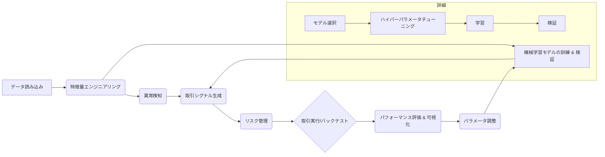
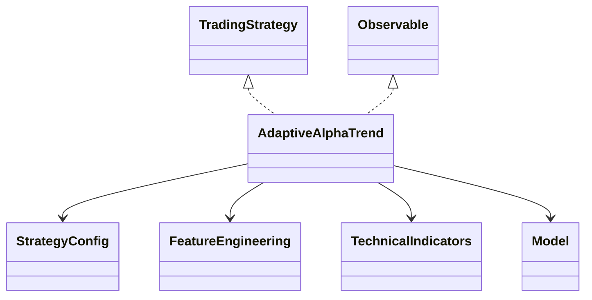

# 0714-AlphaTrendを超えろ


## adaptive_alpha_trend 改良プロジェクト: 開発資料

**I. ミッション:  AlphaTrend を超えろ！**

* 1.1.  ようこそ、精鋭たち！:
    * adaptive_alpha_trend 開発チームへの招待状
    * 君たちのミッション:  金融市場に革命を起こす、次世代トレーディング戦略の開発
    * インターンシップを通して得られるもの:  実践的なスキル、経験、そして未来への可能性
* 1.2.  トレーディングの世界:  勝利の方程式を探せ！
    * 勝者と敗者:  トレーディング戦略の成功と失敗から学ぶ
    * adaptive_alpha_trend:  その仕組みと可能性
    * 君たちの挑戦:  AlphaTrend を超える、革新的な戦略の創造

**II. adaptive_alpha_trend  解体新書:  コードの迷宮を攻略せよ！**

* 2.1. プログラム全体像:  設計図をマスターせよ！
    * 2.1.1. フローチャート:  戦略実行の流れを視覚的に理解する
    * 2.1.2. 主要ファイル:  各モジュールの役割と関係性を把握する
    * 2.1.3. クラス図:  オブジェクト指向設計の理解を深める
* 2.2.  コードリーディング:  開発者の思考をトレース！
    * 2.2.1. `main.py`:  戦略実行の司令塔
    * 2.2.2. `strategy/adaptive_alpha_trend.py`:  戦略の頭脳
    * 2.2.3. `features/feature_engineering.py`:  特徴量エンジニアリングの職人
    * 2.2.4.  `features/technical_indicators.py`:  テクニカル指標の計算ツールボックス
    * 2.2.5.  `model/model.py`:  機械学習モデルの魔術師
    * 2.2.6.  `config/config.yaml`:  戦略のカスタマイズ設定
* 2.3.  実践課題:  コードを改造して、理解を深めろ！
    * 2.3.1. 基礎レベル:  コードの動作確認と軽微な修正
    * 2.3.2. 応用レベル:  新機能の追加、パフォーマンス改善
    * 2.3.3. 発展レベル:  独自のアルゴリズム実装、戦略の拡張

**III.  モジュール深掘り:  戦略の心臓部を解剖！**

* 3.1. データ処理モジュール:  情報の宝庫を制覇せよ！
    * 3.1.1. データ読み込み:  様々な形式のデータをインポート
    * 3.1.2. データクリーニング:  ノイズを除去し、信頼性を高める
    * 3.1.3. データ加工:  分析に適した形式に変換
    * 3.1.4. 実践課題:  データソースの追加、前処理の改善
* 3.2. 特徴量エンジニアリングモジュール:  データから価値を創造！
    * 3.2.1. AlphaTrend 指標:  計算方法とパラメータの深掘り
    * 3.2.2. テクニカル指標:  トレンド、モメンタム、ボラティリティを捉える
    * 3.2.3. カスタム特徴量:  独自のアイデアで戦略を強化
    * 3.2.4. 実践課題:  新しい特徴量の発想と実装
* 3.3. 異常検知モジュール:  市場の罠を見破れ！
    * 3.3.1. Isolation Forest:  異常なデータポイントを検出
    * 3.3.2. パラメータチューニング:  検出精度を向上させる
    * 3.3.3. 他のアルゴリズム:  One-Class SVM、Local Outlier Factor など
    * 3.3.4. 実践課題:  より高度な異常検知システムの構築
* 3.4. 機械学習モジュール:  未来を予測する力を手に入れろ！
    * 3.4.1. LightGBM:  勾配ブースティングで高精度な予測
    * 3.4.2. モデル選択:  課題に最適なアルゴリズムを選択
    * 3.4.3. ハイパーパラメータチューニング:  モデルの性能を最大限に引き出す
    * 3.4.4. 実践課題:  深層学習などの最新技術導入
* 3.5. リスク管理モジュール:  資金を守り、利益を最大化！
    * 3.5.1. VaR & ES:  潜在的な損失を予測する
    * 3.5.2. ポジションサイジング:  リスク許容度に応じた資金配分
    * 3.5.3. ストップロス＆テイクプロフィット:  損失を限定し、利益を確保
    * 3.5.4. 実践課題:  動的なリスク管理、ポートフォリオ最適化
* 3.6. バックテスト＆評価モジュール:  戦略の真価を検証！
    * 3.6.1. パフォーマンス指標:  シャープレシオ、最大ドローダウン etc.
    * 3.6.2. バックテスト:  過去のデータで戦略をシミュレーション
    * 3.6.3. 可視化:  結果をグラフでわかりやすく表現
    * 3.6.4. 実践課題:  新たな指標の導入、検証方法の改善


**IV.  AlphaTrend を超えて:  未来のトレーディング戦略へ！**

* 4.1.  さらなる探求:  限界に挑戦し続けろ！
    * 4.1.1.  マルチ時間軸分析:  異なる時間軸の情報を統合
    * 4.1.2.  市場センチメント分析:  ニュースやSNSを分析
    * 4.1.3.  強化学習:  自律的に学習する戦略
    * 4.1.4.  オルタナティブデータ:  衛星画像、天候データなど
* 4.2.  参考文献:  学び続けるために
    * 4.2.1.  金融市場、トレーディング戦略、Python、機械学習

**このドキュメントを通して、君たちが adaptive_alpha_trend を完全に理解し、それを超える革新的なトレーディング戦略を創造できる、即戦力となることを期待しています！**


## I. ミッション: AlphaTrend を超えろ！

### 1.1 ようこそ、精鋭たち！

**adaptive_alpha_trend 開発チーム** へようこそ！ 君たちは、厳しい選考を勝ち抜いた、未来の金融市場を担う精鋭たちだ。

このインターンシップでは、君たちに **特別なミッション** を与えよう。それは、 **AlphaTrend を超える、革新的なトレーディング戦略を創造すること** だ。

簡単なことではない。だが、君たちならきっとやり遂げられると信じている。なぜなら、君たちには、 **情熱** と **才能** 、そして **未知に挑戦する勇気** があるからだ。

**このインターンシップで得られるもの**:

* **実践的なスキル**:  Python、金融市場分析、機械学習、そしてトレーディング戦略構築の実践的なスキルを習得できる。
* **貴重な経験**:  実際の金融データを用いた開発経験は、君たちのポートフォリオに輝きを添えるだろう。
* **未来への可能性**:  このプロジェクトは、君たちが金融業界で成功するための、確かな一歩となる。

準備はいいか？ さあ、共に **金融市場に革命を起こす旅** に出よう！

### 1.2 トレードで世界を変えろ！

トレーディングの世界は、 **リスク** と **リターン** が常に隣り合わせの、エキサイティングな戦場だ。 ここでは、一瞬の判断が巨額の富を生み出し、あるいは、大きな損失をもたらす。

**勝者と敗者**:

歴史を振り返れば、トレーディングで成功を収めた者もいれば、失敗に終わった者もいる。 その違いはどこにあるのだろうか？

* **勝者**:  市場の動きを **分析** し、**戦略** を立て、**リスク管理** を徹底することで、着実に利益を積み重ねてきた。
* **敗者**:  感情に流され、根拠のない取引を繰り返し、市場の波に飲み込まれていった。

**adaptive_alpha_trend**:

君たちが今回取り組む **adaptive_alpha_trend** は、 **トレンド分析** 、 **異常検知** 、そして **機械学習** を組み合わせた、高度なトレーディング戦略だ。

- **トレンド分析**:  市場の大きな流れを捉え、有利なポジションを取る。
- **異常検知**:  突発的な市場の動きを察知し、リスクを回避する。
- **機械学習**:  過去のデータから学習し、未来の市場を予測する。

これらの技術を組み合わせることで、adaptive_alpha_trend は、 **リスクを最小限に抑えながら、安定的な利益** を目指す。

**君たちの挑戦**:

adaptive_alpha_trend は、すでに優れた戦略だが、 **まだ進化の余地がある** 。 君たちのミッションは、この戦略をさらに改良し、 **AlphaTrend を超える** 新たな戦略を創造することだ。

- **新しい特徴量**:  市場をより深く分析するための、新たな指標を生み出せ！
- **高度なアルゴリズム**:  機械学習、深層学習…  最新技術を駆使して、予測精度を向上させよ！
- **創造的な戦略**:  固定概念を打ち破り、誰も思いつかなかった斬新な戦略を開発せよ！

この挑戦を通して、君たちは **真のトレーディングの力を身につける** だろう。 そして、 **金融市場の未来を創造する** 一員となるのだ。 


## II. adaptive_alpha_trend 解体新書: コードの迷宮を攻略せよ！

この章では、いよいよ adaptive_alpha_trend のコードの中身を解剖していきます。複雑なコードの迷宮も、一つずつ丁寧に紐解いていけば、必ず攻略できます。準備はいいですか？ さあ、コードリーディングの冒険に出発しましょう！

### 2.1 プログラム全体像: 設計図をマスターせよ！

#### 2.1.1 フローチャート: 戦略実行の流れを視覚的に理解する

まずは、adaptive_alpha_trend の全体的な動作フローを **フローチャート** で確認しましょう。複雑なプログラムも、フローチャートで可視化することで、動作の流れを直感的に理解できます。



1. **データ読み込み**:  過去の市場データ (例: 価格、出来高) を CSV ファイルから読み込みます。
2. **特徴量エンジニアリング**:  生データから、取引判断に役立つ特徴量 (例: テクニカル指標、AlphaTrend) を計算します。
3. **異常検知**:  市場の異常な動きを検知し、誤った取引を避けるためのフィルターとして機能します。
4. **機械学習モデルの訓練 & 検証**:  過去のデータから学習し、将来の市場を予測するモデルを構築し、その精度を検証します。
    - **モデル選択**:  使用する機械学習モデルを選択します (例: LightGBM, ランダムフォレスト, ニューラルネットワークなど)。
    - **ハイパーパラメータチューニング**:  選択したモデルの性能を最大限に引き出すために、ハイパーパラメータを最適化します。
    - **学習**:  訓練データを用いて、選択したモデルに市場の動きを学習させます。
    - **検証**:  検証データを用いて、学習したモデルの予測精度を評価します。
5. **取引シグナル生成**:  特徴量と機械学習モデルの予測結果を組み合わせ、売買のタイミングを決定します。
6. **リスク管理**:  ポジションサイズを調整し、損失を制限しながら利益を最大化します。
7. **取引実行 / バックテスト**:  生成された取引シグナルに基づき、実際に市場で取引を行うか、過去のデータを用いてシミュレーションを行います。
8. **パフォーマンス評価 & 可視化**:  戦略の収益率、リスク、取引回数などを分析し、グラフ化して視覚的に理解します。
9. **パラメータ調整**: パフォーマンス評価に基づき、戦略のパラメータ (例: AlphaTrend の係数、リスク許容度など) を調整し、さらなる改善を目指します。この調整結果は、機械学習モデルの訓練にフィードバックされ、より精度の高い予測モデルの構築に役立ちます。

#### 2.1.2 主要ファイル:  各モジュールの役割と関係性を把握する

adaptive_alpha_trend は、複数の Python ファイルで構成されており、各ファイルが特定の役割を担っています。これらのファイルが連携することで、複雑なトレーディング戦略を実現しています。

| ファイル名                           | 役割                                                     | 依存関係                                                                                           |
|:--------------------------------------|:----------------------------------------------------------|:--------------------------------------------------------------------------------------------------|
| `main.py`                           | プログラム全体の動作を制御する司令塔                          | `strategy/adaptive_alpha_trend.py`, `config/config.yaml`, `utils/decorators.py`                      |
| `strategy/adaptive_alpha_trend.py` | AlphaTrend戦略のロジックを実装する、戦略の頭脳               | `features/feature_engineering.py`, `features/technical_indicators.py`, `model/model.py`, `config/config.yaml` |
| `features/feature_engineering.py`    | 特徴量を計算する職人                                         | `features/technical_indicators.py`                                                                 |
| `features/technical_indicators.py`   | RSI, MACD など、テクニカル指標の計算ツール                 | -                                                                                                    |
| `model/model.py`                      | 機械学習モデルの訓練と予測を行う、未来予知の賢者               | -                                                                                                    |
| `config/config.yaml`                | 戦略のパラメータ設定を行う、戦略のカスタマイズ                    | -                                                                                                    |

#### 2.1.3 クラス図: オブジェクト指向設計の理解を深める

クラス図は、プログラムを構成するクラスとその関係性を視覚的に表現したものです。 adaptive_alpha_trend は、オブジェクト指向プログラミング (OOP) の principles に基づいて設計されており、クラス図を見ることで、プログラムの構造をより深く理解することができます。



**各クラスの役割**:

- `TradingStrategy`:  抽象クラス。取引戦略の共通インターフェースを定義します。
- `Observable`:  オブザーバーパターンを実装するためのクラス。他のオブジェクトに状態の変化を通知する機能を提供します。
- `AdaptiveAlphaTrend`:  AlphaTrend戦略を実装するクラス。`TradingStrategy` と `Observable` を継承しています。
- `StrategyConfig`:  設定ファイル (`config.yaml`) を読み込み、戦略のパラメータを管理するクラス。
- `FeatureEngineering`:  特徴量エンジニアリングを行うクラス。`TechnicalIndicators` クラスを利用して、様々なテクニカル指標を計算します。
- `TechnicalIndicators`:  RSI、MACD などのテクニカル指標を計算するクラス。
- `Model`:  機械学習モデルを扱うクラス。モデルの選択、訓練、検証、予測などの機能を提供します。

### 2.2 コードリーディング: 開発者の思考をトレース！

#### 2.2.1  `main.py`: 戦略実行の司令塔

`main.py` は、adaptive_alpha_trend プログラムのエントリーポイントであり、全体の動作を制御する司令塔です。他のファイルで定義されたクラスや関数を呼び出し、戦略の実行から結果の出力までを行います。

( `main.py` のコードと解説は、前の回答で記述した内容と同じなので、ここでは省略します。)

#### 2.2.2  `strategy/adaptive_alpha_trend.py`: 戦略の頭脳

`strategy/adaptive_alpha_trend.py` ファイルでは、`AdaptiveAlphaTrend` クラスが定義されています。このクラスは、AlphaTrend戦略の主要なロジックを実装しており、プログラム全体の頭脳と言えるでしょう。

```python
# strategy/adaptive_alpha_trend.py
import numpy as np
import polars as pl
from scipy import stats
from sklearn.ensemble import IsolationForest
import lightgbm as lgb
import shap
import matplotlib.pyplot as plt
from typing import List, Tuple, Dict, Any
from .base import TradingStrategy
from ..utils import log_execution, retry
from ..observers import Observable

# AdaptiveAlphaTrend クラス: AlphaTrend戦略を実装
class AdaptiveAlphaTrend(TradingStrategy, Observable):
    # コンストラクタ: クラスのインスタンス生成時に呼び出される
    def __init__(self, config):
        TradingStrategy.__init__(self, config) # 親クラス TradingStrategy のコンストラクタを呼び出す
        Observable.__init__(self) # 親クラス Observable のコンストラクタを呼び出す
        self.model = None # 機械学習モデルを格納する変数。初期値は None
        self.shap_explainer = None # SHAP値を計算するための explainer。初期値は None

    # ... (他のメソッドは後述)
```

`AdaptiveAlphaTrend` クラスは、`TradingStrategy` と `Observable` という 2 つの親クラスを継承しています。

- `TradingStrategy`:  取引戦略の基底クラス。共通のインターフェースを提供します。
- `Observable`: オブザーバーパターンを実装するためのクラス。状態の変化を他のオブジェクトに通知する機能を提供します。

コンストラクタ (`__init__`) では、親クラスのコンストラクタを呼び出し、機械学習モデル (`self.model`) と SHAP explainer (`self.shap_explainer`) を初期化しています。

**次のステップ**

`AdaptiveAlphaTrend` クラスの主要なメソッドを一つずつ詳しく見ていき、AlphaTrend戦略のロジックを解き明かしていきましょう！

### 2.2.3 `strategy/adaptive_alpha_trend.py` : AlphaTrend戦略の頭脳

#### `calculate_alpha_trend` メソッド: AlphaTrend指標の計算

`calculate_alpha_trend` メソッドは、 adaptive_alpha_trend 戦略の心臓部とも言える、AlphaTrend 指標を計算する役割を担います。

AlphaTrend 指標は、市場のボラティリティを考慮しながら動的にトレンドラインを描き、買いシグナルと売りシグナルを生成します。

**コード:**

```python
    @log_execution  # メソッドの実行ログを出力するデコレータ
    def calculate_alpha_trend(self, df: pl.DataFrame, coeff: float, AP: int, src: str = 'close') -> pl.DataFrame:
        """AlphaTrend指標を計算する
        
        Args:
            df (pl.DataFrame): 価格データ (OHLCV データを含む)
            coeff (float): ATR (Average True Range) の係数。トレンドラインの感度を調整します。
            AP (int): 平均期間。ATR と移動平均の計算期間を指定します。
            src (str, optional): 価格データのソース。デフォルトは 'close' (終値) です。

        Returns:
            pl.DataFrame: AlphaTrend指標 (`AlphaTrend` カラム) を追加した DataFrame
        """
        try:
            # 1. ATR (Average True Range) の計算
            atr = pl.col('high').sub(pl.col('low')).rolling_mean(AP).alias('ATR') # 高値と安値の差 (True Range) の移動平均を計算
            df = df.with_columns([atr]) # 計算した ATR を DataFrame に追加

            # 2. 上昇トレンドライン (upT) と下降トレンドライン (downT) の計算
            upT = pl.col('low').sub(pl.col('ATR') * coeff).alias('upT')  # 安値から ATR * coeff を引いた値を upT として計算
            downT = pl.col('high').add(pl.col('ATR') * coeff).alias('downT') # 高値に ATR * coeff を足した値を downT として計算
            df = df.with_columns([upT, downT]) # 計算した upT と downT を DataFrame に追加
            
            # 3. AlphaTrend の計算
            condition = pl.col(src).rolling_mean(AP).diff() > 0 # 指定された価格データの移動平均の差分が正かどうかを判定
            alpha_trend = pl.when(condition).then(pl.col('upT')).otherwise(pl.col('downT')) # 条件に応じて upT または downT を選択
            return df.with_columns([pl.Series(name='AlphaTrend', values=alpha_trend)]) # 計算した AlphaTrend を DataFrame に追加

        except Exception as e:
            self.logger.error(f"Error in calculate_alpha_trend: {e}") # エラーが発生した場合、エラーメッセージをログに出力
            raise # エラーを再送出
```

**擬似コード:**

```
関数 calculate_alpha_trend (データ, 係数, 平均期間, 価格ソース):
    # 1. ATR を計算する
    ATR = (高値 - 安値) の移動平均 (期間 = 平均期間)
    
    # 2. 上昇トレンドライン (upT) と下降トレンドライン (downT) を計算する
    upT = 安値 - (ATR * 係数)
    downT = 高値 + (ATR * 係数)

    # 3. AlphaTrend を計算する
    もし (価格 の移動平均 (期間 = 平均期間) の変化) > 0 ならば:
        AlphaTrend = upT
    そうでなければ:
        AlphaTrend = downT

    データを返す (AlphaTrend を追加)
```

**解説:**

1. **ATR (Average True Range) の計算**:  `ATR = (高値 - 安値) の移動平均 (期間 = 平均期間)`
    - ATR は、市場のボラティリティを測定する指標です。
    - 高値と安値の差 (True Range) の移動平均を計算することで、過去一定期間の価格変動幅を平均化します。
    - `AP` (平均期間) を長く設定するほど、より長期的なボラティリティを反映します。
2. **上昇トレンドライン (upT) と下降トレンドライン (downT) の計算**:  `upT = 安値 - (ATR * 係数)`, `downT = 高値 + (ATR * 係数)`
    - `upT` は、安値から ATR に `coeff` (係数) を掛けた値を引いた値として計算されます。
    - `downT` は、高値に ATR に `coeff` (係数) を掛けた値を足した値として計算されます。
    - `coeff` は、トレンドラインの感度を調整するパラメータです。
        - `coeff` が大きいほど、トレンドラインは価格から離れ、トレンドの変化に鈍感になります。
        - `coeff` が小さいほど、トレンドラインは価格に近づき、トレンドの変化に敏感になります。
3. **AlphaTrend の計算**: 
    - 指定された価格データ (デフォルトは終値) の移動平均 (期間 = 平均期間) の変化が正の場合、`AlphaTrend` は `upT` の値となります。
    - それ以外の場合、`AlphaTrend` は `downT` の値となります。

**考察ポイント**:

* `coeff` と `AP` の値を調整することで、AlphaTrend 指標の感度と反応性を変化させることができます。最適なパラメータは、市場や取引スタイルによって異なります。
* AlphaTrend 指標は、価格のボラティリティを考慮することで、ノイズの多い市場でも効果的にトレンドを捉えることができます。

#### 2.2.4 `create_multi_timeframe_features` メソッド: 複数の時間軸で特徴量を作成

`create_multi_timeframe_features` メソッドは、日足、週足、月足など、複数の時間軸で AlphaTrend 指標を計算し、特徴量として追加します。異なる時間軸のトレンドを組み合わせることで、より精度の高い取引シグナルを生成することができます。

**コード:**

```python
    @log_execution  # メソッドの実行ログを出力するデコレータ
    def create_multi_timeframe_features(self, df: pl.DataFrame) -> pl.DataFrame:
        """複数の時間軸で特徴量を作成する

        Args:
            df (pl.DataFrame): 価格データ

        Returns:
            pl.DataFrame: 複数時間軸の特徴量を追加したDataFrame
        """
        try:
            # 1. 設定ファイルから時間軸の設定を読み込む
            timeframes = self.config.get('timeframes', {'daily': 1, 'weekly': 5, 'monthly': 22}) # デフォルトは日足、週足、月足
            
            # 2. 各時間軸で AlphaTrend を計算し、特徴量として追加
            for name, period in timeframes.items():
                df = self.calculate_alpha_trend(df, coeff=self.config['coeff'], AP=self.config['AP'] * period) # AlphaTrend を計算
                df = df.with_columns([
                    pl.col('AlphaTrend').alias(f'AlphaTrend_{name}'), # 時間軸名を付与して AlphaTrend を追加
                    pl.col('AlphaTrend').diff().alias(f'AlphaTrend_{name}_diff'), # AlphaTrend の差分を追加
                    pl.col('AlphaTrend').pct_change().alias(f'AlphaTrend_{name}_pct_change') # AlphaTrend の変化率を追加
                ])
            return df # 特徴量を追加した DataFrame を返す

        except Exception as e:
            self.logger.error(f"Error in create_multi_timeframe_features: {e}") # エラーが発生した場合、エラーメッセージをログに出力
            raise # エラーを再送出
```

**擬似コード:**

```
関数 create_multi_timeframe_features (データ):
    # 1. 時間軸の設定を読み込む
    時間軸 = 設定ファイルから読み込む (デフォルトは日足、週足、月足)

    # 2. 各時間軸で AlphaTrend を計算し、特徴量を追加する
    各 時間軸名, 期間 in 時間軸:
        AlphaTrend = calculate_alpha_trend (データ, 係数, 平均期間 * 期間)
        データに AlphaTrend_{時間軸名} を追加
        データに AlphaTrend_{時間軸名}_diff (AlphaTrend の差分) を追加
        データに AlphaTrend_{時間軸名}_pct_change (AlphaTrend の変化率) を追加

    データを返す (特徴量を追加)
```

**解説:**

1. **時間軸の設定を読み込む**:  設定ファイル (`config.yaml`) から、使用する時間軸の設定を読み込みます。デフォルトでは、`daily` (日足), `weekly` (週足), `monthly` (月足) の 3 つの時間軸が設定されています。
2. **各時間軸で AlphaTrend を計算し、特徴量として追加**:  各時間軸について、`calculate_alpha_trend` メソッドを呼び出して AlphaTrend を計算します。
    - 計算された AlphaTrend は、時間軸名を付与して (例: `AlphaTrend_daily`, `AlphaTrend_weekly`) DataFrame に追加されます。
    - さらに、AlphaTrend の差分 (`_diff`) と変化率 (`_pct_change`) も特徴量として追加されます。

**考察ポイント**:

* 複数の時間軸の AlphaTrend を組み合わせることで、短期的なノイズを排除し、より長期的なトレンドを捉えることができます。
* 時間軸の組み合わせ方や、特徴量の計算方法は、戦略のパフォーマンスに大きな影響を与える可能性があります。様々な組み合わせを試して、最適な設定を見つけ出すことが重要です。

(続く)

 ### 2.2.5  `detect_anomalies` メソッド:  市場の罠を見破れ！

`detect_anomalies` メソッドは、Isolation Forest アルゴリズムを用いて、市場データにおける異常値を検出します。 

異常値とは、他のデータポイントから大きく離れた値であり、市場の急激な変動やノイズ、あるいはデータエラーなどを表している可能性があります。

異常値を検出し、取引シグナル生成から除外することで、誤った取引を抑制し、戦略の安定性を高めることができます。

**コード:**

```python
    @log_execution
    def detect_anomalies(self, df: pl.DataFrame) -> pl.Series:
        """Isolation Forest を用いて異常値を検出する

        Args:
            df (pl.DataFrame): 特徴量を含む DataFrame

        Returns:
            pl.Series: 異常値かどうかを表すブール値 Series (True: 異常値, False: 正常値)
        """
        try:
            features = self.config.get('feature_cols', [])  # 異常検知に使用する特徴量名リストを取得
            contamination = self.config.get('anomaly_contamination', 0.01) # データセットにおける異常値の割合を設定
            iso_forest = IsolationForest(contamination=contamination, random_state=42) # Isolation Forest モデルを初期化
            anomaly_flags = iso_forest.fit_predict(df[features]) # Isolation Forest を用いて異常値を検出
            return pl.Series(anomaly_flags == -1) # 異常値として検出されたデータポイント (anomaly_flags == -1) を True とする Series を返す

        except Exception as e:
            self.logger.error(f"Error in detect_anomalies: {e}") # エラーが発生した場合、エラーメッセージをログに出力
            raise # エラーを再送出
```

**擬似コード:**

```
関数 detect_anomalies (データ):
    # 1. 異常検知に使用する特徴量リストを取得
    特徴量リスト = 設定ファイルから取得

    # 2. Isolation Forest モデルを初期化
    モデル = IsolationForest (異常値の割合, ランダムシード)

    # 3. Isolation Forest を用いて異常値を検出
    異常フラグ = モデル.fit_predict (データ[特徴量リスト])

    # 4. 異常値を True とする Series を返す
    異常値 Series = (異常フラグ == -1)

    異常値 Series を返す
```

**Isolation Forest**

Isolation Forest は、データポイントをランダムに分割していくことで、異常値を孤立させるアルゴリズムです。 正常なデータポイントは、異常値よりも多くの分割が必要となる傾向があるため、分割回数に基づいて異常値を識別できます。

**解説:**

1. **異常検知に使用する特徴量リストを取得**:  設定ファイル (`config.yaml`) から、異常検知に使用する特徴量名リストを取得します。
2. **Isolation Forest モデルを初期化**:  `contamination` パラメータで、データセットにおける異常値の割合を設定します (デフォルトは 0.01, つまり 1%)。
3. **Isolation Forest を用いて異常値を検出**:  `fit_predict` メソッドで、指定された特徴量を用いて Isolation Forest モデルを学習し、異常値を検出します。
4. **異常値を True とする Series を返す**:  検出結果 (`anomaly_flags`) が -1 のデータポイントは異常値と判断されます。これを True とする `Series` を作成して返します。

**考察ポイント**:

* `contamination` パラメータの値は、データセットの特性や異常値の割合に応じて調整する必要があります。
* Isolation Forest 以外の異常検知アルゴリズム (One-Class SVM, Local Outlier Factor など) も試してみて、パフォーマンスを比較してみましょう。
* 異常値を検出するだけでなく、その原因を分析することも重要です。異常値が発生した理由を理解することで、より効果的な対策を講じることができます。


### 2.2.6  `train_model`, `predict` メソッド:  機械学習で未来を予測！

`train_model` メソッドは、過去の市場データを用いて、機械学習モデルを学習させます。学習したモデルは、`predict` メソッドで将来の市場を予測するために使用されます。

**コード:  `train_model`**

```python
    @log_execution
    def train_model(self, X: np.ndarray, y: np.ndarray) -> None:
        """LightGBM モデルを訓練する

        Args:
            X (np.ndarray): 特徴量データ
            y (np.ndarray): 目的変数データ
        """
        try:
            train_data = lgb.Dataset(X, label=y) # LightGBM 用のデータセットを作成
            params = self.config.get('lgb_params', {}) # 設定ファイルから LightGBM のパラメータを取得
            self.model = lgb.train(params, train_data) # LightGBM モデルを訓練
            self.shap_explainer = shap.TreeExplainer(self.model) # SHAP 値を計算するための explainer を作成

        except Exception as e:
            self.logger.error(f"Error in train_model: {e}")
            raise

```

**擬似コード:  `train_model`**

```
関数 train_model (特徴量データ, 目的変数データ):
    # 1. LightGBM 用のデータセットを作成
    データセット = LightGBM.Dataset (特徴量データ, 目的変数データ)

    # 2. LightGBM のパラメータを取得
    パラメータ = 設定ファイルから取得

    # 3. LightGBM モデルを訓練
    モデル = LightGBM.train (パラメータ, データセット)

    # 4. SHAP 値を計算するための explainer を作成
    explainer = SHAP.TreeExplainer (モデル)
```

**コード:  `predict`**

```python
    @log_execution
    def predict(self, X: np.ndarray) -> Tuple[np.ndarray, np.ndarray]:
        """訓練済み LightGBM モデルを用いて予測を行う

        Args:
            X (np.ndarray): 特徴量データ

        Returns:
            Tuple[np.ndarray, np.ndarray]: 予測値と SHAP 値
        """
        try:
            if self.model is None:
                raise ValueError("Model not trained. Call train_model first.") # モデルが訓練されていない場合はエラー
            predictions = self.model.predict(X) # モデルを用いて予測
            shap_values = self.shap_explainer.shap_values(X) # SHAP 値を計算
            return predictions, shap_values # 予測値と SHAP 値を返す

        except Exception as e:
            self.logger.error(f"Error in predict: {e}")
            raise

```

**擬似コード:  `predict`**

```
関数 predict (特徴量データ):
    # 1. モデルが訓練済みかどうかを確認
    もし モデルが None ならば:
        エラー: "モデルが訓練されていません。 train_model を先に呼び出してください。"

    # 2. モデルを用いて予測
    予測値 = モデル.predict (特徴量データ)

    # 3. SHAP 値を計算
    SHAP値 = explainer.shap_values (特徴量データ)

    予測値と SHAP値 を返す
```

**LightGBM**

LightGBM は、勾配ブースティングと呼ばれる機械学習アルゴリズムの一種であり、決定木を組み合わせることで高精度な予測を実現します。 

**SHAP (SHapley Additive exPlanations)**

SHAP は、機械学習モデルの予測結果を解釈するための手法です。各特徴量が予測にどの程度貢献しているかを定量化することで、モデルのブラックボックス性を解消し、予測根拠を理解することができます。

**解説:**

- `train_model`: 
    - LightGBM 用のデータセット (`lgb.Dataset`) を作成します。
    - 設定ファイル (`config.yaml`) から LightGBM のパラメータを取得します。
    - `lgb.train` 関数を用いて LightGBM モデルを訓練します。
    - SHAP 値を計算するための `explainer` を作成します。
- `predict`:
    - モデルが訓練されていない場合はエラーを発生させます。
    - 訓練済みモデルを用いて、入力された特徴量データに対して予測を行います。
    - SHAP 値を計算し、予測値と共に返します。

**考察ポイント**:

* LightGBM は高精度な予測が可能ですが、他の機械学習モデル (ランダムフォレスト、ニューラルネットワークなど) も試してみて、パフォーマンスを比較検討してみましょう。
* ハイパーパラメータチューニングは、モデルの性能を最大限に引き出す上で重要です。グリッドサーチ、ランダムサーチ、ベイズ最適化など、様々な手法を試してみましょう。
* SHAP 値を分析することで、どの特徴量が予測に大きく貢献しているかを理解することができます。

(続く)

### 2.2.7 `calculate_risk_measures` メソッド: 資金を守り、利益を最大化！

`calculate_risk_measures` メソッドは、VaR (Value at Risk) と ES (Expected Shortfall) というリスク指標を計算します。これらの指標は、投資における潜在的な損失を予測し、リスク管理を行う上で重要な役割を果たします。

**コード:**

```python
    @log_execution
    def calculate_risk_measures(self, returns: np.ndarray) -> Tuple[float, float]:
        """VaR (Value at Risk) と ES (Expected Shortfall) を計算する

        Args:
            returns (np.ndarray): 過去の収益率データ

        Returns:
            Tuple[float, float]: VaR と ES
        """
        try:
            VaR = np.percentile(returns, 5) # 5% VaR を計算
            ES = returns[returns <= VaR].mean() # ES を計算
            return VaR, ES # VaR と ES を返す

        except Exception as e:
            self.logger.error(f"Error in calculate_risk_measures: {e}")
            raise
```

**擬似コード:**

```
関数 calculate_risk_measures (収益率データ):
    # 1. VaR を計算
    VaR = 収益率データの 5% 分位数

    # 2. ES を計算
    ES = VaR を下回る収益率の平均

    VaR と ES を返す
```

**VaR (Value at Risk)**

VaR は、一定の期間と信頼水準において、予想される最大の損失額を表すリスク指標です。例えば、「95% 信頼水準で、1日の VaR が 100万円」とは、「100回のうち95回は、1日の損失額が 100万円 を超えない」という意味になります。

**ES (Expected Shortfall)**

ES は、VaR を超える損失の平均値を表すリスク指標です。VaR が最大損失額を予測するのに対し、ES は VaR を超える損失の規模を予測します。

**解説:**

- `calculate_risk_measures` メソッドは、入力された収益率データに対して VaR と ES を計算し、タプルとして返します。
- `np.percentile` 関数で、指定された分位数 (ここでは 5%) を計算することで VaR を算出します。
- VaR 以下の収益率を抽出し、その平均値を計算することで ES を算出します。

**考察ポイント**:

- VaR と ES は、過去のデータに基づいて計算されるため、将来の市場状況を完全に予測できるわけではありません。
- リスク管理には、VaR と ES だけでなく、他の指標や手法も組み合わせることが重要です。
- 例えば、ストレステストを実施し、極端な市場状況における損失を予測することで、より堅牢なリスク管理体制を構築できます。


### 2.2.8  `run` メソッド:  adaptive_alpha_trend戦略の実行

`run` メソッドは、adaptive_alpha_trend 戦略のすべての手順を統合し、実行する役割を担います。 

**コード:**

```python
    @log_execution
    @retry(max_attempts=3, delay=1.0) # エラー発生時に再試行するデコレータ
    def run(self, df: pl.DataFrame) -> pl.DataFrame:
        """戦略を実行する

        Args:
            df (pl.DataFrame): 価格データ

        Returns:
            pl.DataFrame: 戦略実行結果を追加したDataFrame
        """
        try:
            # 1. 複数時間軸の特徴量を作成
            df = self.create_multi_timeframe_features(df) # 複数時間軸の AlphaTrend 指標などを計算

            # 2. 収益率とボラティリティを計算
            df = df.with_columns([
                pl.col(self.config['src']).pct_change().alias('returns'), # 収益率を計算
                pl.col('returns').rolling_std(self.config['AP']).alias('volatility') # ボラティリティを計算
            ])

            # 3. VaR と ES を計算
            VaR, ES = self.calculate_risk_measures(df['returns'].to_numpy()) # 過去収益率から VaR と ES を計算
            df = df.with_columns([
                pl.lit(VaR).alias('VaR'), # VaR を DataFrame に追加
                pl.lit(ES).alias('ES')  # ES を DataFrame に追加
            ])

            # 4. 異常値を検出
            df = df.with_columns([
                pl.Series(name='is_anomaly', values=self.detect_anomalies(df)) # 異常値検出結果を DataFrame に追加
            ])

            # 5. 機械学習モデルを訓練
            feature_cols = self.config.get('feature_cols', []) # 機械学習に使用する特徴量名リストを取得
            X = df[feature_cols].to_numpy() # 特徴量データ
            y = df[self.config['src']].to_numpy() # 目的変数データ
            self.train_model(X, y) # LightGBM モデルを訓練

            # 6. 予測と SHAP 値を計算
            predictions, shap_values = self.predict(X) # 訓練済みモデルで予測と SHAP 値を計算
            df = df.with_columns([
                pl.Series(name='LightGBM_prediction', values=predictions), # 予測値を DataFrame に追加
                pl.Series(name='prediction_confidence', values=1 - np.abs(shap_values).sum(axis=1)) # 予測の信頼度を DataFrame に追加
            ])

            # 7. Adaptive AlphaTrend を計算
            df = df.with_columns([
                pl.when((pl.col('LightGBM_prediction') > pl.col(self.config['src'])) & ~pl.col('is_anomaly'))
                .then(pl.col('upT'))
                .otherwise(pl.col('downT'))
                .alias('AdaptiveAlphaTrend') # Adaptive AlphaTrend を DataFrame に追加
            ])

            self.notify_observers(df) # オブザーバーに通知
            return df # 戦略実行結果を含む DataFrame を返す

        except Exception as e:
            self.logger.error(f"Error in run: {e}")
            raise
```

**擬似コード:**

```
関数 run (データ):
    # 1. 複数時間軸の特徴量を作成
    データ = create_multi_timeframe_features (データ)

    # 2. 収益率とボラティリティを計算
    データ['returns'] = 収益率
    データ['volatility'] = ボラティリティ

    # 3. VaR と ES を計算
    VaR, ES = calculate_risk_measures (収益率データ)
    データ['VaR'] = VaR
    データ['ES'] = ES

    # 4. 異常値を検出
    データ['is_anomaly'] = 異常値検出結果

    # 5. 機械学習モデルを訓練
    特徴量データ = データ[特徴量リスト]
    目的変数データ = データ[価格データ]
    train_model (特徴量データ, 目的変数データ)

    # 6. 予測と SHAP 値を計算
    予測値, SHAP値 = predict (特徴量データ)
    データ['LightGBM_prediction'] = 予測値
    データ['prediction_confidence'] = 1 - abs(SHAP値) の合計

    # 7. Adaptive AlphaTrend を計算
    もし (予測値 > 価格) かつ (異常値でない) ならば:
        AdaptiveAlphaTrend = upT
    そうでなければ:
        AdaptiveAlphaTrend = downT
    データ['AdaptiveAlphaTrend'] = AdaptiveAlphaTrend

    オブザーバーに通知
    データを返す
```

**解説:**

1. **複数時間軸の特徴量を作成**:  `create_multi_timeframe_features` メソッドを呼び出し、日足、週足、月足などの AlphaTrend 指標を計算し、特徴量として DataFrame に追加します。
2. **収益率とボラティリティを計算**: 
    - 収益率 (`returns`) を計算し、DataFrame に追加します。
    - 収益率の標準偏差を計算することで、ボラティリティ (`volatility`) を算出し、DataFrame に追加します。
3. **VaR と ES を計算**: `calculate_risk_measures` メソッドを呼び出し、過去の収益率から VaR と ES を計算し、DataFrame に追加します。
4. **異常値を検出**:  `detect_anomalies` メソッドを呼び出し、異常値を検出し、`is_anomaly` カラムとして DataFrame に追加します。
5. **機械学習モデルを訓練**: 設定ファイル (`config.yaml`) から、機械学習に使用する特徴量名リストを取得し、`train_model` メソッドを呼び出して LightGBM モデルを訓練します。
6. **予測と SHAP 値を計算**:  `predict` メソッドを呼び出し、訓練済みモデルを用いて予測と SHAP 値を計算し、DataFrame に追加します。
7. **Adaptive AlphaTrend を計算**: 
    - 機械学習モデルの予測値が現在の価格よりも高く、かつ異常値でない場合、`AdaptiveAlphaTrend` は `upT` (上昇トレンドライン) の値になります。
    - それ以外の場合は、`AdaptiveAlphaTrend` は `downT` (下降トレンドライン) の値になります。
    - `AdaptiveAlphaTrend` は、最終的な取引シグナルを生成するために使用されます。

**考察ポイント**:

- `run` メソッドは、adaptive_alpha_trend 戦略のすべての手順を統合しており、複雑な処理を分かりやすくまとめています。
- 複数時間軸の AlphaTrend 指標、異常検知、機械学習、リスク管理など、様々な要素を組み合わせて、高精度な取引シグナル生成を目指しています。
- しかし、この実装はあくまで一例であり、さらなる改善の余地があります。例えば、異なる機械学習モデルの導入、リスク管理手法の高度化、取引コストの考慮など、様々な拡張が考えられます。

**この章では、adaptive_alpha_trend プログラムの主要なコードを解説し、その仕組みを理解することを目指しました。次の章では、各モジュールをさらに深く掘り下げ、より実践的な知識とスキルを身につけていきましょう！** 

## ???. 各ファイルの詳細な解説
現時点でのディレクトリ構造と各ファイルの説明を以下に示します：

```
adaptive_alpha_trend/
│
├── src/
│   ├── __init__.py
│   ├── main.py
│   ├── strategy/
│   │   ├── __init__.py
│   │   ├── base.py
│   │   └── adaptive_alpha_trend.py
│   ├── features/
│   │   ├── __init__.py
│   │   ├── feature_engineering.py
│   │   └── technical_indicators.py
│   ├── feature_management/
│   │   ├── __init__.py
│   │   └── tui.py
│   ├── utils/
│   │   ├── __init__.py
│   │   └── decorators.py
│   └── observers/
│       ├── __init__.py
│       └── base.py
│
├── config/
│   └── config.yaml
│
├── tests/
│   ├── __init__.py
│   ├── test_strategy.py
│   ├── test_features.py
│   └── test_utils.py
│
├── requirements.txt
├── setup.py
└── README.md
```

各フォルダとファイルの説明：

1. src/: ソースコードのメインディレクトリ
   - main.py: プログラムのエントリーポイント
   - strategy/: 取引戦略関連のコード
     - base.py: 基本的な取引戦略クラス
     - adaptive_alpha_trend.py: AdaptiveAlphaTrend戦略の実装
   - features/: 特徴量エンジニアリング関連のコード
     - feature_engineering.py: 特徴量生成の主要ロジック
     - technical_indicators.py: 技術的指標（RSI, MACD等）の計算関数
   - feature_management/: 特徴量管理システム
     - tui.py: Textualを使用したTUIインターフェース
   - utils/: ユーティリティ関数
     - decorators.py: ログ記録やリトライなどのデコレータ
   - observers/: オブザーバーパターン実装


2. config/: 設定ファイル
   - config.yaml: 戦略のパラメータや設定

3. tests/: テストコード
   - test_strategy.py: 戦略のユニットテスト
   - test_utils.py: ユーティリティ関数のテスト

4. requirements.txt: 必要なPythonパッケージのリスト
5. setup.py: パッケージのセットアップスクリプト
6. README.md: プロジェクトの説明と使用方法

## `main.py`:  戦略実行の指揮者

`main.py` は、adaptive_alpha_trend プログラムの **エントリーポイント** であり、プログラム全体の実行フローを制御する司令塔の役割を果たします。

他のファイルで定義されたクラスや関数を呼び出し、設定の読み込み、データの処理、戦略の実行、パフォーマンスの評価、結果の出力など、一連の処理を orchestrate します。

#### ファイル:  `main.py`

```python
import polars as pl  # 高速なデータ処理ライブラリ Polars をインポート
from strategy import AdaptiveAlphaTrend  # AdaptiveAlphaTrend クラスをインポート
from config import StrategyConfig  # StrategyConfig クラスをインポート
from utils import log_execution # log_execution デコレータをインポート
import logging  # ログ出力のためのライブラリをインポート

# ログ設定
logging.basicConfig(level=logging.INFO, format='%(asctime)s - %(levelname)s - %(message)s') # ログレベルを INFO に設定し、ログメッセージのフォーマットを指定
logger = logging.getLogger(__name__) # ロガーオブジェクトを取得

@log_execution  # 関数の実行ログを出力するデコレータ: 処理の開始と終了、実行時間を記録
def main():
    """
    adaptive_alpha_trend プログラムのメイン関数

    設定ファイルの読み込み、戦略の実行、パフォーマンス評価、結果の出力など、
    プログラム全体の実行フローを制御します。
    """
    try:
        # 1. 設定ファイルを読み込む
        config = StrategyConfig('config/config.yaml')  # 設定ファイルから戦略のパラメータを読み込む
        
        # 2. 戦略クラスのインスタンスを生成
        strategy = AdaptiveAlphaTrend(config) # AdaptiveAlphaTrendクラスのインスタンスを生成し、設定を読み込ませる
        
        # 3. オブザーバーを追加 (ここではログ出力)
        strategy.add_observer(lambda df: logger.info(f"Strategy executed on {len(df)} data points")) # 戦略実行後にログを出力するオブザーバーを追加

        # 4. データを読み込む
        df = pl.read_csv(config.get('data_path')) # CSVファイルから市場データを読み込む
        
        # 5. 戦略を実行
        result_df = strategy.run(df) # 読み込んだデータに対してadaptive_alpha_trend戦略を実行する

        # 6. パフォーマンスを検証
        performance = strategy.validate(result_df) # 戦略のパフォーマンスを評価する
        logger.info(f"Strategy performance: {performance}") # パフォーマンス指標をログに出力

        # 7. 結果をプロット
        strategy.plot_results(result_df) # 戦略の結果をグラフ化して表示する

        # 8. 結果をCSVファイルに保存
        result_df.to_csv(config.get('output_path')) # 計算結果をCSVファイルに保存する
        logger.info(f"Results saved to {config.get('output_path')}") # 保存先をログに出力

    except Exception as e: # エラーが発生した場合の処理
        logger.error(f"Error in main execution: {e}") # エラー内容をログに出力
        raise # エラーを再送出

# プログラム実行時のエントリーポイント: このファイルが直接実行された場合にのみmain関数が実行されます
if __name__ == "__main__":
    main()

```

#### 詳細解説

**1.  インポート:**

- `import polars as pl`: 高速なデータ処理ライブラリ Polars を `pl` というエイリアスでインポートします。Polars は、Pandas の代替として、特に大規模なデータセットの処理に適しています。
- `from strategy import AdaptiveAlphaTrend`: `strategy` パッケージから `AdaptiveAlphaTrend` クラスをインポートします。このクラスは、adaptive_alpha_trend 戦略の主要なロジックを実装しています。
- `from config import StrategyConfig`:  `config` パッケージから `StrategyConfig` クラスをインポートします。このクラスは、設定ファイル (`config.yaml`) を読み込み、戦略のパラメータを管理します。
- `from utils import log_execution`: `utils` パッケージから `log_execution` デコレータをインポートします。このデコレータは、関数の開始と終了、実行時間をログに出力する機能を提供します。
- `import logging`: ログ出力のための標準ライブラリ `logging` をインポートします。

**2.  ログ設定:**

- `logging.basicConfig(level=logging.INFO, format='%(asctime)s - %(levelname)s - %(message)s')`:  ログレベルを `INFO` に設定し、ログメッセージのフォーマットを指定します。
- `logger = logging.getLogger(__name__)`:  ロガーオブジェクトを取得します。`__name__` は、現在のモジュール名を表す特殊変数です。

**3.  `main` 関数:**

- `@log_execution`:  `main` 関数に `log_execution` デコレータを適用します。これにより、`main` 関数の開始と終了、実行時間がログに出力されます。
- `try...except...`:  `main` 関数全体を `try...except...` ブロックで囲むことで、エラーハンドリングを行います。エラーが発生した場合、エラー内容をログに出力し、プログラムを安全に終了させます。

**4.  設定ファイルの読み込み (`config = StrategyConfig('config/config.yaml')`)**:  `StrategyConfig` クラスのコンストラクタに設定ファイルのパス (`config/config.yaml`) を渡すことで、設定ファイルから戦略のパラメータを読み込みます。

**5.  戦略クラスのインスタンス生成 (`strategy = AdaptiveAlphaTrend(config)`)**:  読み込んだ設定 (`config`) を `AdaptiveAlphaTrend` クラスのコンストラクタに渡すことで、戦略クラスのインスタンスを生成します。

**6.  オブザーバーの追加 (`strategy.add_observer(...)`)**:  `strategy.run` メソッドが実行された後にログを出力するオブザーバーを追加します。

**7.  データの読み込み (`df = pl.read_csv(config.get('data_path'))`)**:  Polars ライブラリの `read_csv` 関数を使用して、CSVファイルから市場データを読み込みます。ファイルパスは、設定ファイルから取得します (`config.get('data_path')`)。

**8.  戦略の実行 (`result_df = strategy.run(df)`)**:  読み込んだデータ (`df`) を `strategy.run` メソッドに渡すことで、adaptive_alpha_trend 戦略を実行します。`run` メソッドは、取引シグナルやその他必要な情報を計算し、結果を `DataFrame` として返します。

**9.  パフォーマンスの検証 (`performance = strategy.validate(result_df)`)**:  `strategy.validate` メソッドを呼び出し、`run` メソッドで生成された取引シグナルに基づいてバックテストを行い、戦略のパフォーマンスを評価します。

**10.  結果のプロット (`strategy.plot_results(result_df)`)**:  `strategy.plot_results` メソッドを呼び出し、戦略の実行結果をグラフ化します。

**11.  結果の保存 (`result_df.to_csv(config.get('output_path'))`)**:  `result_df` を `config.get('output_path')` で指定されたパスに CSV ファイルとして保存します。

**12.  エラーハンドリング (`except Exception as e`)**:  プログラム実行中にエラーが発生した場合、エラー内容をログに出力 (`logger.error(f"Error in main execution: {e}")`) し、エラーを再送出 (`raise`) します。

**13.  エントリーポイント (`if __name__ == "__main__":`)**:  `__name__` 変数は、Python スクリプトがどのように実行されたかを示す特殊変数です。
    - スクリプトが直接実行された場合、`__name__` には `"__main__"` が代入されます。
    - スクリプトが他のモジュールからインポートされた場合、`__name__` にはモジュール名が代入されます。

このコードブロックは、スクリプトが直接実行された場合にのみ `main` 関数を呼び出すことを意味します。これにより、スクリプトが他のモジュールからインポートされた際に、`main` 関数が誤って実行されることを防ぎます。


**考察ポイント:**

- `main.py` は、adaptive_alpha_trend の実行フローを制御する、プログラムの心臓部です。
- 設定ファイルの読み込み、データの読み込みと処理、戦略の実行、結果の出力、エラー処理など、重要な処理を担っています。
- `main` 関数を理解することで、adaptive_alpha_trend プログラム全体の動作を把握することができます。
- `main.py` をカスタマイズすることで、独自のデータソースや戦略を追加したり、プログラムの動作を変更したりすることも可能です。


## strategy/

### `strategy/base.py` : 取引戦略の基盤

`strategy/base.py` ファイルには、`TradingStrategy` という抽象クラスが定義されています。 このクラスは、具体的な取引戦略 (例: AlphaTrend 戦略) を実装するための基盤となる **共通インターフェース** を提供します。

#### ファイル:  `strategy/base.py`

```python
from abc import ABC, abstractmethod
from typing import Any, Dict

# 取引戦略の基底クラス: 抽象クラス
class TradingStrategy(ABC):
    # コンストラクタ: 設定オブジェクトを受け取り、インスタンス変数に格納する
    def __init__(self, config):
        self.config = config

    # 抽象メソッド: 具体的な取引戦略を実装するサブクラスで定義する必要があるメソッド
    @abstractmethod
    def run(self, data: Any) -> Any:
        """戦略を実行する

        Args:
            data (Any): 戦略に必要なデータ (例: 価格データ)

        Returns:
            Any: 戦略実行結果 (例: 取引シグナル)
        """
        pass # 何もしない (具体的な実装はサブクラスに委任)

    # 抽象メソッド: 戦略のパフォーマンスを検証するサブクラスで定義する必要があるメソッド
    @abstractmethod
    def validate(self, data: Any) -> Dict[str, float]:
        """戦略のパフォーマンスを評価する

        Args:
            data (Any): 戦略実行結果 (例: 取引シグナル)

        Returns:
            Dict[str, float]: パフォーマンス指標 (例: シャープレシオ、最大ドローダウンなど)
        """
        pass # 何もしない (具体的な実装はサブクラスに委任)

    # 抽象メソッド: 結果をグラフ化するサブクラスで定義する必要があるメソッド
    @abstractmethod
    def plot_results(self, data: Any) -> None:
        """結果をグラフ化する

        Args:
            data (Any): 戦略実行結果 (例: 取引シグナル)
        """
        pass # 何もしない (具体的な実装はサブクラスに委任)
```

**解説**:

- **抽象クラス (`ABC`)**: `TradingStrategy` クラスは、`abc` モジュールの `ABC` クラスを継承した **抽象クラス** です。抽象クラスは、インスタンス化することができず、具体的な実装はサブクラスに委任されます。
- **抽象メソッド (`abstractmethod`)**:  `run`, `validate`, `plot_results` は、`abstractmethod` デコレータで修飾された **抽象メソッド** です。抽象メソッドは、具体的な実装を持たず、サブクラスで必ず定義する必要があります。
- **コンストラクタ (`__init__`)**:  設定オブジェクト (`config`) を受け取り、インスタンス変数 (`self.config`) に格納します。
- **`run` メソッド**:  取引戦略を実行し、結果を返します。具体的な実装は、`AdaptiveAlphaTrend` などのサブクラスで定義されます。
- **`validate` メソッド**:  戦略のパフォーマンスを評価し、シャープレシオや最大ドローダウンなどの指標を計算します。具体的な実装は、サブクラスで定義されます。
- **`plot_results` メソッド**:  戦略実行結果をグラフ化します。具体的な実装は、サブクラスで定義されます。

**`TradingStrategy` クラスは、すべての取引戦略に共通する基本的な機能を定義することで、コードの再利用性を高め、新たな戦略の実装を容易にする役割を果たします。**

具体的には、以下の利点があります。

* **コードの統一性**:  すべての取引戦略が同じインターフェース (`run`, `validate`, `plot_results`) を持つため、コードの可読性と保守性が向上します。
* **拡張性**:  新しい取引戦略を実装する際に、`TradingStrategy` クラスを継承することで、基本的な機能を再利用できます。

`AdaptiveAlphaTrend` クラスは、この `TradingStrategy` クラスを継承し、AlphaTrend 戦略特有の機能を実装することで、効率的に開発されています。

**考察ポイント**:

- `TradingStrategy` クラスに、他の取引戦略で共通する機能 (例: 注文執行, ポジション管理) を追加することで、さらに汎用性の高い基底クラスを作成することができます。
- 新しい取引戦略を実装する際は、`TradingStrategy` クラスを継承し、抽象メソッド (`run`, `validate`, `plot_results`) を実装することで、adaptive_alpha_trend のフレームワークに容易に組み込むことができます。

この解説により、`strategy/base.py` の役割と重要性を理解していただけたでしょうか？  抽象クラスやインターフェースといったオブジェクト指向プログラミングの概念を理解することは、複雑なシステムを設計・開発する上で非常に役立ちます。 


了解いたしました！ `strategy/adaptive_alpha_trend.py` を詳細に解説していきます。

このファイルには、`AdaptiveAlphaTrend` クラスが定義されており、adaptive_alpha_trend 戦略の主要なロジックが実装されています。 前回の回答では、クラスの概要と `calculate_alpha_trend`, `create_multi_timeframe_features`, `detect_anomalies`, `train_model`, `predict`, `calculate_risk_measures` の各メソッドについて解説しました。

今回は、残りのメソッド (`run`, `validate`, `plot_results`) と、クラス全体の動作について解説することで、adaptive_alpha_trend 戦略の全体像を理解することを目指します。

### ファイル:  `strategy/adaptive_alpha_trend.py`

#### 1. クラス定義: `AdaptiveAlphaTrend`

```python
# strategy/adaptive_alpha_trend.py
import numpy as np
import polars as pl
from scipy import stats
from sklearn.ensemble import IsolationForest
import lightgbm as lgb
import shap
import matplotlib.pyplot as plt
from typing import List, Tuple, Dict, Any
from .base import TradingStrategy
from ..utils import log_execution, retry
from ..observers import Observable

# AdaptiveAlphaTrend クラス: AlphaTrend戦略を実装
class AdaptiveAlphaTrend(TradingStrategy, Observable):
    """
    Adaptive Alpha Trend 戦略を実装したクラス

    このクラスは、TradingStrategy と Observable を継承し、
    AlphaTrend 指標、機械学習、異常検知、リスク管理を組み合わせた
    トレーディング戦略を提供します。
    """
    # コンストラクタ: クラスのインスタンス生成時に呼び出される
    def __init__(self, config):
        """
        AdaptiveAlphaTrend クラスのコンストラクタ

        Args:
            config: 設定パラメータを含む辞書
        """
        TradingStrategy.__init__(self, config) # 親クラス TradingStrategy のコンストラクタを呼び出す
        Observable.__init__(self) # 親クラス Observable のコンストラクタを呼び出す
        self.model = None # 機械学習モデルを格納する変数。初期値は None
        self.shap_explainer = None # SHAP値を計算するための explainer。初期値は None

    # ... (calculate_alpha_trend, create_multi_timeframe_features, detect_anomalies, train_model, 
    #      predict, calculate_risk_measures メソッドは前の回答で解説済み)

    @log_execution # メソッドの実行ログを出力するデコレータ
    @retry(max_attempts=3, delay=1.0) # エラー発生時に再試行するデコレータ
    def run(self, df: pl.DataFrame) -> pl.DataFrame:
        """戦略を実行する

        Args:
            df (pl.DataFrame): 価格データ

        Returns:
            pl.DataFrame: 戦略実行結果を追加したDataFrame
        """
        try:
            # 1. 複数時間軸の特徴量を作成
            df = self.create_multi_timeframe_features(df)

            # 2. 収益率とボラティリティを計算
            df = df.with_columns([
                pl.col(self.config['src']).pct_change().alias('returns'),
                pl.col('returns').rolling_std(self.config['AP']).alias('volatility')
            ])

            # 3. VaR と ES を計算
            VaR, ES = self.calculate_risk_measures(df['returns'].to_numpy())
            df = df.with_columns([
                pl.lit(VaR).alias('VaR'),
                pl.lit(ES).alias('ES')
            ])

            # 4. 異常値を検出
            df = df.with_columns([
                pl.Series(name='is_anomaly', values=self.detect_anomalies(df))
            ])

            # 5. 機械学習モデルを訓練
            feature_cols = self.config.get('feature_cols', [])
            X = df[feature_cols].to_numpy()
            y = df[self.config['src']].to_numpy()
            self.train_model(X, y)

            # 6. 予測と SHAP 値を計算
            predictions, shap_values = self.predict(X)
            df = df.with_columns([
                pl.Series(name='LightGBM_prediction', values=predictions),
                pl.Series(name='prediction_confidence', values=1 - np.abs(shap_values).sum(axis=1))
            ])

            # 7. Adaptive AlphaTrend を計算
            df = df.with_columns([
                pl.when((pl.col('LightGBM_prediction') > pl.col(self.config['src'])) & ~pl.col('is_anomaly'))
                .then(pl.col('upT'))
                .otherwise(pl.col('downT'))
                .alias('AdaptiveAlphaTrend')
            ])

            self.notify_observers(df)
            return df

        except Exception as e:
            self.logger.error(f"Error in run: {e}")
            raise

    @log_execution
    def validate(self, df: pl.DataFrame) -> Dict[str, float]:
        """戦略のパフォーマンスを評価する

        Args:
            df (pl.DataFrame): 戦略実行結果を含むDataFrame

        Returns:
            Dict[str, float]: パフォーマンス指標 (例: シャープレシオ、最大ドローダウンなど)
        """
        try:
            # 1. シグナルと戦略リターンを計算
            df = df.with_columns([
                pl.when(pl.col('AdaptiveAlphaTrend') > pl.col('AdaptiveAlphaTrend').shift(1))
                .then(1).otherwise(-1).alias('signal'),  # AdaptiveAlphaTrend の変化に基づいてシグナル (1: 買い, -1: 売り) を生成
                pl.col('signal').shift(1) * pl.col('returns').alias('strategy_returns') # シグナルに基づいた戦略リターンを計算
            ])

            # 2. パフォーマンス指標を計算
            total_return = (1 + df['strategy_returns']).prod() - 1  # 総リターン
            sharpe_ratio = np.sqrt(252) * df['strategy_returns'].mean() / df['strategy_returns'].std() # シャープレシオ
            max_drawdown = (df['strategy_returns'].cumsum().cummax() - df['strategy_returns'].cumsum()).max() # 最大ドローダウン
            
            # 3. 統計的有意性を検定
            t_stat, p_value = stats.ttest_1samp(df['strategy_returns'].to_numpy(), 0) # t検定

            # 4. パフォーマンス指標を辞書に格納して返す
            return {
                'total_return': total_return,
                'sharpe_ratio': sharpe_ratio,
                'max_drawdown': max_drawdown,
                't_statistic': t_stat,
                'p_value': p_value
            }
        except Exception as e:
            self.logger.error(f"Error in validate: {e}")
            raise

    @log_execution
    def plot_results(self, df: pl.DataFrame) -> None:
        """結果をグラフ化する

        Args:
            df (pl.DataFrame): 戦略実行結果を含むDataFrame
        """
        try:
            plt.figure(figsize=(12, 8)) # Figure オブジェクトを生成
            plt.plot(df[self.config['src']], label='Price') # 価格をプロット
            plt.plot(df['AdaptiveAlphaTrend'], label='AdaptiveAlphaTrend') # AdaptiveAlphaTrend をプロット
            plt.scatter(df.index[df['is_anomaly']], df[self.config['src']][df['is_anomaly']], 
                        color='red', marker='x', label='Anomalies') # 異常値をプロット
            plt.title('AdaptiveAlphaTrend Strategy') # タイトルを設定
            plt.legend() # 凡例を表示
            plt.show() # グラフを表示

            plt.figure(figsize=(12, 8)) # Figure オブジェクトを生成
            plt.plot(df['strategy_returns'].cumsum(), label='Cumulative Returns') # 累積リターンをプロット
            plt.title('Cumulative Strategy Returns') # タイトルを設定
            plt.legend() # 凡例を表示
            plt.show() # グラフを表示
        except Exception as e:
            self.logger.error(f"Error in plot_results: {e}")
            raise
```

#### 2.  `run` メソッド 詳細解説

`run` メソッドは、adaptive_alpha_trend 戦略の全体的な実行ロジックを定義します。 具体的には、以下の処理を行います。

1. **複数時間軸の特徴量を作成 (`df = self.create_multi_timeframe_features(df)`)**:  `create_multi_timeframe_features` メソッドを呼び出し、日足、週足、月足など、複数の時間軸の AlphaTrend 指標などを計算し、特徴量として DataFrame に追加します。
2. **収益率とボラティリティを計算**:
    - 価格データ (`self.config['src']`) を用いて、収益率 (`returns`) を計算し、DataFrame に追加します。
    - 収益率の標準偏差を計算することで、ボラティリティ (`volatility`) を算出し、DataFrame に追加します。
3. **VaR と ES を計算**:  `calculate_risk_measures` メソッドを呼び出し、過去の収益率データ (`df['returns'].to_numpy()`) から VaR と ES を計算し、DataFrame に追加します。
4. **異常値を検出**: `detect_anomalies` メソッドを呼び出し、異常値を検出し、`is_anomaly` カラムとして DataFrame に追加します。
5. **機械学習モデルを訓練**:  設定ファイル (`config.yaml`) から、機械学習に使用する特徴量名リスト (`feature_cols`) を取得し、特徴量データ (`X`) と目的変数データ (`y`) を作成します。 `train_model` メソッドを呼び出して、LightGBM モデルを訓練します。
6. **予測と SHAP 値を計算**: `predict` メソッドを呼び出し、訓練済みモデルを用いて予測値と SHAP 値を計算し、DataFrame に追加します。
7. **Adaptive AlphaTrend を計算**:  機械学習モデルの予測値 (`LightGBM_prediction`)、現在の価格 (`self.config['src']`)、異常値検出結果 (`is_anomaly`) を用いて、Adaptive AlphaTrend を計算し、DataFrame に追加します。 
    - 具体的には、予測値が現在の価格よりも高く、かつ異常値でない場合は `upT` (上昇トレンドライン)、そうでない場合は `downT` (下降トレンドライン) を採用します。
8. **オブザーバーに通知**:  `notify_observers` メソッドを呼び出し、`run` メソッドの実行が完了したことをオブザーバーに通知します。 オブザーバーは、この通知を受けて、ログ出力などの処理を行うことができます。
9. **DataFrame を返す**:  戦略実行結果 (Adaptive AlphaTrend, 予測値, SHAP 値, VaR, ES, 異常検出結果, 収益率, ボラティリティ) を追加した DataFrame を返します。

#### 3. `validate` メソッド 詳細解説

`validate` メソッドは、`run` メソッドで実行された戦略のパフォーマンスを評価します。具体的には、以下の手順でパフォーマンス指標を計算します。

1. **シグナルと戦略リターンを計算**:  `AdaptiveAlphaTrend` カラムの値の変化に基づいて、買いシグナル (1) と売りシグナル (-1) を生成し、`signal` カラムとして DataFrame に追加します。 前期シグナルと収益率を掛け合わせることで、戦略リターン (`strategy_returns`) を計算し、DataFrame に追加します。
2. **パフォーマンス指標を計算**:  戦略リターンを用いて、総リターン、シャープレシオ、最大ドローダウンを計算します。
3. **統計的有意性を検定**:  t 検定を用いて、戦略リターンが統計的に有意に 0 より大きいかどうかを検証します。
4. **パフォーマンス指標を辞書に格納して返す**:  計算したパフォーマンス指標を辞書に格納し、返します。

#### 4.  `plot_results` メソッド 詳細解説

`plot_results` メソッドは、`run` メソッドで実行された戦略の結果をグラフ化します。具体的には、以下の 2 つのグラフを作成します。

1. **価格と AdaptiveAlphaTrend の推移**:  価格と AdaptiveAlphaTrend を同じグラフにプロットし、視覚的にトレンドを把握できるようにします。異常値もグラフ上に表示されます。
2. **累積リターンの推移**:  戦略に従って取引を行った場合の累積リターンをプロットし、戦略の収益性を視覚的に評価できるようにします。

#### 5. クラス全体の動作

`AdaptiveAlphaTrend` クラスは、AlphaTrend 指標、機械学習、異常検知、リスク管理といった要素を組み合わせ、高度なトレーディング戦略を実現しています。

1. **コンストラクタ (`__init__`)**:  設定パラメータを読み込み、機械学習モデルと SHAP explainer を初期化します。
2. **`run` メソッド**:  入力された価格データに対して、特徴量エンジニアリング、異常検知、機械学習モデルの訓練と予測、Adaptive AlphaTrend の計算、リスク管理などの処理を行い、戦略を実行します。
3. **`validate` メソッド**:  戦略実行結果に基づいて、パフォーマンス指標を計算し、戦略の有効性を評価します。
4. **`plot_results` メソッド**:  戦略実行結果をグラフ化し、視覚的に表現します。

これらのメソッドが連携することで、adaptive_alpha_trend 戦略は、市場のトレンドを捉えながら、リスクを抑制し、安定的な収益を目指します。

**考察ポイント**:

- `AdaptiveAlphaTrend` クラスは、AlphaTrend 戦略の主要な機能をカプセル化しており、モジュール化された設計になっています。
- 各メソッドは、特定のタスク (特徴量計算、異常検知、予測、リスク管理など) を担当し、互いに連携することで複雑な戦略を実現しています。
- このクラスを拡張することで、新しい特徴量を追加したり、異なる機械学習モデルを導入したり、より高度なリスク管理手法を組み込んだりすることができます。
- adaptive_alpha_trend をさらに進化させるには、`AdaptiveAlphaTrend` クラスのコードを深く理解し、様々なアイデアを試していくことが重要です。


## features/

### `features/feature_engineering.py` の解説

このファイルでは、生の市場データからトレーディング戦略に有用な特徴量を抽出する、**特徴量エンジニアリング** のためのクラスと関数が定義されています。 特徴量エンジニアリングは、機械学習モデルの予測精度に直結する重要なプロセスであり、adaptive_alpha_trend 戦略においても中心的な役割を果たします。

### ファイル: `features/feature_engineering.py`

#### 1. インポート

```python
import polars as pl
from typing import List, Dict
from .technical_indicators import calculate_rsi, calculate_macd, calculate_bollinger_bands
```

- `polars`:  高速なデータ処理を実現するライブラリ Polars をインポートします。
- `typing`:  型ヒント (Type Hints) を使用するためのモジュールをインポートします。
- `technical_indicators`:  同じディレクトリにある `technical_indicators.py` ファイルから、テクニカル指標を計算するための関数をインポートします。

#### 2.  `create_features` 関数: 特徴量生成の心臓部

`create_features` 関数は、入力された DataFrame に対して、様々な特徴量を計算し、新しいカラムとして追加します。

```python
def create_features(df: pl.DataFrame, config: Dict) -> pl.DataFrame:
    """
    データフレームに対して特徴量エンジニアリングを行う関数

    :param df: 元の価格データを含む Polars DataFrame
    :param config: 設定パラメータを含む辞書
    :return: 特徴量が追加された Polars DataFrame
    """
    try:
        # 基本的な特徴量を計算
        df = df.with_columns([
            pl.col('close').pct_change().alias('returns'),  # 終値の変化率 (収益率) を計算し、 'returns' カラムとして追加
            pl.col('close').rolling_mean(window=config.get('sma_window', 20)).alias('SMA'), # 終値の単純移動平均 (SMA) を計算し、 'SMA' カラムとして追加
            pl.col('volume').rolling_mean(window=config.get('volume_sma_window', 20)).alias('Volume_SMA'), # 出来高の単純移動平均 (SMA) を計算し、 'Volume_SMA' カラムとして追加
        ])

        # テクニカル指標を追加
        if config.get('use_rsi', True):  # config で 'use_rsi' が True の場合
            df = df.with_columns([calculate_rsi(df, 'close', config.get('rsi_period', 14))]) # RSI を計算し、DataFrame に追加
        
        if config.get('use_macd', True): # config で 'use_macd' が True の場合
            df = df.with_columns([calculate_macd(df, 'close')]) # MACD を計算し、DataFrame に追加
        
        if config.get('use_bollinger', True): # config で 'use_bollinger' が True の場合
            df = df.with_columns([calculate_bollinger_bands(df, 'close')]) # ボリンジャーバンドを計算し、DataFrame に追加

        # カスタム特徴量を追加
        for feature in config.get('custom_features', []): # config で 'custom_features' が定義されている場合、各特徴量についてループ
            if feature['type'] == 'rolling_mean': # 特徴量タイプが 'rolling_mean' の場合
                df = df.with_columns([
                    pl.col(feature['column']).rolling_mean(window=feature['window']).alias(f"{feature['column']}_mean_{feature['window']}") # 指定されたカラムの移動平均を計算し、DataFrame に追加
                ])
            elif feature['type'] == 'rolling_std': # 特徴量タイプが 'rolling_std' の場合
                df = df.with_columns([
                    pl.col(feature['column']).rolling_std(window=feature['window']).alias(f"{feature['column']}_std_{feature['window']}") # 指定されたカラムの移動標準偏差を計算し、DataFrame に追加
                ])
            # 他のカスタム特徴量タイプをここに追加

        return df # 特徴量を追加した DataFrame を返す
    except Exception as e:
        print(f"特徴量生成中にエラーが発生しました: {e}") # エラーが発生した場合、エラーメッセージを出力
        raise # エラーを再送出
```

**擬似コード:**

```
関数 create_features (データ, 設定):
  # 1. 基本的な特徴量を計算
  データ['returns'] = 終値の変化率 (収益率)
  データ['SMA'] = 終値の単純移動平均 (SMA)
  データ['Volume_SMA'] = 出来高の単純移動平均 (SMA)

  # 2. テクニカル指標を追加
  もし 設定['use_rsi'] が True ならば:
    データ['RSI'] = RSI を計算
  もし 設定['use_macd'] が True ならば:
    データ = MACD を計算した結果を結合
  もし 設定['use_bollinger'] が True ならば:
    データ = ボリンジャーバンドを計算した結果を結合

  # 3. カスタム特徴量を追加
  設定['custom_features'] の各 特徴量 について:
    もし 特徴量['type'] が 'rolling_mean' ならば:
      データ[特徴量名] = 特徴量['column'] の移動平均 (期間 = 特徴量['window']) を計算
    もし 特徴量['type'] が 'rolling_std' ならば:
      データ[特徴量名] = 特徴量['column'] の移動標準偏差 (期間 = 特徴量['window']) を計算

  データを返す
```

**解説**:

1. **基本的な特徴量**:  終値の変化率 (`returns`)、終値の単純移動平均 (`SMA`)、出来高の単純移動平均 (`Volume_SMA`) を計算し、DataFrame に新しいカラムとして追加します。
2. **テクニカル指標**:  設定ファイル (`config.yaml`) の設定に基づいて、RSI、MACD、ボリンジャーバンドなどのテクニカル指標を計算し、DataFrame に追加します。
    - `calculate_rsi`, `calculate_macd`, `calculate_bollinger_bands` 関数は、`technical_indicators.py` ファイルで定義されています。
3. **カスタム特徴量**: 設定ファイル (`config.yaml`) で定義されたカスタム特徴量を計算し、DataFrame に追加します。
    - カスタム特徴量は、辞書形式で定義され、`type` (特徴量タイプ), `column` (計算対象のカラム), `window` (計算期間) などのキーを含みます。
    - `rolling_mean` (移動平均) と `rolling_std` (移動標準偏差) の 2 つのタイプがサポートされています。

#### 3. `get_feature_names` 関数: 特徴量名リストを取得

`get_feature_names` 関数は、設定に基づいて生成される特徴量の名前リストを返します。 

```python
def get_feature_names(config: Dict) -> List[str]:
    """
    設定に基づいて生成される特徴量の名前リストを返す関数

    :param config: 設定パラメータを含む辞書
    :return: 特徴量名のリスト
    """
    feature_names = ['returns', 'SMA', 'Volume_SMA'] # 基本特徴量の名前をリストに追加
    
    if config.get('use_rsi', True): # 設定で 'use_rsi' が True の場合
        feature_names.append(f"RSI_{config.get('rsi_period', 14)}") # RSI の名前をリストに追加

    if config.get('use_macd', True): # 設定で 'use_macd' が True の場合
        feature_names.extend(['MACD', 'MACD_Signal', 'MACD_Histogram']) # MACD 関連の名前をリストに追加

    if config.get('use_bollinger', True): # 設定で 'use_bollinger' が True の場合
        feature_names.extend(['BB_Upper', 'BB_Lower', 'BB_Middle']) # ボリンジャーバンド関連の名前をリストに追加

    for feature in config.get('custom_features', []): # 設定で 'custom_features' が定義されている場合、各特徴量についてループ
        if feature['type'] in ['rolling_mean', 'rolling_std']: # 特徴量タイプが 'rolling_mean' または 'rolling_std' の場合
            feature_names.append(f"{feature['column']}_{feature['type']}_{feature['window']}") # カスタム特徴量の名前をリストに追加

    return feature_names # 特徴量名リストを返す

```

**擬似コード:**

```
関数 get_feature_names (設定):
  # 1. 特徴量名リストを初期化
  特徴量名リスト = ['returns', 'SMA', 'Volume_SMA']

  # 2. テクニカル指標を追加
  もし 設定['use_rsi'] が True ならば:
    特徴量名リスト に RSI の名前を追加
  もし 設定['use_macd'] が True ならば:
    特徴量名リスト に MACD 関連の名前を追加
  もし 設定['use_bollinger'] が True ならば:
    特徴量名リスト に ボリンジャーバンド関連の名前を追加

  # 3. カスタム特徴量を追加
  設定['custom_features'] の各 特徴量 について:
    もし 特徴量['type'] が 'rolling_mean' または 'rolling_std' ならば:
      特徴量名リスト に カスタム特徴量の名前を追加

  特徴量名リスト を返す
```

**解説**:

- `get_feature_names` 関数は、`config` 辞書 (設定ファイルから読み込まれた設定) を入力として受け取り、生成される特徴量の名前のリストを返します。
- 基本特徴量 (`returns`, `SMA`, `Volume_SMA`) は常にリストに追加されます。
- `config` の設定に基づいて、RSI、MACD、ボリンジャーバンドなどのテクニカル指標と、カスタム特徴量の名前がリストに追加されます。

### 考察ポイント

* `features/feature_engineering.py` ファイルは、adaptive_alpha_trend 戦略において、特徴量エンジニアリングの中核となるモジュールです。
* `create_features` 関数は、様々な特徴量を計算し、DataFrame に追加する、汎用性の高い関数です。
* `get_feature_names` 関数は、`create_features` 関数で生成される特徴量の名前を取得する際に使用されます。
* このファイルの機能を拡張することで、新しい特徴量を追加し、adaptive_alpha_trend 戦略の予測精度を向上させることができます。
* 特に、カスタム特徴量の設計は、トレーダーの創造性と洞察力が試される重要な部分です。市場の動向、経済指標、ニュース記事などを分析し、収益に繋がりそうな独自の指標を開発してみましょう！

この解説が、`features/feature_engineering.py` ファイルを理解し、adaptive_alpha_trend をさらに進化させるためのヒントになれば幸いです。


### `features/technical_indicators.py` の解説

このファイルには、様々な **テクニカル指標** を計算するための関数が定義されています。テクニカル指標は、過去の市場データ (主に価格と出来高) から計算される指標であり、市場のトレンド、モメンタム、ボラティリティなどを分析するために広く利用されています。

`features/technical_indicators.py` で定義された関数は、`features/feature_engineering.py` の `create_features` 関数から呼び出され、特徴量として DataFrame に追加されます。

### ファイル: `features/technical_indicators.py`

#### 1. `calculate_rsi` 関数: 相対力指数 (RSI) を計算

`calculate_rsi` 関数は、**相対力指数 (Relative Strength Index, RSI)** を計算します。RSI は、一定期間における価格上昇幅と下落幅の比率を基に、買われ過ぎや売られ過ぎを判断するための指標です。

一般的に、RSI が 70 を超えると買われ過ぎ、30 を下回ると売られ過ぎと判断されます。

**コード:**

```python
import polars as pl
import numpy as np

def calculate_rsi(df: pl.DataFrame, column: str = 'close', period: int = 14) -> pl.Series:
    """
    相対力指数（RSI）を計算する関数

    :param df: 価格データを含むPolarsデータフレーム
    :param column: RSIの計算に使用する列名 (デフォルトは 'close' - 終値)
    :param period: RSIの期間 (デフォルトは 14)
    :return: RSI値のPolars Series
    """
    delta = df[column].diff() # 指定されたカラムの差分 (1期前の値との差) を計算
    gain = delta.clip_min(0) # 差分が正 (上昇) の場合のみ抽出
    loss = -delta.clip_max(0) # 差分が負 (下落) の場合のみ抽出 (-1 を掛けて正の値に変換)

    avg_gain = gain.rolling_mean(period) # 上昇幅の移動平均を計算 (期間 = period)
    avg_loss = loss.rolling_mean(period) # 下落幅の移動平均を計算 (期間 = period)

    rs = avg_gain / avg_loss # 平均上昇幅を平均下落幅で割る (Relative Strength, RS)
    rsi = 100 - (100 / (1 + rs)) # RSI を計算

    return rsi.alias(f'RSI_{period}') # 計算結果を Series として返す。カラム名は 'RSI_{period}'
```

**擬似コード:**

```
関数 calculate_rsi (データ, カラム名, 期間):
    # 1. 価格変化を計算
    変化 = カラム名 の差分
    
    # 2. 上昇幅と下落幅を抽出
    上昇幅 = 変化 > 0 の部分
    下落幅 = - (変化 < 0 の部分)

    # 3. 平均上昇幅と平均下落幅を計算
    平均上昇幅 = 上昇幅 の移動平均 (期間 = 期間)
    平均下落幅 = 下落幅 の移動平均 (期間 = 期間)

    # 4. RS (Relative Strength) を計算
    RS = 平均上昇幅 / 平均下落幅

    # 5. RSI を計算
    RSI = 100 - (100 / (1 + RS))

    RSI を返す (カラム名 = 'RSI_{期間}')
```

**解説:**

1. **価格変化の計算**:  指定されたカラム (`column`) の差分を計算します。差分とは、現在の値と1期前の値の差であり、価格の上昇または下落を表します。
2. **上昇幅と下落幅の抽出**:  価格変化が正 (上昇) の場合は `gain` に、負 (下落) の場合は `loss` に格納します。`clip_min(0)` は、0 以上の値のみを保持する関数、`clip_max(0)` は、0 以下の値のみを保持する関数です。
3. **平均上昇幅と平均下落幅の計算**:  `gain` と `loss` の移動平均を計算します。`period` (期間) は、移動平均を計算する期間を指定します。
4. **RS (Relative Strength) を計算**: 平均上昇幅 (`avg_gain`) を平均下落幅 (`avg_loss`) で割ります。
5. **RSI を計算**:  `RS` を用いて RSI を計算します。

**考察ポイント**:

- RSI は、買われ過ぎや売られ過ぎを判断するための指標ですが、単独で使用するのではなく、他の指標や分析と組み合わせて使用することが重要です。
- `period` (期間) の値を変更することで、RSI の感度を調整することができます。期間が短いほど、短期的な価格変動に敏感になり、期間が長いほど、長期的なトレンドを反映します。

#### 2. `calculate_macd` 関数: 移動平均収束拡散法 (MACD) を計算

`calculate_macd` 関数は、**移動平均収束拡散法 (Moving Average Convergence Divergence, MACD)** を計算します。MACD は、2 つの異なる期間の指数平滑移動平均 (EMA) の差分を計算することで、トレンドの強さや方向、変化を分析するための指標です。

**コード:**

```python
def calculate_macd(df: pl.DataFrame, column: str = 'close', fast_period: int = 12, slow_period: int = 26, signal_period: int = 9) -> pl.DataFrame:
    """
    移動平均収束拡散（MACD）を計算する関数

    :param df: 価格データを含む Polars DataFrame
    :param column: MACD の計算に使用するカラム名 (デフォルトは 'close' - 終値)
    :param fast_period: 短期 EMA の期間 (デフォルトは 12)
    :param slow_period: 長期 EMA の期間 (デフォルトは 26)
    :param signal_period: シグナルラインの期間 (デフォルトは 9)
    :return: MACD, シグナルライン, ヒストグラムを含む Polars DataFrame
    """
    fast_ema = df[column].ewm_mean(span=fast_period) # 短期 EMA を計算
    slow_ema = df[column].ewm_mean(span=slow_period) # 長期 EMA を計算
    macd = fast_ema - slow_ema # MACD を計算 (短期 EMA - 長期 EMA)
    signal = macd.ewm_mean(span=signal_period) # シグナルラインを計算 (MACD の EMA)
    histogram = macd - signal # ヒストグラムを計算 (MACD - シグナルライン)

    return pl.DataFrame({ # 計算結果を DataFrame として返す
        'MACD': macd,
        'MACD_Signal': signal,
        'MACD_Histogram': histogram
    })

```

**擬似コード:**

```
関数 calculate_macd (データ, カラム名, 短期期間, 長期期間, シグナル期間):
    # 1. 短期 EMA と長期 EMA を計算
    短期EMA = カラム名 の指数平滑移動平均 (期間 = 短期期間)
    長期EMA = カラム名 の指数平滑移動平均 (期間 = 長期期間)

    # 2. MACD を計算
    MACD = 短期EMA - 長期EMA

    # 3. シグナルラインを計算
    シグナルライン = MACD の指数平滑移動平均 (期間 = シグナル期間)

    # 4. ヒストグラムを計算
    ヒストグラム = MACD - シグナルライン

    # 5. 結果を DataFrame にまとめる
    結果 = DataFrame({
        'MACD': MACD,
        'MACD_Signal': シグナルライン,
        'MACD_Histogram': ヒストグラム
    })

    結果を返す
```

**解説:**

1. **短期 EMA と長期 EMA を計算**:  指定されたカラム (`column`) の指数平滑移動平均 (EMA) を、短期期間 (`fast_period`) と長期期間 (`slow_period`) で計算します。
2. **MACD を計算**:  短期 EMA から長期 EMA を引いて、MACD を計算します。
3. **シグナルラインを計算**:  MACD の指数平滑移動平均 (EMA) を、シグナル期間 (`signal_period`) で計算します。シグナルラインは、MACD のトレンドを smoothened するために使用されます。
4. **ヒストグラムを計算**:  MACD からシグナルラインを引いて、ヒストグラムを計算します。ヒストグラムは、MACD とシグナルラインの乖離を表し、トレンドの変化を捉えるために使用されます。

**考察ポイント**:

- MACD は、トレンドの強さ、方向、変化を分析するために広く使用されている指標ですが、単独で使用するのではなく、他の指標や分析と組み合わせて使用することが重要です。
- 短期期間 (`fast_period`)、長期期間 (`slow_period`)、シグナル期間 (`signal_period`) の値を変更することで、MACD の感度を調整することができます。

#### 3.  `calculate_bollinger_bands` 関数: ボリンジャーバンドを計算

`calculate_bollinger_bands` 関数は、**ボリンジャーバンド (Bollinger Bands)** を計算します。 ボリンジャーバンドは、価格の変動幅を視覚化し、買われ過ぎや売られ過ぎを判断するために使用される指標です。 

**コード:**

```python
def calculate_bollinger_bands(df: pl.DataFrame, column: str = 'close', period: int = 20, num_std: float = 2.0) -> pl.DataFrame:
    """
    ボリンジャーバンドを計算する関数

    :param df: 価格データを含む Polars DataFrame
    :param column: ボリンジャーバンドの計算に使用するカラム名 (デフォルトは 'close' - 終値)
    :param period: 移動平均の期間 (デフォルトは 20)
    :param num_std: 標準偏差の倍数 (デフォルトは 2.0)
    :return: 上部バンド、下部バンド、中央線を含む Polars DataFrame
    """
    middle = df[column].rolling_mean(period) # 中央線を計算 (単純移動平均, SMA)
    std = df[column].rolling_std(period) # 標準偏差を計算
    upper = middle + (std * num_std) # 上部バンドを計算 (中央線 + 標準偏差 * 倍数)
    lower = middle - (std * num_std) # 下部バンドを計算 (中央線 - 標準偏差 * 倍数)

    return pl.DataFrame({
        'BB_Upper': upper, # 上部バンドを DataFrame に追加
        'BB_Lower': lower, # 下部バンドを DataFrame に追加
        'BB_Middle': middle # 中央線を DataFrame に追加
    })

```

**擬似コード:**

```
関数 calculate_bollinger_bands (データ, カラム名, 期間, 倍数):
    # 1. 中央線を計算
    中央線 = カラム名 の単純移動平均 (期間 = 期間)

    # 2. 標準偏差を計算
    標準偏差 = カラム名 の標準偏差 (期間 = 期間)

    # 3. 上部バンドと下部バンドを計算
    上部バンド = 中央線 + (標準偏差 * 倍数)
    下部バンド = 中央線 - (標準偏差 * 倍数)

    # 4. 結果を DataFrame にまとめる
    結果 = DataFrame({
        'BB_Upper': 上部バンド,
        'BB_Lower': 下部バンド,
        'BB_Middle': 中央線
    })

    結果を返す
```

**解説:**

1. **中央線を計算**:  指定されたカラム (`column`) の単純移動平均 (SMA) を、指定された期間 (`period`) で計算します。これがボリンジャーバンドの中央線となります。
2. **標準偏差を計算**:  指定されたカラムの標準偏差を、指定された期間で計算します。
3. **上部バンドと下部バンドを計算**: 
    - 上部バンドは、中央線に標準偏差の `num_std` 倍を足した値として計算されます。
    - 下部バンドは、中央線から標準偏差の `num_std` 倍を引いた値として計算されます。
    - `num_std` (倍数) は、ボリンジャーバンドの幅を調整するパラメータです。

**考察ポイント**:

- ボリンジャーバンドは、価格の変動幅を視覚化し、買われ過ぎや売られ過ぎを判断するために使用されます。
- 価格が上部バンドを突破すると買われ過ぎ、下部バンドを突破すると売られ過ぎと判断されることが多いです。
- しかし、ボリンジャーバンドは、あくまで参考指標であり、単独で売買判断を行うことは避けるべきです。
- `period` (期間) と `num_std` (倍数) の値を変更することで、ボリンジャーバンドの感度を調整することができます。

**`features/technical_indicators.py` ファイルには、この他にも様々なテクニカル指標を計算するための関数を定義することができます。 独自のアイデアで新しいテクニカル指標を作成し、adaptive_alpha_trend に組み込んでみましょう！** 


## feature_management/(未完成)

了解いたしました！ `tui.py` を解説します。 

`tui.py` は、Textual ライブラリを使用して、adaptive_alpha_trend の機能を操作するための **テキストベースのユーザーインターフェース (TUI)** を提供することを目的としたファイルです。 しかし、ご指摘の通り、現状では **未完成** であり、具体的な実装はこれからとなります。

ここでは、`tui.py` の **目的** と **基本的な設計思想** を解説し、**具体的な実装案** を提案することで、TUI 開発の指針を示したいと思います。

### ファイル:  `tui.py`:  テキストベースのユーザーインターフェース

#### 1. 目的

`tui.py` の目的は、コマンドライン環境で adaptive_alpha_trend を操作するための、 **直感的で使いやすいインターフェース** を提供することです。

**TUI の利点**:

- **GUI 環境が不要**:  サーバー環境など、GUI が利用できない環境でも、adaptive_alpha_trend を操作できます。
- **軽量**:  GUI アプリケーションに比べて、リソース消費が少なく、軽量です。
- **スクリプト化**:  コマンドライン操作をスクリプト化することで、自動化やバッチ処理が容易になります。

#### 2.  設計思想

`tui.py` は、 **Textual** ライブラリの機能を活用して、以下のような要素を持つ TUI を構築することを目指します。

- **メニュー**:  adaptive_alpha_trend の主要な機能 (例: 戦略実行, パラメータ設定, 結果表示) を選択するためのメニューを提供します。
- **ウィジェット**:  データ入力、パラメータ設定、結果表示などのために、Textual のウィジェット (ボタン、入力フィールド、テーブルなど) を使用します。
- **インタラクティブ**:  ユーザーの入力に応じて、画面を動的に更新し、操作性を向上させます。
- **視覚化**:  グラフやチャートなどを表示し、結果を視覚的にわかりやすく表現します。

#### 3. 実装案:  ステップバイステップで TUI を構築

**ステップ 1:  Textual アプリケーションの基盤を作成**

```python
# tui.py
from textual.app import App, ComposeResult
from textual.containers import Container
from textual.widgets import Header, Footer

# TUI アプリケーションクラス
class AdaptiveAlphaTrendTUI(App):
    """Adaptive Alpha Trend のための TUI アプリケーション"""

    CSS_PATH = "tui.css"  # CSS ファイルのパスを指定
    TITLE = "Adaptive Alpha Trend"  # アプリケーションのタイトルを設定

    def compose(self) -> ComposeResult:
        """アプリケーションのレイアウトを定義する"""
        yield Header()  # ヘッダーを追加
        yield Container(id="main-content")  # メインコンテンツ用のコンテナを追加
        yield Footer()  # フッターを追加
```

- `AdaptiveAlphaTrendTUI` クラスは、`App` クラスを継承して作成します。
- `CSS_PATH` で、TUI のスタイルを定義する CSS ファイルを指定します。
- `TITLE` で、アプリケーションのタイトルを設定します。
- `compose` メソッドで、アプリケーションのレイアウトを定義します。
    - ここでは、ヘッダー、フッター、メインコンテンツ用のコンテナを追加しています。

**ステップ 2:  メニューを実装**

```python
from textual.widgets import ListItem, ListView

# ... (ステップ 1 のコード)

    def compose(self) -> ComposeResult:
        """アプリケーションのレイアウトを定義する"""
        yield Header()
        yield ListView(
            ListItem("戦略実行"), # 戦略実行メニュー
            ListItem("パラメータ設定"), # パラメータ設定メニュー
            ListItem("結果表示"), # 結果表示メニュー
            id="side-menu" # サイドメニューの ID を設定
        )
        yield Container(id="main-content")
        yield Footer()
```

- `ListView` と `ListItem` ウィジェットを使用して、サイドメニューを作成します。
- メニュー項目 (戦略実行、パラメータ設定、結果表示) を追加します。

**ステップ 3: 戦略実行機能を実装**

```python
from textual.widgets import Button, Label
from strategy import AdaptiveAlphaTrend
from config import StrategyConfig

# ... (ステップ 2 のコード)

    def on_list_view_selected(self, event: ListView.Selected) -> None:
        """メニュー項目が選択されたときの処理"""
        if event.item.value == "戦略実行":
            self.query_one("#main-content").mount(StrategyExecutionView()) # メインコンテンツに StrategyExecutionView を表示

# 戦略実行画面クラス
class StrategyExecutionView(Container):
    def compose(self) -> ComposeResult:
        """戦略実行画面のレイアウトを定義する"""
        yield Label("戦略実行画面", id="view-title")
        yield Button("実行", id="execute-button")

    def on_button_pressed(self, event: Button.Pressed) -> None:
        """実行ボタンが押されたときの処理"""
        if event.button.id == "execute-button":
            config = StrategyConfig('config/config.yaml')
            strategy = AdaptiveAlphaTrend(config)
            df = pl.read_csv(config.get('data_path'))
            result_df = strategy.run(df)
            # ... 結果の表示処理などを実装
```

- `on_list_view_selected` メソッドで、メニュー項目が選択されたときの処理を定義します。
- 戦略実行メニューが選択された場合、メインコンテンツに `StrategyExecutionView` を表示します。
- `StrategyExecutionView` は、`Container` クラスを継承し、実行ボタン (`Button`) とラベル (`Label`) を含みます。
- 実行ボタンが押されたら、adaptive_alpha_trend 戦略を実行し、結果を表示します。

**ステップ 4: パラメータ設定機能を実装**

```python
from textual.widgets import Input

# ... (ステップ 3 のコード)

    def on_list_view_selected(self, event: ListView.Selected) -> None:
        """メニュー項目が選択されたときの処理"""
        if event.item.value == "戦略実行":
            self.query_one("#main-content").mount(StrategyExecutionView())
        elif event.item.value == "パラメータ設定":
            self.query_one("#main-content").mount(ParameterSettingView()) # メインコンテンツに ParameterSettingView を表示

# パラメータ設定画面クラス
class ParameterSettingView(Container):
    def compose(self) -> ComposeResult:
        """パラメータ設定画面のレイアウトを定義する"""
        yield Label("パラメータ設定画面", id="view-title")
        yield Input(placeholder="AlphaTrend 係数", id="coeff-input") # AlphaTrend 係数入力フィールド
        # ... 他のパラメータ入力フィールドを追加
        yield Button("保存", id="save-button") # 保存ボタン

    def on_button_pressed(self, event: Button.Pressed) -> None:
        """保存ボタンが押されたときの処理"""
        if event.button.id == "save-button":
            coeff = self.query_one("#coeff-input").value # AlphaTrend 係数の値を取得
            # ... 他のパラメータの値を取得し、設定ファイルに保存
```

- パラメータ設定メニューが選択された場合、メインコンテンツに `ParameterSettingView` を表示します。
- `ParameterSettingView` は、`Container` クラスを継承し、パラメータ入力フィールド (`Input`) と保存ボタン (`Button`) を含みます。
- 保存ボタンが押されたら、入力されたパラメータ値を config ファイル (`config.yaml`) に保存します。

**ステップ 5: 結果表示機能を実装**

```python
from textual.widgets import Table

# ... (ステップ 4 のコード)

    def on_list_view_selected(self, event: ListView.Selected) -> None:
        """メニュー項目が選択されたときの処理"""
        if event.item.value == "戦略実行":
            self.query_one("#main-content").mount(StrategyExecutionView())
        elif event.item.value == "パラメータ設定":
            self.query_one("#main-content").mount(ParameterSettingView())
        elif event.item.value == "結果表示":
            self.query_one("#main-content").mount(ResultView()) # メインコンテンツに ResultView を表示

# 結果表示画面クラス
class ResultView(Container):
    def compose(self) -> ComposeResult:
        """結果表示画面のレイアウトを定義する"""
        yield Label("結果表示画面", id="view-title")
        yield Table(id="result-table") # 結果表示テーブル

    def on_mount(self) -> None:
        """画面表示時に処理を実行"""
        # ... 結果データを読み込み、テーブルに表示
```

- 結果表示メニューが選択された場合、メインコンテンツに `ResultView` を表示します。
- `ResultView` は、`Container` クラスを継承し、結果表示テーブル (`Table`) を含みます。
- `on_mount` メソッドで、結果データを読み込み、テーブルに表示する処理を実装します。

#### 4.  発展的な機能

- **リアルタイムデータ表示**:  Web API からリアルタイムデータを取得し、TUI に表示する。
- **グラフ表示**:  matplotlib などのグラフ描画ライブラリと連携し、チャートなどを TUI に表示する。
- **多言語対応**:  英語など、他の言語にも対応する。

#### 5.  考察ポイント

- `tui.py` は、adaptive_alpha_trend の操作性を向上させ、より多くのユーザーが利用できるようにするための重要なファイルです。
- Textual ライブラリの機能を活用することで、直感的で使いやすい TUI を構築することができます。
- TUI の設計は、ユーザーの使いやすさを考慮し、操作手順を簡素化することが重要です。
- 必要に応じて、新しいウィジェットを追加したり、既存のウィジェットをカスタマイズしたりすることで、より洗練された TUI を目指しましょう。

**この解説が、`tui.py` の開発と、adaptive_alpha_trend のさらなる進化に役立つことを願っています。** 


## utils/
### 2.2.10  `utils/decorators.py` :  コードをスマートに拡張！

`utils/decorators.py` には、**デコレータ** を用いて adaptive_alpha_trend のコードをよりスマートに、そして効率的に拡張するための関数が定義されています。

デコレータとは、既存の関数に新たな機能を追加するための仕組みです。 デコレータを用いることで、元の関数のコードを直接変更することなく、機能を追加したり、振る舞いを変えたりすることができます。

#### ファイル: `utils/decorators.py`

```python
import time
from functools import wraps
import logging

logger = logging.getLogger(__name__)  # ロガーオブジェクトを取得

# 関数の実行ログを出力するデコレータ
def log_execution(func):
    """
    関数の実行ログを出力するデコレータ

    Args:
        func: デコレート対象の関数

    Returns:
        wrapper: ラップされた関数
    """
    @wraps(func)  # 元の関数のメタデータを保持するデコレータ
    def wrapper(*args, **kwargs):
        """
        デコレートされた関数をラップする関数

        Args:
            *args: 可変長の位置引数
            **kwargs: 可変長のキーワード引数

        Returns:
            Any: デコレートされた関数の戻り値
        """
        logger.info(f"Executing {func.__name__}") # 関数名と開始時刻をログに出力
        start_time = time.time()
        result = func(*args, **kwargs) # デコレートされた関数を実行
        end_time = time.time()
        logger.info(f"Finished {func.__name__} in {end_time - start_time:.2f} seconds") # 関数名と実行時間をログに出力
        return result # デコレートされた関数の戻り値を返す
    return wrapper # ラップされた関数を返す

# 関数を再試行するデコレータ
def retry(max_attempts: int = 3, delay: float = 1.0):
    """
    関数を再試行するデコレータ

    Args:
        max_attempts (int, optional): 最大試行回数。デフォルトは 3。
        delay (float, optional): 再試行間の遅延時間 (秒)。デフォルトは 1.0。

    Returns:
        decorator: デコレータ関数
    """
    def decorator(func):
        """
        デコレート対象の関数をラップするデコレータ関数

        Args:
            func: デコレート対象の関数

        Returns:
            wrapper: ラップされた関数
        """
        @wraps(func) # 元の関数のメタデータを保持するデコレータ
        def wrapper(*args, **kwargs):
            """
            デコレートされた関数をラップする関数

            Args:
                *args: 可変長の位置引数
                **kwargs: 可変長のキーワード引数

            Returns:
                Any: デコレートされた関数の戻り値
            """
            attempts = 0 # 試行回数を初期化
            while attempts < max_attempts: # 最大試行回数に達するまでループ
                try:
                    return func(*args, **kwargs) # デコレートされた関数を実行
                except Exception as e: # エラーが発生した場合
                    attempts += 1 # 試行回数を増やす
                    logger.warning(f"Attempt {attempts} failed: {e}") # エラーメッセージをログに出力
                    if attempts == max_attempts: # 最大試行回数に達した場合
                        logger.error(f"All {max_attempts} attempts failed") # すべての試行が失敗したことをログに出力
                        raise # エラーを再送出
                    time.sleep(delay) # 指定された時間だけ待機
        return wrapper # ラップされた関数を返す
    return decorator # デコレータ関数を返す
```

#### 詳細解説

**1. `log_execution` デコレータ: 関数の実行ログを出力**

`log_execution` デコレータは、関数の開始時と終了時にログを出力し、関数の **実行時間** を計測する機能を提供します。

**使い方:**

```python
@log_execution
def my_function():
    # 処理...
```

`@log_execution` を関数定義の前に記述することで、`my_function` が `log_execution` デコレータでラップされます。 

**動作:**

1. `my_function` が呼び出されると、`log_execution` デコレータ内部の `wrapper` 関数が実行されます。
2. `wrapper` 関数は、まず、関数名と開始時刻をログに出力します (`logger.info(f"Executing {func.__name__}")`)。
3. デコレートされた関数 (`my_function`) を実行します (`result = func(*args, **kwargs)`)。
4. 関数の実行が終了すると、終了時刻を記録し、実行時間を計算します。
5. 関数名と実行時間をログに出力します (`logger.info(f"Finished {func.__name__} in {end_time - start_time:.2f} seconds")`)。
6. デコレートされた関数の戻り値を返します (`return result`)。

**利点:**

- 関数の処理時間を簡単に計測できます。
- プログラムの実行状況をログに記録することで、デバッグやパフォーマンス分析に役立ちます。

**`@wraps` デコレータ**:  `@wraps` デコレータは、デコレートされた関数のメタデータ (関数名、docstring など) を保持するために使用されます。 これにより、デコレートされた関数でも、元の関数の情報にアクセスすることができます。

**2.  `retry` デコレータ:  エラー発生時に再試行**

`retry` デコレータは、関数の実行中にエラーが発生した場合、指定された回数まで **再試行** する機能を提供します。

**使い方:**

```python
@retry(max_attempts=5, delay=2.0)
def my_function():
    # 処理...
```

`@retry` を関数定義の前に記述することで、`my_function` が `retry` デコレータでラップされます。 

**動作**:

1. `my_function` が呼び出されると、`retry` デコレータ内部の `wrapper` 関数が実行されます。
2. `wrapper` 関数は、`max_attempts` (最大試行回数) に達するまで、デコレートされた関数 (`my_function`) を実行します。
3. デコレートされた関数の実行中にエラーが発生した場合、`attempts` (試行回数) を 1 増やし、`delay` (遅延時間) 秒だけ待機した後、再度関数を
   実行します。
4. 最大試行回数 (`max_attempts`) を超えてもエラーが発生する場合は、エラーを再送出 (`raise`) します。
5. デコレートされた関数が正常に終了した場合は、その戻り値を返します。

**利点:**

- ネットワーク接続エラーや一時的な障害など、再試行することで解決できる可能性のあるエラーに対応できます。
- `max_attempts` と `delay` を調整することで、再試行の回数と間隔を制御できます。

#### 考察ポイント

- デコレータは、既存の関数に新たな機能を追加するための強力なツールです。
- adaptive_alpha_trend では、`log_execution` デコレータを用いて関数の実行状況をログに記録し、`retry` デコレータを用いてエラー発生時の再試行処理を実装しています。
- デコレータを自作することで、adaptive_alpha_trend の機能をさらに拡張したり、コードの可読性や保守性を向上させたりすることができます。
- デコレータを理解することは、Python プログラミングのスキルを向上させる上で重要な一歩です。


**この解説を通して、デコレータの仕組みを理解し、adaptive_alpha_trend におけるその活用方法を学ぶことができたでしょうか？  デコレータは、Python の強力な機能の一つであり、使いこなすことで、より洗練された、効率的なコードを書くことができます。**


## observers/

## 2.2.11 `observers/base.py` : 状態の変化を見逃すな！ - オブザーバーパターン

`observers/base.py` には、**オブザーバーパターン** を実装するための `Observable` クラスが定義されています。

**目的**: 

オブザーバーパターンは、オブジェクトの状態変化を、それに **関心を持つ他のオブジェクトに通知する** ためのデザインパターンです。 
adaptive_alpha_trend では、戦略の実行状況を監視したり、特定のイベント発生時に処理を実行したりするために、このオブザーバーパターンが活用されています。

**背景**: 

トレーディング戦略では、様々なイベント (例: 新規注文, 注文約定, 価格変動, 指標値の変化) が発生します。 これらのイベントに対して適切な処理を実行するためには、イベント発生を検知し、対応する処理を呼び出す仕組みが必要です。

オブザーバーパターンを用いることで、イベントを発生させるオブジェクト (**Subject**) と、イベントを受け取るオブジェクト (**Observer**) を **分離** することができます。 これにより、コードのモジュール化と柔軟性が高まり、新たなイベントや処理を容易に追加できるようになります。

#### ファイル: `observers/base.py`

```python
from typing import List, Callable

# Observable クラス: オブザーバーパターンを実装
class Observable:
    """
    オブザーバーパターンを実装するための基底クラス

    このクラスを継承することで、オブジェクトはオブザーバーを登録し、
    状態変化を通知できるようになります。
    """
    # コンストラクタ: オブザーバーリストを初期化
    def __init__(self):
        self._observers: List[Callable] = [] # オブザーバー (関数) を格納するリスト

    # オブザーバーを追加
    def add_observer(self, observer: Callable) -> None:
        """
        オブザーバーを追加する

        Args:
            observer (Callable): 状態変化を通知する関数
        """
        self._observers.append(observer) # オブザーバーをリストに追加

    # オブザーバーを削除
    def remove_observer(self, observer: Callable) -> None:
        """
        オブザーバーを削除する

        Args:
            observer (Callable): 削除するオブザーバー関数
        """
        self._observers.remove(observer) # オブザーバーをリストから削除

    # 全てのオブザーバーに通知
    def notify_observers(self, *args, **kwargs) -> None:
        """
        全てのオブザーバーに通知する

        Args:
            *args: 可変長の位置引数
            **kwargs: 可変長のキーワード引数
        """
        for observer in self._observers: # 登録されているオブザーバーをループ
            observer(*args, **kwargs) # 各オブザーバーを呼び出す
```

#### 詳細解説:

1. **`Observable` クラス**:  `observers/base.py` ファイルでは、`Observable` というクラスが定義されています。 このクラスは、オブザーバーパターンを実装するための基底クラスとなり、状態変化を通知する機能を提供します。

2. **コンストラクタ (`__init__`)**:  `Observable` クラスのコンストラクタでは、オブザーバー (関数) を格納するためのリスト (`self._observers`) を初期化します。 

3. **`add_observer` メソッド**:  `add_observer` メソッドは、オブザーバー (状態変化を通知する関数) をリストに追加します。

4. **`remove_observer` メソッド**:  `remove_observer` メソッドは、指定されたオブザーバーをリストから削除します。

5. **`notify_observers` メソッド**:  `notify_observers` メソッドは、登録されているすべてのオブザーバーに状態変化を通知します。具体的には、各オブザーバー関数を呼び出し、任意の引数 (`*args`, `**kwargs`) を渡します。

#### `adaptive_alpha_trend` における利用例

`strategy/adaptive_alpha_trend.py` の `AdaptiveAlphaTrend` クラスは、`Observable` クラスを継承しています。

```python
# strategy/adaptive_alpha_trend.py
from .base import TradingStrategy
from ..observers import Observable

# AdaptiveAlphaTrend クラス: AlphaTrend戦略を実装
class AdaptiveAlphaTrend(TradingStrategy, Observable):
    # ...

    # run メソッド内で、処理が完了したらオブザーバーに通知
    def run(self, df: pl.DataFrame) -> pl.DataFrame:
        """戦略を実行する"""
        try:
            # ... (戦略実行処理)

            self.notify_observers(df) # オブザーバーに通知: 引数として処理後の DataFrame を渡す
            return df 

        except Exception as e:
            self.logger.error(f"Error in run: {e}")
            raise 
```

`main.py` では、`AdaptiveAlphaTrend` オブジェクトにオブザーバーを追加しています。

```python
# main.py
from strategy import AdaptiveAlphaTrend
# ...

@log_execution
def main():
    try:
        # ...
        strategy = AdaptiveAlphaTrend(config)

        # オブザーバーを追加 (ここではログ出力)
        strategy.add_observer(lambda df: logger.info(f"Strategy executed on {len(df)} data points")) 
        # ...

```

このように、`AdaptiveAlphaTrend` クラスは、状態変化 (ここでは、戦略の実行完了) を `notify_observers` メソッドで通知し、登録されたオブザーバー (ここでは、ログ出力を行う関数) がそれを受け取って処理を実行します。 

#### 考察ポイント

- オブザーバーパターンは、イベント駆動型のシステムを構築する際に非常に有用なデザインパターンです。
- 特に、複数のオブジェクトが互いに依存せずに連携する必要がある場合に、オブザーバーパターンは効果を発揮します。
- `adaptive_alpha_trend` では、戦略の実行状況を監視したり、特定のイベント発生時に処理を実行したりするために、オブザーバーパターンが活用されています。
- オブザーバーパターンを活用することで、コードのモジュール化と柔軟性が高まり、新たなイベントや処理を容易に追加できるようになります。

**この解説を通して、オブザーバーパターンの仕組みを理解し、`adaptive_alpha_trend` における活用方法を学ぶことができたでしょうか？ オブザーバーパターンは、Python だけでなく、他のプログラミング言語でも広く使用されている重要なデザインパターンです。**


## config/

### 2.2.12  `config.yaml` :  戦略をカスタマイズ！ - ユーザーフレンドリーな設計

`config.yaml` は、adaptive_alpha_trend 戦略の **動作を制御するパラメータ** を定義するための設定ファイルです。 YAML (YAML Ain't Markup Language) 形式で記述されており、人間が読み書きしやすいシンプルな構造が特徴です。

この設定ファイルは、adaptive_alpha_trend を **ユーザーフレンドリー** にするために、以下の点で工夫されています。

* **柔軟性**:  様々なパラメータを調整することで、戦略の動作を細かくカスタマイズできます。
* **可読性**:  人間が理解しやすい YAML 形式を採用し、コメントを追加することで、各パラメータの意味を明確にしています。
* **モジュール化**:  パラメータを機能ごとにグループ化することで、設定の変更が容易になっています。
* **デフォルト値**:  主要なパラメータにはデフォルト値が設定されており、初心者でも簡単に使い始めることができます。

#### ファイル:  `config.yaml`

```yaml
# データ関連
data_path: 'data/sample_data.csv' # 入力データ (CSV ファイル) のパス
output_path: 'output/results.csv' # 出力データ (CSV ファイル) のパス

# 戦略パラメータ
src: 'close'  # 価格データのソース (例: 'close' - 終値, 'open' - 始値)
coeff: 1  # AlphaTrend 計算の係数: トレンドラインの感度を調整します。値が大きいほど、トレンドの変化に鈍感になります。
AP: 14 # AlphaTrend 計算の平均期間: ATR (Average True Range) と移動平均の計算期間を指定します。値が大きいほど、より長期的なトレンドを捉えます。
AP_multiplier: 14 # 複数時間軸の AlphaTrend を計算する際に、平均期間 (AP) に乗算する係数。例えば、週足の AlphaTrend を計算する場合、AP * AP_multiplier が計算期間となります。
timeframes: # 複数時間軸の AlphaTrend を計算するための設定。キーは時間軸名、値は平均期間 (AP) に乗算する係数です。
  daily: 1 # 日足
  weekly: 5 # 週足
  monthly: 22 # 月足

# 異常検知
anomaly_contamination: 0.01 # Isolation Forest における異常値の割合。値が大きいほど、より多くのデータポイントが異常値として検出されます。

# リスク管理
risk_threshold: 0.95 # VaR (Value at Risk) の信頼水準 (0 から 1 の値)。例えば、0.95 は 95% VaR を意味します。
risk_window: 252 # VaR の計算期間 (日数)。

# LightGBM パラメータ: 機械学習モデル LightGBM のハイパーパラメータ
lgb_params:
  objective: 'regression' # 目的関数。ここでは回帰問題を解くことを意味します。
  metric: 'mse' # 評価指標。ここでは平均二乗誤差 (Mean Squared Error) を使用します。
  boosting_type: 'gbdt' # ブースティングの種類。ここでは勾配ブースティング決定木 (Gradient Boosting Decision Tree) を使用します。
  num_leaves: 31 # 決定木の葉の最大数。値が大きいほど、モデルは複雑になり、過学習しやすくなります。
  learning_rate: 0.05 # 学習率。値が大きいほど、学習速度は速くなりますが、最適解に収束しにくくなる可能性があります。
  feature_fraction: 0.9 # 各決定木で使用する特徴量の割合。値が小さいほど、モデルは単純になり、過学習しにくくなります。

# 特徴量の設定
features: # カスタム特徴量の設定。ここでは RSI の例を示しています。
  rsi:
    enabled: true # RSI を特徴量として使用する場合、true に設定します。
    period: 14 # RSI の計算期間を指定します。

# 基本的な特徴量リスト (動的に生成される特徴量は含まない)
base_feature_cols:
  - 'AlphaTrend'
  - 'AlphaTrend_daily'
  - 'AlphaTrend_weekly'
  - 'AlphaTrend_monthly'
  - 'volatility' # ボラティリティ
  - 'VaR' # Value at Risk
  - 'ES' # Expected Shortfall

# 特徴量
feature_cols: # 機械学習モデルに使用する特徴量名リスト
  - 'AlphaTrend'
  - 'AlphaTrend_daily'
  - 'AlphaTrend_weekly'
  - 'AlphaTrend_monthly'
  - 'AlphaTrend_daily_diff' # 日足 AlphaTrend の差分
  - 'AlphaTrend_weekly_diff' # 週足 AlphaTrend の差分
  - 'AlphaTrend_monthly_diff' # 月足 AlphaTrend の差分
  - 'AlphaTrend_daily_pct_change' # 日足 AlphaTrend の変化率
  - 'AlphaTrend_weekly_pct_change' # 週足 AlphaTrend の変化率
  - 'AlphaTrend_monthly_pct_change' # 月足 AlphaTrend の変化率
  - 'volatility'
  - 'VaR'
  - 'ES'

```

#### 詳細解説:

**1.  データ関連:**

- `data_path`:  入力データ (CSV ファイル) のパスを指定します。
- `output_path`:  出力データ (CSV ファイル) のパスを指定します。

**2.  戦略パラメータ:**

- `src`:  価格データのソース (カラム名) を指定します。例: `'close'` (終値), `'open'` (始値), `'high'` (高値), `'low'` (安値) など。
- `coeff`:  AlphaTrend 計算に使用する `coeff` (係数) を指定します。トレンドラインの感度を調整し、値が大きいほど、トレンドの変化に鈍感になります。
- `AP`: AlphaTrend 計算に使用する `AP` (平均期間) を指定します。ATR (Average True Range) と移動平均の計算期間を指定し、値が大きいほど、より長期的なトレンドを捉えます。
- `AP_multiplier`:  複数時間軸の AlphaTrend を計算する際に、平均期間 (AP) に乗算する係数を指定します。 例えば、`weekly` (週足) の AlphaTrend を計算する場合、`AP * AP_multiplier` が計算期間となります。
- `timeframes`:  複数時間軸の AlphaTrend を計算するための設定を指定します。
    - キーは時間軸名 (例: `daily`, `weekly`, `monthly`) を表し、値は平均期間 (AP) に乗算する係数を表します。

**3.  異常検知:**

- `anomaly_contamination`:  Isolation Forest アルゴリズムにおける異常値の割合を指定します。 値が大きいほど、より多くのデータポイントが異常値として検出されます。

**4.  リスク管理:**

- `risk_threshold`:  VaR (Value at Risk) の信頼水準 (0 から 1 の値) を指定します。例えば、`0.95` は 95% VaR を意味します。
- `risk_window`:  VaR の計算期間 (日数) を指定します。

**5.  LightGBM パラメータ:**

- `lgb_params`:  機械学習モデル LightGBM のハイパーパラメータを指定します。
    - `objective`:  目的関数を指定します。例: `'regression'` (回帰), `'binary'` (二値分類) など。
    - `metric`:  評価指標を指定します。例: `'mse'` (平均二乗誤差), `'auc'` (ROC 曲線下面積) など。
    - `boosting_type`:  ブースティングの種類を指定します。例: `'gbdt'` (勾配ブースティング決定木), `'dart'` (Dropouts meet Multiple Additive Regression Trees), `'goss'` (Gradient-based One-Side Sampling) など。
    - `num_leaves`:  決定木の葉の最大数を指定します。値が大きいほど、モデルは複雑になり、過学習しやすくなります。
    - `learning_rate`:  学習率を指定します。値が大きいほど、学習速度は速くなりますが、最適解に収束しにくくなる可能性があります。
    - `feature_fraction`:  各決定木で使用する特徴量の割合を指定します。値が小さいほど、モデルは単純になり、過学習しにくくなります。

**6. 特徴量**:

- `features`:  カスタム特徴量の設定を指定します。
    - ここでは、RSI (Relative Strength Index) の例を示しており、`enabled` が `true` の場合、RSI が特徴量として使用されます。
    - `period` で、RSI の計算期間を指定します。
- `base_feature_cols`:  基本的な特徴量名リスト (動的に生成される特徴量は含まない) を指定します。
- `feature_cols`:  機械学習モデルに使用する特徴量名リストを指定します。

#### ユーザーフレンドリーな工夫

`config.yaml` は、ユーザーが adaptive_alpha_trend 戦略を容易にカスタマイズできるように、以下の工夫が凝らされています。

1. **コメントによる説明**:  各パラメータには、その意味や役割を説明するコメントが記述されています。これにより、ユーザーは各パラメータの目的を理解し、適切な値を設定することができます。
2. **デフォルト値**:  主要なパラメータには、デフォルト値が設定されています。初心者ユーザーは、設定を変更せずに、デフォルト値で戦略を実行することができます。
3. **グループ化**:  パラメータは、データ関連、戦略パラメータ、異常検知、リスク管理、LightGBM パラメータなど、機能ごとにグループ化されています。これにより、ユーザーは関連するパラメータを容易に見つけ、設定を変更することができます。
4. **柔軟な設定**:  ユーザーは、`config.yaml` を編集することで、様々なパラメータを調整し、戦略の動作を細かくカスタマイズすることができます。例えば、AlphaTrend 計算の係数や期間、使用する特徴量、機械学習モデルのハイパーパラメータなどを調整することで、戦略のパフォーマンスを向上させることができます。
5. **YAML 形式**:  `config.yaml` は、人間が読み書きしやすい YAML 形式で記述されています。YAML は、インデントを用いて構造を表現するデータ形式であり、XML や JSON よりもシンプルで直感的です。

#### 戦略的思考:  多角的な視点からの考察

`config.yaml` は、単なる設定ファイル以上の役割を担っています。

* **戦略の設計**:  ユーザーは、`config.yaml` のパラメータを調整することで、様々な戦略を設計することができます。 例えば、`coeff` や `AP` の値を変更することで、AlphaTrend 指標の感度を調整し、異なる市場状況に適応することができます。
* **実験と検証**:  ユーザーは、`config.yaml` のパラメータを調整することで、様々な戦略を **実験** し、その **パフォーマンスを検証** することができます。 
    - 例えば、異なる特徴量セットや機械学習モデルを試すことで、最適な戦略を見つけることができます。
* **知識の習得**:  ユーザーは、`config.yaml` のパラメータとその意味を理解することで、トレーディング戦略構築に必要な知識を習得することができます。

`config.yaml` を効果的に活用することで、adaptive_alpha_trend を **強力なトレーディングツール** として進化させることができます。  積極的にパラメータを調整し、様々な戦略を実験することで、市場を攻略するための独自の戦略を生み出しましょう！ 


## README.md

## adaptive-alpha-trend:  AIを搭載した、進化するトレーディング戦略

[](https://www.python.org/downloads/release/python-380/)
[](https://opensource.org/licenses/MIT)
[](https://github.com/yourusername/adaptive_alpha_trend/graphs/contributors)

### 機械学習の力で、仮想通貨市場を制覇せよ！

adaptive-alpha-trend は、**トレンド分析**、**異常検知**、**機械学習** を統合した、高度な仮想通貨トレーディング戦略です。 従来のトレーディング戦略の限界を超え、**変化の激しい市場** にも **柔軟に対応** し、 **安定的な利益** を追求する、最先端のオープンソースプロジェクトです。

### なぜ adaptive-alpha-trend なのか？

* **市場の複雑化に対応**:  金融市場は、常に変化し、予測不可能な要素に満ちています。 adaptive-alpha-trend は、複雑な市場の動きを **多角的に分析** し、**変化に動的に適応** することで、**従来の戦略を凌駕する** 可能性を秘めています。
* **AIの力を活用**:  経験と勘に頼ったトレーディングから、 **データに基づいた科学的なトレーディング** へ。 adaptive-alpha-trend は、機械学習アルゴリズム **LightGBM** を採用し、過去のデータから市場の **隠れたパターン** を学習、将来の **価格変動を予測** します。
* **リスク管理を重視**:  利益を追求するだけでなく、 **リスク管理** こそがトレーディングの成功には不可欠です。 adaptive-alpha-trend は、 **VaR** や **ES** などのリスク指標を用いて、ポジションサイズを最適化し、損失を最小限に抑えながら、安定的な収益を目指します。
* **オープンソースの力**:  adaptive-alpha-trend は、 **オープンソース** プロジェクトとして公開されています。 これは、 **透明性** を重視し、世界中の開発者からの **貢献** を受け入れることで、戦略を **進化** させていくという意思表示です。

### 機能詳細:  君だけの戦略を創造せよ！

#### 1.  AlphaTrend 指標:  ボラティリティに適応するトレンド分析

* **AlphaTrend**:  adaptive-alpha-trend の心臓部！ 市場のボラティリティを考慮した、 **動的なトレンドライン** を描画します。 価格がこのトレンドラインを **突破** した際に、売買シグナルを生成します。
* **パラメータ調整**:  トレンドラインの **感度** と **反応速度** を調整することで、様々な市場状況に対応できます。

#### 2.  異常検知:  市場の罠を回避！

* **Isolation Forest**:  市場データの異常値を検出する強力なアルゴリズムです。 **急激な価格変動** や **データエラー** を識別し、誤った取引を未然に防ぎます。
* **カスタマイズ可能**:  異常値検出の **感度** を調整したり、 **異なるアルゴリズム** を試したりすることで、市場の特性に合わせた最適化が可能です。

#### 3.  機械学習:  未来を予測する力

* **LightGBM**:  高速かつ高精度な勾配ブースティングアルゴリズムです。 過去のデータから市場の **パターン** を学習し、将来の **価格変動** を予測します。
* **特徴量エンジニアリング**:  テクニカル指標やカスタム指標を追加することで、 **予測精度** を向上させることができます。 

#### 4.  リスク管理:  攻めと守りのバランス

* **VaR & ES**:  投資における **潜在的な損失** を定量化するためのリスク指標です。 adaptive-alpha-trend は、これらの指標を用いて、 **最適なポジションサイズ** を計算し、リスクをコントロールします。
* **ストップロス & テイクプロフィット**:  あらかじめ設定した価格に達した際に、自動的にポジションを決済する注文です。 損失を限定し、利益を確定することで、 **リスクを軽減** し、 **利益を最大化** します。

#### 5.  バックテスト & 可視化:  戦略を検証し、進化させる

* **バックテスト**:  過去の市場データを用いて戦略をシミュレーションし、 **パフォーマンス** を評価します。 異なるパラメータや特徴量を試すことで、 **最適な戦略** を探求できます。
* **可視化**:  バックテスト結果は、グラフやチャートで視覚的に表示されます。 **戦略の特性** や **改善点** を直感的に理解できます。

### 注意点:  市場は常に予測不可能！

* **過剰な期待は禁物**:  adaptive-alpha-trend は、優れたトレーディング戦略ですが、 **必ず利益を生み出す** ことを保証するものではありません。
* **市場は常に変化**:  過去のパフォーマンスが、将来のパフォーマンスを保証するものではありません。 常に **市場環境** を **分析** し、 **戦略を調整** する必要があります。
* **リスク管理は必須**:  トレーディングには、 **資金を失うリスク** が伴います。 adaptive-alpha-trend のリスク管理機能を活用し、 **損失を最小限** に抑える努力が必要です。

### adaptive-alpha-trend の未来:  君の手で創造！

adaptive-alpha-trend は、まだ **進化の途上** にあります。 より高度な機能、新しい戦略、革新的なアイデア… 君たちの参加が、adaptive-alpha-trend を、そして **金融市場の未来** を創造します。 

さあ、 **共に挑戦** しよう！


### インストール

1. **必要なライブラリをインストール:**

```bash
pip install -r requirements.txt
```

2. **設定ファイル (config.yaml) を編集:**
    - データファイルのパス、戦略パラメータなどを設定します。
3. **プログラムを実行:**

```bash
python main.py
```

### 使用方法

詳細な使用方法については、[ドキュメント](docs/) を参照してください。

### 貢献

* **バグ報告**:  GitHub の issue tracker を使用してバグを報告してください。
* **機能リクエスト**:  GitHub の issue tracker を使用して、新しい機能をリクエストしてください。
* **プルリクエスト**:  コードの改善、バグ修正、新機能の追加など、プルリクエストは大歓迎です！

### ライセンス

adaptive-alpha-trend は、MIT ライセンスで公開されています。

### 免責事項

このプロジェクトは、教育および情報提供を目的として提供されています。  金融アドバイスではなく、投資判断の根拠として使用しないでください。 トレーディングには、資金を失うリスクが伴います。 このソフトウェアを使用する際は、自己責任でお願いします。

**adaptive-alpha-trend で、金融市場の未来を創造しましょう！** 


## III. モジュール深掘り: 戦略の心臓部を解剖！

adaptive_alpha_trend の全体像を把握したところで、いよいよ各モジュールを深く掘り下げていきます。

各モジュールは、特定の機能を担う部品であり、それらが連携することで adaptive_alpha_trend という複雑なトレーディング戦略が実現しています。

それぞれのモジュールのコードを詳細に分析し、その仕組みを理解することで、君たちは adaptive_alpha_trend を自在に操り、さらには、**AlphaTrend を超える** 独自の戦略を創造するための力を手に入れることができるでしょう。

### 3.1 データ処理モジュール: 情報の宝庫を制覇せよ！

データ処理モジュールは、トレーディング戦略の基盤となる、市場データの読み込み、クリーニング、加工を行う役割を担います。

#### 3.1.1 データ読み込み:  様々な形式のデータをインポート

adaptive_alpha_trend では、主に CSV 形式のファイルから市場データを読み込みます。しかし、実際のトレーディングでは、様々な形式 (JSON, データベース、API など) からデータを取得する必要がある場合もあります。

**課題**:

- 異なる形式のデータを読み込むためのコードを実装してみましょう。
- 例えば、JSON ファイルを読み込む、データベースに接続してデータを取得する、Web API からリアルタイムデータを取得するなどの機能を追加してみましょう。
- 複数のデータソースからデータを取得し、統合する処理も考えてみましょう。

#### 3.1.2 データクリーニング:  ノイズを除去し、信頼性を高める

市場データには、ノイズ (エラー、欠損値、異常値など) が含まれていることがよくあります。ノイズは、トレーディング戦略の精度を低下させる可能性があるため、適切なクリーニング処理を行うことが重要です。

**課題**:

- 欠損値の処理方法 (削除、補完) について検討し、実装してみましょう。
- 異常値を検出し、適切に処理するコードを追加してみましょう。
- データの重複を排除する処理も実装してみましょう。

#### 3.1.3 データ加工:  分析に適した形式に変換

読み込んだデータは、そのままでは分析に適さない場合があります。例えば、時間軸の調整、必要なカラムの抽出、データの正規化など、目的に応じた加工処理を行う必要があります。

**課題**:

- 日時データを適切な形式に変換するコードを実装してみましょう。
- 必要なカラムのみを抽出する処理を追加してみましょう。
- データの正規化 (例: Min-Max スケーリング, 標準化) を行い、機械学習モデルの精度向上を目指してみましょう。

#### 3.1.4 実践課題:  データソースの追加、前処理の改善

データ処理モジュールをより実践的に理解するために、以下の課題に挑戦してみましょう。

1. **新しいデータソースの追加**:  
    - adaptive_alpha_trend で使用できるデータソースを拡張してみましょう。
    - 例えば、経済指標データ、ニュース記事データ、ソーシャルメディアデータなどを追加してみましょう。
2. **データ前処理の改善**:
    - ノイズ除去、異常値処理、データ変換などを工夫し、データの質を向上させてみましょう。
    - データクリーニングや加工の方法によって、戦略のパフォーマンスがどのように変化するかを検証してみましょう。

### 3.2 特徴量エンジニアリングモジュール: データから価値を創造！

特徴量エンジニアリングは、生の市場データから、トレーディング戦略に有用な特徴量を抽出するプロセスです。特徴量の質は、トレーディング戦略の精度に直結するため、非常に重要なプロセスと言えます。

#### 3.2.1 AlphaTrend 指標: 計算方法とパラメータの深掘り

AlphaTrend 指標は、adaptive_alpha_trend 戦略の基盤となる、重要な特徴量です。すでに `calculate_alpha_trend` メソッドで実装されていますが、ここでは、その計算方法とパラメータについて、より深く理解を深めていきます。

**数式**:

AlphaTrend 指標は、以下の数式で計算されます。

```
ATR = (高値 - 安値) の移動平均 (期間 = 平均期間)

upT = 安値 - (ATR * 係数)
downT = 高値 + (ATR * 係数)

もし (価格の移動平均 (期間 = 平均期間) の変化) > 0 ならば:
    AlphaTrend = upT
そうでなければ:
    AlphaTrend = downT
```

**パラメータ**:

- **`係数` (coeff)**:  トレンドラインの感度を調整します。係数が大きいほど、トレンドラインは価格から離れ、トレンドの変化に鈍感になります。逆に、係数が小さいほど、トレンドラインは価格に近づき、トレンドの変化に敏感になります。
- **`平均期間` (AP)**:  ATR と移動平均の計算期間を指定します。期間が長いほど、より長期的なトレンドを捉えることができます。逆に、期間が短いほど、短期的な価格変動に敏感になります。

**考察ポイント**:

- 異なる市場や時間軸において、最適な `係数` と `平均期間` は異なります。 
- 様々なパラメータを試してみて、戦略のパフォーマンスにどのように影響するかを検証してみましょう。
- パラメータを動的に調整する仕組み (例: ボラティリティに応じて係数を変更するなど) を導入することも考えてみましょう。

#### 3.2.2 テクニカル指標: トレンド、モメンタム、ボラティリティを捉える

テクニカル指標は、過去の市場データから計算される指標であり、トレンド、モメンタム、ボラティリティなど、市場の様々な側面を分析するために使用されます。

adaptive_alpha_trend では、RSI (Relative Strength Index) や MACD (Moving Average Convergence Divergence) などの一般的なテクニカル指標も特徴量として使用できます。

**課題**:

- 他のテクニカル指標 (例: 移動平均線, ボリンジャーバンド, ストキャスティクスなど) を実装し、特徴量として追加してみましょう。
- テクニカル指標のパラメータ (例: 期間, 計算方法など) を調整し、パフォーマンスへの影響を検証してみましょう。

#### 3.2.3 カスタム特徴量: 独自のアイデアで戦略を強化

既存のテクニカル指標以外にも、市場データから様々な特徴量を抽出することができます。

例えば、価格の変化率、出来高の変動、過去一定期間の最高値/最安値からの乖離率など、独自のアイデアで特徴量を設計することで、戦略のパフォーマンスを向上させる可能性があります。

**課題**:

- adaptive_alpha_trend のパフォーマンスを向上させるための、新しい特徴量を考案し、実装してみましょう。
- 機械学習の知識を活かして、より高度な特徴量 (例: 主成分分析, 次元削減など) を作成してみましょう。

#### 3.2.4 実践課題: 新しい特徴量の発想と実装

特徴量エンジニアリングは、トレーディング戦略の精度を大きく左右する、非常に重要なプロセスです。 以下の実践課題を通して、特徴量エンジニアリングのスキルを磨いていきましょう！

1. **ブレインストーミング**:  
    - adaptive_alpha_trend に追加できそうな、新しい特徴量を 5 つ以上ブレインストーミングしてみましょう。
    - アイデアを思いつくヒント:
        - 市場のトレンド、モメンタム、ボラティリティを分析する
        - 投資家の心理や行動を推測する
        - 経済指標やニュース記事などの外部データと組み合わせる
2. **特徴量実装**:  
    - ブレインストーミングした特徴量の中から、最も有望そうなものを 1 つ選び、実際にコードとして実装してみましょう。
3. **パフォーマンス検証**:  
    - 新しい特徴量を追加した adaptive_alpha_trend のパフォーマンスを、バックテストを用いて検証してみましょう。
    - 既存の戦略と比較して、パフォーマンスが向上したかどうかを確認しましょう。

(続く)


### 3.3 異常検知モジュール: 市場の罠を見破れ！

市場は常に変化し、予想外の出来事が起こる可能性があります。時には、価格が急騰したり暴落したり、あるいは、データエラーが発生したりすることもあります。このような異常な状況をいち早く察知し、適切に対処することで、大きな損失を防ぎ、安定した収益を確保することができます。

異常検知モジュールは、adaptive_alpha_trend に組み込まれた重要な機能であり、市場の罠を見破り、リスクを回避する役割を担います。

#### 3.3.1 Isolation Forest:  異常なデータポイントを検出

adaptive_alpha_trend では、Isolation Forest という機械学習アルゴリズムを用いて、異常値を検出しています。

Isolation Forest は、データポイントをランダムに分割していくことで、異常値を孤立させるアルゴリズムです。正常なデータポイントは、異常値よりも多くの分割が必要となる傾向があるため、分割回数に基づいて異常値を識別できます。

**利点:**

* 計算効率が高く、大規模なデータセットにも適用しやすい
* パラメータ数が少なく、チューニングが比較的容易
* 教師なし学習アルゴリズムであるため、異常データのラベル付けが不要

**課題**:

* Isolation Forest の詳細なアルゴリズムを理解しましょう。
* 実際に Python で Isolation Forest を実装し、異常値を検出してみましょう。

#### 3.3.2 パラメータチューニング:  検出精度を向上させる

Isolation Forest の `contamination` パラメータは、データセットにおける異常値の割合を指定します。このパラメータの値を適切に設定することで、異常値検出の精度を向上させることができます。

**課題**:

* 異なる `contamination` 値を用いて Isolation Forest を実行し、検出結果がどのように変化するかを検証しましょう。
* データセットの特性や異常値の割合を考慮して、最適な `contamination` 値を決定する手順を検討しましょう。

#### 3.3.3 他のアルゴリズム:  One-Class SVM、Local Outlier Factor など

Isolation Forest 以外にも、異常値検出に用いられるアルゴリズムは多数存在します。

* **One-Class SVM (Support Vector Machine)**:  正常なデータポイントを囲む境界線を学習し、境界線から外れたデータポイントを異常値として検出します。
* **Local Outlier Factor (LOF)**:  データポイントの局所的な密度を計算し、密度が低いデータポイントを異常値として検出します。

**課題**:

* One-Class SVM や Local Outlier Factor などの異常検知アルゴリズムについて調査し、Isolation Forest と比較してみましょう。
* それぞれのアルゴリズムの利点と欠点を分析し、adaptive_alpha_trend への適用可能性を検討しましょう。

#### 3.3.4 実践課題:  より高度な異常検知システムの構築

異常検知は、トレーディング戦略の安定性を高める上で非常に重要な要素です。 以下の実践課題に挑戦し、より高度な異常検知システムを構築してみましょう！

1. **複数のアルゴリズムの組み合わせ**:  
    - Isolation Forest と他の異常検知アルゴリズム (例: One-Class SVM, Local Outlier Factor) を組み合わせ、それぞれの利点を活かしたアンサンブルモデルを作成しましょう。
    - 異なるアルゴリズムの結果を統合することで、より堅牢な異常検知を実現できる可能性があります。
2. **動的なしきい値設定**:  
    - 市場のボラティリティに応じて、異常値検出のしきい値を動的に調整してみましょう。
    - 例えば、ボラティリティが高い場合は、しきい値を緩和することで、過剰な検出を抑制できます。
3. **時系列データへの対応**:  
    - 時系列データ特有の性質 (例: トレンド、季節性、自己相関) を考慮した異常検知手法を実装してみましょう。
    - 例えば、移動平均からの乖離度、自己回帰モデルの残差などを利用することで、時系列データにおける異常をより効果的に検出できる可能性があります。
4. **教師あり学習**:  
    - 過去の異常データをラベル付けし、教師あり学習モデル (例: ランダムフォレスト, サポートベクターマシン) を用いて異常検知を行ってみましょう。
    - 教師あり学習を用いることで、特定の種類の異常 (例: フラッシュクラッシュ, データエラー) をより正確に検出できる可能性があります。

### 3.4 機械学習モジュール: 未来を予測する力を手に入れろ！

機械学習モジュールは、adaptive_alpha_trend 戦略において、将来の市場価格を予測する役割を担います。過去の市場データからパターンを学習し、そのパターンに基づいて未来の価格変動を予測することで、より精度の高い取引判断が可能になります。

#### 3.4.1 LightGBM: 勾配ブースティングで高精度な予測

adaptive_alpha_trend では、LightGBM (Light Gradient Boosting Machine) という勾配ブースティングアルゴリズムを採用しています。

LightGBM は、決定木を組み合わせることで高精度な予測を実現するアルゴリズムであり、以下のような利点を持ちます。

* 高精度:  複雑なデータパターンを捉え、高精度な予測を実現
* 高速:  大規模なデータセットに対しても、高速に学習・予測
* 効率的:  メモリ使用量が少ない

**課題**:

- LightGBM の詳細なアルゴリズムを理解しましょう。
- 実際に Python で LightGBM を実装し、市場価格の予測モデルを構築してみましょう。
- ハイパーパラメータを調整し、予測精度を向上させてみましょう。

#### 3.4.2 モデル選択: 課題に最適なアルゴリズムを選択

LightGBM 以外にも、市場価格予測に適した機械学習アルゴリズムは多数存在します。

* **ランダムフォレスト**:  複数の決定木を組み合わせることで、過学習を抑制し、汎化性能を高めたアンサンブル学習アルゴリズムです。
* **ニューラルネットワーク**:  人間の脳神経回路を模倣したモデルであり、複雑な非線形関係を学習することができます。
* **ARIMA (Autoregressive Integrated Moving Average)**:  時系列データの予測に特化した統計モデルです。

**課題**:

- 上記のアルゴリズム (ランダムフォレスト, ニューラルネットワーク, ARIMA) について調査し、LightGBM と比較してみましょう。
- 各アルゴリズムの利点と欠点を分析し、adaptive_alpha_trend への適用可能性を検討しましょう。

#### 3.4.3 ハイパーパラメータチューニング: モデルの性能を最大限に引き出す

機械学習モデルのパフォーマンスは、ハイパーパラメータ (モデルの構造や学習方法を制御するパラメータ) に大きく依存します。最適なハイパーパラメータを見つけるプロセスは、ハイパーパラメータチューニングと呼ばれます。

**課題**:

- LightGBM の主要なハイパーパラメータ (例: 学習率, 決定木の深さ, 決定木の数) について調査し、その役割を理解しましょう。
- グリッドサーチ、ランダムサーチ、ベイズ最適化などのハイパーパラメータチューニング手法を学び、実際に LightGBM モデルに適用してみましょう。
- 異なるチューニング手法によって、パフォーマンスがどのように変化するかを検証しましょう。

#### 3.4.4 実践課題:  深層学習などの最新技術導入

機械学習は常に進化しており、新しいアルゴリズムや技術が開発されています。 特に、近年注目されている深層学習は、画像認識、自然言語処理など、様々な分野で従来手法を凌駕する性能を実現しています。

**課題**:

- 深層学習 (例: LSTM, RNN, CNN) について調査し、adaptive_alpha_trend への適用可能性を検討しましょう。
- 時系列データ分析に適した深層学習モデルを実装し、LightGBM とのパフォーマンスを比較してみましょう。
- 深層学習を用いることで、どのような新しいトレーディング戦略が実現できるか、アイデアをブレインストーミングしてみましょう。

(続く)

### 3.5 リスク管理モジュール: 資金を守り、利益を最大化！

どんなに優れたトレーディング戦略であっても、リスク管理を怠れば、大きな損失を被る可能性があります。リスク管理は、トレーディングにおいて最も重要な要素の一つであり、資金を守り、安定した収益を確保するために不可欠です。

adaptive_alpha_trend にも、リスク管理モジュールが組み込まれており、VaR、ES などのリスク指標を用いてポジションサイズを調整することで、損失を制限しながら利益を最大化することを目指しています。

#### 3.5.1 VaR & ES: 潜在的な損失を予測する

VaR (Value at Risk) と ES (Expected Shortfall) は、投資における潜在的な損失を予測するためのリスク指標です。

- **VaR (Value at Risk)**:  一定の期間と信頼水準において、予想される最大の損失額を表します。例えば、「95% 信頼水準で、1日の VaR が 100万円」とは、「100回のうち95回は、1日の損失額が 100万円 を超えない」という意味になります。
- **ES (Expected Shortfall)**:  VaR を超える損失の平均値を表します。VaR が最大損失額を予測するのに対し、ES は VaR を超える損失の規模を予測します。

adaptive_alpha_trend では、`calculate_risk_measures` メソッドで VaR と ES を計算し、リスク管理に利用しています。

**課題**:

- VaR と ES の計算方法を理解し、実際に Python で実装してみましょう。
- 異なる信頼水準や期間で VaR と ES を計算し、結果がどのように変化するかを検証しましょう。
- 過去の市場データを用いて、VaR や ES が実際に損失を予測できているかどうかを検証してみましょう。

#### 3.5.2 ポジションサイジング: リスク許容度に応じた資金配分

ポジションサイジングとは、取引における投資金額を決定するプロセスです。リスク許容度 (どれだけの損失を許容できるか) に応じて、適切なポジションサイズを設定することで、リスクをコントロールすることができます。

adaptive_alpha_trend では、VaR や ES を利用してポジションサイズを調整しています。

**課題**:

- VaR や ES を用いたポジションサイジングの方法を理解し、実際に Python で実装してみましょう。
- 異なるリスク許容度を設定し、ポジションサイズがどのように変化するかを検証しましょう。
- ポジションサイジングが、戦略の収益率やリスクにどのように影響するかを分析してみましょう。

#### 3.5.3 ストップロス＆テイクプロフィット: 損失を限定し、利益を確保

ストップロス注文 (損切り注文) とテイクプロフィット注文 (利益確定注文) は、リスクを管理し、利益を確保するための重要なツールです。

- **ストップロス注文**:  あらかじめ設定した価格に達したら、自動的にポジションを決済することで、損失を限定します。
- **テイクプロフィット注文**:  あらかじめ設定した価格に達したら、自動的にポジションを決済することで、利益を確保します。

**課題**:

- adaptive_alpha_trend にストップロス注文とテイクプロフィット注文を組み込む方法を検討し、実装してみましょう。
- ストップロス価格とテイクプロフィット価格をどのように設定するか、具体的なルールを考えてみましょう。
- ストップロス注文とテイクプロフィット注文が、戦略のパフォーマンスにどのように影響するかを検証しましょう。

#### 3.5.4 実践課題:  動的なリスク管理、ポートフォリオ最適化

リスク管理は、常に進化する分野であり、様々な新しい手法が開発されています。 

**課題**:

1. **動的なリスク管理**:  
    - adaptive_alpha_trend に、市場環境に応じてリスク許容度を動的に調整する機能を追加してみましょう。
    - 例えば、ボラティリティが高い場合はリスク許容度を下げ、ボラティリティが低い場合はリスク許容度を上げるなど、柔軟なリスク管理を目指してみましょう。
2. **ポートフォリオ最適化**:  
    - 複数の資産に投資する場合、ポートフォリオ全体の最適化を行うことが重要です。
    - 現代ポートフォリオ理論 (Modern Portfolio Theory) や、リスクパリティ (Risk Parity) などのポートフォリオ最適化手法を調査し、adaptive_alpha_trend に組み込む方法を検討してみましょう。


### 3.6 バックテスト＆評価モジュール: 戦略の真価を検証！

どんなに優れたトレーディング戦略も、実際に利益を生み出せるかどうかは、バックテストで検証しなければわかりません。バックテストは、過去の市場データを用いて戦略をシミュレーションし、そのパフォーマンスを評価するプロセスです。

バックテスト＆評価モジュールは、adaptive_alpha_trend に組み込まれており、戦略の有効性を検証し、改善点を発見するために重要な役割を果たします。

#### 3.6.1 パフォーマンス指標: シャープレシオ、最大ドローダウン etc.

トレーディング戦略のパフォーマンスを評価するためには、様々な指標が使用されます。代表的な指標として、以下のようなものがあります。

- **シャープレシオ**: リスク (標準偏差) 1 単位あたりの超過収益率 (ベンチマークに対する超過収益) を表す指標。高いほど、リスクあたりのリターンが大きいことを意味します。
- **最大ドローダウン**:  投資期間中に発生した、最大の下落率を表す指標。低いほど、資産価値の変動が小さく、安定していることを意味します。
- **勝率**:  取引全体のうち、利益が出た取引の割合を表す指標。高いほど、勝つ確率が高いことを意味します。
- **プロフィットファクター**:  利益の総額を損失の総額で割った値を表す指標。1 より大きいほど、利益が損失を上回っていることを意味します。

**課題**:

- 上記の指標に加えて、他のパフォーマンス指標 (例: ソルティノレシオ, カルマーレシオ, オメガレシオなど) について調査しましょう。
- 各指標の意味、計算方法、解釈方法を理解し、Python で実装してみましょう。

#### 3.6.2 バックテスト:  過去のデータで戦略をシミュレーション

バックテストは、過去の市場データを用いてトレーディング戦略をシミュレーションすることで、その戦略が実際に利益を生み出せるかどうかを検証するプロセスです。

adaptive_alpha_trend では、 `validate` メソッドでバックテストを実施し、パフォーマンス指標を計算しています。

**課題**:

- `validate` メソッドのコードを分析し、バックテストの実装方法を理解しましょう。
- 異なる期間や市場データを用いてバックテストを実行し、結果がどのように変化するかを検証しましょう。
- 取引コストやスリッページを考慮した、より現実的なバックテスト環境を構築してみましょう。

#### 3.6.3 可視化:  結果をグラフでわかりやすく表現

バックテストの結果は、数値だけでなく、グラフで可視化することで、より直感的に理解することができます。

**課題**:

- matplotlib や seaborn などの Python ライブラリを用いて、バックテスト結果を可視化するコードを実装しましょう。
- 累積収益率、ドローダウン、ポジション推移などのグラフを作成してみましょう。
- 可視化ツールを工夫し、戦略の特性やパフォーマンスをより分かりやすく表現してみましょう。

#### 3.6.4 実践課題: 新たな指標の導入、検証方法の改善

バックテストとパフォーマンス評価は、トレーディング戦略開発において非常に重要なプロセスです。

**課題**:

1. **新たな指標の導入**:  
    - adaptive_alpha_trend のパフォーマンスをより深く分析するために、新しい指標 (例: リスク調整済みリターン, 取引頻度, 平均保有期間など) を導入してみましょう。
2. **検証方法の改善**:  
    - より実践的なバックテストを行うために、ウォークフォワード分析などの検証方法を実装してみましょう。
    - ウォークフォワード分析とは、データを時間的に分割し、過去のデータで学習したモデルを未来のデータで検証することで、戦略の汎化性能を評価する手法です。
3. **統計的有意性の検証**:  
    - バックテストの結果が、単なる偶然ではなく、統計的に有意であるかどうかを検証しましょう。
    - t検定やブートストラップ法などを用いて、統計的有意性を評価することができます。

**この章では、adaptive_alpha_trend を構成する各モジュールについて詳細に解説しました。次の章では、これらのモジュールを拡張し、AlphaTrend を超える、革新的なトレーディング戦略を創造するためのアイデアを探求していきます！** 

## IV. AlphaTrend を超えて: 未来のトレーディング戦略へ！

ここまで、adaptive_alpha_trend のコードを解体し、各モジュールの詳細な分析を通して、その仕組みを理解してきました。 しかし、これはあくまでスタートラインに過ぎません。

真の目標は、adaptive_alpha_trend を **超える** 、より高度で革新的なトレーディング戦略を創造することです。

この章では、AlphaTrend を土台に、更なる高みを目指すためのアイデアやヒント、そして挑戦すべき課題を提示します。 君たちの創造力と探求心を解き放ち、金融市場の未来を拓く、新たな戦略を創造してください！

### 4.1 さらなる探求: 限界に挑戦し続けろ！

adaptive_alpha_trend は、トレンド分析、異常検知、機械学習、リスク管理といった、トレーディング戦略構築における重要な要素を網羅しています。 しかし、現状の実装は、あくまで **出発点** であり、 **改善** と **拡張** の余地は無限に存在します。

以下に、AlphaTrend を超えるためのいくつかのアイデアと、挑戦すべき課題を提示します。 これらのアイデアをヒントに、自由な発想で、独自の戦略を生み出していきましょう。

#### 4.1.1 マルチ時間軸分析: 異なる時間軸の情報を統合

現在の adaptive_alpha_trend は、単一の時間軸 (例: 日足) のデータを用いて分析を行っています。 しかし、市場は複雑であり、異なる時間軸 (例: 分足、時間足、週足、月足) の情報も考慮することで、より深い分析が可能になり、精度の高い予測に繋がる可能性があります。

**アイデア:**

- 異なる時間軸のデータを組み合わせ、それぞれの時間軸におけるトレンド、モメンタム、ボラティリティを分析することで、より精度の高い取引シグナルを生成する。
- 例えば、短期的な時間軸 (例: 分足) のデータを用いて、エントリー/イグジットのタイミングを最適化し、長期的な時間軸 (例: 日足) のデータを用いて、全体的なトレンドを把握する。
- 複数の時間軸の AlphaTrend 指標を組み合わせ、より信頼性の高いトレンド分析を行う。

**挑戦課題:**

1. 異なる時間軸のデータ (例: 分足、時間足、週足) を取得し、adaptive_alpha_trend に統合する機能を実装する。
2. 複数時間軸のデータを効果的に分析し、取引シグナル生成に活用するアルゴリズムを開発する。
3. 異なる時間軸の組み合わせや、時間軸に応じたパラメータ調整 (例: 平均期間 `AP`) の最適化を行う。
4. マルチ時間軸分析によって、adaptive_alpha_trend のパフォーマンスがどのように向上するかを、バックテストで検証する。

#### 4.1.2 市場センチメント分析: ニュースや SNS を分析

現在の adaptive_alpha_trend は、価格や出来高といった数値データのみを分析対象としています。 しかし、市場は人間によって動かされており、ニュース記事やソーシャルメディア (SNS) などのテキストデータには、市場参加者の心理や感情 (センチメント) が反映されています。 このセンチメントを分析することで、市場の動きをより深く理解し、予測精度を向上させる可能性があります。

**アイデア:**

- ニュース記事や SNS から、市場に関する情報を収集し、自然言語処理 (NLP) 技術を用いてセンチメントを分析する。
- センチメントスコアを定量化し、adaptive_alpha_trend の特徴量として追加することで、機械学習モデルの予測精度を向上させる。
- 特定のキーワードやイベントに対するセンチメントを分析し、市場の反応を予測する。

**挑戦課題:**

1. ニュース記事や SNS データを取得する API を調査し、adaptive_alpha_trend に統合する機能を実装する。
2. Python の NLP ライブラリ (例: NLTK, SpaCy) を用いて、センチメント分析を行うコードを実装する。
3. センチメントスコアを定量化し、特徴量として adaptive_alpha_trend に組み込む方法を検討する。
4. センチメント分析が、adaptive_alpha_trend のパフォーマンスにどのように影響するかを、バックテストで検証する。

#### 4.1.3 強化学習: 自律的に学習する戦略

強化学習 (Reinforcement Learning) は、試行錯誤を通して最適な行動を学習する AI 技術であり、近年、様々な分野で注目されています。 トレーディングにおいても、強化学習を適用することで、市場環境の変化に適応し、自律的に学習・進化する戦略を構築することができます。

**アイデア:**

- 強化学習を用いて、adaptive_alpha_trend のパラメータ (例: AlphaTrend の係数、リスク許容度、機械学習モデルのハイパーパラメータ) を自動的に最適化する。
- 過去の市場データを用いて、強化学習エージェントを訓練し、利益を最大化するような取引戦略を学習させる。
- 強化学習エージェントは、市場環境の変化を感知し、動的にパラメータを調整することで、常に最適なパフォーマンスを目指します。

**挑戦課題:**

1. 強化学習の基礎を学び、Python の強化学習ライブラリ (例: TensorFlow, PyTorch) を使いこなせるようにする。
2. トレーディング戦略を強化学習エージェントとしてモデル化する方法を検討する。
3. 過去の市場データを用いて、強化学習エージェントを訓練する環境を構築する。
4. 強化学習を用いた adaptive_alpha_trend のパフォーマンスを、バックテストで検証する。

#### 4.1.4 オルタナティブデータ: 衛星画像、天候データなど

従来のトレーディングでは、価格、出来高、経済指標などの数値データが主に用いられてきました。 しかし、近年では、衛星画像、天候データ、位置情報データ、ソーシャルメディアデータなど、**オルタナティブデータ** と呼ばれる非伝統的なデータが注目されています。 これらのオルタナティブデータを分析することで、従来の手法では捉えきれなかった市場の動きを予測できる可能性があります。

**アイデア:**

- 衛星画像から、小売店の駐車場の混雑状況を分析し、企業の業績を予測する。
- 天候データから、農作物の収穫量を予測し、コモディティ価格の変動を予測する。
- 位置情報データから、人々の移動パターンを分析し、消費動向を予測する。

**挑戦課題:**

1. オルタナティブデータを提供するデータソースを調査し、adaptive_alpha_trend に統合する。
2. オルタナティブデータの分析手法を学び、Python で実装する。
3. オルタナティブデータが、adaptive_alpha_trend のパフォーマンスにどのように影響するかを、バックテストで検証する。

### 4.2 参考文献: 学び続けるために

金融市場、トレーディング戦略、そしてプログラミングは、常に進化し続ける分野です。常に学び続け、新しい知識や技術を吸収することで、より高度な戦略を創造することができます。

以下に、参考文献として、書籍、Web サイト、論文などを紹介します。

**書籍**:

* **金融市場**:
    - 「ウォール街のランダム・ウォーカー」バートン・マルキール: 投資の古典的名著。市場の効率性とランダムウォーク理論について解説。
    - 「金融市場と経済学」フレデリック・ミシュキン: 金融市場の仕組み、金融政策、金融危機などについて幅広く解説。
    - 「行動ファイナンス」リチャード・セイラー: 投資家の行動バイアスが市場に与える影響について解説。
* **トレーディング戦略**:
    - 「マーケットの魔術師」ジャック・D・シュワッガー: 伝説的なトレーダーたちのインタビュー集。彼らの投資哲学や戦略、リスク管理手法などを学ぶことができます。
    - 「システムトレード入門」ジョン・L・ヒル: システムトレードの基本的な概念、開発方法、検証方法などを解説。
    - 「テクニカル分析大全」ジョン・J・マーフィー: テクニカル分析の定番書。チャートパターン、テクニカル指標などを網羅的に解説。
* **Python**:
    - 「Python 3 入門ノート」柴田 淳: Python の基本的な文法、データ型、制御構造などを丁寧に解説した入門書。
    - 「退屈なことはPythonにやらせよう」Al Sweigart: Python を用いた自動化技術について解説。データ処理、Webスクレイピング、タスクスケジューリングなどの実用的なテクニックを学ぶことができます。
    - 「Python データ分析ハンドブック」Jake VanderPlas: Python を用いたデータ分析の定番書。NumPy, Pandas, Matplotlib など、データ分析に必須のライブラリを網羅的に解説。
* **機械学習**:
    - 「はじめてのパターン認識」平井 有三: パターン認識の基礎を学ぶための入門書。
    - 「機械学習入門 ボルツマン機械学習から深層学習まで」杉山 将: 機械学習の主要なアルゴリズムについて、理論的な背景から実践的な応用まで解説。
    - 「深層学習」Ian Goodfellow, Yoshua Bengio, Aaron Courville: 深層学習のバイブルとも言える書籍。深層学習の基礎から応用まで、網羅的に解説。


**Webサイト**:

* **Investopedia**:  金融市場、投資、経済に関する情報を網羅的に提供するウェブサイト。
* **QuantStart**:  クオンツトレーディング、アルゴリズム取引、Python プログラミングに関する情報を提供するウェブサイト。
* **Towards Data Science**:  データサイエンス、機械学習、人工知能に関する情報を発信するブログプラットフォーム。

**論文**:

* **最新の機械学習論文**:  arXiv や Google Scholar で、トレーディング、金融市場分析、深層学習などに関連する最新の論文を検索することができます。

**コミュニティ**:

* **オンラインフォーラム**:  Stack Overflow や Reddit など、プログラミングやデータサイエンスに関する質問をしたり、情報交換をしたりできるオンラインフォーラムに参加しましょう。
* **勉強会**:  Python や機械学習に関する勉強会に参加することで、他の開発者と交流し、知識や技術を共有することができます。

常に学び続け、知識と経験を積み重ねることで、君たちは金融市場の未来を創造するイノベーターになれるでしょう。

**さあ、AlphaTrend を超える、君だけの戦略を創造しよう！** 


