<!--
作成日: 2026-07-14_10:41 JST
更新日: 2026-07-14_17:37 JST
-->

# Profit-Seeking Hypothesis Search Engine v1 ゴール・チェックポイント憲章

最終更新日時: 07月14日(火)_午後5時37分23秒.

## 0. 結論

このプロジェクトの目的は、見栄えのよいBacktestを作ることではない。限られたデータ、計算資源、
資本、時間の中から、現実的な費用を差し引いた後にも残る経済価値を持つ仮説を、できる限り広く、
速く、貪欲に掘り当てることである。

ただし、貪欲さの向きを間違えない。

- 候補空間は広く攻める。
- 異質なgeneratorへ探索機会を与える。
- 有望な候補へ計算予算を速く寄せる。
- 明確に弱い候補は安価な段階で容赦なくKillする。
- 不確実だが上振れの大きい候補は、実行許可を与えず研究対象として残す。
- trial、失敗、rerank、手動介入を隠さない。
- validationやsealedを見た後で門を広げない。
- Paper、actual cash、wallet、signing、exchange write、live orderへ接続しない。

つまり、攻撃性は「探索幅、淘汰速度、資源集中」に向ける。統計ゲート、安全境界、証拠要件を
緩める方向には一切向けない。美しいequity curve、賢そうな説明、AIの自信、単独の高Sharpeは、
無罪証明ではない。全試行母集団、コスト、時系列依存、非定常性、資本競合、執行現実性を通るまで、
すべての候補を偽陽性の可能性があるchallengerとして扱う。

## 1. この文書の役割

この文書は、[実装計画](./HYPOTHESIS_SEARCH_ENGINE_V1_2026-07-13.md)を置き換えない。

- 実装計画: アーキテクチャ、対象ファイル、実装順序、テストコマンドを定義する。
- 本文書: 何を勝利と呼ぶか、各Checkpointで何を証明するか、何が欠ければ止めるかを定義する。
- `.codex/SP_STATE.md`: 現在実行する1つのCheckpointだけを管理する。
- code、tests、schemas、config、lockfiles、CLI help: 実装済み事実の正本である。

本文書の5ゴールはAND条件である。どれか1つでも未達なら、エンジン全体は未完了である。
利益候補が見つかっても、偽陽性排除、Backtest接続、安全境界、運用可能性のどれかが壊れていれば
失敗である。反対に、全候補がKillされても、探索と判定が正しく実行されていれば、エンジン実装は
成功である。ただし、それをalpha発見やprofit proofとは呼ばない。

さらに、技術的に正しいエンジンでも、現行deterministic pipelineに対する限界発見価値がbuild/data/compute
費用を上回らなければ、投資継続は失敗である。fixtureだけで巨大な研究基盤を完成させること、generator数を
増やすこと、統計名を実装することを勝利に数えない。CP0は技術feasibilityだけでなく、どこまで作る価値が
あるかを`GO_REAL_VERTICAL_SLICE / GO_FIXTURE_SPIKE_ONLY / NO_GO`のいずれかで決める。

## 2. 2026-07-14時点の現在地

### 2.1 実装済みの強み

- `strategy-idea-candidates-build` は固定familyと有限gridから決定的に候補を生成する。
- candidate cap、shortlist count、重複、棄却、validation peek、rerank、sealed non-useを記録できる。
- manual AI packet/importは存在するが、外部LLM APIをcoreから呼ばない。
- Strategy Authoringは豊富なfeature、condition、side、regime、entry/exit、sizing、execution、risk表現を持つ。
- Strategy Backtestはwalk-forward、bootstrap、stress、regime、rolling、benchmark、trial ledgerを持つ。
- Crypto Perpにはbias guard、no-cash gate、no-trade Kill、leaderboard、human review packetがある。
- 既存Crypto Perp decision chainはfail-closedであり、upstream BLOCKEDを下流READYへ昇格させない。

### 2.2 未実装の中核

- 複数generatorが共通CandidateProgramへ候補を出すplugin portfolio。
- generator間の探索floorとprofit-per-compute racing。
- K0 static Kill、K1 cheap screen、K2実PBO/DSR/dependency-aware multiplicity Kill。
- survivorだけを正式Backtestへ送るcandidate-scoped binding。
- `hypothesis-search-run`、status、resume、resource accounting。
- runを跨ぐresearch epoch、validation汚染、human/AI feedbackの累積trial管理。
- execution realism、capacity、資本競合、portfolio限界寄与の必須gate。

### 2.3 現在の証拠境界

現在のCrypto Perp no-cash sampleは30 events、14 simulated trades、約35時間、5 episodes程度に偏り、
books、trades、queue、partial fill、latency、market impact、actual fill evidenceを持たない。現在のdecision
chainは`BLOCKED / BACKTEST_REJECT / NO_CASH_BACKTEST_REJECT / KILL / BLOCKED_BY_BIAS_GUARD`である。

実機も無制限ではない。現在の開発機は6 CPU、memory 62 GiB、swap 0、filesystem 290 GiB中の空き
122 GiBである。したがってartifact上限250 GiBの現行`attack`案は物理的に実行不能であり、50 GiBの
`research`案も一時領域と安全余白を含む実測なしには許可できない。

したがって、現在地は`PRE-CP0`である。実装計画とCP0 execution stateは存在するが、data、統計的推定
可能性、baseline、実機資源を固定するfeasibility gateが欠けている。Hypothesis Search Engineはまだ
実装されていない。現在の追加状態は`REAL_MARKET_RESEARCH_BLOCKED_BY_EVIDENCE`および
`ATTACK_BLOCKED_BY_STORAGE`である。本文書の数値は実装済み結果ではなく、CP0で検証または棄却する
暫定上限である。

### 2.4 既存実装計画へ追加する必須要件

追加監査により、既存実装計画の骨格は維持したまま、次を必須化する。

1. run単位のfreezeだけでなく、`research_epoch_id`とcross-run feedback ledgerを持つ。
2. 相関候補へplain BHを既定適用せず、dependency-aware FDRとfamily-level superiority testを使う。
3. external optimizer/AI/manual importで、成功trialだけのimportを拒否する。
4. standalone candidate評価に加え、portfolio限界寄与、資本競合、drawdown overlapを測る。
5. execution evidenceを観測・推定・未取得に分類し、未取得をzero costへ変換しない。
6. stage outputをatomic commitし、resume時のtrial/resource二重計上を拒否する。
7. sealed-use履歴をrun横断で保持し、再利用とreplacementを阻止する。
8. CP1より前にCP0を置き、data readiness、effective sample、baseline、threshold calibration protocol、
   実機の静的上限を固定する。統計実装の実測校正はCP6、engine resource実測はCP8で行う。
9. generator本体とimport adapterを分け、import経路を「独立した発想手法」の数へ水増ししない。
10. 旧writer/CLIの削除は新導線のhostile E2Eとmigration rehearsal後の独立CPへ移す。
11. append-onlyの正本はimmutable segmentとcommit manifestで構成し、複数JSONLへの疑似transactionを避ける。

これらはscope拡張のための装飾ではない。大量探索の結果を利益候補と誤認する主要経路を閉じるための
correctness requirementである。実装開始前にCP1 stateと全体計画の該当CPへ反映する。

## 3. North Starと目的関数

### 3.1 North Star

North Starは、次の量を増やすことである。

> realistic cost、capital constraint、capacity、tail riskを考慮した、最良の実装可能な単純baselineに
> 対するout-of-sample限界経済価値

raw P/L、勝率、Sharpe、候補生成数、Kill率のどれか1つではない。候補単体の利益が正でも、既存候補と
同じ時間に同じriskを取り、資本を奪い、portfolio全体のtailを悪化させるなら、限界経済価値は低い。

各research profileはsecondary metricを見る前に、primary economic estimandを1つ固定する。estimand、
best-simple comparator、uncertainty interval、hard constraint、adoption hurdleのどれかが未固定なら、Pareto
frontやscheduler scoreを使って後から勝者の定義を選ばない。new engine自体もincumbent pipelineと同じdata、
budget、partitionで比較し、credible challenger発見数だけでなく、false survivor、false kill、CPU、artifact、
engineering/data costを含む限界発見価値で殴り合わせる。

「同じbudget」はcandidate件数だけを揃えることではない。prospective engineering時間、data/license、CPU、
temporary/final artifact、operator時間、time-to-decisionを別々に記録する。incumbent challengeは単発runでなく、
事前固定した反復とminimum economically meaningful improvementで判定する。新engineが勝てない、または
連続epochでzero-survivor/zero-improvementを続ける場合のshutdown ruleをCP0で固定する。

### 3.2 経済価値の評価軸

候補は少なくとも次のvectorで評価する。

1. realistic cost後のbaseline excess P/L。
2. episode単位の中央値、下方分位、expected shortfall、max drawdown。
3. peak capital、capital-time、margin、liquidation bufferに対する利益効率。
4. turnover、fee、spread、slippage、funding、latencyへの感応度。
5. capacityとmarket impactを悪化させた場合のbreak-even点。
6. era、regime、symbol、side、holding horizonを跨ぐ方向安定性。
7. 既存候補、current champion、単純baselineに対する構造的novelty。
8. portfolioへ追加した時の限界利益、相関、drawdown重複、資本競合。
9. 実装複雑性、データ取得費用、監視負担、計算費用。

候補の最終比較に単一の恣意的weighted scoreだけを使わない。hard constraint、Pareto dominance、
lane、candidate-specific evidenceを併用する。scheduler用priorityは計算予算を配るproxyであり、
profit proofではない。

### 3.3 Schedulerの攻撃的proxy

予算配分には概念的に次を使う。

```text
priority ≈ positive expected after-cost upside
           × expected uncertainty reduction
           × strategic novelty
           ÷ expected compute and artifact cost
```

この式を精密な真値と誤認しない。目的は、弱い候補へ高価なBacktestを配る浪費を止め、上振れ余地と
情報価値が大きい候補へ予算を寄せることである。proxyの重み、入力metric、lane quotaはrun開始前に
manifestへ固定し、validationやsealedを見て同一run内で変更しない。

## 4. 攻撃的探索の10原則

1. **広く掘る**: featureだけでなくregime、side、entry/exit、sizing、execution、risk、cross-sectional、
   multi-leg、counterfactualまで候補化する。
2. **単純baselineを先に殴る**: no-trade、always-long、always-short、単純momentum/reversion、current
   championに勝てない候補へ高価な予算を配らない。
3. **全generatorへ初期弾薬を与える**: 各generatorへgenerated capの5%を探索floorとして配る。
4. **勝ち筋へ速く集中する**: 残予算はunique率ではなく、after-cost発見率、lane到達率、情報価値、
   compute costで再配分する。
5. **安くKillする**: compile不能、leakage、no-op、exact duplicate、明確な経済的劣後をFull Backtest前に落とす。
6. **候補に外交特権を与えない**: 古いfamily、AI案、複雑なmodel、人間のお気に入りを同じledgerとgateへ通す。
7. **不確実性を敗北と混同しない**: data不足は`DEFER_DATA`、上振れ大でhard failureなしは`ASYMMETRIC`として残す。
8. **後出しで門を動かさない**: cohort、metric、threshold、cost model、partition、trial universeを事前固定する。
9. **Kill結果を次epochの攻撃材料にする**: 全滅時はgateを緩めず、coverage gap、data gap、generator yieldを分析する。
10. **研究と実行許可を分離する**: aggressive research laneはPaper/live permissionを一切持たない。

### 4.1 利益探索の停止規則

攻撃的であることは、止めないことではない。利益へ結びつかないengine、generator、lane、候補を早く止め、
次の探索へ資源を移すことが攻撃性である。

- Checkpointごとにmaximum elapsed time、maximum prospective spend、次に減らす不確実性を持つ。
- 「将来使えるかもしれない」は継続理由にしない。次の反証実験、期待情報利得、費用上限がないものは止める。
- ASYMMETRIC/NOVELTYは`next_falsifier`、`max_additional_cost`、expiryを必須にし、候補墓場にしない。
- 同じfailure reasonが連続する場合、candidateを増やさず、data、generator、Kill policy、economic premiseの順に疑う。
- engineがincumbentより限界発見価値を改善しない場合、実装済みmodule数に関係なく拡張を止める。
- sunk costは継続理由にしない。判断時点から先のprospective valueとcostだけで次の投資を決める。

## 5. 状態語彙

| 状態 | 意味 | 許可される次の行動 | 禁止される解釈 |
|---|---|---|---|
| `NOT_EVALUATED` | 未評価 | 該当stageを実行 | 弱い、強い |
| `ERROR` | 実行失敗 | 原因修正後に新attempt | KILL、PASS |
| `KILL` | 反証済みまたはhard constraint違反 | 履歴保存のみ | 同一candidateの復活 |
| `DEFER_DATA` | 必要な独立dataまたは能力不足 | 新source hashの新attempt | 反証済み、PASS |
| `BLOCKED` | upstream gate、permission、lineage不整合 | blocker解消 | READY、HOLDへの昇格 |
| `ROBUST_PENDING_FULL` | screening gate通過、full evidence待ち | Full Backtest予算候補 | profit proof、sealed可 |
| `ROBUST` | full gateを通った研究候補 | K3、frozen shortlist候補 | Paper/live permission |
| `ASYMMETRIC` | high upside、hard failureなし、不確実性残存 | 限定Full Backtest研究枠 | COMPUTED_PASS、sealed |
| `NOVELTY` | 構造的新規性、致命傷なし、証拠薄い | 探索用Full Backtest枠 | robust、profit proof |
| `SEALED_PASS` | 事前登録候補が補正済みsealed条件を通過 | human research review | 将来利益保証、実行許可 |
| `SEALED_FAIL` | sealedで確認できなかった | 終了、次epoch設計 | replacement、threshold緩和 |

`KILL` decisionの履歴はterminalであり、書き換えない。新source、新cost model、bug fix、gate policy変更など
materialな評価context変更がある場合は、同じcandidate idを復活させず、旧attemptを参照する新attemptとして
再評価できる。再評価は新trialとしてmultiplicity、budget、peekへ全額課金する。
`DEFER_DATA`は新しいsource hash、attempt id、理由がある場合だけ再入場できる。
`ASYMMETRIC`と`NOVELTY`は研究予算を受けられるが、sealed、Paper、liveへ進めない。

`KILL_RUN`と`RUN_INVALID`はcandidate状態ではなくrun-level failure、`IMPORTED_INCOMPLETE`は
import-level failureである。これらをcandidateの成績へ混ぜず、原因を直した新run/importとして扱う。

## 6. 共通Scoreboard

### 6.1 探索生産性

- generator別attempt数、compile可能率、exact/near duplicate率。
- unique structural fingerprint数とfamily/regime/side/exit/risk coverage。
- K0、K1、K2、Full Backtest、K3への到達率。
- ROBUST_PENDING_FULL、ROBUST、ASYMMETRIC、NOVELTYのlane到達率。
- 1 unique survivorあたりCPU分、memory peak、artifact bytes、elapsed time。
- time-to-first-non-dominated candidate。
- current championを更新したcandidate数と限界改善量。
- mechanism、information origin、decision surface、market condition、portfolio roleのcoverage cell別attempt、
  survivor、限界価値、compute cost。

current championとbaselineはrun開始前に固定する。同一runのvalidation結果を見てchampionを
差し替えない。

候補数やKill率だけを成功KPIにしない。大量のduplicateを生成して大量Killすれば、数字だけは派手になる。
評価すべきは、単位資源あたりに新しい経済価値候補を見つけたかである。

### 6.2 経済性

- after-cost baseline excessのepisode中央値と下方分位。
- expected shortfall、max drawdown、risk of ruin proxy。
- break-even spread/slippage/funding/feeと観測・想定costのmargin。
- capital-time return、peak capital、margin utilization。
- capacity stress後のnet value。
- current championおよびportfolioへの限界寄与。

### 6.3 偽陽性制御

- run内およびresearch epoch累積attempt数。
- success、failed、pruned、error、manual rejectを含むtrial universe完全性。
- comparison cohort hash、return matrix hash、split hash、cost hash一致率。
- screening PBO、full-backtest PBO、DSR、dependency-aware FDR、family-level benchmark superiority。
- validation/sealed peek、human rerank、AI-assisted revision、threshold changeの回数。
- null fixtureを誤ってsurvivorにする率とstable-edge fixtureを誤ってKillする率。

### 6.4 安全・運用

- boundary flag false率は100%でなければならない。
- forbidden partition readは0件でなければならない。
- resume後のduplicate decision/resource chargeは0件でなければならない。
- generated総数とterminal/nonterminal decisionのcount conservation差は0でなければならない。
- 同一manifest/input/code/seedのcanonical artifact差は0でなければならない。

## 7. 暫定Profile、実機校正、凍結ルール

候補数は「使い切る目標」ではなく上限である。`research`と`attack`はCP0 host/proxy監査とCP8の
実engine smoke benchmarkが完了するまで`PROVISIONAL_MAX`であり、実行profileとして無効である。

| profile | generated cap | cheap screen cap | full Backtest cap | sealed cap | 現在の扱い |
|---|---:|---:|---:|---:|---|
| `smoke` | 100 | 25 | 5 | 1 | contract/fixture確認用 |
| `research` | 10,000 | 2,000 | 100 | 10 | `PROVISIONAL_MAX`、CP8校正まで無効 |
| `attack` | 100,000 | 10,000 | 250 | 20 | `PROVISIONAL_MAX`、CP8校正まで無効 |

| profile | total CPU minutes | RSS hard cap | artifact ceiling | 現在の扱い |
|---|---:|---:|---:|---|
| `smoke` | 10 | 2,048 MiB | 1 GiB | 初期contract default |
| `research` | 480 | 8,192 MiB | 50 GiB | 実測で縮小または再設計 |
| `attack` | 2,880 | 32,768 MiB | 250 GiB | 現機ではstorage preflight失敗 |

CP0はhostの静的資源と現行deterministic generator/既存Backtest componentのproxy値を測る。これは
設計上限とblockerを見つけるための参考値であり、新engineのprofileを認可しない。CP8で実engineの
smoke runを候補、stage、generator別に測り、CPU、wall time、RSS peak、temporary bytes、final bytesの
p50/p95と安全係数から`research`/`attack`を再計算する。`CPU minutes`はwall timeではなく全workerの
CPU time合計とする。固定表やproxy値を「予算がある証拠」にしない。

初期preflightは少なくとも次を満たす。

- `disk_safety_reserve = max(50 GiB, filesystem capacityの20%)`。
- `max_new_artifact_bytes <= min(configured cap, free bytes - disk_safety_reserve)`。
- temporary、checkpoint、log、index再構築領域をすべてartifact budgetへ含める。
- swap 0のhostでは、RSS hard capをpreflight時available memoryの60%以下とし、OSと他processの余白を残す。
- concurrencyはCPU数ではなく、実測p95 RSSとI/O saturationから決める。
- hard limiterを実装できないprofileは`PREFLIGHT_BLOCKED`とし、注意書きだけで実行しない。

現機ではdisk reserveが約58 GiB、理論上の新規artifact余地が約64 GiBである。250 GiBの`attack`は
明確に拒否する。50 GiBの`research`も、temporaryを含む実測p95と追加余白が確認されるまで有効化しない。

Full Backtest枠の`ROBUST 50% / ASYMMETRIC 35% / NOVELTY 15%`はknown-case fixtureを動かすための
`INITIAL_FIXTURE_DEFAULT`に降格する。real-data profileでは、CP5のincumbent challenge、generator yield、
false-kill shadow audit、lane別compute costから校正しない限り使用しない。不足laneの再配分順も同様に
事前固定するが、普遍的最適値とは扱わない。

`attack`は明示指定、校正済みresource preflight、十分なdisk、rollback/restart pathがある時だけ許可する。
CI、通常開発、暗黙fallbackでattackを実行しない。上限不足時は同じrunを黙って縮小せず、新manifestで
別runとして計画する。

## 8. ゴール1: 利益探索

### 8.1 ゴール

固定familyと固定順shortlistを廃し、多様な独立発想経路で候補空間を掘り、after-cost経済価値、
上振れ余地、情報価値が高い候補へ計算予算を集中する。目的は候補数ではなく、単位資源あたりの
credible economic challenger発見率を最大化することである。

### 8.2 必須サブゴール

#### 1.1 候補空間を広げる

- deterministic grid、typed grammar、mutation/crossover、counterfactual、statistical screen、
  linear model、manual AI import、external trial importを共通CandidateProgramへ接続する。
- 前6者をrepo内で候補を作る`endogenous generator`、後2者を候補を受け取る`import adapter`として分ける。
- import adapterの本数やimport件数を、独立した発想手法数またはsemantic diversityの証拠へ数えない。
- feature選択だけでなく、entry、exit、side、regime、position sizing、risk throttle、execution、
  cross-sectional、multi-legまで探索する。
- 生成不能、compile失敗、duplicateもattemptとして記録する。
- generatorの数だけで多様性を主張せず、structural fingerprintとsemantic coverageを測る。

#### 1.2 既存の勝ち筋に予算を独占させない

- 各generatorへgenerated capの5%を`INITIAL_FIXTURE_DEFAULT`の探索floorとして先に配る。real-data runでは
  固定batchの最低観測数、generator別cost、false-kill監査からCP5で校正し、5%を普遍値として流用しない。
- 残予算はdiscoveryだけから計算したmarginal yieldへ配る。
- validation、sealed、human preferenceを同一runのgenerator racingへ戻さない。
- 高compile率でもduplicateしか出さないgeneratorは残予算を失う。

#### 1.3 上振れ候補を保守指標1つで全滅させない

- ROBUST、ASYMMETRIC、NOVELTYの3laneを維持する。
- realistic costで正、極端stressだけ負の候補を自動Killしない。
- realistic costで負、break-even costが観測・保守想定を下回る候補はKillする。
- 不確実性を残す候補には研究予算だけを与え、sealed/execution permissionを与えない。

#### 1.4 Portfolio限界価値を競わせる

- standalone P/Lだけでなく、current championとportfolioへ追加した限界価値を測る。
- signal overlap、position overlap、drawdown overlap、capital collisionを計算する。
- 単独では正でも、既存候補に完全包含され、資本効率を悪化させる候補はdominance Kill対象とする。
- 相関が低くtail hedgeとして働く候補は、単独Sharpeがやや低くても価値を持ち得る。

#### 1.5 全滅を次epochの攻撃材料へ変える

- Kill funnelをgenerator、family、reason、data gap、regime gapで分解する。
- gateを緩める前に、candidate space不足、data不足、cost assumptions、実装bugを切り分ける。
- 次epochでは新manifest、新trial universe、新partition policyを作る。
- 前epochのvalidationを見て設計した場合、そのvalidationは次epochでdiscovery扱いに降格する。

### 8.3 完了判定

- deterministic adapter、typed grammar、counterfactualの3 core endogenous generatorが同一contract、seed、
  budget、ledgerへ接続される。追加sourceは1件ずつadmissionし、6+2の本数達成を要求しない。
- endogenous generator間のsemantic coverage増分が測定され、名前の違いだけを多様性に数えない。
- Search Frontier Coverageをmechanism、information origin、decision surface、market condition、portfolio roleで測り、
  同じ領域を異なる実装で掘っただけのmethod-count inflationを拒否する。
- profile、resource cap、generator floor、lane quotaがmanifestで凍結される。
- coverageとmarginal yieldがgenerator別に監査できる。
- 同じdata、partition、compute budgetでincumbent deterministic pipelineとnew portfolioを比較し、限界発見価値が
  改善しないgeneratorをactive portfolioへ自動採用しない。
- 高upside fixtureがASYMMETRICへ、構造的新規fixtureがNOVELTYへ残る。
- ASYMMETRIC/NOVELTYがnext falsifier、追加費用上限、expiryを持ち、期限切れ候補が予算を受け続けない。
- baseline完全劣後fixtureがFull Backtest予算を受けない。
- portfolio cannibalization fixtureとdiversifier fixtureを正しく区別する。

### 8.4 失敗条件

- 候補数だけ増え、semantic diversityが増えない。
- fixed gridが予算を独占する。
- AI narrativeや説明の巧さをrankingへ使う。
- validation/sealedをgenerator改善へfeedbackする。
- standalone高Sharpeだけでportfolio価値を主張する。

## 9. ゴール2: 偽陽性排除

### 9.1 ゴール

大量探索によって必然的に発生する偶然の勝者を、全trial母集団、時系列依存、候補間依存、
研究者の自由度、data access履歴を含む証拠で落とす。もっともらしい候補ほど厳しく疑う。

### 9.2 必須サブゴール

#### 2.1 Trial universeを隠せなくする

- complete、failed、pruned、error、duplicate、manual reject、AI importを全件記録する。
- candidate mutation、rerank、threshold変更、cost変更、metric変更もtrialまたはresearch decisionとして数える。
- 外部optimizer trialを成功行だけimportしない。全trial ledgerがないimportは`IMPORTED_INCOMPLETE`で止める。
- run単位だけでなくresearch epoch単位の累積trial countを持つ。

#### 2.2 Cross-run contaminationを防ぐ

run内freezeだけでは不十分である。人間やAIが前runのvalidation結果を見て次runを設計すれば、
そのvalidationは実質的にdiscoveryへ転落している。

- `research_epoch_id`を導入し、source partitionとpeek履歴をrun横断で管理する。
- validationを見て候補、metric、threshold、generator、cost modelを変えた場合、そのpartitionを次epochで
  validationとして再利用しない。
- sealedは一度でも読んだ時点で永久にsealed資格を失う。
- human note、AI response、manual chart reviewもfeedback eventとして記録する。
- stale/unknown cross-run historyではROBUSTやSEALED_PASSを作らない。

holdoutを繰り返し見ながら仮説を適応させると、そのholdout自体へ過適合できる。これはrun名を変えても
解消しない。[Generalization in Adaptive Data Analysis and Holdout Reuse](https://arxiv.org/abs/1506.02629)

#### 2.3 相関候補を独立trialとして扱わない

Benjamini-Hochbergは元来、独立testでのFDR制御として提示されている。候補が共通feature、period、
parameter近傍を共有する本システムで、相関を無視したBHだけを機械適用しない。

- exact duplicateを除外し、near duplicateをcluster化する。
- correlation/effective trial数をartifactへ残す。
- BHを使う場合は依存条件を証明する。証明できない場合はBenjamini-Yekutieli、block-resampling、
  max-statistic/step-down等のdependency-aware方法を使う。
- procedure、assumption、family definitionをmanifestへ固定する。
- candidate生成、threshold調整、racingに使ったdataから作るadaptive p-valueは、dependency correction以前に
  inference validityを失い得る。protected inferenceまたはselection-valid calibrationがないp-valueへFDRを
  適用して、妥当性が回復したことにしない。

BHの独立性前提とdependency下の拡張は、[Benjamini–Hochberg 1995](https://doi.org/10.1111/j.2517-6161.1995.tb02031.x)
および[Benjamini–Yekutieli 2001](https://doi.org/10.1214/aos/1013699998)に基づく。

#### 2.4 異なる失敗原因を別々に攻撃する

- `screening_pbo`: cheap comparison cohort全体の選択不安定性。ただし同じdiscovery dataでadaptiveに
  候補生成・racingした後の値は、予算配分用のnegative diagnosticに限り、ROBUSTの肯定証拠にしない。
- `full_backtest_pbo`: Full Backtest配分finalist内の選択不安定性。K1/K2で落ちた候補を含まないため、
  上流探索全体のoverfitting補正には使わない。
- DSR: multiple testingと非正規性によるSharpe膨張。effective trial数のplausible rangeで感度を出し、
  推定法だけで判定が反転する場合は`NOT_ESTIMABLE`とする。
- dependency-aware FDR: candidate-level discoveryの期待偽陽性率。
- family-level benchmark superiority: data snooping下で少なくとも1候補がbaselineを上回るか。
- block/episode resampling: serial dependenceを壊さないnull生成。

PBOはCSCVによりbacktest overfitting確率を評価する枠組みであり、通常のhold-outだけでは投資Backtestの
選択バイアスを十分扱えないという問題意識に基づく。[The Probability of Backtest Overfitting](https://escholarship.org/uc/item/4w1110bb)

DSRはtrial数と非正規性を無視したSharpe膨張を補正する。[The Deflated Sharpe Ratio](https://papers.ssrn.com/sol3/papers.cfm?abstract_id=2460551)

family-level testにはHansen SPAまたは同等のstudentized block-bootstrap testを用い、poor/irrelevant
alternativeの混入でpowerを失う問題を避ける。[A Test for Superior Predictive Ability](https://doi.org/10.1198/073500105000000063)

#### 2.5 数値を捏造しない

- 独立episode不足、return matrix欠損、hash不一致は`NOT_ESTIMABLE`または`DEFER_DATA`とする。
- PBO、DSR、FDRという名前の数をPASS数として数えない。事前固定したrequired risk coverageの一部でも
  invalid、underpowered、未評価ならROBUSTにしない。
- fold数、AI同意、説明の説得力を統計量の代替にしない。
- synthetic known-caseでtype-Iとtype-IIの双方を測る。

#### 2.6 Killの偽陰性を観測する

K1/K2で落とした候補を一切full評価しないと、survivorだけに結果labelが付き、Kill側の偽陰性率を測れない。
これは採用された事例だけ結果が観測されるselective-label問題と同型である。直接の金融証明ではないが、
[Lakkaraju et al.](https://pmc.ncbi.nlm.nih.gov/articles/PMC5958915/)が示す評価上の欠損を避けるため、CP5/CP6では
事前固定した小さな`shadow audit`枠を持つ。無作為抽出したK1/K2 Kill候補をcalibration用partitionまたは
known-caseだけで高価評価し、false-kill率と理由別recallを測る。shadow結果は候補復活、ranking、sealed投入に
使わず、次research epochのgate校正だけへ使う。

### 9.3 ROBUST gateの校正契約

`0.10`、`0.95`、`0.05`は論文がこのprojectへ保証した普遍値ではない。次はknown-case fixtureを設計する
ための暫定値であり、real-market research gateとしてはCP0/CP6の校正完了まで無効である。

| risk coverage | 暫定fixture値 | real-marketでの条件 | 不成立時 |
|---|---:|---|---|
| full-backtest selection instability | `PBO <= 0.10` | episode数、split数、dependencyでtype-I/type-IIを校正 | `NOT_ESTIMABLE` |
| Sharpe selection inflation | `DSR probability >= 0.95` | full trial countとreturn non-normalityを入力 | `NOT_ESTIMABLE` |
| candidate-level multiplicity | adjusted `q <= 0.05` | predeclared familyと依存条件に適合するprocedure | `NOT_ESTIMABLE` |
| family-level superiority | adjusted `alpha <= 0.05` | serial dependenceを保つstudentized resampling | `NOT_ESTIMABLE` |
| economic direction | after-cost excessが正 | frozen baseline、episode下方分位、capacity stress | `KILL/DEFER_DATA` |

CP0ではnull、弱edge、stable edge、regime-local edge、correlated duplicateのfixture仕様、loss function、
必要episode/powerの推定方法を`calibration protocol`として固定する。統計実装が存在しないCP0で測定済み
閾値を捏造しない。CP6でprotocolを実行してfalse survivor率、false kill率、検出力、計算費用を測り、
`robustness_method_plan`へriskごとのmethod、assumption、threshold、最低power、代替methodを凍結する。
methodを差し替える場合は同一runで救済せず、新research epochとする。

ROBUSTは統計名を機械的に全部ANDすることではなく、selection instability、multiple testing、candidate
dependency、serial dependence、economic realismの各riskが、前提を満たす有効なmethodで全てcoverされた
状態である。required riskが1つでも未cover、invalid、underpoweredなら`NOT_ESTIMABLE`であり、他metricの
好結果で埋めない。screening PBOは肯定証拠へ数えない。lineage、partition、trial universe、return matrixの
hash一致とhard failureなしは常に必須である。

### 9.4 完了判定

- count conservationが全runで成立する。
- research epoch累積trialとcross-run feedbackを再構築できる。
- stable edge、winner reversal、correlated duplicate、null、insufficient episode fixtureが期待どおり判定される。
- arbitrary dependencyでplain BHだけを使わない。
- cohortから不利なcandidate/eraを抜くとhash mismatchでfailする。
- KILL済みcandidateが復活しない。
- shadow auditでK1/K2のfalse-kill率とreason別recallが推定され、audit対象がsurvivorへ昇格しない。

### 9.5 失敗条件

- success-only ledger。
- runを変えるだけでpeek履歴を消す。
- BH、PBO、DSRのassumptionを記録しない。
- missing episodeを0やPASSへ丸める。
- 人間のお気に入りcandidateをtrial universeから除外する。
- validationで負けたcandidateを少し変えて同じvalidationへ再投入する。

## 10. ゴール3: Backtest接続

### 10.1 ゴール

K0/K1/K2を生き残り、budget allocatorに選ばれた候補だけを、既存Strategy Authoringと正式Backtestへ
losslessに接続する。新しい簡易Backtestで都合のよい近道を作らず、既存stress、regime、rolling、
benchmark、Crypto Perp Kill chainへ一貫したlineageで流す。

### 10.2 必須サブゴール

#### 3.1 Lossless materialization

- compact CandidateProgramを`strategy_authoring_spec.v1`へcompileする。
- candidate id、program hash、source/split hash、cost model、trial universe、code/config identityをbindingする。
- spec、suite、bundle、Backtest pack、selection-bias artifact、downstream decisionを1 lineageへ結ぶ。
- unsupported mappingをsilent approximationせずKILLまたはDEFER_DATAにする。

#### 3.2 Candidate-scoped Full Backtest

- budget-selected survivor以外にFull Backtest artifactを作らない。
- candidateごとに同じsuite contractを使い、都合よくstressやbaselineを省かない。
- benchmark、cost、horizon、purge、embargo、available-at policyをK2 cohortと一致させる。
- full resultをscreening resultへ上書きせず、両方をlineageで保持する。

#### 3.3 Execution realism

最低限、fee、funding、spread、slippage、latency、partial fill、queue、market impact、capacityを区別する。
観測dataがない項目を0にしない。

- 観測値、保守推定、未取得を明確に分類する。
- base、realistic、adverse、break-evenのcost scenarioを事前固定する。
- quotesだけでbooks/trades/queueを証明しない。
- missing microstructure evidenceは`DEFER_DATA(reason=EXECUTION_EVIDENCE_MISSING)`またはBLOCKEDとする。
- actual fill evidenceなしにsimulationを実約定性能と呼ばない。

#### 3.4 Capacityと資本競合

- sizeを増やした時のslippage/impact悪化をstressする。
- peak concurrency、margin、liquidation proximity、capital occupancyを測る。
- 複数candidate同時保有時の資本衝突とdrawdown共振を測る。
- standalone positiveでもportfolio限界価値が負ならshortlist候補にしない。

#### 3.5 既存Kill chainの再利用

順序は次から変えない。

```text
Backtest pack validation
-> stress/regime/rolling/benchmark
-> full-backtest selection-bias artifact
-> Crypto Perp bias guard
-> no-cash gate
-> no-trade Kill
-> leaderboard
-> frozen shortlist
```

upstream `KILL/BLOCKED/NOT_ESTIMABLE/COLLECT_MORE_DATA`を下流が`PASS/HOLD/READY`へ上書きしない。

#### 3.6 Sealed confirmation

- K3を通ったROBUST候補だけを対象にする。
- candidate、順序、metric、threshold、最大件数、Holm補正をread前にfreezeする。
- candidate別PASS/FAILだけを出し、raw winnerを選ばない。
- FAIL後のreplacement、候補追加、threshold緩和、二度目のreadを拒否する。
- 全候補FAILを正常な研究結果として受け入れる。
- PASSはcandidate、source/universe、era、cost/execution model、code/config、baseline/portfolio hashの組へ限定する。
- calendar age、feature drift、cost/venue rule変更、baseline/portfolio変更のexpiry triggerをread前に固定する。
- expiry後は過去PASSを現在の証拠として使わず、新しい未使用partitionと新research epochを要求する。

### 10.3 完了判定

- 同じcandidate/input hashから同じbindingとmaterialized artifactが作られる。
- budget外candidateにFull Backtest artifactがない。
- cost scenario、execution evidence class、capacity結果が全candidateで揃う。
- portfolio cannibalizationとdiversificationのknown-case testが通る。
- screening/full PBOは各cohort内のtrial universe/return matrix hash整合を要求し、full cohortがscreening
  survivor選抜lineageと一致しなければbias guardがPASSしない。両cohortのhash自体が同一である必要はない。
- no-cash gateからleaderboardまでdecision lineageが一致する。

### 10.4 失敗条件

- 全candidateをFull Backtestする。
- candidateにより都合よくcost modelやbenchmarkを変える。
- missing fill dataをzero slippageとして扱う。
- standalone P/Lだけでportfolio採用する。
- Backtest PASSをPaper permission、actual fill evidence、profit proofへ昇格する。

## 11. ゴール4: 安全境界

### 11.1 ゴール

探索を攻撃的にしても、local research/no-cash evidenceの外へ出さない。研究上の候補分類と、
外部副作用・実行許可を構造的に分離する。

### 11.2 必須サブゴール

#### 4.1 Data capability

- discovery、validation、sealedを別capabilityとしてstageへ渡す。
- 任意pathをdomain logicから直接開けない。
- forbidden readはsilent fallbackせず`KILL_RUN`にする。
- access logへpartition、path/ref、hash、purpose、stage、timestampを残す。

#### 4.2 Boundary flags

全artifactで次をfalseに保つ。

- `paper_permission_granted`
- `permits_paper_order`
- `permits_live_order`
- `actual_cash_used`
- `profit_proven`
- `wallet_used`
- `signing_used`
- `exchange_write_used`
- `live_order_submitted`

unknown、missing、schema mismatchをfalseと同一視して握り潰さない。artifact validation自体をfailさせる。

#### 4.3 External effect

- external LLM API、課金、credential操作をcore orchestrationへ入れない。
- AIはmanual packet/importに限定する。
- public network readも明示opt-inとsource manifestを要求する。
- deploy、push、exchange write、account/wallet操作を本scopeに含めない。

#### 4.4 Fail-closed propagation

- upstream blockを下流が上書きしない。
- `HOLD`という語をpermissionと解釈しない。
- missing evidenceをpositive defaultへ変換しない。
- ASYMMETRIC/NOVELTYへ研究予算を与えても、sealed/Paper/live gateは開かない。

#### 4.5 Sealedとresearch memory

- sealed readはappend-only registryへ永久記録する。
- repo、run id、file名を変えて再利用する抜け道を認めない。
- human/AIがsealed結果を見た後の全設計変更を次research epochへ隔離する。

OS外への手動コピーや未申告の別環境利用まで、repo内codeだけで完全には阻止できない。sealed-use履歴が
不明または監査不能なら、技術的に未使用と推測せず`BLOCKED_UNKNOWN_SEALED_HISTORY`にする。

### 11.3 完了判定

- hostile forbidden-read testがrun全体をfailさせる。
- boundary flagsのmutation/property testが全stageでfalseを維持する。
- missing/unknown/mismatch artifactがfail-closedになる。
- source code、runtime artifact、logsにsecret、credential、cash/live permissionがない。
- existing Crypto Perp blocked chainの回帰testが通る。

### 11.4 失敗条件

- 安全を理由に探索laneを削る。
- 攻撃性を理由にdata partitionを越える。
- sealed FAIL後に別candidateを差し込む。
- local estimateをactual evidenceへ昇格する。
- downstream READY wordingでupstream BLOCKEDを隠す。

## 12. ゴール5: 運用可能性

### 12.1 ゴール

100件でも100,000件でも同じcontractを使い、停止、crash、再開、監査、再構築ができるようにする。
会話履歴、手修正JSON、runtime DuckDBだけに依存せず、第三者が何を試し、なぜ落とし、何が残ったかを
再現できる状態にする。

### 12.2 必須サブゴール

#### 5.1 Portable truth

- `run_manifest.json`、immutable stage segment、checksum付きcommit manifestを正本にする。
- JSONLはsegment内部のportable event形式として使い、複数の永続fileへ同時appendしてtransactionを装わない。
- DuckDBは破棄・再構築可能なindex/cacheにする。
- code/config identity、source/split hash、seed、budget、threshold、resource capを開始前に固定する。
- schema versionとproducer versionを全artifactへ持たせる。

#### 5.2 Atomic stage commit

- stageは一意なattempt directoryへtemporary segmentを書き、close/checksum検証後にimmutable名へatomic renameする。
- commit manifestはsegment hash、row count、resource charge、idempotency keyを束ね、最後にatomic publishする。
- partial outputとcommitted decisionを区別し、commit manifestにないartifactを次stageが読まない。
- crash後は最後のcommitted decisionから再開する。
- resumeでcandidate、decision、resource chargeを二重記録しない。

#### 5.3 Count conservation

最低限、次を機械的に成立させる。

```text
generated attempts
= KILL + DEFER_DATA + ERROR + active survivors
```

stage別のinput、output、skip、failureも保存する。unknown missing rowを自動補完しない。

#### 5.4 Statusと観測可能性

`hypothesis-search-status`は次を返す。

- run/research epoch identity。
- current stage、last committed stage、resume可否。
- generator別attempt、unique、duplicate、Kill、lane到達。
- decision reason別件数。
- CPU、memory peak、artifact bytes、elapsed、残budget。
- data access violation、hash mismatch、partial artifact。
- next safe actionとstop reason。

#### 5.5 Public CLIとmigration

- 主入口は`hypothesis-search-run`と`hypothesis-search-status`に絞る。
- `--through`と`--resume`は同一manifest一致を要求する。
- 旧artifactは`IMPORTED_UNSCREENED`から再評価する。
- 旧SHORTLISTEDを新survivorとして信用しない。
- 新E2Eとmigration reader成立後、旧writer/CLI削除を独立CPで行う。
- CLI catalog、current docs、implemented surfaceを同期する。

#### 5.6 Resource discipline

- candidate capだけでなくCPU、memory、artifact bytes、elapsedをhard capにする。
- preflight不足時に暗黙縮小しない。
- attack dogfoodはCIから分離し、実行条件、elapsed、peak resource、stop reasonを記録する。
- moduleを800行以下に保ち、generator、Kill、scheduler、adapter、orchestratorを分離する。

### 12.3 完了判定

- 同一manifest/input/code/seedのsmoke runがcanonicalに再現する。
- crash pointごとのresume testで二重記録がない。
- committed JSONL segmentsとmanifestからDuckDBを再構築し同じstatus summaryを得る。
- 100,000候補preflightがresource不足を事前拒否できる。
- CLI help、catalog、current docs、focused tests、`./scripts/check`が通る。
- runtime outputを削除してもtracked sourceから新runを開始できる。

### 12.4 失敗条件

- giant scriptへ全責務を集める。
- DuckDBだけを正本にする。
- partial writeを成功stageとして読む。
- resumeで予算またはtrialを二重計上する。
- attack runを暗黙実行する。
- operatorが会話履歴なしに停止理由を判断できない。

## 13. CP0〜CP11 Decision Gates

CPは単なる作業区切りではない。前段で証明できていないことを後段の見栄えで隠さないための
不可逆なdecision gateである。各CPはdependency graph上の直接依存CPのAcceptance Evidence Ledgerが全件PASSした
時だけ開始する。数値順を機械的な実行順とはみなさない。CP3Bは意図的にCP5後へ遅延し、実行順は
`CP0 -> CP1 -> CP2 -> CP3A -> CP4 -> CP5 -> CP3B -> CP6 -> CP7 -> CP8 -> CP9 -> CP10 -> CP11`とする。

### 13.1 Checkpoint Goal契約

各Checkpointのゴールは「ファイルや機能を作ったこと」ではなく、「次の投資判断に必要な不確実性を、
観測可能な証拠で十分に減らした状態」と定義する。成果物が存在しても、経済的な比較、negative case、
blocker伝播、Acceptance Evidence Ledgerのどれかが欠ければ未達である。

全Checkpointへ次の共通契約を適用する。

1. **到達状態**: 誰が再確認しても同じPASS/BLOCKED/STOPへ到達できる。
2. **利益への接続**: 探索幅、偽陽性削減、Backtest資源節約、限界経済価値、運用費のどれを改善するか明示する。
3. **解禁範囲**: PASSが許可するのは次のCheckpoint開始だけであり、alpha、Paper、live、profitは解禁しない。
4. **失敗時の行動**: gateを緩めず、修正して同じCPを再審査するか、build ceilingで停止する。
5. **非代替性**: 後段の好成績、broad test PASS、説明のもっともらしさで前段の未達を上書きしない。
6. **証拠保存**: PASSだけでなく、KILL、DEFER、ERROR、shadow audit、未実行理由を同じledgerへ残す。

| CP | Checkpoint Goal — 完了時に成立している状態 | PASS時に解禁するもの | BLOCKED / FAIL時の扱い |
|---|---|---|---|
| CP0 | data、baseline、経済指標、費用、実機制約を監査し、投資判断とbuild ceilingを後付け不能な形で1つに固定できている。 | `GO_REAL_VERTICAL_SLICE`ならCP1計画、`GO_FIXTURE_SPIKE_ONLY`なら限定spikeの再計画。 | `NO_GO`なら停止。情報不足ならCP0のまま追加調査し、branchや実装へ進まない。 |
| CP1 | candidate、trial、state、partition、epoch、permission、resourceの意味を、都合よく変更できない契約として表現・拒否できている。 | CP2のregistry/ledger実装。 | contract ambiguity、positive default、状態抜けがあればCP1を修正し、生成器を作らない。 |
| CP2 | 成功・失敗・重複・手動/AI介入を含む全attemptが、同じCandidateProgram、fingerprint、append-only ledgerへ損失なく入る。 | CP3Aの最小generator競争。 | success-only記録、任意path、count loss、cross-run peek欠落があれば台帳から作り直す。 |
| CP3A | 異質な3 endogenous generatorが共通契約上で再現可能に候補を作り、構造coverageと費用を比較できる。 | CP4のK0 static Kill。 | 名前違いだけ、compile不能の隠蔽、validation feedbackがあればgenerator追加を止める。 |
| CP4 | 構造不正、leakage、実行不能、no-op、exact duplicateを安価に落とし、near duplicateとdata不足を誤Killせず分離できる。 | CP5のK1 cheap screen/racing。 | reason不明drop、source不足のKILL、false-kill監査不能ならK0を再設計する。 |
| CP5 | K1がFull Backtest費用を実際に節約しながら、incumbent比の有望候補を残し、層化確率shadow auditでfalse-kill regretを推定できる。 | CP3Bのsource別admission審査。 | compute削減なし、価値候補の過剰Kill、audit underpower、cheap metricのprofit化なら追加generatorへ投資しない。 |
| CP3B | 追加sourceを1件ずつspikeし、同一予算でcoverageまたは限界発見価値を増やすsourceだけをactive化できる。 | 凍結active portfolioを用いたCP6。 | 増分価値なしなら`IMPLEMENTED_DISABLED/NOT_BUILT_REJECTED`。6+2の本数やsunk costを理由にactive化しない。 |
| CP6 | 全trial、依存構造、epoch跨ぎ、holdout消費を含むK2が校正され、valid inferenceとdescriptive diagnosticを分け、false survivorとfalse killの双方を測定できる。 | CP7のcandidate-scoped Full Backtest。 | adaptive-invalid p-value、underpowered、method前提不成立、error budget不明なら`NOT_ESTIMABLE/BLOCKED`としPASSを作らない。 |
| CP7 | K2 survivorだけをlosslessに既存Kill/Full Backtestへ接続し、cost、capacity、tail、portfolio限界寄与まで候補単位で判定できる。finalist-only PBOを上流選択補正へ誤用しない。 | CP8の統合運用導線。 | missing execution evidence、binding不一致、standalone P/Lだけ、上流bias未処理なら候補またはrunをBLOCKする。 |
| CP8 | generateからpost-killまでが決定的、再開可能、atomic、resource-boundedなCLI導線となり、現機用profileを実測校正できる。 | CP9のmigration rehearsal。 | resume divergence、二重課金、partial artifact、preflight不足なら運用可能と呼ばない。 |
| CP9 | legacy利用箇所を把握し、新reader、dual-read、deprecation、rollbackを削除なしでrehearsalできている。 | rollbackを残したままCP10 hostile E2E。 | unknown caller、parity不明、rollback不成立ならlegacyを残し、migrationをやり直す。 |
| CP10 | 改ざん、欠損、汚染、全滅、再開、resource不足を含む敵対条件で、ゴール1〜5と全gateがfail-closedに成立する。 | CP11のcutover判断だけ。 | skipped証拠、fixture alpha、blocker昇格、rollback欠落があればcutover禁止。 |
| CP11 | 証明済み新導線をpublic正本にし、legacy writer/CLIを限定差分で除去しても検証・復旧可能である。 | `ENGINE_IMPLEMENTED`の判定。 | unknown caller、回帰、revert不能なら削除をrollbackし、新導線と証拠を修正する。 |

この表の「解禁」は自動実行を意味しない。各CP完了後にevidence reviewを行い、次CPの開始は別の作業単位として
選択する。特にCP0のPASSはbranch作成を自動許可せず、CP11のPASSもPaper/live/cashを許可しない。

### CP0: Research Feasibility / Baseline Freeze

- **主対象**: ゴール1〜5の前提。
- **攻撃目的**: 実装量で進捗を演出する前に、何を探索でき、何を統計的に判定でき、何を実機で回せるかを確定する。
- **開始条件**: read-only inventory、現行dirty state保全。code実装は開始しない。
- **必須成果物**: tracked feasibility report、data/source inventory、license/provenance、event/available/ingest
  time監査、missing/delisted universe、effective episode見積り、frozen baseline/champion/portfolio、null/edge
  calibration protocol、host snapshot、現行componentのproxy benchmark、disk/memory/concurrency envelope、
  data取得gapと費用区分。runtime schema/codeはCP0で作らない。
- **能力判定**: `ENGINE_FIXTURE_READY`、`DATA_RESEARCH_READY`、`EXECUTION_EVIDENCE_READY`を独立判定する。
- **通過証拠**: 現行30-event/5-episode sampleがreal-market ROBUSTを推定不能と判定される、nullとplanted-edgeの
  minimum episode/power計画、baseline/champion/portfolioのhashまたは明示的MISSING blocker、host/proxy値、
  現機でattack storage拒否。proxy値だけでresearch/attackを認可しない。
- **停止条件**: sample件数を独立性と同一視、data取得計画なし、普遍閾値の流用、実測なしのresource profile、
  current championの後出し変更。
- **まだ証明しないこと**: engine fixture実装、alpha、research運用可能性。

CP0で`DATA_RESEARCH_READY`がBLOCKEDでも、synthetic/known-caseによるengine実装計画は続行できる。ただし
無制限にCP1〜CP11へ進めない。CP0は次のどれか1つを選ぶ。

- `GO_REAL_VERTICAL_SLICE`: provenanceと最低限の独立情報があり、incumbent challengeを実データで設計できる。
- `GO_FIXTURE_SPIKE_ONLY`: dataはBLOCKEDだが、1 generatorの非昇格vertical contract spikeだけは価値がある。
- `NO_GO`: data、license、費用、resource、機会費用のどれかがbuild価値を上回り、現行pipelineを維持する。

`GO_FIXTURE_SPIKE_ONLY`はfull fixture-only engineの完成許可ではない。spike ceilingと解除証拠をCP0 reportへ固定し、
到達後に停止する。real-market `research`/`attack` run、ROBUST、SEALED_PASS、`RESEARCH_OPERABLE`はblocker解消まで
禁止する。

### CP1: Contract Foundation

- **主対象**: ゴール2、4、5。
- **攻撃目的**: 後で都合よく候補、trial、partition、permissionの意味を変えられない土台を作る。
- **開始条件**: CP0全PASS、investment decisionが`NO_GO`以外、decision固有のbuild ceilingを明記したapproved plan、
  専用branch、既存dirty state保全。`GO_FIXTURE_SPIKE_ONLY`ではfull engine contractを作らない。
- **必須成果物**: run、candidate、stage decision schema/Pydantic、state transition、boundary、source/split、
  budget、research epoch、resource cap契約。
- **追加必須項目**: cross-run feedback event、sealed-use registry ref、execution evidence class、portfolio eval ref。
- **通過証拠**: schema/Pydantic round-trip、invalid transition、KILL revival、DEFER re-entry、boundary mutation、
  count conservation、sealed contaminationのproperty test。
- **停止条件**: 万能schema化、状態語彙の曖昧さ、missingをpositive defaultへ変換する設計。
- **まだ証明しないこと**: generator、統計計算、Backtest、alpha。

### CP2: Program / Registry / Ledger

- **主対象**: ゴール1、2、4、5。
- **攻撃目的**: 全発想経路を同じ競技場へ載せ、失敗を隠せなくする。
- **開始条件**: CP1全PASS。
- **必須成果物**: CandidateProgram、plugin registry、fingerprint、append-only ledger、data capability、
  research epoch registry、deterministic generator adapter。
- **通過証拠**: 現行generatorの再現、byte-stable canonical output、failed/error/duplicate ledger、forbidden read拒否、
  cross-run peek継承。
- **停止条件**: 旧fixed generatorを特権的coreとして残す、success-only import、任意path access。
- **まだ証明しないこと**: generator diversity、利益、bias correction。

### CP3A: Core Generator Portfolio

- **主対象**: ゴール1。
- **攻撃目的**: 全generatorを先に作り込まず、deterministic adapter、typed grammar、counterfactualの3経路で
  K0/K1とincumbent challengeを成立させる最小portfolioを作る。
- **開始条件**: CP2全PASS。
- **必須成果物**: 3 endogenous generator、compile可能program、lineage、seed、budget charge、structural
  coverage、失敗候補記録。
- **停止条件**: 名前だけ異なるgenerator、AI自由文の直接採用、validation feedback。
- **まだ証明しないこと**: extended generatorの価値、ROBUST、正式Backtest PASS。

### CP4: Static Kill

- **主対象**: ゴール1、2。
- **攻撃目的**: 高価な評価前に、構造不正、leakage、実行不能、no-op、exact duplicateを切る。
- **開始条件**: CP3A全PASS。
- **必須成果物**: K0 reason taxonomy、semantic fingerprint、near-duplicate cluster、DEFER_DATA分離。
- **通過証拠**: lookahead/warmup/horizon/purge/embargo、unsupported mapping、no-op、exact/near duplicate fixture。
- **停止条件**: source不足をKILL、near duplicateを一律KILL、reason不明のdrop。
- **まだ証明しないこと**: after-cost profitability。

### CP5: Cheap Screen / Racing

- **主対象**: ゴール1、2、5。
- **攻撃目的**: 多数候補を安く殴り合わせ、情報価値の高いchallengerへ予算を集中する。
- **開始条件**: CP4全PASS。
- **必須成果物**: baseline/cost/episode/capital/regime metrics、successive halving、generator floor、lane allocator、
  resource budget、scheduler proxy、層化shadow-audit design。
- **通過証拠**: baseline dominance、cost break-even、high-upside asymmetric、novelty、generator floor、
  deterministic reallocation、cap stop fixture、incumbent同予算・反復seed比較、generator/reason/score/coverage別の
  抽出確率、sample-size根拠、weighted false-kill率、上方信頼限界、economic regret。
- **停止条件**: cheap metricをprofit proof化、validation-based racing、resource capの暗黙縮小、
  無層化・underpowered auditをKill policyの証明にする。
- **まだ証明しないこと**: ROBUST、正式Backtest PASS。

### CP3B: Extended Generator Admission

- **主対象**: ゴール1。
- **攻撃目的**: K0/K1とincumbent challengeが存在してからmutation/crossover、statistical、linear modelを
  追加し、実装量ではなく限界coverageとdiscovery economicsでactive portfolioへ入れる。
- **開始条件**: CP5のcore-portfolio incumbent challenge PASS。
- **必須成果物**: 追加sourceごとの`PROPOSED -> CHEAPEST_DISCRIMINATING_SPIKE -> ADMIT/DISABLE/DO_NOT_BUILD`記録、
  K0/K1 delta report、manual AI/external trialのall-trial completeness。6 endogenous + 2 adapterはbacklogであり、
  全件実装を完了条件にしない。
- **通過証拠**: incremental Search Frontier Coverage、same-budget marginal yield、CPU/artifact cost、false-kill regret、
  failed candidate ledger、external all-trial completeness。追加sourceは既存K0/K1 contractを再通過する。
- **停止条件**: 実装済みという理由だけでactive化、import件数によるdiversity水増し、core portfolioより
  discovery economicsを悪化させるsourceへの追加予算。
- **まだ証明しないこと**: ROBUST、正式Backtest PASS。

### CP6: Bias Kill

- **主対象**: ゴール2。
- **攻撃目的**: 大量探索で生まれた偶然の勝者を、全trialと依存構造を含めて落とす。
- **開始条件**: CP3B admission完了、active portfolioとcomparison cohort freeze。
- **必須成果物**: negative diagnosticとしてのscreening PBO、DSR、dependency-aware FDR、family-level
  superiorityを候補methodとして評価したselection-bias artifact、`robustness_method_plan`、null/edge calibration
  report、K1/K2 shadow audit report、cross-epoch error/holdout budget。全methodを儀式的にANDせず、riskごとに
  前提を満たすmethodを事前選択し、不適合methodは`NOT_ESTIMABLE/NOT_APPLICABLE`として残す。protected inferenceと
  discovery diagnosticを分離し、adaptive-invalid p-valueへFDRを適用して妥当化したことにしない。DSRは
  effective-trial rangeへのsensitivityを記録する。
- **通過証拠**: stable/null/winner-reversal/correlated/insufficient fixture、cohort tamper rejection、
  research epoch trial accumulation、plain-BH misuse rejection、adaptive-invalid p-value rejection、DSR sensitivity、
  type-I/type-IIとminimum power記録。
- **停止条件**: PBOをfold countで代用、discovery screening PBOを肯定証拠化、correlated trialsを独立扱い、
  underpowered testをPASS化、run変更でtrial historyまたはalpha/holdout消費を消去。epochが継続的に仮説を
  追加する場合、offline family freezeか前提を満たすonline error-control methodを事前選択し、run名変更を
  multiplicity resetに使わない。
- **まだ証明しないこと**: full-backtest PBO、execution realism、sealed PASS。

### CP7: Full Backtest / Existing Kill Adapter

- **主対象**: ゴール1、2、3、4。
- **攻撃目的**: 生存候補だけへ高価な証拠を集中し、既存の強いKill chainで再度殴る。
- **開始条件**: CP6全PASS、Full Backtest budget freeze。real-market評価は`DATA_RESEARCH_READY`がPASS、
  fixture-only評価はblockerをartifactへ保持する。
- **必須成果物**: lossless materialization、binding、candidate-scoped pack、finalist-cohort full PBO diagnostic、execution evidence class、
  cost/capacity scenario、portfolio marginal contribution、Crypto Perp adapter。
- **通過証拠**: budget exclusion、binding hash、pack validation、cost stress、capacity/capital collision、
  portfolio cannibalization、upstream block propagation。
- **停止条件**: missing microstructureを0cost化、generic coreとvenue adapterの密結合、standalone P/L採用、
  finalist-only PBOを上流探索全体のselection-bias補正へ使う。
- **まだ証明しないこと**: actual fill、Paper/live、profit proof。

### CP8: Orchestration / CLI

- **主対象**: ゴール4、5。
- **攻撃目的**: 全stageを1本の再開可能な運用導線へし、手作業の抜け道を消す。
- **開始条件**: CP7全PASS。
- **必須成果物**: orchestrator、status、`--through`、`--resume`、atomic commit、resource/access rendering、
  sealed guard、実engine smoke resource calibration report。
- **通過証拠**: smoke generate-to-post-kill、crash-point resume、partial write拒否、double-charge拒否、status再構築、
  stage別CPU/RSS/temporary/final bytesのp50/p95と安全係数、research/attack profileの再計算またはBLOCKED。
- **停止条件**: orchestratorへdomain logic流入、手修正JSON必須、silent resume divergence。
- **まだ証明しないこと**: migration完了、attack実績、alpha。

### CP9: Migration / Docs

- **主対象**: ゴール5。
- **攻撃目的**: 旧artifactを信用せず新導線へ載せ替え、削除前に利用実態とrollback可能性を確定する。
- **開始条件**: CP8全PASS。
- **必須成果物**: `IMPORTED_UNSCREENED` reader、legacy inventory、caller map、dual-read/deprecation期間、
  migration rehearsal、CLI catalog、current docs、cutover/rollback手順。旧writer/CLIはまだ削除しない。
- **通過証拠**: hidden caller検索、legacy fixture、reader parity、旧SHORTLISTED非信頼、rollback rehearsal。
- **停止条件**: migration readerなし、利用者/automation不明、旧artifactをsurvivor昇格、削除を混ぜる。
- **まだ証明しないこと**: 実市場profitability。

### CP10: E2E / Hostile Verification

- **主対象**: ゴール1〜5すべて。
- **攻撃目的**: 正常系ではなく、改ざん、欠損、汚染、再開、全滅、resource不足で壊れないことを証明する。
- **開始条件**: CP9全PASS。旧writer/CLIがrollback用に残る状態で開始する。
- **必須成果物**: smoke E2E、hostile fixtures、migration E2E、sealed multiplicity、attack preflight、
  明示実行時だけdogfood record。
- **通過証拠**: focused tests、full relevant tests、CLI/current docs checks、`./scripts/check`、diff audit、Acceptance Ledger。
- **停止条件**: fixture alphaをprofit proofと呼ぶ、attack未実行を隠す、skipped check理由なし、
  rollback pathを先に削除する。
- **まだ証明しないこと**: 将来収益、Paper/live readiness、actual execution quality。

### CP11: Destructive Cutover / Legacy Removal

- **主対象**: ゴール4、5。
- **攻撃目的**: hostile E2Eを通った新導線だけをpublic正本にし、二重運用と旧抜け道を終わらせる。
- **開始条件**: CP10全PASS、migration/rollback rehearsal PASS、専用branch、削除対象と影響先の再inventory。
- **必須成果物**: 旧writer/CLI削除、call site更新、deprecation終了記録、CLI help/catalog/current docs同期、
  rollback commitまたはrevert手順。
- **通過証拠**: removed symbol/command検索0件、full relevant tests、migration fixture、`./scripts/check`、diff audit。
- **停止条件**: 未知caller、互換reader未検証、rollback不能、unrelated refactor混入。
- **まだ証明しないこと**: alpha、将来利益、Paper/live readiness。

## 14. 依存関係とFeedback境界

```mermaid
flowchart LR
    CP0["CP0 Feasibility and Baseline"] --> CP1["CP1 Contracts"]
    CP1 --> CP2["CP2 Program and Ledger"]
    CP2 --> CP3A["CP3A Core Generators"]
    CP3A --> CP4["CP4 Static Kill"]
    CP4 --> CP5["CP5 Cheap Screen and Racing"]
    CP5 --> CP3B["CP3B Extended Admission"]
    CP3B --> CP6["CP6 Bias Kill"]
    CP6 --> CP7["CP7 Full Backtest and Existing Kill"]
    CP7 --> CP8["CP8 Orchestration and CLI"]
    CP8 --> CP9["CP9 Migration Rehearsal and Docs"]
    CP9 --> CP10["CP10 Hostile E2E"]
    CP10 --> CP11["CP11 Destructive Cutover"]
    CP11 --> N["New research epoch"]
    N --> CP3A
```



CP5以降のvalidation結果を同一runのCP3へ戻さない。CP10の結果から新しい発想を得た場合は、新しい
research epochを作り、旧validation/sealedの資格を見直した上でCP3相当から再開する。feedback loopを
許すのはepoch境界だけである。

## 15. 完成レベルを混同しない

| レベル | 必要条件 | 許される表現 | 禁止される表現 |
|---|---|---|---|
| `ENGINE_SKELETON_VERIFIED` | `GO_FIXTURE_SPIKE_ONLY`の非昇格vertical spike PASS | 契約spike確認 | エンジン完成、alpha、real-data readiness |
| `ENGINE_IMPLEMENTED` | `GO_REAL_VERTICAL_SLICE`後にCP1〜CP11のcode/test/docs gateとincumbent challenge PASS | エンジン実装完了 | alpha発見、profit proof |
| `DATA_RESEARCH_READY` | provenance、time semantics、universe、effective episode、power gate PASS | real-data研究入力可能 | robust alpha発見 |
| `EXECUTION_EVIDENCE_READY` | 必要なcost/fill/latency/queue/impact classが観測または保守推定可能 | 指定strategyの執行評価可能 | actual fill証明 |
| `SMOKE_VERIFIED` | deterministic smoke E2E PASS | 小規模導線確認 | 大規模探索可能性の実証 |
| `RESEARCH_OPERABLE` | DATA_RESEARCH_READY、校正済みgate、research dogfood、resume、resource証拠 | real-data research run運用可能 | profit proof |
| `ATTACK_PREFLIGHT_READY` | 100k preflight、capacity、disk、stop/recovery | attack実行準備 | attack実行済み |
| `ATTACK_DOGFOOD_COMPLETE` | 明示run完了、全件accounting | attack profile実行済み | robust alpha発見 |
| `ROBUST_CANDIDATE` | candidate固有G2/G3 gate PASS | robust research candidate | Paper/live permission |
| `SEALED_PASS` | frozen shortlist、one-shot、Holm後PASS | sealed確認PASS | 将来利益保証 |
| `PROFIT_PROVEN` | 本scope外 | 使用しない | 本実装からの自動昇格 |

## 16. 誤謬リスク総監査

| 誤謬・抜け道 | 典型的な偽成功 | 必須対策 | 未対策時の判定 |
|---|---|---|---|
| selection bias | 最大Sharpeだけ報告 | 全trial ledger、DSR、PBO | BLOCKED |
| insufficient power | 5 episodesへ高級検定を適用 | CP0 effective episode/power、NOT_ESTIMABLE | REAL_MARKET_RESEARCH_BLOCKED |
| data snooping | 同じvalidationで繰返し改良 | research epoch、partition降格 | KILL_RUN |
| adaptive holdout | run名だけ変えて同じvalidationを再利用 | cross-run feedback、holdout exposure制限 | KILL_RUN |
| dependent tests | 相関候補へplain BH | dependency-aware FDR | NOT_ESTIMABLE |
| invalid adaptive p-values | discoveryで選択・調整後のp値へFDRを適用 | protected inferenceまたはselection-valid calibration | NOT_ESTIMABLE |
| finalist PBO laundering | survivorだけのPBOで全探索biasを補正したと主張 | finalist diagnosticへ限定、上流trial負債を別管理 | BLOCKED |
| DSR effective-N gaming | 都合のよい相関heuristicでtrial数を縮小 | plausible N range sensitivity、反転時NOT_ESTIMABLE | NOT_ESTIMABLE |
| survivorship bias | 現存symbol/良いeraだけ | source universe、missing/delisted記録 | DEFER_DATA |
| lookahead | revised/future data使用 | available-at、event/ingest time、purge/embargo | KILL |
| non-stationarity | 1 regimeだけの勝利 | era/regime/rolling/stress | ASYMMETRIC以下 |
| optimistic cost | zero slippage/funding | realistic/adverse/break-even scenario | KILL/BLOCKED |
| fill illusion | quoteからfillを断定 | evidence class、queue/partial/latency gap | DEFER_DATA |
| capacity neglect | 小額だけで高収益 | size/impact/capital stress | KILL/BLOCKED |
| portfolio cannibalization | standalone P/L合算 | overlap/correlation/marginal contribution | KILL |
| tail blindness | mean/Sharpeだけ正 | ES、drawdown、ruin、liquidation stress | KILL/BLOCKED |
| benchmark gaming | 弱いbaseline選択 | predeclared best-simple baseline/champion | KILL_RUN |
| metric hacking | scheduler metricへ過適応 | proxy freeze、protected validation | 新epoch必須 |
| selective labels | survivorだけ評価しKill誤りが不可視 | 層化確率shadow audit、抽出確率、CI、economic regret | KILL_POLICY_UNCALIBRATED |
| audit theater | 小さい無層化sampleでfalse-killが低いと主張 | sample-size根拠、reason/score/source別上方限界 | KILL_POLICY_UNCALIBRATED |
| infrastructure vanity | fixtureだけで巨大engineを完成扱い | CP0 investment decision、minimal file ceiling、incumbent challenge | NO_GO/STOP |
| method-count theater | 6+2や統計module数を探索幅と主張 | Search Frontier Coverageと限界発見価値 | BLOCKED |
| option graveyard | ASYMMETRIC/NOVELTYを永久温存 | next falsifier、max cost、expiry | KILL/EXPIRED |
| hidden build economics | CPUだけ比較して開発/data/operator費を除外 | prospective total cost、decision clock | STOP |
| human degrees of freedom | 手動除外をtrialに数えない | feedback event ledger | BLOCKED |
| AI narrative bias | 説明が強いから採用 | compile、same gates、score非採用 | KILL |
| diversity inflation | import adapterを独立generator扱い | endogenous/adapter分離、semantic coverage | BLOCKED |
| success-only import | optimizer成功trialだけ | all-trial completeness | IMPORTED_INCOMPLETE |
| count loss | failed row消失 | count conservation | RUN_INVALID |
| hash drift | 異なるcohort混合 | source/split/cost/trial hashes | BLOCKED |
| resume duplication | 二重trial/予算 | atomic commit、idempotency | RUN_INVALID |
| resource fiction | 実測なし100k/250GiB宣言 | CP0 benchmark、disk/memory hard preflight | PREFLIGHT_BLOCKED |
| unsafe cutover | E2E前に旧導線削除 | CP9 rehearsal、CP10 hostile E2E、CP11 removal | BLOCKED |
| sealed recycling | FAIL後再試行 | permanent use registry | KILL_RUN |
| false readiness | HOLDをpermission化 | fail-closed propagation | BLOCKED |
| regime shift | sealed PASSを将来保証化 | expiry、drift monitor、新epoch再検証 | PROFIT_NOT_PROVEN |

## 17. Acceptance Evidence Ledger

各CPは次の形式で証拠を残す。説明だけではPASSにしない。

| ID | Acceptance criterion | Status | Evidence | Remaining gap |
|---|---|---|---|---|
| `CPx-A1` | 観測可能な条件 | `PASS/PARTIAL/BLOCKED/NOT_RUN` | test、command、artifact、diff | なし、または具体的gap |

ルール:

- `PASS`: 条件全体を直接証明する証拠がある。
- `PARTIAL`: 一部だけ証明。CP通過不可。
- `BLOCKED`: 名前付きblockerがある。下流へ進まない。
- `NOT_RUN`: 未実行理由を記録。必要testならCP通過不可。
- test名やcommand名だけでなく、結果、対象、hash、artifact pathを残す。
- mock/syntheticだけで実市場alpha、cost realism、actual fillを証明しない。
- broad suite PASSでも、checkpoint固有negative/hostile caseがなければ不十分である。

## 18. CP記録テンプレート

```markdown
## CPx: <name>

- Goal coverage: G1/G2/G3/G4/G5
- Branch:
- Baseline commit:
- Started at:
- Completed at:
- Preconditions:
- In scope:
- Non-goals:
- Decisions frozen before run:
- Changed files:
- Schema/API changes:
- Destructive changes and migration:
- Evidence ledger:
- Failed checks:
- Checks not run and reason:
- Resource usage:
- Prospective build/run/data/operator cost:
- Decision clock and time-to-information:
- Search Frontier Coverage delta:
- Kill shadow-audit design and regret:
- Data readiness:
- Statistical power/calibration:
- Baseline/champion/portfolio hashes:
- Boundary flags:
- Review findings:
- Rollback/restart procedure:
- Remaining risks:
- Next checkpoint:
- Stop condition:
```

## 19. 全体完了条件

次をすべて満たした時だけ`ENGINE_IMPLEMENTED`とする。

1. CP0でdata、baseline、statistical power、resource profileが監査され、blockerが下流へ伝播する。
2. 3 core endogenous generatorが同一CandidateProgram、ledger、budget、partition契約を使い、追加sourceを
   source別admissionで`ACTIVE / IMPLEMENTED_DISABLED / NOT_BUILT_REJECTED`にできる。
3. 6+2 backlogやimport adapter本数を独立発想手法の数へ水増しせず、Search Frontier Coverageと限界発見価値を測る。
4. generator floorとprofit-per-compute racingがdiscoveryだけで再現可能に動く。
5. 全trial、cross-run feedback、manual/AI interventionをresearch epoch単位で再構築できる。
6. K0、K1、K2、Full Backtest、K3、sealedの順序を飛ばせない。
7. selection instability、multiple testing、candidate dependency、serial dependence、economic realismの各riskが、
   前提を満たす校正済みmethodでcoverされる。PBO、DSR、FDR、family-level testの実装本数を成功指標にしない。
   adaptive-invalid p-value、finalist-only PBO、effective-trial sensitivityを肯定証拠へ昇格しない。
8. insufficient/underpowered evidenceをPASS/KILLへ捏造せず、DEFER/NOT_ESTIMABLEへ分離する。
9. survivorだけが正式Backtestへ進み、binding hashが全artifactを結ぶ。
10. execution evidence class、cost scenario、capacity、capital collision、portfolio限界寄与を評価する。
11. upstream blockがno-cash gate、Kill、leaderboard、packetまで維持される。
12. Paper/cash/wallet/signing/exchange/live/profit flagsが全件falseである。
13. runがdeterministic、immutable-segment append-only、resume-safe、rebuildable、resource-boundedである。
14. calibrated preflightが現機で不可能なresearch/attack profileを開始前に拒否する。
15. CP9 migration rehearsalとCP10 hostile E2E後、CP11でlegacy writer/CLIがpublic主導線から消える。
16. smoke/hostile/migration/sealed tests、focused suites、CLI/docs checks、`./scripts/check`が通る。
17. 各CPのAcceptance Evidence Ledgerが全件PASSである。
18. fixture、Backtest、sealedをprofit proofまたは実行許可と誤表示していない。
19. CP0がinvestment decisionとbuild/data/compute stop-lossを固定し、`GO_FIXTURE_SPIKE_ONLY`をfull buildへ拡張していない。
20. new engineが同一data/partition/budgetのincumbent challengeで限界発見価値を示し、示さないgeneratorやstageへ
    追加投資していない。
21. incumbent challengeが反復、minimum meaningful improvement、prospective build/run/data cost、decision clockを
    含み、連続zero-survivor/zero-improvement時のshutdown ruleが発動できる。
22. ASYMMETRIC/NOVELTYがnext falsifier、追加費用上限、expiryを持ち、研究候補の永久温存を許さない。

## 20. 直近のCheckpoint

直近はCP0である。ただし、本書作成は実装開始許可ではない。CP0はまずread-onlyのfeasibility監査として
実施し、CP1 codeへ進む条件とblockerを確定する。

CP0で最初に固定すべき論点は次である。

1. source provenance、license、event/available/ingest time、missing/delisted universe。
2. independent episode定義、現行effective sample、minimum episode、検出力。
3. null/weak/stable/regime-local edge calibration fixture仕様、loss function、CP6での実行判定。
4. current baseline、champion、portfolio referenceとhash。
5. host snapshot、現行component proxy、disk reserve、memory/concurrency envelope、CP8実測へのhandoff。
6. `ENGINE_FIXTURE_READY`、`DATA_RESEARCH_READY`、`EXECUTION_EVIDENCE_READY`の独立判定。
7. data acquisition gap、外部費用、repo scope、解消しない場合の停止境界。
8. primary economic estimand、incumbent challenge、engineering/data/compute budget、投資停止条件。
9. `GO_REAL_VERTICAL_SLICE / GO_FIXTURE_SPIKE_ONLY / NO_GO`の単一decisionと、そのbuild ceiling。

本改訂で既存実装計画へCP0、CP3A/B、CP11と校正契約を反映し、`.codex/SP_STATE.md`をCP0へ
置き換えた。ただし、現在はbranchを作らず、CP0も開始しない。Checkpoint Goalとinvestment decisionの
事前条件をレビューし、別の明示指示が出るまで`PRE-CP0 / PLAN-ONLY`を維持する。
