<!--
作成日: 2026-07-13_19:03 JST
更新日: 2026-07-14_17:37 JST
-->

# Profit-Seeking Hypothesis Search Engine v1 実装計画

最終更新日時: 07月14日(火)_午後5時37分23秒.

## Checkpoint ID

`CP-HYPOTHESIS-SEARCH-ENGINE-V1-20260713`

## 決定

案1「統一 Hypothesis IR + Generator Plugin + 段階 Kill」を採用する。

実装前に`CP0 Research Feasibility / Baseline Freeze`を置く。CP0はcode/schemaを作らず、現行data、
effective episode、baseline/champion/portfolio、統計校正protocol、host resource envelopeをtracked reportへ
固定する。現在の30 events / 5 episodesはreal-market ROBUST判定に不足し、250 GiB attack profileは空き
122 GiBの現機で実行不能である。これらを実装進捗で覆い隠さない。

ただし、前案をそのまま実装しない。追加調査で、Strategy Authoring には既に多数の
derived feature、entry/exit、regime、cross-sectional、multi-leg、execution、risk
表現があると分かった。新しい式言語を作るのではなく、既存
`strategy_authoring_spec.v1` の表現能力を仮説生成に直接使う。

また、現行 `crypto_perp_bias_guard.v1` の PBO は event/fold の入力条件を判定するだけで、
実際の PBO は計算していない。豊富な探索を導入する前に、選択processとcomparison cohortの前提を満たす
PBO、Deflated Sharpe Ratio、valid p-valueに対するmultiple-testing control、全試行ledgerをKill経路へ接続する。
method名を並べることは証拠ではなく、前提不成立なら`NOT_APPLICABLE/NOT_ESTIMABLE`を返す。

最終形は「候補を安全に少し作る装置」ではない。多数の候補を貪欲に掘り、安価な評価で
急速に落とし、高い上振れ余地を持つ候補へ計算予算を集中し、残った候補だけに高価な
Backtest を実行する研究エンジンとする。

## 目的

1. 既存の固定 family / fixed grid を、まず3つのcore endogenous generatorが共通契約へ候補を出し、
   追加sourceを1つずつ利益発見効率で入場・停止できる構造へ置換する。6 endogenous + 2 import adapterは
   breadth backlogであり、実装本数を完成条件や発想力KPIへ水増ししない。
2. 現行 Strategy Authoring の表現を組み合わせ、手法、feature、regime、side、entry/exit、
   sizing、execution、risk control を広く探索する。
3. 全候補、全 trial、全 stage decision、棄却理由、使用データ、peek、親子 lineage を残す。
4. 構造的に壊れた候補、重複、経済的劣後、leakage、選択バイアス、cost fragility を
   段階 Kill する。
5. 強いが不確実な候補を過度に殺さず、ROBUST / ASYMMETRIC / NOVELTY の3レーンで
   Backtest 予算を配分する。
6. 正式 Backtest 後は既存 Crypto Perp の bias guard、no-cash gate、no-trade Kill、
   leaderboard を再利用する。
7. Paper、actual cash、wallet、signing、exchange write、live execution へは接続しない。

## 詳細ゴール定義

### 統合ゴール

既存Strategy Authoringの表現力を使って大量かつ多様な取引仮説を生成し、限られた計算予算を
高いafter-cost利益余地へ集中させる。同時に、探索で生じるleakage、multiple testing、
backtest overfitting、重複、都合のよい母集団選択を機械的に排除する。残った候補だけを既存の
BacktestとCrypto Perp Kill chainへ接続し、同じ入力なら同じ結論を再現・再開・監査できる
research-only仮説探索エンジンを完成させる。

最適化対象は、hard constraintを破らない範囲での
「期待after-cost経済価値 × 不確実性削減 ÷ 計算コスト」とする。raw Backtest P/L、勝率、Sharpe、
候補生成数のいずれか1つだけを最大化しない。

次の5ゴールはAND条件である。どれか1つでも未達なら全体は未完了とする。profit proofや
Paper/live permissionはこの5ゴールの外にあり、本実装だけでは成立しない。

### 1. 利益探索

#### ゴール

固定familyと固定順shortlistから脱却し、複数の独立した発想手法で候補空間を広く掘る。
探索幅を増やすだけでなく、現実的なcost、capital、capacityを差し引いた後にも経済価値が残る
可能性が高い候補へ、安価な段階評価を使って計算予算を貪欲に集中する。

#### 達成する状態

- deterministic grid、authoring grammar、counterfactualの3 core generatorを先に同じHypothesis IRへ接続し、
  mutation/crossover、statistical screen、linear model、AI import、external trial importはsource別の
  cheapest discriminating spikeとadmission evidenceがある場合だけ追加する。
- featureだけでなく、regime、long/short、entry/exit、hold/close/reduce/add、sizing、execution、
  risk throttle、cross-sectional、multi-legまで探索対象にする。
- 各generatorへ最低探索floorを与え、未知手法を初期成績だけで全滅させない。
- 残予算はcompile可能率ではなく、after-cost候補の発見率、upside、uncertainty reduction、
  compute costを使ってgeneratorとcandidateへ再配分する。
- ROBUSTだけでなく、hard failureがないASYMMETRICと構造的に新しいNOVELTYへもFull Backtest枠を
  残し、保守指標1つによる機会損失を防ぐ。
- 単一scoreの最大値ではなく、after-cost baseline excess、episode downside、capital efficiency、
  capacity、regime stability、novelty、complexityのPareto frontで候補を比較する。

#### 測定可能な完了条件

- 3 core endogenous generatorが同一run contract、seed、budget、ledger規約で動き、追加sourceは
  `ACTIVE / IMPLEMENTED_DISABLED / NOT_BUILT_REJECTED`のいずれかと根拠を持つ。6+2の本数達成を要求しない。
- smoke=100はcontract default、research=10,000とattack=100,000はCP8実測まで`PROVISIONAL_MAX`として
  実行禁止になり、stage別capがmanifestへ固定される。
- 各generatorの生成数、unique率、Kill率、lane到達率、CPU分、artifact bytesが集計できる。
- fixtureではFull Backtest枠を`INITIAL_FIXTURE_DEFAULT`から開始できるが、real-data配分はK1 yield、
  false-kill、compute costから校正する。ASYMMETRIC/NOVELTYは期限、最大追加費用、次の反証条件を持つ。
- realistic cost後に単純baselineへ完全劣後する候補へ、高価なBacktest予算を浪費しない。
- 高upside・高uncertainty・hard failureなしの既知fixtureがASYMMETRICとして残る。

#### ゴールではないもの

- 100,000候補を作ること自体を成功としない。
- raw P/L、勝率、単一期間Sharpeの最大候補を自動採用しない。
- 実装完了時に必ず利益候補が存在するとは約束しない。全候補Killも正しい探索結果になり得る。

### 2. 偽陽性排除

#### ゴール

大量探索によって必然的に増える「偶然よく見えた候補」を、説明のもっともらしさではなく、
全trial母集団、時系列依存、利用data、選択履歴を含む証拠で落とす。偽陽性排除を強化しながら、
data不足と反証済みを混同せず、将来検証可能な高upside候補を不必要に永久削除しない。

#### 達成する状態

- 全candidate、failed/pruned/error trial、stage decision、peek、rerank、mutation lineageを
  append-only ledgerへ残し、success-only reportingを不可能にする。
- K0で構造不正、lookahead、warmup違反、実行不能、exact duplicateを落とす。
- near duplicateは一律Killせずcluster化し、effective trial数とPareto dominanceへ反映する。
- K1でafter-cost result、baseline差、episode concentration、capital occupancy、turnover、
  break-even cost、regime方向一致を安価に測る。
- K2でblock/episode null resampling、dependency-aware FDR、DSR、CSCV PBO、family-level superiorityを
  事前固定した`robustness_method_plan`に従って計算する。
- comparison cohortをsource、split、horizon、cost model、metric、available-at policyのhashで固定し、
  不利な候補やeraを後から除外できなくする。
- screening cohort全体のPBOとFull Backtest候補全体のPBOを分ける。同じdiscovery dataでadaptiveに
  生成・racingした`screening_pbo`はnegative diagnostic/予算配分に限定し、ROBUSTの肯定証拠へ数えない。
- run横断のvalidation peek、human/AI feedback、threshold/cost変更を`research_epoch_id`で累積し、
  前runのvalidationを見て設計変更した場合はそのpartitionをdiscoveryへ降格する。
- dataや独立episode不足はDEFER_DATAまたはNOT_ESTIMABLEとし、数値PASSも永久KILLも作らない。

#### 測定可能な完了条件

- generated総数 = KILL + DEFER_DATA + survivor + errorが常に成立する。
- stable edge、winner reversal、correlated duplicates、insufficient episodesのknown-case testが期待する
  PBO/DSR/FDR判定を返す。
- comparison cohort、trial universe、return matrix、split configのhash不一致時は
  COMPUTED_PASSにならない。
- fold数だけ、外部文字列だけ、AI scoreだけ、説明の同意数だけでは候補が生存しない。
- KILL済み候補は復活せず、DEFER_DATAは新しいsource hashを持つ別attemptとしてだけ再入場する。
- validation/sealedをgenerator、mutation、threshold調整へfeedbackする試みを拒否する。

#### ゴールではないもの

- 不確実な候補をすべて保守的にKillすることではない。
- p-value、PBO、DSRの単一閾値だけで経済価値を判定することではない。
- 選択バイアス補正を「利益がない証明」または「利益がある証明」と呼ぶことではない。

### 3. Backtest接続

#### ゴール

安価なKillを生き残り、かつbudget allocatorに選ばれた候補だけを、既存Strategy Authoringの正式spec、
suite、bundleとcandidate-scoped Backtest packへmaterializeする。新しい簡易Backtestを別系統で作らず、
既存のstress、regime、rolling、benchmark、Crypto Perp Kill chainへ証拠hash付きで接続する。

#### 達成する状態

- compact CandidateProgramが既存strategy_authoring_spec.v1へlosslessにcompileされる。
- survivorごとにauthoring spec、suite、bundle、Backtest pack、binding artifactを作る。
- bindingがcandidate id、program hash、source/split hash、cost model、trial universe、PBO artifact、
  Backtest outputを一つのlineageとして結ぶ。
- Full Backtest後にfull-backtest PBOを計算し、既存Crypto Perp bias guard、no-cash gate、
  no-trade Kill、leaderboardへ順番どおり流す。
- upstreamのKILL/BLOCKED/COLLECT_MORE_DATAを下流artifactがHOLD/PASSへ上書きできない。
- 旧fixed-order shortlistは新E2Eとmigration readerが成立するまで並行保持し、その後独立CPで削除する。

#### 測定可能な完了条件

- budget未選択候補にFull Backtest artifactが存在しない。
- 同じcandidateと入力hashから同じauthoring/backtest bindingが生成される。
- survivorの全Backtest artifactがschema validationと既存pack validationを通る。
- full-backtest risk coverage、DSR、dependency-aware FDR、family-level superiorityのいずれかが
  invalid/underpowered/未計算なら既存bias guardがCOMPUTED_PASSを返さない。screening PBOの好結果で補わない。
- no-cash gate、Kill report、leaderboardまでcandidate/source/decision lineageが一致する。
- 旧artifactはIMPORTED_UNSCREENEDとして読めるが、過去のSHORTLISTED状態を信用せず再評価する。

#### ゴールではないもの

- 全candidateをFull Backtestすることではない。
- Backtest PASSをPaper permission、actual fill evidence、profit proofへ昇格することではない。
- Strategy Authoringとは別のsignal DSLやBacktest engineを新設することではない。

### 4. 安全境界

#### ゴール

このエンジンをlocal researchとno-cash evidenceの範囲へ閉じ込める。利益探索を攻撃的にしても、
sealed contamination、外部副作用、実資金、wallet/signing、exchange write、live orderへ越境しない。
研究候補の分類と実行許可を完全に分離する。

#### 達成する状態

- discovery、validation、sealedを別capabilityとしてstageへ渡し、任意pathを直接開かせない。
- discoveryだけがgenerator学習、mutation、racingを行い、validationはfrozen候補評価だけに使う。
- sealedは事前登録済みROBUST shortlistを一度だけ確認し、ranking、replacement、再学習に使わない。
- 複数sealed候補はHolm補正後のcandidate別PASS/FAILを返し、raw winnerを選ばない。
- AIはmanual packet/import経路に限定し、外部LLM API、課金、credential操作をcoreから行わない。
- Paper permission、paper order、actual cash、wallet、signing、exchange write、live order、profit proofの
  boundary flagを全artifactでfalseに保つ。

#### 測定可能な完了条件

- 禁止partitionへのread attemptはsilent fallbackせずKILL_RUNになる。
- sealed shortlist hash不一致、二度目のread、候補差し替え、threshold緩和を拒否する。
- ASYMMETRIC/NOVELTYは研究予算を受けられるが、COMPUTED_PASS、sealed、Paper/live permissionへ
  進めない。
- hostile testでmissing/unknown/mismatched artifactがfail-closedになる。
- repository diff、runtime artifact、logsにsecret、credential、cash/live permissionが存在しない。

#### ゴールではないもの

- 安全を理由に探索幅や高upside laneを消すことではない。
- Paper Observation、wallet作成、exchange account操作、live executionを実装することではない。
- sealed PASSを将来収益の保証と呼ぶことではない。

### 5. 運用可能性

#### ゴール

大規模runを途中停止、失敗、再開しても履歴を壊さず、第三者が「何を生成し、何をKillし、なぜ残し、
どのdataとcodeで、どれだけ資源を使ったか」を会話履歴なしで再現できる状態にする。smokeから
attackまで同じcontractで運用し、巨大な一枚スクリプトや手作業のartifact継ぎ合わせにしない。

#### 達成する状態

- JSON manifest、immutable stage segment、checksum付きcommit manifestをportableな正本にし、DuckDBは
  破棄・再構築可能index/cacheにする。JSONLはsegment内部形式に限定する。
- run id、code/config identity、source/split hash、seed、budget、threshold、resource capを開始前に固定する。
- hypothesis-search-run、hypothesis-search-status、--through、--resumeでstage実行と状態確認を行う。
- resumeは完了stageを二重実行せず、partial writeを検出して最後のcommitted decisionから続ける。
- candidate数、各decision数、lane数、残budget、CPU分、memory、artifact bytes、failure reasonをstatusで出す。
- research/attackはCP8実engine benchmarkで校正されるまで開始できない。100,000候補runでもresource capを
  越えて暗黙縮小せず、安全に停止して別runとして再計画できる。
- moduleを800行以下に保ち、generator、Kill、scheduler、adapter、orchestratorの責務を分離する。
- 新public CLIをCLI catalogへ登録し、旧CLIのmigration、廃止時期、rollbackを文書化する。

#### 測定可能な完了条件

- 同一manifest、input、code、seedのsmoke runがcanonical artifactで再現する。
- crash/interrupt後のresumeでcandidate、stage decision、resource chargeが二重記録されない。
- committed JSONL segmentsとcommit manifestからindex.duckdbを再構築し、同じstatus summaryを得られる。
- smoke E2E、hostile fixture、migration、CLI catalog、current docs、focused tests、./scripts/checkが通る。
- attack dogfoodはcandidate accounting、peak resource、elapsed time、停止理由を記録する。
- runtime outputを削除してもtracked code/schema/docsだけから新runを開始できる。

#### ゴールではないもの

- attack runをCIで毎回実行することではない。
- runtime DuckDBだけを唯一の正本にすることではない。
- 会話履歴や手修正JSONを再開条件にすることではない。

### 全体の成功判定

次をすべて満たした時だけ、技術実装を完了とする。

1. 利益探索: 多様なgeneratorと攻撃的budget allocatorが、after-cost価値の高い候補へ計算を集中できる。
2. 偽陽性排除: 全trialと比較母集団を隠せず、riskごとに前提を満たす校正済みmethodとdata隔離が強制される。
3. Backtest接続: budget-selected survivorだけが既存Backtest/Kill chainへhash付きで到達する。
4. 安全境界: research-only/no-cash境界を越えるflag、write、permissionが存在しない。
5. 運用可能性: runが再現・再開・監査でき、migrationとrollbackを含めて第三者が操作できる。

利益候補がゼロでも、この5条件を満たせばエンジン実装は成功である。逆に、見栄えのよい利益候補が
出ても、trial隠蔽、data contamination、lineage不一致、再現不能、安全境界違反のいずれかがあれば
全体は失敗とする。

fixture-onlyで許される完成語は`ENGINE_SKELETON_VERIFIED`までとする。`ENGINE_IMPLEMENTED`はCP0の
`GO_REAL_VERTICAL_SLICE`、CP1〜CP11、同一data/partition/budgetでのincumbent challengeを通過した時だけ使う。
`DATA_RESEARCH_READY`、`EXECUTION_EVIDENCE_READY`、`RESEARCH_OPERABLE`、profit proofは依然として別判定である。

## 利益追求の設計原則

### 利益を目的関数の中心に置く

ランキングは「チェック数が多い候補」ではなく、次の Pareto 軸で行う。

- realistic cost 後の best-simple-baseline 超過損益
- episode 単位の中央値と下方リスク
- peak capital / capital-time に対する利益効率
- turnover、capacity、slippage、funding、fee への耐性
- regime / time window / symbol を跨ぐ一貫性
- 既存候補からの構造的 novelty
- 複雑さと実装コスト

単一の恣意的な重み付き score だけで全候補を並べない。Pareto front と lane 別 priority を
併用し、ひとつの保守指標が高い上振れ候補を全滅させることを防ぐ。

### 不確実性を即 KILL と同一視しない

- `KILL`: leakage、壊れた lineage、実行不能、重複、明確な経済的劣後、十分な標本での
  bias failure。
- `DEFER_DATA`: 必要データ、独立 episode、market regime が不足。
- `ROBUST_SURVIVOR`: after-cost edge と選択バイアス検査を通過。
- `ASYMMETRIC_SURVIVOR`: 上振れ余地が大きく、hard failure はないが不確実性が残る。
- `NOVELTY_SURVIVOR`: 既存候補と異なり、安価評価で致命傷がない探索枠。

`DEFER_DATA` と `ASYMMETRIC_SURVIVOR` は Paper/live permission ではない。しかし研究予算を
止めない。利益探索上の「攻める候補」と実行許可を分離する。

### Backtest 予算を攻撃的に集中する

次は候補数の暫定上限であり、使い切る目標ではない。値はrun manifestに固定し、実行後に変更しない。
`research`/`attack`はCP0のhost/proxy監査とCP8の実engine smoke校正が終わるまで実行profileとして無効である。

| profile | generated cap | cheap screen cap | full Backtest cap | sealed confirmation cap |
|---|---:|---:|---:|---:|
| smoke | 100 | 25 | 5 | 1 |
| research (`PROVISIONAL_MAX`) | 10,000 | 2,000 | 100 | 10 |
| attack (`PROVISIONAL_MAX`) | 100,000 | 10,000 | 250 | 20 |

次は校正前のceilingである。実行環境に合わない場合は同一runを縮小せず、新manifestで再計画する。

| profile | CPU minutes | memory MB | artifact bytes |
|---|---:|---:|---:|
| smoke | 10 | 2,048 | 1 GiB |
| research (`PROVISIONAL_MAX`) | 480 | 8,192 | 50 GiB |
| attack (`PROVISIONAL_MAX`) | 2,880 | 32,768 | 250 GiB |

full Backtest枠のROBUST 50%、ASYMMETRIC 35%、NOVELTY 15%はknown-case用の
`INITIAL_FIXTURE_DEFAULT`である。real-data profileではCP5のincumbent challenge、lane yield、false-kill
shadow audit、compute costで校正するまで有効化しない。該当候補が足りないlaneの再配分順もrun開始前に
固定するが、普遍値とは扱わない。
CP0は`nproc`、`free -b`、`df -B1`と現行componentのproxy値を記録するだけで、新engine profileを認可しない。
CP8で実engine smokeのstage別CPU time、wall time、RSS peak、temporary/final bytesのp50/p95を測定し、安全係数を
掛けてresource capとconcurrencyを確定する。`CPU minutes`はworker合計CPU timeである。

preflightは`disk_safety_reserve=max(50 GiB, filesystem capacityの20%)`を残し、new artifact上限を
`min(configured cap, free bytes - reserve)`以下にする。swap 0ではRSS capをpreflight時available memoryの
60%以下にする。hard limiterがないprofileは`PREFLIGHT_BLOCKED`である。現機ではdisk reserve約58 GiB、
新規artifact余地約64 GiBなので250 GiB attackは`ATTACK_BLOCKED_BY_STORAGE`である。

`attack`は明示指定時だけ使い、無制限探索は許可しない。

### Generator予算を既存手法に独占させない

各generatorへgenerated capの5%を`INITIAL_FIXTURE_DEFAULT`の探索floorとして先に配り、残りを次の指標で
racing配分する。real-data runでは固定batchの最低観測数、generator別cost、false-kill監査からCP5で校正し、
5%を普遍値として流用しない。

- compile可能かつexact duplicateでない候補の生成率
- cheap screenへ到達した候補率
- Pareto front / ASYMMETRIC / NOVELTY laneへの到達率
- 1候補あたりのCPU時間とartifact bytes

rewardはdiscovery partitionだけから計算する。同一runのvalidation / sealed結果をgenerator強化へ
戻さない。これにより既存gridの安定した生成率だけで予算を独占させず、未知手法にも最低探索枠を
残しながら、利益候補を多く生むgeneratorへ残予算を貪欲に寄せる。

### 利益だけでなく利益発見効率を最大化する

schedulerは単純な候補score順ではなく、`upside potential x uncertainty reduction / expected
compute cost` をpriorityに使う。run manifestにはcandidate数だけでなく、CPU分、memory上限、
artifact bytes上限も固定する。resource preflightが上限超過を予測した場合はprofileを暗黙縮小せず
failし、明示した別runとして再計画する。

### エンジン自体をincumbentと競争させる

新engineは善意で採用しない。current deterministic pipelineをincumbent controlとして凍結し、同じsource、
partition、候補/CPU/artifact budgetで比較する。primary economic estimand、false survivor、false kill、
credible challenger per compute、engineering/data costを事前固定し、new engineの限界発見価値がincumbentを
上回らなければgenerator拡張、attack、legacy削除へ進まない。CP0でbuild/data/compute budgetとstop-lossを
固定し、数値を決める証拠がなければ`UNSET/BLOCKED`にする。

CP0のdecisionは`GO_REAL_VERTICAL_SLICE / GO_FIXTURE_SPIKE_ONLY / NO_GO`の三択とする。
`GO_FIXTURE_SPIKE_ONLY`は1 generatorの非昇格vertical contract spikeだけを許可し、fixtureだけでCP1〜CP11を
完成させる口実にしない。

## 現状調査

### 既存の強み

- `strategy_idea_candidate_set.v1` は全候補数、trial count、duplicate、validation peek、
  rerank、sealed test non-use を記録できる。
- Strategy Authoring は100種類超の derived feature op、long/short/auto、regime override、
  cross-sectional、multi-leg、bracket、sizing、execution、risk throttle を表現できる。
- Strategy Backtest は purged walk-forward、return bootstrap、block bootstrap、stress、
  regime split、rolling stability、benchmark relative、trial ledger を持つ。
- `strategy_optimizer_trial_ledger.v1` は complete / failed / pruned / running を含む
  all-trial ledger を持つ。
- Crypto Perp は cost-aware tournament、bias guard、no-cash gate、no-trade Kill、
  leaderboard、human review packet まで fail-closed に接続されている。

### 現在の断絶

- 現行 generator の shortlist は性能ではなく固定順の最初の候補である。
- fixed family / finite grid と Strategy Authoring の豊富な表現力が接続されていない。
- C9 authoring bridge は一部 Perp family の allowlist mapping に限定される。
- candidate ledger、optimizer trial ledger、Backtest trial ledger が別契約で分断される。
- 現行 Kill は評価済み artifact を前提とし、未評価仮説の static Kill を持たない。
- PBO は `INPUT_THRESHOLD_MET` までで、CSCV による計算結果が存在しない。
- 30 events / 14 simulated trades / 約35時間の現在証拠は、広い仮説探索の実証母集団として
  不足する。
- 現行sampleは5 episodes、27/30 eventsが同一UTC日、selectorはalways-long未達である。
- books、trades、replay、queue、partial fill、latency、market impact、external authenticityが不足する。
- 現機は6 CPU、memory 62 GiB、swap 0、filesystem空き122 GiBで、現行attack ceilingは実行不能である。
- verified current championとportfolio referenceは未固定であり、CP0でhashまたは`MISSING` blockerにする。

## 制約

- CP0はdocs/investigation-onlyのためbranchを作らず`main`上の未コミット文書として実行できる。
  CP0 reviewが実装続行を認めた後、CP1以降のcode/schema/API変更前に専用branchを作る。
- この計画作成ではブランチ作成、コード変更、schema変更、依存変更を行わない。
- core は venue-neutral とし、最初の end-to-end adapter は既存 Kill が強い Crypto Perp とする。
- Trade[XYZ] 固有仮定を導入しない。
- 新しい式DSLを作らない。Strategy Authoring の Pydantic contract を再利用する。
- 初期実装では新しい runtime dependency を追加しない。Polars、DuckDB、既存 Backtest、
  Python標準ライブラリで構築する。
- LLM は候補生成元として利用できるが、AI score、説明の巧さ、複数AIの同意を採用根拠にしない。
- 外部LLM API呼び出し、課金、credential操作は core orchestration に含めない。
  現行 manual packet/import を generator plugin として昇格する。
- sealed confirmation data は候補生成、mutation、ranking、threshold調整に使用しない。
- runtime DuckDBは検索index/cacheであり、portableな正本はJSON manifest、immutable JSONL segment、
  checksum付きcommit manifestとする。
- source、split、generator budget、stage budget、統計method/threshold、resource capは生成前にmanifestへ固定し、
  同一run内でvalidation結果を見て変更しない。runだけでなく`research_epoch_id`を持ち、validation feedbackを
  受けた変更は新epochとしてpartition資格を見直す。
- 1 module 800行以下を維持する。
- 現計画に列挙された新規`src/sis/hypothesis_search` 40 path、`tests/hypothesis_search` 40 path、schema 6件は
  architecture inventoryの上限であり、作成許可ではない。各CPのSP_STATEは、そのCPで最初の経済判定を出す
  最小file setだけをAllowedFilesへ載せ、将来分割を先回りして空moduleや薄いwrapperを作らない。
- runtime `data/`、`.tmp/`、`.ai-work/` をcommitしない。
- Paper/live等の安全flagはすべてfalseを維持する。

## 非目標

- この実装の完了条件を「儲かる候補が見つかること」にしない。
- synthetic fixture の正値を alpha / profit proof と呼ばない。
- 同一validation sampleを繰り返し見てthresholdを調整しない。
- 全候補へ高価なBacktest packを作らない。
- market data collection、books/trades/replay、actual fill evidenceを本機能に偽装しない。
- 自律的なPaper/live昇格を作らない。

## 最終アーキテクチャ

```mermaid
flowchart LR
    CP0["CP0 feasibility and frozen references"] --> S["Frozen source and split manifest"]
    S --> G["Generator portfolio"]
    G --> L["Append-only candidate and trial ledger"]
    L --> K0["K0 Compile / Static Kill"]
    K0 --> K1["K1 Cheap evidence screen"]
    K1 --> K2["K2 Bias / dominance Kill"]
    K2 --> B["Lane budget allocator"]
    B --> FB["Candidate-scoped full Backtest"]
    FB --> K3["K3 Existing Crypto Perp Kill chain"]
    K3 --> C["Frozen shortlist"]
    C --> ST["One-shot sealed confirmation"]
```



### Data Access Contract

| partition | 許可する用途 | 禁止する用途 |
|---|---|---|
| discovery | generator学習、mutation、cheap screen、generator racing | 最終採用証明 |
| validation | frozen候補のK2、full Backtest、K3、lane判定 | 新候補生成、mutation、閾値変更、generator再配分 |
| sealed | 事前登録済みshortlistの一度限り確認 | ranking、replacement、再学習、閾値変更、失敗後の候補追加 |

各stageは許可partitionをcode-level capabilityとして受け取り、任意pathを直接開かない。era / episode
境界、purge、embargo、available-at policyは候補生成前にfreezeする。data access logとinput hashを
stage decisionへ残し、禁止partitionへのread attemptは即時`KILL_RUN`とする。

run開始前に`research_epoch_id`、過去validation/sealed exposure、human/AI feedback、metric/threshold/cost
変更履歴を確認する。validationを見て設計変更したpartitionは次epochでdiscoveryへ降格し、sealedは一度でも
読んだ時点で永久にsealed資格を失う。履歴が不明なら`BLOCKED_UNKNOWN_RESEARCH_HISTORY`とする。

### Canonical Candidate Program

新しい Hypothesis IR は自由文字列の `signal_expression` を中心にしない。次を持つ。

- `candidate_id`、`search_run_id`、generator id/version、seed
- parent candidate ids、mutation/crossover lineage
- source snapshot refs / hashes、available-at policy
- discovery / validation / sealed windows
- compact `CandidateProgram`
  - Strategy Authoring `AuthoringRules`
  - Backtest split / horizon / purge / embargo
  - base spec ref と candidate-specific overrides
- falsification conditions
- required columns / data capabilities
- normalized structural fingerprint
- complexity / estimated compute cost
- trial universe ref、peek / rerank count
- boundary false

候補段階では compact program をJSONLに保存する。正式
`strategy_authoring_spec.v1`、suite、bundle、Backtest packは survivor だけ materialize する。

### Generator Portfolio Backlog

次の6つをendogenous generatorのbreadth backlogとする。CP3Aで必須なのは1、2、4のcore 3経路であり、
3、5、6はCP5後に1 sourceずつadmissionする。本数ではなく、後述のSearch Frontier Coverageと
同一予算の限界発見価値を発想能力KPIにする。

1. `deterministic_grid`
   - 現行 fixed family / grid を plugin として移植する。
2. `authoring_grammar`
   - 既存 derived feature op、condition、regime、side、exit、sizing の型付きgrammarから生成する。
3. `mutation_crossover`
   - window、threshold、side、entry/exit、risk、regime filterを変異・交差する。
4. `counterfactual`
   - long/short反転、条件除去、条件追加、baselineとの差分から反証候補を作る。
5. `statistical_screen`
   - discovery data上のIC、quantile spread、conditional return、monotonicity、interactionから
     単純で検証可能な候補を作る。
6. `linear_model`
   - 既存 Strategy Authoring model scoreを使い、係数とfeature setを候補化する。
次の2つはimport adapterであり、独立した発想手法数へ数えない。

7. `ai_import`
   - manual AI packet/importを共通IRへ正規化する。文章ではなくcompile可能 programを要求する。
8. `external_trial_import`
   - `strategy_optimizer_trial_ledger.v1` を読み、外部ML/optimizer trialを候補として取り込む。

すべてのgenerator/adapterは同じbudget、ledger、fingerprint、source/split contractに従う。多様性はsource名や
import件数ではなく、structural fingerprint、semantic coverage、既存候補に対するincremental coverageで測る。

### Search Frontier Coverage Contract

generator実装方式と、掘った利益仮説の種類を混同しない。各candidateへ少なくとも次のcoverage軸を付ける。

- **economic mechanism**: trend、reversion、carry/funding、basis/relative value、liquidity/flow、volatility、
  event/forced-flow、cross-sectional、portfolio hedge。
- **information origin**: price/return、volume、spread/book、funding/basis、open interest/liquidation、
  cross-asset、calendar/event。未取得sourceを使用済みに数えない。
- **decision surface**: entry、exit、side、holding horizon、sizing、risk throttle、execution、multi-leg。
- **market condition**: regime、era、volatility/liquidity state、trend state、crowding state。
- **portfolio role**: standalone return、diversifier、tail hedge、capital recycler、execution-cost reducer。

coverage matrixの空白を探索優先度へ使えるが、空白を埋めるための低品質candidateを成果へ数えない。
評価するのは、各cellのattempt、unique fingerprint、K0/K1生存、Full Backtest到達、限界経済価値、計算費用である。
同じcellを異なるgeneratorが掘っただけならmethod数は増えてもbreadthは増えていない。逆に1 generatorが異なる
mechanismを有効に掘れるなら、本数が少なくても探索幅は広い。

## Kill Cascade

### K0 Compile / Static Kill

- CandidateProgramのPydantic validation
- required columns / source capability
- available-at / lookahead / warmup
- horizon、purge、embargo
- exact duplicate
- near duplicate cluster / effective-trial accounting
- impossible entry/exit、no-op rule
- unsupported Strategy Authoring mapping
- invalid fee/funding/slippage/risk assumption
- excessive complexity / compute estimate

source不足は原則 `DEFER_DATA`、構造不正は `KILL` とする。exact duplicateは代表候補を1件だけ残して
KILLするが、near duplicateは一律に殺さない。cluster idを付け、単純候補に完全劣後する場合だけ
KILLし、それ以外はeffective trial数とNOVELTY評価へ反映する。

KILL decisionの履歴は書き換えない。ただし、新source、新cost model、bug fix、gate policy変更などmaterialな
評価context変更がある場合、同一candidate idを復活させず、`supersedes_attempt_id`を持つ新attemptとして
再評価できる。これは利益機会の永久損失を防ぐ一方、過去のKILLと追加trialを消さないための規則である。

### K1 Cheap Evidence Screen

discovery partitionだけで、full packを作らず次を計算する。

- signal count / executed opportunity count
- after-cost gross/net result
- no-trade、always-long、always-short、単純momentum/reversion baselineとの差
- episode count / concentration
- win/loss asymmetry、profit factor、expected shortfall
- break-even cost、slippage/funding/fee sensitivity
- capital occupancy、peak concurrency、turnover
- regime / era別方向一致
- score/outcome correlation

候補を小さいsliceから段階的に評価し、successive halvingで予算を増やす。安価評価もtrialとして
全件ledgerへ残す。

ASYMMETRIC/NOVELTYは候補の墓場にしない。各research optionは`next_falsifier`、`expected_information_gain`、
`max_additional_cost`、`expires_at/expiry_event`を持つ。期限までに次の識別情報を得られない候補は、説明が魅力的でも
追加予算を失う。

K1/K2 shadow auditは「小さなrandom sample」で済ませない。generator、kill reason、score band、coverage cellで
層化し、既知の抽出確率を保存する。監査budgetとsample sizeは許容false-kill regretとconfidence intervalから
事前決定し、weighted false-kill率、上方信頼限界、失った可能性のある経済価値を報告する。監査対象は非昇格のまま
だが、policy改訂は次research epochへ反映できる。

### K2 Selection Bias / Dominance Kill

- dependency assumptionを記録したFDR。plain Benjamini-Hochbergは独立/適合条件を証明できる場合だけ使い、
  それ以外はBenjamini-Yekutieli、block-resampling、max-statistic/step-down等を使う
- correlated trial数を考慮したDeflated Sharpe Ratio
- candidate x independent-era return matrixを使うCSCV PBO
- block / episode単位resampling
- Hansen SPAまたは同等のstudentized block-bootstrapによるfamily-level benchmark superiority
- validation peek / rerank / mutation generationの累積trial数
- simpler candidateによるPareto dominance
- family / signal fingerprint集中

FDRのone-sided p-valueは、episode/block単位で時間依存を保ったnull resamplingによる
`after-cost baseline excess <= 0` を帰無仮説として作る。単純なiid trade shuffleは使わない。candidate生成、
threshold調整、racingに使った同じdataから作るadaptive p-valueは原則としてinference-validではないため、
descriptive diagnosticへ降格する。FDR procedureはinvalid p-valueを修復しない。肯定的K2判定には、protected
inference partitionまたは選択を条件づけた妥当性が校正fixtureで示されたp-valueだけを使う。

PBO/FDRの比較母集団は任意に選ばない。source hash、split hash、horizon、cost model、metric、
available-at policyが同じ候補を`comparison cohort`としてmanifestで固定する。不完全matrixや異なる
評価条件の候補を都合よく除外せず、除外理由と全attempt数をselection-bias artifactへ残す。

PBOは二層で計算する。

1. `screening_pbo`: K1 comparison cohort全体のcheap return matrix。同じdiscovery dataでadaptiveに候補生成と
   racingを行った後の値なので、negative diagnosticと予算配分に限り、ROBUSTの肯定証拠にしない。
2. `full_backtest_pbo`: full Backtestへ配分されたfinalist cohortのcandidate-scoped return matrix。これは
   finalist内の選択不安定性を測るdiagnosticであり、CP3〜CP5で落とした候補を含まないため、上流探索全体の
   selection biasを補正した証拠として使わない。

K2は`screening_pbo`を作ってbudget allocation可否を決める。`full_backtest_pbo`はfull Backtest後、
K3の既存bias guardを呼ぶ直前に作る。stage順序を逆転させない。

`PBO <= 0.10`、`DSR probability >= 0.95`、dependency-adjusted `q <= 0.05`、family-level
`alpha <= 0.05`はknown-case fixture設計用の暫定値であり、real-market gateとしては無効である。CP0は
null/weak/stable/regime-local/correlated fixture、loss function、minimum powerのcalibration protocolを固定する。
CP6がprotocolを実行し、type-I/type-II、episode数、dependency、計算費用を測って`robustness_method_plan`へ
method、assumption、threshold、最低powerを凍結する。underpowered/invalidなrisk coverageは
`NOT_ESTIMABLE`であり、他metricの好結果で埋めない。

DSRのtrial数はexact duplicateを除く全attemptを起点とし、dependence調整法を事前固定する。単一の相関heuristicを
真値扱いせず、plausible effective-trial rangeでDSRの感度を報告する。採否が推定法だけで反転する場合は
`NOT_ESTIMABLE`とする。PBO未推定はROBUSTには入れないが、hard failureがなく、期限・追加費用・次の反証条件を
持つ場合だけASYMMETRICへ残せる。

### K3 Existing Kill

full Backtest survivorについて、既存の次の経路を実行する。

- Strategy Authoring backtest pack validation
- stress / regime / rolling / benchmark comparison
- Crypto Perp tournament rows
- Crypto Perp bias guard
- no-cash gate
- no-trade Kill report
- candidate leaderboard

screening/full Backtest artifactは、それぞれのcomparison cohort、trial universe、return matrix、split config内で
hash整合を要求する。full cohortがscreening survivor選抜lineageと一致し、`robustness_method_plan`が指定した
selection instability、multiple testing、candidate dependency、serial dependence、economic realismのrequired
risk coverageが、前提を満たす選択methodで全て有効にPASSした場合だけ
`crypto_perp_bias_guard.v1.pbo_status=COMPUTED_PASS`を許す。両cohortのhash自体は異なるため同一を要求しない。
`fold_count>=2` または外部文字列だけでは許可しない。

### Sealed Confirmation

sealedへ進めるのはK3を通過したROBUST候補だけとする。候補、優先順、metric、閾値、最大件数を
sealed read前にfreezeする。複数候補の確認は「一番良かった1件を選ぶ」ために使わず、Holm法で
family-wise errorを補正したcandidate別PASS/FAILだけを出す。FAIL候補の差し替え、追加候補、
threshold緩和、sealed結果による再rankingは禁止する。全候補FAILは正常な研究結果として受け入れる。
PASSはcandidate、source/universe、era、cost/execution model、code/config、baseline/portfolio hashの組へ限定する。
calendar age、feature drift、cost/venue rule変更、baseline/portfolio変更のexpiry triggerをread前に固定し、expiry後は
過去PASSを現在の証拠に使わず、新しい未使用partitionとresearch epochを要求する。

## Artifact Contract

新規:

- `schemas/hypothesis_search_run.v1.schema.json`
- `schemas/hypothesis_candidate.v1.schema.json`
- `schemas/hypothesis_stage_decision.v1.schema.json`
- `schemas/hypothesis_selection_bias.v1.schema.json`
- `schemas/hypothesis_backtest_binding.v1.schema.json`
- `schemas/hypothesis_sealed_confirmation.v1.schema.json`

runtime:

```text
data/hypothesis_search/<run-id>/
  run_manifest.json
  commits/<stage>-<attempt>.json
  segments/candidates/<segment-id>.jsonl
  segments/stage_decisions/<segment-id>.jsonl
  segments/access/<segment-id>.jsonl
  segments/resources/<segment-id>.jsonl
  search_summary.json
  selection_bias.json
  index.duckdb
  survivors/<candidate-id>/
    strategy_authoring_spec.json
    strategy_backtest_suite.yaml
    strategy_authoring_bundle.yaml
    backtest_pack/
    hypothesis_backtest_binding.json
  sealed_confirmation.json
```

各stageはtemporary segmentをclose/checksum後にimmutable名へatomic renameし、segment hash、row count、resource
charge、idempotency keyを束ねたcommit manifestを最後にatomic publishする。commit manifestにないpartial
artifactは読まない。`index.duckdb`はcommitted segmentsだけから再構築可能にする。

## Public CLI

新しい主入口:

- `hypothesis-search-run`
  - `--run-id`（新規時は必須、resume時は既存manifestと完全一致）
  - `--profile smoke|research|attack`
  - `--through generate|static|screen|bias|backtest|post-kill|sealed`
  - `--resume`
  - `--max-cpu-minutes`、`--max-memory-mb`、`--max-artifact-bytes`
- `hypothesis-search-status`
- `hypothesis-search-ai-packet-build`
- `hypothesis-search-ai-import`

stageごとに多数のpublic commandを増やさない。orchestratorとstatusを主導線にし、各stageは
Python APIで独立テストする。

## 破壊的変更と移行

- `strategy-idea-candidates-build` の固定順shortlistを廃止する。
- `strategy-idea-candidates-perp-estimate` と
  `strategy-idea-candidates-authoring-bridge` は新backtest bridgeへ統合する。
- 旧 `strategy_idea_candidate_set.v1` はread-only migration inputとして1 releaseだけ読む。
- 旧artifactを新artifactへ変換しても過去のSHORTLISTEDをsurvivor扱いしない。stageは
  `IMPORTED_UNSCREENED` から再評価する。
- `strategy_idea.v1` exportは生成直後ではなく、full Backtest後のfrozen shortlistで行う。
- `strategy_model_loop` は削除しない。external trial import sourceとして再利用する。
- `strategy-idea-candidates-bitget-source-refresh` はdata source commandなので本変更では残す。
- CP9はreader、caller inventory、dual-read/deprecation、migration/rollback rehearsalまでとし、旧writer/CLIを
  削除しない。CP10 hostile E2E後、CP11の独立commitで旧public CLIを削除する。

## 対象ファイル

### CP0 Research Feasibility / Baseline Freeze

新規tracked output:

- `docs/plans/HYPOTHESIS_SEARCH_ENGINE_CP0_FEASIBILITY_2026-07-14.md`

state:

- `.codex/SP_STATE.md`

read-only evidence inputs。CP0では変更しない:

- `.ai_memory/HANDOFF.md`
- `docs/crypto_perp/REAL_MARKET_NO_CASH_SAMPLE_V1.md`
- `docs/crypto_perp/EVIDENCE_QUALITY_REALITY_CHECK_2026-07-05.md`
- `docs/strategy_idea_candidates/README.md`
- `src/sis/crypto_perp/source_availability.py`
- `src/sis/strategy_idea_candidates/generator.py`
- `data/crypto_perp/real_market_no_cash/backtest_candidate_pack/latest/decision.json`
- `data/crypto_perp/real_market_no_cash/backtest_candidate_pack/latest/data_availability_ledger.json`
- `data/crypto_perp/real_market_no_cash/human_review_packet/latest/human_review_packet.json`
- `pyproject.toml`

CP0はcode/schema/config/runtime dataを作成・変更しない。runtime dataが欠けている場合はdocsから補完せず、
`EVIDENCE_INPUT_MISSING`として記録する。

### CP1 Contract Foundation

新規:

- `src/sis/hypothesis_search/__init__.py`
- `src/sis/hypothesis_search/models.py`
- `schemas/hypothesis_search_run.v1.schema.json`
- `schemas/hypothesis_candidate.v1.schema.json`
- `schemas/hypothesis_stage_decision.v1.schema.json`
- `tests/hypothesis_search/__init__.py`
- `tests/hypothesis_search/test_contracts.py`

CP1 contractはrun/candidate/decisionだけでなく、`research_epoch_id`、cross-run feedback event ref、
sealed-use registry ref、execution evidence class、portfolio evaluation ref、terminal/nonterminal accountingを含む。

### CP2 Program / Registry / Ledger

- `src/sis/hypothesis_search/programs.py`
- `src/sis/hypothesis_search/registry.py`
- `src/sis/hypothesis_search/fingerprints.py`
- `src/sis/hypothesis_search/ledger.py`
- `src/sis/hypothesis_search/io.py`
- `src/sis/hypothesis_search/data_access.py`
- `src/sis/hypothesis_search/generators/base.py`
- `src/sis/hypothesis_search/generators/deterministic.py`
- `src/sis/strategy_idea_candidates/generator.py`
- `tests/hypothesis_search/test_programs.py`
- `tests/hypothesis_search/test_registry.py`
- `tests/hypothesis_search/test_ledger.py`
- `tests/hypothesis_search/test_data_access.py`
- `tests/hypothesis_search/test_deterministic_generator.py`

### CP3A Core Endogenous Generators

- `src/sis/hypothesis_search/generators/grammar.py`
- `src/sis/hypothesis_search/generators/counterfactual.py`
- `tests/hypothesis_search/test_grammar_generator.py`
- `tests/hypothesis_search/test_counterfactual_generator.py`

### CP3B Extended Endogenous Generators / Import Adapters（CP5後に実行）

- `src/sis/hypothesis_search/generators/mutation.py`
- `src/sis/hypothesis_search/generators/statistical.py`
- `src/sis/hypothesis_search/generators/linear_model.py`
- `src/sis/hypothesis_search/generators/ai_import.py`
- `src/sis/hypothesis_search/generators/external_trial.py`
- `src/sis/research/strategy_lab/authoring/contracts/derived.py`（変更は必要な場合だけ。原則read-only）
- `src/sis/strategy_idea_candidates/ai.py`
- `src/sis/strategy_model_loop/models.py`
- 対応する `tests/hypothesis_search/test_*_generator.py`

### CP4 Static Kill

- `src/sis/hypothesis_search/kill/__init__.py`
- `src/sis/hypothesis_search/kill/models.py`
- `src/sis/hypothesis_search/kill/static.py`
- `src/sis/hypothesis_search/fingerprints.py`
- `tests/hypothesis_search/test_static_kill.py`
- `tests/hypothesis_search/test_fingerprints.py`

### CP5 Cheap Screen / Scheduler

- `src/sis/hypothesis_search/cheap_screen.py`
- `src/sis/hypothesis_search/scheduler.py`
- `src/sis/hypothesis_search/scoring.py`
- `src/sis/hypothesis_search/resource_budget.py`
- `src/sis/hypothesis_search/kill_audit.py`
- `src/sis/research/strategy_lab/authoring/backtest_suite.py`（既存primitive再利用。変更は必要時のみ）
- `tests/hypothesis_search/test_cheap_screen.py`
- `tests/hypothesis_search/test_scheduler.py`
- `tests/hypothesis_search/test_scoring.py`
- `tests/hypothesis_search/test_resource_budget.py`
- `tests/hypothesis_search/test_kill_audit.py`

### CP6 Bias Kill

- `src/sis/hypothesis_search/pbo.py`
- `src/sis/hypothesis_search/dsr.py`
- `src/sis/hypothesis_search/kill/bias.py`
- `src/sis/hypothesis_search/selection_bias.py`
- `schemas/hypothesis_selection_bias.v1.schema.json`
- `src/sis/strategy_idea_candidates/selection_metrics.py`
- `src/sis/crypto_perp/bias_guards.py`
- `tests/hypothesis_search/test_pbo.py`
- `tests/hypothesis_search/test_dsr.py`
- `tests/hypothesis_search/test_bias_kill.py`
- `tests/crypto_perp/test_bias_guards.py`

### CP7 Full Backtest / Existing Kill Adapter

- `src/sis/hypothesis_search/backtest_bridge.py`
- `src/sis/hypothesis_search/crypto_perp_adapter.py`
- `src/sis/hypothesis_search/backtest_binding.py`
- `src/sis/hypothesis_search/execution_evidence.py`
- `src/sis/hypothesis_search/capacity.py`
- `src/sis/hypothesis_search/portfolio_evaluation.py`
- `schemas/hypothesis_backtest_binding.v1.schema.json`
- `src/sis/crypto_perp/backtest_candidate_pack.py`
- `src/sis/crypto_perp/no_cash_backtest_gate.py`
- `src/sis/crypto_perp/no_trade_kill_report.py`
- `src/sis/crypto_perp/candidate_leaderboard.py`
- `tests/hypothesis_search/test_backtest_bridge.py`
- `tests/hypothesis_search/test_crypto_perp_adapter.py`
- `tests/hypothesis_search/test_execution_evidence.py`
- `tests/hypothesis_search/test_capacity.py`
- `tests/hypothesis_search/test_portfolio_evaluation.py`
- 既存 `tests/crypto_perp/test_*.py` の関連slice

### CP8 Orchestration / CLI

- `src/sis/hypothesis_search/orchestrator.py`
- `src/sis/hypothesis_search/rendering.py`
- `src/sis/hypothesis_search/sealed.py`
- `src/sis/hypothesis_search/resource_calibration.py`
- `schemas/hypothesis_sealed_confirmation.v1.schema.json`
- `src/sis/commands/hypothesis_search.py`
- `src/sis/cli.py`
- `tests/hypothesis_search/test_orchestrator.py`
- `tests/hypothesis_search/test_cli.py`
- `tests/hypothesis_search/test_resume.py`
- `tests/hypothesis_search/test_sealed_confirmation.py`
- `tests/hypothesis_search/test_resource_calibration.py`

### CP9 Migration / Docs

- `src/sis/hypothesis_search/migration.py`
- `src/sis/commands/strategy_idea_candidates.py`
- `src/sis/strategy_idea_candidates/__init__.py`
- `docs/strategy_idea_candidates/README.md`
- `docs/strategy_idea_candidates/GOAL_AND_GLOSSARY.md`
- `docs/strategy_model_loop/README.md`
- `docs/IMPLEMENTED_SURFACES.md`
- `docs/REPO_CLI_CATALOG_CURRENT_2026-06-17.md`
- `docs/final-summary.md`
- `tests/hypothesis_search/test_migration.py`
- `tests/strategy_idea_candidates/test_candidate_cli.py`
- `tests/strategy_model_loop/test_strategy_model_loop.py`

CP9では旧writer/CLIを削除しない。reader、caller inventory、deprecation、migration/rollback rehearsalだけを行う。

### CP10 E2E / Hostile Verification

- `tests/hypothesis_search/fixtures/`
- `tests/hypothesis_search/test_pipeline_e2e.py`
- `tests/hypothesis_search/test_hostile_paths.py`
- `tests/hypothesis_search/test_attack_budget_accounting.py`
- `tests/hypothesis_search/test_sealed_confirmation.py`
- `tests/strategy_authoring/test_module_boundaries.py`

### CP11 Destructive Cutover / Legacy Removal

- `src/sis/commands/strategy_idea_candidates.py`
- `src/sis/strategy_idea_candidates/__init__.py`
- `src/sis/cli.py`
- `docs/strategy_idea_candidates/README.md`
- `docs/strategy_idea_candidates/GOAL_AND_GLOSSARY.md`
- `docs/IMPLEMENTED_SURFACES.md`
- `docs/REPO_CLI_CATALOG_CURRENT_2026-06-17.md`
- `docs/final-summary.md`
- `tests/strategy_idea_candidates/test_candidate_cli.py`
- `tests/hypothesis_search/test_migration.py`

削除対象symbol/commandと全call siteはCP9 inventoryで確定する。CP11計画時に未確認fileを推測追加しない。

## 実装チェックポイント

実行順は`CP0 -> CP1 -> CP2 -> CP3A -> CP4 -> CP5 -> CP3B -> CP6 -> CP7 -> CP8 -> CP9 -> CP10 -> CP11`で
ある。CP3Bは責務上の番号を維持したままCP5後へ遅延し、core portfolioのeconomicsが見える前にextended
generatorの全実装費を払わない。

### CP0 Research Feasibility / Baseline Freeze

- 目的: 実装前に、現在使えるdata、推定可能性、baseline、資源上限、外部依存を確定する。
- 依存: なし。
- 実施方法: read-only inventoryとtracked Markdown report。code/schema/config/runtime dataは変更しない。
- 完了条件:
  - 現行30 events / 5 episodes、27/30同一UTC日、PBO NOT_ESTIMABLE、always-long未達を直接artifactから確認する。
  - books/trades/replay/queue/partial fill/latency/impact/authenticityのavailabilityを`AVAILABLE/MISSING/UNKNOWN`で記録する。
  - `ENGINE_FIXTURE_READY`、`DATA_RESEARCH_READY`、`EXECUTION_EVIDENCE_READY`を独立判定する。
  - baseline/champion/portfolio refをhash付きでfreezeする。見つからなければ`MISSING` blockerにし、仮作成しない。
  - null/weak/stable/regime-local/correlated fixture、loss function、minimum powerのcalibration protocolを定義する。
  - host snapshot、disk/memory formula、現行component proxyを記録し、proxyでresearch/attackを認可しない。
  - data acquisition gapを無料/既存local、public network opt-in、課金/契約/credential必要に分ける。
  - primary economic estimand、comparator ladder、incumbent challenge、engineering/data/compute budget、stop-lossを
    freezeする。根拠のない数値は`UNSET/BLOCKED`にする。
  - `GO_REAL_VERTICAL_SLICE / GO_FIXTURE_SPIKE_ONLY / NO_GO`のどれか1つを選び、build ceilingを固定する。
- リスク: CP0で未実装PBO/DSRや新engine resourceを測定済みと偽装する。
- 破壊的変更: なし。
- ブランチ: CP0 docs/investigation-onlyでは作成しない。CP0 review後に実装続行が決まった時だけ、次CP用branchを作る。

### CP1 Contract Foundation

- 目的: 候補、run、stage decisionの不変条件を先に固定する。
- 依存: CP0 report PASSかつdecisionが`NO_GO`以外。`GO_FIXTURE_SPIKE_ONLY`では別planに固定した1 generatorの
  非昇格vertical spikeだけ開始可で、full engine contractへ拡張しない。
- 完了条件: JSON SchemaとPydanticが相互にround-tripし、boundary、source refs、split、
  stage transition、resource cap、data-access policy、research epoch、cross-run feedback、sealed-use ref、
  execution/portfolio ref、全件accountingを強制する。
- リスク: 巨大な万能schemaを作る。
- 破壊的変更: なし。新契約追加。
- ブランチ: 必須。

### CP2 Program / Registry / Ledger

- 目的: Strategy Authoring表現を直接生成できるplugin基盤とappend-only ledgerを作る。
- 依存: CP1。
- 完了条件: 現行deterministic generatorがpluginとして同一候補を再生成し、同一入力・seed・
  時刻でbyte-stableになり、stageが許可されないpartitionを開けない。
- リスク: 旧generatorの挙動を互換性のために中心へ残す。
- 破壊的変更: 内部API変更。
- ブランチ: 必須。

### CP3A Core Endogenous Generators

- 目的: deterministic adapterに加え、typed grammarとcounterfactualの内生発想経路を実装する。
- 依存: CP2。
- 完了条件: 3 endogenous generatorがcompile可能CandidateProgram、完全lineage、budget消費、deterministic
  seedを出し、generator間のincremental semantic coverageと失敗候補をledgerへ残す。
- リスク: generator数だけ増えて似た候補を量産する。
- 破壊的変更: generator surface置換。
- ブランチ: 必須。

### CP3B Extended Endogenous Generators / Import Adapters

- 目的: mutation、statistical、linear model、manual AI/external trialをsource単位で安く審査し、利益探索幅を
  実測で増やすsourceだけをactive portfolioへ入れる。
- 依存: CP5 core-portfolio incumbent challenge PASS。CP3A直後には開始しない。
- 完了条件: 各追加sourceについて`PROPOSED -> CHEAPEST_DISCRIMINATING_SPIKE -> ADMIT/DISABLE/DO_NOT_BUILD`
  を1件ずつ実行する。incremental coverage、same-budget marginal yield、CPU/artifact cost、false-kill regretが
  core portfolioより改善するsourceだけを`ACTIVE`にする。実装済みだが未達なら`IMPLEMENTED_DISABLED`、
  spike前に価値がないなら`NOT_BUILT_REJECTED`とし、6+2全件実装をCP完了条件にしない。import adapterは
  all-trial completenessを満たし、独立発想手法数へ数えない。
- リスク: import件数や名称だけでdiversityを水増しする。
- 破壊的変更: generator/import surface置換。
- ブランチ: 必須。

### CP4 Static Kill

- 目的: 高価な評価前に無効、重複、実行不能候補を落とす。
- 依存: CP3A。まずcore portfolioでK0を成立させ、CP3B追加sourceは同じK0 contractを再通過する。
- 完了条件: KILLとDEFER_DATAが区別され、semantic duplicateとunsupported mappingが
  machine-readable reasonで残る。
- リスク: novelty候補を重複扱いするfalse negative。
- 破壊的変更: decision enum変更。
- ブランチ: 必須。

### CP5 Cheap Screen / Racing

- 目的: discovery partitionで多数候補を安価に競争させる。
- 依存: CP4。
- 完了条件: baseline、cost、episode、capital、regime metricsが候補別に出て、
  generator探索floor、profit-per-compute racing、successive-halving、resource capの全配分が再現可能。
  incumbentと同一予算・同一data exposure・反復seedで比較する。K1/K2 Kill shadow auditはgenerator、reason、
  score band、coverage cellで層化し、抽出確率、sample-size根拠、weighted false-kill率、上方信頼限界、
  economic regretを非昇格artifactへ保存する。
- リスク: cheap metricをprofit proofと誤読する。
- 破壊的変更: selection policy置換。
- ブランチ: 必須。

### CP6 Bias Kill

- 目的: 豊富な探索で増える偽陽性を全trial母集団から落とす。
- 依存: CP3B admission完了、active portfolioとcomparison cohort freeze。
- 完了条件: synthetic known-caseでselection instability、Sharpe inflation、multiplicity、dependencyをcoverする
  候補methodが安定候補とoverfit候補を正しく分け、comparison
  cohortの恣意的除外を拒む。CP0 calibration protocolを実行してtype-I/type-II、minimum power、
  dependency assumptionを記録し、required risk coverageがinvalid/underpoweredならCOMPUTED_PASSにしない。
- 追加条件: screening PBOをnegative diagnosticに限定し、`robustness_method_plan`をrun開始前にfreezeする。
  K1/K2 shadow auditでreason別false-kill率を測り、audit対象をsurvivorへ復活させない。research epochを跨いで
  仮説を追加する場合はoffline family freezeまたは前提を満たすonline error-control methodとalpha/holdout
  budgetを事前固定し、run名変更でmultiplicityをresetしない。
- リスク: episode不足時に数値を捏造する、または相関候補を独立trialとして数える。
- 破壊的変更: `build_bias_guard` API変更。
- ブランチ: 必須。

### CP7 Full Backtest / Existing Kill

- 目的: survivorだけをcandidate-scoped full Backtestへ送り、既存Kill chainへ接続する。
- 依存: CP6。real-market評価は`DATA_RESEARCH_READY=PASS`、fixture-only評価はdata blockerを保持する。
- 完了条件: budget外候補はfull Backtestされず、binding hashが全artifactを結び、
  execution evidence class、cost/capacity、capital collision、portfolio marginal contributionを記録し、
  upstream rejectを下流が上書きしない。
- リスク: generic coreとCrypto固有artifactの密結合。
- 破壊的変更: backtest bridge置換。
- ブランチ: 必須。

### CP8 Orchestration / CLI

- 目的: 1 commandでstageを進め、途中再開、status、budget監査を可能にする。
- 依存: CP7。
- 完了条件: smoke profileがgenerateからpost-killまで再実行可能で、resume時に完了stageを
  二重記録しない。実engine smokeのstage別CPU/RSS/temporary/final bytes p50/p95からresearch/attack capを
  再計算し、許可できなければprofileをBLOCKEDにする。
- リスク: orchestrationにdomain logicが流入する。
- 破壊的変更: public CLI追加。
- ブランチ: 必須。

### CP9 Migration / Docs

- 目的: 旧artifactを信用せず新導線へ載せ替え、削除前にcallerとrollback可能性を確定する。
- 依存: CP8。
- 完了条件: 旧artifactはIMPORTED_UNSCREENEDとして読める。caller inventory、dual-read/deprecation、
  migration/rollback rehearsal、CLI catalog/current docsが揃う。旧writer/CLIは残す。
- リスク: stale docsやhidden callerが旧CLIに依存する。
- 破壊的変更: なし。削除準備だけ。
- ブランチ: 必須。

### CP10 E2E / Hostile Verification

- 目的: 複数generator、Kill、budget、Backtest、既存Killを一気通貫で検証する。
- 依存: CP9。
- 完了条件: hostile fixtures、smoke E2E、sealed multiplicity/replacement拒否、focused、full check、
  diff auditが通る。
- リスク: fixtureだけで実市場alpha発見済みと誤認する。
- 破壊的変更: なし。
- ブランチ: 必須。

### CP11 Destructive Cutover / Legacy Removal

- 目的: CP10で証明済みの新導線をpublic正本にし、旧writer/CLIと二重運用を終わらせる。
- 依存: CP10、migration/rollback rehearsal PASS、削除対象/caller再inventory。
- 完了条件: 旧writer/CLIとcall siteが削除され、removed command/symbol検索0件、migration fixture、CLI help、
  catalog/current docs、full relevant tests、`./scripts/check`、diff auditが通る。
- リスク: 未知caller、rollback不能、unrelated refactor混入。
- 破壊的変更: public CLI/API削除。独立commitとrevert手順必須。
- ブランチ: 必須。

## テスト方針

### CP0 Document / Evidence Verification

CP0はdocs/調査例外であり、Red -> Greenのcode実装を行わない。feasibility reportの各事実にartifact path、
hashまたはread command、観測結果、`PASS/BLOCKED/UNKNOWN`を付ける。runtime input欠損をdocsの記述だけで
PASSへ補完しない。report本文の`Investment Decision`と`Acceptance Evidence Ledger`の存在を直接確認し、
その後`check_current_docs.py`と`tests/test_docs_current_truth.py`を実行する。

### Red -> Green

各CPで最初に最小の失敗testを追加し、対象CPだけGreenにする。複数CPを一度に実装しない。

### Contract / Property Tests

`hypothesis` を使い、次をpropertyとして検証する。
`hypothesis>=6` は既にdev dependencyとlockfileに存在するため、依存追加は行わない。

- generated総数 = KILL + DEFER + survivor + error
- candidate id、fingerprint、stage sequenceに重複がない
- 同一input/hash/config/seed/generated_atでcanonical artifactが一致する
- KILL済みcandidateは復活しない
- DEFER_DATAは新source hashがある場合だけ再入場できる
- generation / screenはsealed dataを読めない
- validation結果はgenerator budget、mutation、thresholdへfeedbackできない
- full Backtestはbudget-selected survivorだけ
- AI narrativeやAI scoreだけではsurvivorにならない
- boundary falseが全stageで維持される
- exact duplicateは1代表だけ残り、near duplicateはcluster化されて一律KILLされない
- resource cap超過時にprofileを暗黙縮小せずfailする

### Statistical Known-Case Tests

- stable edge matrixは低PBO、高DSRになる
- foldごとにwinnerが反転するmatrixは高PBOになる
- trial数を増やすと同じraw SharpeのDSRが悪化する
- correlated duplicate trialsを独立trialとして水増ししない
- insufficient episodeは数値PASSでなくNOT_ESTIMABLEになる
- BH-FDRは評価済み全候補を母集団にする
- comparison cohortから不利なcandidate/eraを抜くとhash不一致で失敗する
- discovery screening PBOの好結果だけではROBUST/COMPUTED_PASSにならない
- CP0 calibration protocolのnull/weak/stable/correlated fixtureでtype-I/type-IIとminimum powerを記録する
- arbitrary dependencyでplain BHだけを使わず、invalid/underpowered methodをNOT_ESTIMABLEにする
- family-level superiorityが未評価なら他metricが良くてもCOMPUTED_PASSにならない
- cross-epochで仮説を追加してもalpha/holdout budgetがrun名変更で回復しない
- randomized shadow auditがK1/K2 reason別false-kill率を測り、audit対象をpromotionしない

### Profit-Seeking Regression Tests

- 高upside・高uncertainty・hard failureなしはASYMMETRICへ残る
- 単純baselineに全tracked metricで劣る候補はKILLされる
- realistic costでは正、極端stressだけ負の候補を自動KILLしない
- realistic costで負、break-even costが観測spread未満の候補はKILLされる
- lane quotaがROBUSTだけに偏らず、未使用枠が決めた順で再配分される
- 各generatorに探索floorがあり、残予算はprofit発見率とcompute costで再配分される
- near duplicateでも非劣後・高upside候補はNOVELTY以外の適切なlaneへ残せる
- incumbentとnew engineを同一data/partition/budgetで比較し、限界発見価値が悪化すれば拡張を止める
- `INITIAL_FIXTURE_DEFAULT`のfloor/lane quotaを未校正のreal-data runへ流用しない

### Sealed / Contamination Tests

- discovery stageからvalidation/sealed pathを開くとrun全体がfailする
- validationを見た後のmutation、generator再配分、閾値変更を拒否する
- 前runのvalidation feedbackを受けた新runが同partitionをvalidationとして再利用できない
- sealed shortlistのhash不一致、候補差し替え、二度目のreadを拒否する
- sealed候補のcandidate別判定はHolm補正を使い、raw best scoreで再rankingしない
- sealed全候補FAILをpipeline errorにしない
- sealed PASSのexpiry trigger後に過去PASSを現在証拠として再利用できない

### Resource / Resume / Migration Tests

- commit manifestにないpartial segmentを次stageが読まない
- atomic publish前後のcrashでcandidate、decision、resource chargeを二重記録しない
- committed segmentsだけからDuckDB/statusを再構築する
- CP8 smoke calibrationがp50/p95、安全係数、disk/memory reserveを記録し、未校正profileを拒否する
- CP9 migration rehearsal中は旧writer/CLIが残り、CP10 hostile E2E前の削除を拒否する
- CP11でremoved command/symbolとhidden callerが0件になる

### Focused Commands

```bash
CI=true timeout 180 sh -c 'uv run python scripts/check_current_docs.py && uv run pytest -q tests/test_docs_current_truth.py'
CI=true timeout 60 uv run pytest tests/hypothesis_search/test_contracts.py -q
CI=true timeout 90 uv run pytest tests/hypothesis_search/test_programs.py tests/hypothesis_search/test_registry.py tests/hypothesis_search/test_ledger.py tests/hypothesis_search/test_data_access.py -q
CI=true timeout 90 uv run pytest tests/hypothesis_search/test_deterministic_generator.py tests/hypothesis_search/test_grammar_generator.py tests/hypothesis_search/test_counterfactual_generator.py -q
CI=true timeout 120 uv run pytest tests/hypothesis_search/test_mutation_generator.py tests/hypothesis_search/test_statistical_generator.py tests/hypothesis_search/test_linear_model_generator.py tests/hypothesis_search/test_ai_import_generator.py tests/hypothesis_search/test_external_trial_generator.py -q
CI=true timeout 120 uv run pytest tests/hypothesis_search/test_static_kill.py tests/hypothesis_search/test_cheap_screen.py tests/hypothesis_search/test_scheduler.py tests/hypothesis_search/test_resource_budget.py tests/hypothesis_search/test_kill_audit.py -q
CI=true timeout 120 uv run pytest tests/hypothesis_search/test_pbo.py tests/hypothesis_search/test_dsr.py tests/hypothesis_search/test_bias_kill.py tests/crypto_perp/test_bias_guards.py -q
CI=true timeout 180 uv run pytest tests/hypothesis_search/test_backtest_bridge.py tests/hypothesis_search/test_crypto_perp_adapter.py tests/hypothesis_search/test_execution_evidence.py tests/hypothesis_search/test_capacity.py tests/hypothesis_search/test_portfolio_evaluation.py tests/crypto_perp/test_no_cash_backtest_gate.py tests/crypto_perp/test_no_trade_kill_report.py tests/crypto_perp/test_candidate_leaderboard.py -q
CI=true timeout 180 uv run pytest tests/hypothesis_search/test_orchestrator.py tests/hypothesis_search/test_cli.py tests/hypothesis_search/test_resume.py tests/hypothesis_search/test_resource_calibration.py tests/hypothesis_search/test_pipeline_e2e.py tests/hypothesis_search/test_sealed_confirmation.py -q
```

### Final Verification

```bash
uv run sis hypothesis-search-run --help
uv run sis hypothesis-search-status --help
uv run python scripts/check_cli_catalog.py
uv run python scripts/check_current_docs.py
uv run pytest tests/hypothesis_search tests/strategy_idea_candidates tests/strategy_model_loop tests/crypto_perp -q
./scripts/check
git diff --check
git status --short
```

`attack` profileの100,000候補runはCI必須条件にしない。CP8校正でBLOCKEDなら実行しない。smoke E2Eを
CI必須とし、attackは明示したperformance/dogfood runとしてcandidate accounting、peak resource、elapsed、
stop reasonを記録する。

## 完了条件

- CP0 reportがdata/evidence/resource blockerを隠さず、baseline/champion/portfolioをhashまたはMISSINGで固定する。
- CP0 reportがprimary economic estimand、incumbent challenge、build/data/compute budget、stop-loss、三択decisionを固定する。
- 3 core endogenous generatorが同一IRへ候補を出し、追加sourceはsource別admissionで
  `ACTIVE / IMPLEMENTED_DISABLED / NOT_BUILT_REJECTED`になる。6+2 backlogの本数を完成条件にしない。
- Search Frontier Coverageがmechanism、information origin、decision surface、market condition、portfolio roleで
  集計され、generator名の違いを探索幅へ水増ししない。
- 現行fixed-order shortlistがpublic主導線から消える。
- Strategy Authoringの既存表現を直接使い、新DSLを追加していない。
- 全候補と全trialがappend-only ledgerへ残り、success-only reportingが不可能。
- KILL、DEFER_DATA、ROBUST、ASYMMETRIC、NOVELTYがmachine-readableに分かれる。
- smoke budgetがmanifestで固定され、research/attackはCP8実測校正済みまたはBLOCKEDである。
- 全generatorへ探索floorが配られ、残予算はprofit発見効率で再配分される。
- new engineが同一data/partition/budgetのincumbent challengeで限界発見価値を示し、示さないgenerator/stageへ
  追加投資しない。
- incumbent challengeは単発の勝敗でなく、事前固定した反復、minimum meaningful improvement、build/run/data cost、
  decision clockで判定され、連続zero-survivorまたは限界価値悪化時のengine停止規則がある。
- CPU、memory、artifact bytes上限を超えて暗黙に探索規模を変えない。
- static Kill、cheap screen、bias Kill、full Backtest、既存Killの順序が強制される。
- comparison cohortが評価条件hashで固定され、恣意的な母集団除外ができない。
- screening PBOはnegative diagnosticとしてlineageに残り、肯定証拠へ使われない。
- finalist-only `full_backtest_pbo`は上流探索のselection-bias補正へ使われず、adaptive dataからのinvalid p-valueを
  FDRで修復したことにしない。
- 選択されたPBO、DSR、dependency-aware FDR、family-level methodと`NOT_ESTIMABLE/NOT_APPLICABLE`理由が
  各cohort/trial universe/hashへ結ばれ、method本数を成功指標にしない。
- required risk coverageのartifact不一致、underpowered、invalid、未計算で`COMPUTED_PASS`にならない。
- 層化確率non-promotable shadow auditでK1/K2のweighted false-kill率、上方信頼限界、economic regretを監査できる。
- full Backtestはsurvivorかつbudget内候補にしか実行されない。
- 既存Crypto Perp upstream rejectが下流で上書きされない。
- sealed confirmationはfrozen ROBUST shortlist後に一度だけ実行され、Holm補正後の判定だけを返す。
- CP9 migration/rollback rehearsal、CP10 hostile E2E後にCP11 legacy removalが独立して行われる。
- migration、CLI help、catalog、current docs、focused tests、`./scripts/check`が通る。
- Paper/cash/wallet/signing/exchange/live flagがすべてfalse。
- 変更moduleが800行以下。

## 失敗条件

- generator追加だけで全trial母集団を記録しない。
- validationで候補生成・mutation・threshold調整を続ける。
- validation/sealed結果を同一runのgenerator racingへfeedbackする。
- killed candidateをledgerから削除する。
- cheap screenやAI explanationをalpha proofと呼ぶ。
- PBOをfold countだけでCOMPUTED_PASSにする。
- cheap cohortだけのPBO、full Backtest選抜候補だけのPBO、または都合よく欠損候補を除いたPBOを
  単独でCOMPUTED_PASSに使う。
- current 30-event sampleを広い探索の十分な証拠とみなす。
- `GO_FIXTURE_SPIKE_ONLY`をfull fixture-only CP1〜CP11 buildへ拡張する。
- incumbent比較なしにgenerator数、schema数、統計module数を進捗または投資価値へ数える。
- 5% floorや50/35/15 lane quotaを校正済みreal-data policyとして流用する。
- survivorだけをfull評価し、K1/K2のfalse-kill率を永久に観測不能にする。
- CP0で未実装PBO/DSRまたは新engine resourceを校正済みと主張する。
- import adapterの数や件数をsemantic diversityへ数える。
- research/attackをCP8校正前に実行する。
- discovery screening PBOをROBUSTの肯定証拠にする。
- plain BHのdependency assumptionを記録しない。
- commit manifestのないpartial JSONLを正本として読む。
- all candidatesをfull Backtestし、段階Killの計算利益を失う。
- missing dataをKILLに混ぜ、将来有望候補を永久削除する。
- Strategy Authoringと別の式DSLを作る。
- external LLM API、credential、課金を暗黙導入する。
- new CLIをcatalogへ反映しない。
- sealed候補を比較してraw winnerだけ採用する、FAIL後にreplacementする、同じsealedを再読する。
- CP10 hostile E2E前に旧writer/CLIを削除する。

## 影響範囲

- candidate generation public CLI/API
- Strategy Idea export timing
- Strategy Authoring bridge
- trial ledgerの統合的な読み方
- Crypto Perp PBO/bias guard入力
- docs / CLI catalog / implemented surfaces
- runtime artifact layout
- CP0 feasibility reportとresearch/data readiness表現

Paper/live execution code、wallet、signing、exchange writeには影響させない。

## ロールバック

- CP単位で手動revert可能なcommitに分ける。
- CP0-CP10中は旧public CLIを残し、新経路を並行検証する。
- CP9はreader/deprecation/rehearsalだけで削除しない。
- CP11の旧CLI削除commitは独立させる。
- 問題時はCP11だけをrevertし、旧CLIを再公開する。
- 新artifactは旧writerへ逆変換しない。旧readerで既存artifactを読む。
- 破壊的git commandは使わない。

## 代替案

### 別repo Idea Foundry

重いML/LLM依存を隔離できるが、artifact version、2環境、E2E運用の負担が増える。
初期採用しない。将来generator dependencyがcoreを圧迫した時だけ分離する。

### 完全な進化型Search Engine

探索幅は最大だが、validation適応と運用複雑性も最大になる。今回の
`mutation_crossover` と successive halving で必要な攻撃性を得られるため、statefulな
無限世代engineは作らない。

### 固定familyだけ増やす

変更は小さいが、Strategy Authoringの既存表現を活かせず、また同じ問題に戻る。採用しない。

## 追加監査で修正した点

- 「新しいHypothesis DSLを作る」を撤回し、Strategy Authoring contract直接利用へ変更。
- 「既存Killをそのまま前段へ使う」を撤回し、K0/K1/K2を新設。既存KillはK3で再利用。
- PBOが未実装であることを明記し、実CSCV PBOを必須checkpointへ追加。
- 候補不足と候補不良を分離するため、DEFER_DATAをKILLから独立。
- 保守的な単一路線を撤回し、ASYMMETRIC / NOVELTYへfull Backtest予算を明示配分。
- 新ML dependencyの先行追加を撤回。既存Authoring/Polars/DuckDBで攻撃的探索を先に実現。
- `strategy_model_loop` の削除を撤回し、external trial import sourceとして再利用。
- 旧C9 bridgeの限定mappingを延命せず、compile可能CandidateProgramへ置換。
- portable truthをDuckDBだけに置かず、JSON/JSONLを正本、DuckDBを再構築可能cacheとした。
- exact duplicateとnear duplicateを分離し、近似候補を一律KILLして上振れを消す設計を撤回。
- comparison cohortを評価条件hashで固定し、PBO/FDRの母集団を後から都合よく選べないようにした。
- PBOをscreening/full Backtestの二層に分け、安価評価だけまたは選抜候補だけの片側PASSを禁止。
- generatorごとの探索floorとprofit-per-compute racingを追加し、固定gridの予算独占を防止。
- discovery/validation/sealedのdata access capabilityを明示し、validation feedbackを同一runから排除。
- sealedでraw winnerを選ぶ設計を禁止し、事前登録、Holm補正、replacement禁止を追加。
- candidate capだけでなくCPU、memory、artifact bytesのhard capとpreflightを追加。
- CP1より前にdocs-only CP0を追加し、data/effective sample/baseline/resource blockerを実装から分離。
- CP0で不可能な統計実測と新engine benchmarkを撤回し、calibration protocolはCP0、統計実測はCP6、
  engine resource実測はCP8へ分離。
- 8 sourceという水増しを撤回し、6 endogenous generator + 2 import adapterへ分類。
- fixed threshold/resource capを実行可能値として扱わず、校正前`PROVISIONAL_MAX`へ降格。
- append-only正本を単一JSONLからimmutable segment + checksum commit manifestへ強化。
- CP9でのlegacy削除を撤回し、CP9 rehearsal、CP10 hostile E2E、CP11 destructive cutoverへ並べ替え。
- fixture-only full buildを撤回し、CP0に三択investment decisionとbuild ceilingを追加。
- primary economic estimand、incumbent challenge、engineering/data/compute stop-lossを追加。
- survivor-only評価のselective-label blind spotを閉じる非昇格Kill shadow auditを追加。
- fixed generator floor/lane quotaを`INITIAL_FIXTURE_DEFAULT`へ降格し、CP5校正を必須化。
- research epochをmultiplicity resetに使わないcross-epoch error/holdout budgetを追加。

## Plan Review Result

### FINDINGS

- 統一IR、段階Kill、既存Backtest/Kill再利用の方向性は維持できる。
- 一方、初稿は未実装engineのresource profileと未実装PBO/DSRの閾値をCP0で実測できるように扱っていた。
- 250 GiB attack ceilingは空き122 GiBの現機で物理的に実行不能である。
- 30 events / 5 episodesへ高度な検定を追加しても推定可能性は増えない。
- AI/external importを独立generatorへ数えると発想能力を水増しする。
- legacy削除がhostile E2Eより先ではrollback pathを自分で失う。
- CP0がBLOCKEDでもfull fixture-only engineを完成できる旧文言は、価値未検証の基盤投資を正当化していた。
- survivorだけをfull評価する設計では、K1/K2のfalse-kill率を実測できない。
- fixed 5% floorと50/35/15 lane quotaにはreal-data最適性の根拠がない。

### RISKS

- PBO/DSR/FDRの数値実装が正しくても、cohortを後選択すれば結論は壊れる。
- discovery screening PBOを肯定証拠へ使うとadaptive selectionを二重評価する。
- fixed thresholdを論文由来の普遍値として実装すると、underpowered dataでも偽PASSを作れる。
- 近似重複の強制削除は計算量を減らす代わりに局所的な高収益変種も消す。
- sealedで複数候補を比較して1件選ぶとsealedがvalidationへ転落する。
- 単一JSONLの追記をcross-file transactionとみなすとcrash/resumeで二重計上またはpartial readが起きる。
- 100,000候補を実測校正なしで回すと再開不能な中途半端artifactを作る。
- 6 generatorを先に全部作ると、incumbentより発見効率が悪いengineへ実装費を積み上げる。
- CP3BをK0/K1より前に置く旧順序は、追加generatorの価値を測る前に全実装費を支払うhorizontal buildだった。
- runを変えるだけで新しい検定familyとみなすと、cross-epoch multiplicityが消えたふりになる。

### BETTER OPTIONS

- CP0は事実監査とprotocol固定だけ、統計実測はCP6、engine resource実測はCP8に置く。
- 候補生成は広く攻め、評価母集団とdata accessだけを厳密に固定する。
- 発想能力はendogenous generatorのsemantic coverageで測り、import adapterは別KPIにする。
- near duplicateはcluster化してeffective trial補正し、経済的完全劣後時だけKillする。
- generatorには最低探索枠を配り、残予算を利益発見効率へ適応配分する。
- sealedは事前登録済みROBUST候補の補正済み確認に限定する。
- migration rehearsalとhostile E2E後にだけlegacyを独立削除する。
- CP0でinvestment decisionとbuild ceilingを固定し、最初はbounded vertical sliceでincumbentを殴る。
- CP3AでK0/K1とincumbent challengeを先に成立させ、CP3BはCP5後にsourceごとadmissionする。
- K1/K2 Killから非昇格の層化確率audit sampleを取り、抽出確率、uncertainty、economic regretを見ないまま淘汰を強化しない。
- research epochを跨ぐ仮説追加はoffline family freezeまたは前提を満たすonline error controlで扱う。

### AUTO-APPLIED REFINEMENTS

上記案を本計画と`.codex/SP_STATE.md`へ反映した。Goalとresearch-only/no-cash境界は変更せず、価値未検証の
full fixture buildだけを禁止した。

### SKIPPED OPTIONS

- 全candidate full Backtest: 計算量が探索幅を直接潰すため不採用。
- validation結果によるonline generator強化: 同一runの適応的overfitになるため不採用。
- ASYMMETRIC/NOVELTYの即Kill: 高upside探索を弱めるため不採用。
- ASYMMETRIC/NOVELTYのsealed投入: robust evidenceなしで最終確認枠を消費するため不採用。
- CP0でreal-market閾値を確定: 統計実装と十分なepisodeがなく偽精度になるため不採用。
- CP0でresearch/attack capを認可: 新engine実測がなく外挿不能なため不採用。
- data不足をsynthetic fixtureでPASS化: engine correctnessとresearch validityを混同するため不採用。

### UPDATED PLAN SUMMARY

CP0で現状の不足と投資上限を固定し、三択decisionを出す。最初の許可単位はbounded vertical sliceであり、
incumbentより限界発見価値が悪ければ拡張を止める。6 endogenous generator + 2 import adapterで広く掘るのは
CP3A -> CP4 -> CP5のcore economics gate後、CP3Bのsource別admission evidenceがある場合だけとする。
K0/K1/K2はshadow auditで偽陰性も監査する。screening PBOはnegative
diagnostic、cross-epoch仮説追加はerror/holdout budgetへ課金する。CP8で実engine資源を測るまでresearch/attackを
開けず、CP9 rehearsal、CP10 hostile E2E、CP11 cutoverの順でrollback可能性を維持する。

## Hostile Profit Review v2

### FINDINGS

- 現行codeには`src/sis/hypothesis_search/`が存在しない一方、旧計画のtarget inventoryは新規source 40 path、
  test 40 path、schema 6件に達する。最初の限界発見価値を測る前のarchitectureとして重すぎる。
- 現行generatorは13 family enumを持つが、fixed family/grid順の決定論的生成である。family数は存在しても、
  mechanism、information source、horizon、portfolio roleの探索幅を自動的には意味しない。
- 6 endogenous + 2 adapterを完成条件にすると、利益を探す前に本数を埋めるインセンティブが生まれる。
- CSCV PBOは、ISで選ばれた最良configurationがOOSで他configurationに対してどう順位づくかを見るselection-process
  診断である。K1/K2で落ちた候補を除いたfinalistだけのPBOは、上流探索全体のoverfitting補正ではない。
- FDR controlは入力p-valueの妥当性を前提とする。同じdataでcandidate生成、threshold調整、racingを行った後の
  adaptive p-valueへBH/BYをかけても、元のinference validityは戻らない。
- DSRは試行数、trial Sharpe分散、sample length、skew、kurtosisに依存する。correlated trialを単一heuristicで
  effective Nへ圧縮すると、推定法の選択だけでPASS/FAILを動かせる。
- 「小さなrandom shadow audit」では、kill reasonやscore帯によるfalse-kill偏りを推定できない。抽出確率と
  uncertaintyを持たない監査率は、Kill policyの免罪符になり得る。
- `ASYMMETRIC/NOVELTY`に期限と次の反証条件がなければ、魅力的な物語を捨てられない候補墓場になる。
- KILL履歴の不変性は必要だが、新dataやbug fix後も同じprogramを永久再評価不能にすると、false killの
  opportunity costを固定化する。
- docs-only CP0にbranchを要求することは、調査前に開発開始を既成事実化し、`NO_GO`を心理的に選びにくくする。

### RISKS

- **Infrastructure vanity**: 86個のplanned pathを埋め、engineが存在することを利益探索の進捗と誤認する。
- **Method-count theater**: PBO、DSR、FDR、SPAを全部実装したことを、妥当なinference coverageと誤認する。
- **Proxy overfit**: K1 cheap metricにgeneratorが適応し、Full Backtestで価値のある異質候補を系統的に消す。
- **Audit theater**: 少数・無層化sampleでfalse-killが低いように見せ、監査の検出力不足を隠す。
- **Option graveyard**: ASYMMETRIC/NOVELTYへ候補を温存し続け、computeと人間の注意を食い潰す。
- **Hidden economics**: CPUだけ比較し、engineering時間、data/license、artifact運用、time-to-decisionを除外する。
- **Single-run luck**: incumbent challengeを1回のseed/runで決め、engine側またはincumbent側の偶然を勝利にする。
- **Permanent false kill**: 判定履歴保全と再評価禁止を混同し、新情報で価値が戻った候補を掘り直せない。

### BETTER OPTIONS

- module-first horizontal buildではなく、1 incumbent adapter + 最小challenger + ledger + K0/K1を通すbounded vertical
  sliceを最初の許可単位にする。generic分割は2つ目の実需が出た後に行う。
- 6+2はbreadth backlogへ降格し、追加sourceを`PROPOSED -> SPIKE -> ADMIT/DISABLE/DO_NOT_BUILD`で1件ずつ処理する。
- generator数の代わりにSearch Frontier Coverageとcell別の限界発見価値を測る。
- protected inferenceをcandidate generation/racingから隔離し、invalid p-valueへFDRを適用しない。
- finalist PBOを上流選択補正から外し、finalist cohortの安定性diagnosticとしてのみ使う。
- DSRはeffective-trial rangeに対するsensitivityを必須化し、判定が反転する場合は`NOT_ESTIMABLE`にする。
- shadow auditを層化確率標本にし、false-kill率だけでなく上方信頼限界とeconomic regretを出す。
- ASYMMETRIC/NOVELTYへ期限、追加費用上限、次の反証条件を課し、情報価値が尽きたらKillする。
- KILL decisionは不変のまま、material context変更時だけ新attemptとして再評価する。
- incumbent challengeへ反復、minimum meaningful improvement、prospective build/run/data cost、decision clock、
  repeated-zero-survivor shutdownを入れる。

### AUTO-APPLIED REFINEMENTS

上記のうちGoalを変えず、scopeを広げず、依存を追加しない修正を本計画、ゴール憲章、現在判断メモ、
`.codex/SP_STATE.md`へ反映した。特にCP0 branch requirementを撤回し、実装branchはCP0 review後へ遅らせた。

### SKIPPED OPTIONS

- 全candidateをFull Backtestする案: false-kill観測は容易になるが、計算費用が探索幅を直接破壊する。
- 統計gateを全廃する案: aggressive searchのmultiple-testing負債を無視するため不採用。
- 6+2を最初から並列実装する案: breadthではなくsunk costを最大化するため不採用。
- LLMをcoreから自動呼び出しする案: 現時点ではdata送信、課金、trial completeness、再現性の契約がなく、
  manual importを越える価値が証明されていない。

## 未解決事項

ユーザー判断が必要な設計分岐はない。ただし、解消していない事実上のblockerはある。

- real-market data/effective episode不足。
- execution evidence不足。
- baseline/champion/portfolio reference未固定。
- 統計method/threshold未校正。
- research/attack resource cap未校正。
- primary economic estimand、incumbent challenge、build/data/compute budget、investment decision未固定。

CP0はこれらを消したふりをせず、hash付きreferenceまたは名前付きBLOCKEDへ固定する。data blockerが残る場合、
許されるのは`GO_FIXTURE_SPIKE_ONLY`のbounded/non-promotable spikeまでであり、full engine実装へ進めない。

## 参考資料

- Bailey et al., “The Probability of Backtest Overfitting”, CSCVによるPBO。
  https://escholarship.org/uc/item/4w1110bb
- Bailey and López de Prado, “The Deflated Sharpe Ratio”, multiple testingと非正規性の補正。
  https://papers.ssrn.com/sol3/papers.cfm?abstract_id=2460551
- Dwork et al., “Generalization in Adaptive Data Analysis and Holdout Reuse”, adaptive holdout reuse。
  https://arxiv.org/abs/1506.02629
- Benjamini and Hochberg, FDR control under independent tests。
  https://doi.org/10.1111/j.2517-6161.1995.tb02031.x
- Benjamini and Yekutieli, FDR control under dependency。
  https://doi.org/10.1214/aos/1013699998
- Hansen, “A Test for Superior Predictive Ability”。
  https://doi.org/10.1198/073500105000000063
- Harvey, Liu, and Zhu, “... and the Cross-Section of Expected Returns”, large-scale searchで通常の有意水準を
  そのまま使えないこと。
  https://doi.org/10.1093/rfs/hhv059
- Novy-Marx, “Backtesting Strategies Based on Multiple Signals”, signal組合せ探索がselection biasを増幅すること。
  https://www.nber.org/papers/w21329
- Novy-Marx and Velikov, “A Taxonomy of Anomalies and Their Trading Costs”, turnover/cost/capacityを早期評価する根拠。
  https://doi.org/10.1093/rfs/hhv063
- Lakkaraju et al., “The Selective Labels Problem”,選別された対象だけ結果が観測される評価blind spot。
  https://doi.org/10.1145/3097983.3098066
- Ramdas et al., “SAFFRON”, sequential hypothesis追加時のonline FDR選択肢。依存前提を満たす場合だけ候補とする。
  https://proceedings.mlr.press/v80/ramdas18a.html
- McLean and Pontiff, “Does Academic Research Destroy Stock Return Predictability?”, out-of-sampleおよび公表後の
  edge decayを無視しない根拠。
  https://doi.org/10.1111/jofi.12365
- SciPy statistics documentation。bootstrap、permutation、FDR APIの比較確認に使用したが、
  初期実装では新依存を追加しない。
  https://docs.scipy.org/doc/scipy/reference/stats.html

一次資料から採用する境界は次である。

- PBOはstrategy selection processの診断であり、選抜後cohortだけの計算で上流探索負債を消さない。
- DSRの独立trial数とtrial Sharpe分散は入力であり、推定法の不確実性を隠さない。
- BH/BY/online FDRはvalid p-valueとdependency/order前提を必要とし、adaptive data reuseの万能修復ではない。
- SAFFRONを使う場合、各thresholdは過去だけの関数であり、現在または未来のp-valueを見て決めない。
- Reality Check/SPAはbenchmark superiorityのfamily-level候補であり、economic magnitude、capacity、costを
  自動的に証明しない。

## 実装開始条件

1. この改訂計画をユーザーが承認する。
2. branchを作らず、`.codex/SP_STATE.md`のdocs-only CP0を実行し、tracked feasibility report、Investment Decision、Acceptance Evidence
   Ledgerを完成する。
3. CP0 report review後、decisionが`NO_GO`なら停止する。それ以外でもdecision固有のbuild ceilingを越えず、
   次のbounded checkpoint用SP_STATEと専用branchを別turnで作る。

この文書作成時点では実装を開始しない。
