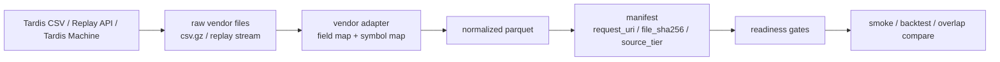
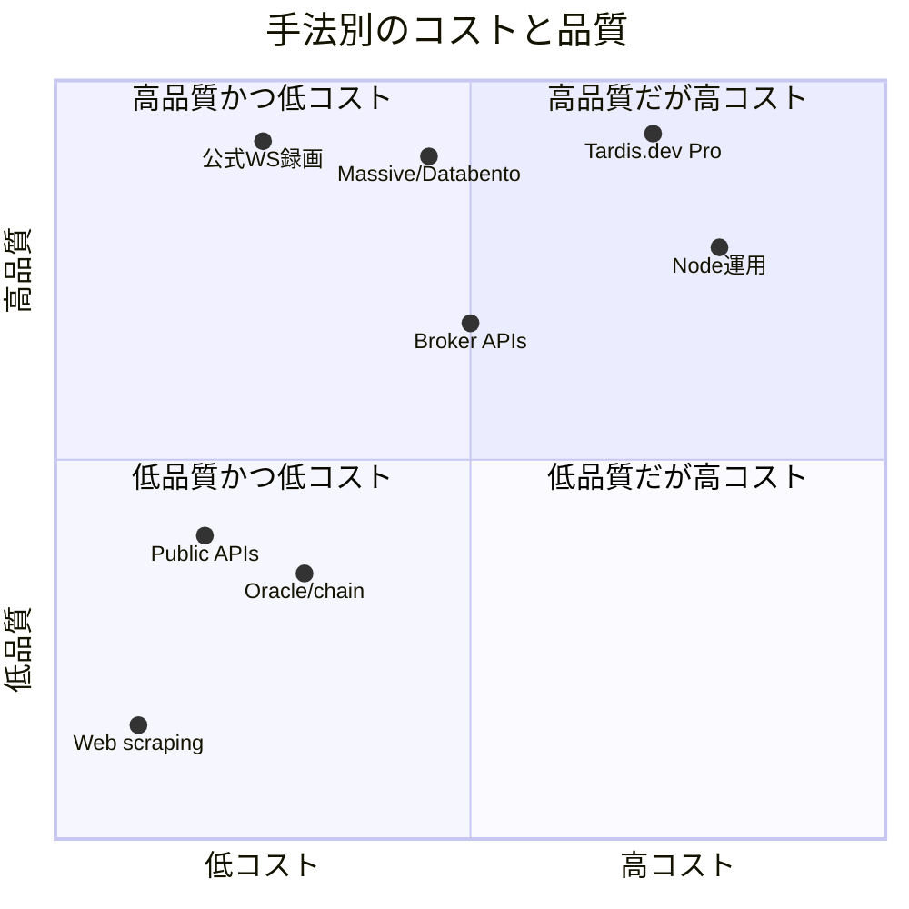

# Trade[XYZ] 実データ収集の代替手法調査

## エグゼクティブサマリー

明示されていない前提として、**Trade[XYZ] は Hyperliquid 系の「公開 REST / 公開 WebSocket / 公式 S3 archive」を持つ暗号資産デリバティブ venue**と仮定して評価した。もし実体が別 venue なら、**vendor の対応可否と優先順位**は変わるが、**方法論の序列**はほぼそのまま使える。予算上限、許容遅延、必要 symbol 群、保持期間は未指定として扱った。

実務的に見ると、**最も現実的な収集方針は単一ソース主義ではなく三層構成**である。すなわち、**前向きの正本は公式 WebSocket 録画**、**既往履歴の圧縮取得は Tardis.dev のような replay / CSV vendor**、**AAPL・NVDA・SPY・QQQ・FX など外部 real-market reference は Massive または Databento のような exchange-licensed vendor**に分ける構成だ。Hyperliquid 系 official archive は、**月次アップロード・欠損あり・L2 snapshots と asset contexts 中心で、candles や spot asset data は揃わない**ため、archive 単独で readiness を満たす運用は弱い。citeturn21search1turn14search2turn1search0turn12search0turn7search5turn24search5

**最優先の推奨順**は次の通りである。  
第一に、**公式 WebSocket を append-only で録る WS-first recorder**。これは read-only、raw_payload_ref を最も自然に持て、追加データライセンスも不要で、将来の監査・再現性の核になる。第二に、**Tardis.dev Pro を使った historical / replay 補完**。これは「すぐに履歴が欲しい」「archive が足りない」「collector の空白を埋めたい」に最も効く。第三に、**Massive か Databento で外部参照市場を別レイヤで取得**することだ。反対に、**Yahoo 系スクレイピング、非公式 API、crowdsourced telemetry を primary にする運用は非推奨**である。Yahoo は ToS で自動収集を原則禁止し、`yfinance` 側も研究・教育目的の利用を前提に Terms 参照を促している。citeturn14search1turn12search1turn23search22turn15search4turn6search5turn2search24

## 前提と評価基準

今回の判断基準は、ユーザーが提示した制約に合わせている。すなわち、**no exchange write、read-only evidence、Python 3.13 + Polars/DuckDB/PyArrow、raw_payload_ref による provenance、できるだけ低運用負荷**である。この条件だと、評価軸は「最速」ではなく、**証跡の残しやすさ・法務の安定性・障害時の再現性・既存の readiness gate への接続しやすさ**になる。

この前提では、現在の collector/archive/backfill の延長線だけで頑張るより、**source tier を分ける**方が事故が少ない。特に Hyperliquid 系 official archive は、**requester pays、月次更新、timeliness 保証なし、欠損あり**で、かつ **S3 から取れるのは L2 snapshots と asset contexts が中心**である。したがって、archive は「第三ソースの補助」には向くが、「唯一の正本」には向きにくい。AWS の requester pays は、ダウンロード側に課金責任が移る。citeturn21search1turn5search0turn5search10

以後の表では、各手法について **技術可否、鮮度、coverage、費用形態、法務/コンプラ、運用複雑性、必要 infra、品質リスク、repo への接続しやすさ**を condensed に示す。

## 代替手法一覧

### Venue-native と暗号資産 vendor

| アプローチ | 実務評価 | 主なリスクと必要 infra | 既存 repo への接続 | 判定 | 根拠 |
|---|---|---|---|---|---|
| **公式 WebSocket 録画** | 可否: 高。鮮度: push 型で最良。Hyperliquid 系では `l2Book`、`trades`、`candle`、`allMids`、`bbo`、asset contexts を取得でき、book はブロック単位で少なくとも 0.5 秒ごとに押し出される。Coverage: 前向き収集に最適。Cost: 主に VPS / storage / monitoring。 | 法務: 低。品質: 切断ギャップ、順序乱れ、ローカル時計ずれ。Ops: 中。Infra: 1〜2 小型常駐ノード、object storage、監視、NTP。 | `raw_payload_ref` を最も素直に実装できる。hot path は dlt ではなく **append-only raw → Polars normalize → Parquet** が向く。 | **即使用** | citeturn14search1turn9search0turn10search2 |
| **公式 REST polling / parity snapshots** | 可否: 高。鮮度: polling 依存で秒〜分。Coverage: mids / candles / recent trades / funding の parity や小ギャップ補完向き。Cost: 低。 | 法務: 低。品質: sampling bias、missed ticks。Ops: 低〜中。Time-range 系は 500 件単位 pagination、rate-limit weight に注意。 | WS の補助として優秀。dlt を使うならこちら側。正本の tick 取得には不十分。 | **即使用** | citeturn21search4turn0search12turn14search0 |
| **公式 archive / S3 dump** | 可否: 中。鮮度: 悪い。Coverage: venue が公開する範囲だけ。Hyperliquid 系では月次・欠損あり・L2 snapshots と asset contexts 中心。Cost: requester-pays + storage。 | 法務: 低。品質: timeliness なし、欠損あり。Ops: 中。Infra: AWS credentials、download / decompress / verify。 | batch ingest には合うが、現時点 readiness の単独解にはなりにくい。 | **中程度の作業** | citeturn21search1turn5search0turn5search5 |
| **非 validating node / node data** | 可否: 中。鮮度: 良い。Foundation non-validating node は low latency を狙えるが best-efforts で authoritative source として依存非推奨。Coverage: fills / orders / L1 tx に強い。Cost: infra と運用負荷が重い。 | 法務: 低。品質: node completeness、network issues。Ops: 高。Foundation peer 利用には条件があり、独自 node は permissionless だが自前運用が必要。 | fills/order provenance には強いが、minimal ops 条件にはやや反する。 | **中程度の作業** | citeturn21search0turn21search3turn21search5 |
| **Tardis.dev replay / CSV / Tardis Machine** | 可否: 高。鮮度: historical / replay に最強、real-time 連携も可能。Coverage: Hyperliquid 対応が明示され、`l2Book`、`bbo`、`activeAssetCtx` を提供。replay は real-time と同じ subscribe ロジックで過去再生できる。Cost: 公開価格あり。 | 法務: 低〜中。品質: vendor 正規化差分、coverage 起点日に依存。Ops: 低〜中。Infra: API key、storage、比較検証。 | Pro/Business なら replay API と Tardis Machine を使え、**raw vendor file → manifest → normalize** が非常に作りやすい。 | **即使用** | citeturn1search0turn10search6turn12search0turn12search1 |
| **Amberdata / Kaiko / CoinAPI** | 可否: 高。Amberdata は Hyperliquid Futures を REST / WS / S3 bulk で提供。Kaiko は Stream と L1/L2 / cloud delivery を持ち、CeFi derivatives の歴史も長い。CoinAPI は 400+ exchanges、REST/WS/FIX、historical order books / quotes / trades を提供し、HYPERLIQUID metadata も扱う。Cost: Amberdata/Kaiko は見積中心、CoinAPI は credit 課金。 | 法務: 中。品質: normalized schema による venue-specific field 喪失、vendor lock-in。Ops: 低〜中。Infra: API keys / contracts。 | 既存 repo には入りやすいが、**official truth source の代替ではなく vendor truth source**になる。 | **中程度の作業** | citeturn13search8turn13search6turn13search13turn13search7turn4search11turn4search6turn22search17 |

### 外部 real-market reference と汎用データ

| アプローチ | 実務評価 | 主なリスクと必要 infra | 既存 repo への接続 | 判定 | 根拠 |
|---|---|---|---|---|---|
| **Exchange-licensed vendor for reference markets** | 可否: 高。Massive は米株 20 年の trade / quote、NBBO quotes、flat files、WebSocket、価格は $29 / $79 / $199。Databento は live / historical、MBP-1 / MBO / OHLCV、`to_parquet`、usage-based pricing と $125 credit。Coverage: AAPL / NVDA / SPY / QQQ など外部参照市場向けに非常に強い。 | 法務: 中。いずれも internal use 前提で、Massive は再配布に business product が必要、Databento は外部再配布不可。Ops: 低〜中。Infra: API key、symbol master、session/calendar。 | **real_market_reference gate** 専用レイヤに最適。Databento は Parquet / symbology が強く、Massive は料金と導入容易性が強い。 | **即使用** | citeturn7search5turn7search14turn7search19turn23search1turn23search4turn15search4turn24search2turn24search5turn24search17 |
| **Broker APIs** | 可否: 中。IBKR は多くの証券で L1 subscription が必要。Alpaca は market data API を提供し、無料 / $99 の plan があり、7+ years history。OANDA は口座前提だが pricing stream と candles を提供、Exchange Rates API は 32 年超 history と 5 秒更新、価格は $450/mo から。 | 法務: 中〜高。口座・market data契約・redistribution 制約が重い。Alpaca は business redistribution 不可。Ops: 中〜高。Infra: accounts, secrets, session management。 | 「read-onlyにはできるが、broker dependency が増える」。minimal ops 優先なら第一候補ではない。 | **中程度の作業** | citeturn2search1turn18search0turn6search4turn8search5turn19search1turn19search19 |
| **Public / low-cost APIs** | 可否: 高。Alpha Vantage は premium $49.99/mo から。Tiingo は $30 / $50 で IEX / Forex / Crypto の REST / WS を提供。Twelve Data は real-time stock / forex / crypto を JSON / CSV で提供し $29/mo から。CoinGecko は free 100 calls/min・10,000 monthly、paid $35/mo から。Coverage は広いが、microstructure は弱い。 | 法務: 中。Tiingo は redistribution license が別途必要。品質: aggregation / latency / session handling / symbol mapping のばらつき。Ops: 低。Infra: API keys のみ。 | provisional reference、weekend/holiday 補助、低頻度 리サーチには良い。**readiness の canonical source としては弱い**。 | **即使用** | citeturn17search1turn20search6turn20search9turn17search0turn3search18turn3search2turn3search12 |
| **Oracle / chain data** | 可否: 中〜高。Chainlink は複数データソース集約だが、一部 feed は single-source や calculated value の例外がある。Pyth は 120+ first-party providers と Benchmarks / History API を持つ。Coverage は参照価格に強いが、bid/ask・depth・execution microstructure には弱い。 | 法務: 低。品質: oracle methodology、update cadence、confidence interval、order-book 不在。Ops: 低〜中。Infra: API key か chain/RPC。 | **secondary reference / oracle sanity check** としては有効。primary market data としては不十分。 | **中程度の作業** | citeturn3search0turn3search1turn3search6turn3search11 |
| **Synthetic replay from L2 / trades / book** | 可否: 高。ただし source 単体ではなく、official WS・Tardis・Databento 等の上で成り立つ。Databento では MBP から BBO / trades / OHLCV を導出可能で、Tardis は historical replay を real-time 形式で流せる。 | 法務: source license に従属。品質: gaps があると再構築も壊れる。Ops: 中。Infra: compute / storage。 | backtest / validation / regression には強い。**新しい source ではなく source amplification** と考えるべき。 | **中程度の作業** | citeturn10search6turn15search5turn15search1 |
| **Third-party flat files / paid archives** | 可否: 中〜高。Binance は public daily / monthly files、Cboe DataShop は historical downloads、Nasdaq Data Link は streaming / REST APIs を提供。Coverage は asset class と vendor に依存。 | 法務: 低〜中。品質: venue 固有、更新頻度差。Ops: 低〜中。Infra: bulk download と変換。 | Trade[XYZ] そのものに対応していれば強力。**対応していない venue には効かない**。 | **中程度の作業** | citeturn5search1turn5search6turn5search4turn5search8 |

### 組織的には可能だが primary には向かない手法

| アプローチ | 実務評価 | 主なリスクと必要 infra | 既存 repo への接続 | 判定 | 根拠 |
|---|---|---|---|---|---|
| **On-device edge collection** | 可否: 中〜高。複数地域 / 複数 ISP / 自宅回線 + VPS で collector を分散させ、blind spot を減らす方法。WebSocket は複数 connection に分けるのが実務的。 | 法務: 低。品質: clock sync と config drift 管理が必要。Ops: 中〜高。Infra: multi-region nodes、private networking、Tailnet Lock、S3 event routing。 | 外部 vendor なしで冗長化できる。だが minimal ops 優先だと第二段階。 | **中程度の作業** | citeturn10search2turn10search0turn9search15turn9search11turn9search8 |
| **Partner data sharing** | 技術的には可。ただし、相手が収集した raw をもらう方式は、chain-of-title と redistribution 権限を契約で明確化しないと危険。 | 法務: 高。Massive / Databento / Tiingo / Alpaca などは internal use や redistribution に制約がある。Ops: 高。Infra: secure transfer, access control, audit。 | 既に信頼できる提携先がある場合だけ。新規に起こすと data source より契約調整がボトルネックになる。 | **非実務的** | citeturn23search1turn24search17turn20search9turn6search4 |
| **Crowdsourced telemetry** | 技術的には可。だが各 collector の時刻同期、network path、schema、license、tamper control を揃えるのが難しい。 | 法務: 高。品質: provenance 汚染、改ざん、重複、silent gaps。Ops: 非常に高い。Infra: federation / signing / attestation / secure mesh。 | 個人プロジェクトでは primary source にしない方がよい。 | **非実務的** | citeturn9search15turn9search11turn23search1turn24search17 |
| **Web scraping / unofficial APIs** | 技術的には初期着手が簡単。Coverage も広く見える。だが Yahoo は ToS で automated collection を原則禁止し、robots も厳しい。`yfinance` は research / educational を前提に Terms 参照を促す。 | 法務: 高。品質: layout change、shadow throttle、HTML 依存、provenance 弱い。Ops: 初期は低いが、長期は高い。 | primary / readiness / evidence と最も相性が悪い。 | **非実務的** | citeturn6search5turn6search15turn2search24 |

## 制約適合の整理

以下は、ユーザー制約に照らした**実務判定**である。ここでの「即使用」は「read-only / provenance / Python stack / 低運用」の条件を**そのまま、または軽い adapter で満たせる**ものを意味する。

| 手法 | no write / read-only | raw_payload_ref | minimal ops | 既存 stack 適合 | 判定 |
|---|---|---:|---:|---:|---|
| 公式 WS 録画 | ◎ | ◎ | ○ | ◎ | **即使用** |
| Tardis.dev Pro | ◎ | ◎ | ○ | ◎ | **即使用** |
| Massive / Databento reference | ◎ | ◎ | ○ | ◎ | **即使用** |
| Amberdata / Kaiko / CoinAPI | ◎ | ◎ | △ | ○ | **中程度の作業** |
| Broker APIs | ○ | ◎ | △ | ○ | **中程度の作業** |
| Public / low-cost APIs | ◎ | ◎ | ◎ | ◎ | **即使用だが canonical には弱い** |
| Oracle / chain data | ◎ | ◎ | ○ | ○ | **中程度の作業** |
| Node 運用 | ◎ | ◎ | × | ○ | **中程度の作業** |
| Partner / crowdshare / scraping | △〜× | △ | × | △ | **非実務的** |

実務上の要点は三つだけでよい。  
第一に、**official WS recorder は最も安く、最も証跡に強い**。第二に、**speed-to-ready を短縮するなら Tardis が最も効率的**で、しかも Hyperliquid 系 venue では replay と CSV の両面がある。第三に、**外部市場 reference は venue-native source と混ぜず、専用 vendor adapter を分離する**のが事故を減らす。Databento は Parquet / schema / symbology が強く、Massive は fixed pricing と導入容易性が強い。citeturn14search1turn12search1turn15search4turn24search5turn7search14

一方、**public APIs は「すぐ使える」が「本番 readiness には弱い」**。Alpha Vantage、Tiingo、Twelve Data、CoinGecko は、開発速度と低コストでは強いが、vendor aggregation、session semantics、redistribution 制約、microstructure fidelity の面で primary source にはなりにくい。**web scraping は安く見えて、最も高くつく**。ToS と保守で必ず後から返ってくる。citeturn17search1turn20search6turn17search0turn3search2turn6search5

## 上位推奨の実装計画

### 公式 WebSocket ファースト収集

公式 WS は、**「今後の真実を自分で持つ」**ための最小コスト手段である。Hyperliquid 系 official docs では公開 WS と各 subscription が定義され、REST は pagination と rate-limits が明示されている。したがって、**WS を正本、REST を parity / sanity / gap detector**に分ける構成が最も合理的だ。複数 subscription を 1 connection に詰め込みすぎないことも、一般的な exchange WS best practice と整合する。citeturn14search1turn21search4turn10search2

```mermaid
flowchart LR
    A[Trade[XYZ] WebSocket<br/>l2Book / trades / bbo / candle] --> B[raw append-only NDJSON.ZST]
    C[Trade[XYZ] REST parity<br/>allMids / funding / candles] --> D[parity JSON.ZST]
    B --> E[Polars normalizer]
    D --> F[quality validator<br/>gap / dup / heartbeat]
    E --> G[normalized parquet]
    F --> H[source manifest + quality manifest]
    G --> H
    H --> I[readiness gates]
    I --> J[smoke / backtest]
```

実装は 6 段階で足りる。  
まず、`l2Book`、`trades`、`bbo`、必要なら `candle` を別 subscription 群として 2 connection 以上に分けて append-only で保存する。次に、各 record に **`source_endpoint`、`subscription_hash`、`connection_id`、`recv_ts_ns`、`payload_sha256`、`raw_payload_ref`** を envelope として付ける。`raw_payload_ref` は、たとえば `raw/tradexyz/ws/date=2026-06-01/hour=16/conn=a/file.ndjson.zst#byte=183920` のように file + offset で引ける形がよい。三番目に、REST で `allMids`、`candleSnapshot`、funding / OI 系を定期取得し、**WS 空白検知**と **book/trade 整合性**を見る。四番目に、Polars で正規化して canonical parquet を出し、五番目に DuckDB/Polars で duplicate, bid-ask inversion, heartbeat gap, null rate を manifest 化する。最後に、同じ normalized parquet をそのまま smoke / backtest に流す。dlt を使うなら、hot path ではなく **REST の batch pulls と metadata manifests**に限定した方が安定する。

必要資格は基本的にない。公開エンドポイントなので、必要なのは network 到達性と監視だけである。工数は **3〜6 人日**が目安で、主コストは infra 側の常駐費と保管費になる。金額はクラウド次第だが、**小型 VPS 2 台 + object storage + 監視**で足りるケースが多い。  
この方法の最大のメリットは、**raw_payload_ref を venue-native payload で持てること**、最大の弱点は **forward-only なので、今までの空白は埋まらないこと**である。

### Tardis.dev による履歴と replay 補完

履歴の速攻回収と replay の一体運用では、Tardis が最も実務的である。Hyperliquid 対応ページで **`l2Book`、`bbo`、`activeAssetCtx`** が明示され、replay API は **real-time と同じ subscribe ロジックで historical market data を再生**できる。しかも pricing が公開されており、Pro 以上で replay API / Tardis Machine / instrument metadata API が使える。citeturn1search0turn10search6turn12search0turn12search1



おすすめの導入順は明快だ。  
最初に、**CSV だけで backfill** する。これなら adapter は軽く、row-level `raw_payload_ref` は `vendor=tardis/.../file.csv.gz#row=92831` で持てる。次に、canonical schema に変換し、official collector と重なる時刻帯で **overlap compare** を取る。ここで比較するのは、row count、timestamp monotonicity、top-of-book spread、funding / OI / mark/index price の整合だ。三番目に、backtest が replay を欲しがるなら **Pro** に上げて Tardis replay API か Tardis Machine を使う。四番目に、vendor original をそのまま raw bucket に保存し、**vendor request URI・API key id・download timestamp・sha256** を manifest に持たせる。これで provenance は実務上十分になる。

必要 credentials は **Tardis API key** である。Pro / Business で replay API と Tardis Machine が使える。ここは価格が公開されていて、2026-06-01 時点の public pricing では、**Perpetuals の Professional は $900/月、Derivatives の Professional は $1,350/月**である。USD/JPY を OANDA live rate の **159.28** で概算すると、**約 ¥143,352/月** と **約 ¥215,028/月** になる。Academic / Solo は安いが、**CSV only 寄り**なので、replay 前提なら Pro から見るのが現実的だ。citeturn12search0turn25search4turn26calculator0turn26calculator1

工数は、**CSV ingest だけなら 2〜5 人日**、**replay 統合までやると 4〜8 人日**が目安である。  
この方法の最大のメリットは、**speed-to-ready** と **official archive の弱さの一発解決**、最大の弱点は **月額コスト**である。

### Massive または Databento による外部 real-market reference

AAPL・NVDA・SPY・QQQ・FX など、Trade[XYZ] 外の real-market reference を真面目にやるなら、**公式 source と別系統の licensed vendor を置く**のが正攻法である。Massive は **米株 trade/quote の 20 年 history、NBBO quotes、flat files、WebSocket、価格は $29 / $79 / $199** と分かりやすい。Databento は **live / historical の一貫 schema、MBP-1 / MBO / OHLCV、Parquet 変換、symbology 解決、usage-based pricing と free credits** が強い。どちらも internal use の研究基盤には相性がよいが、再配布には制約がある。citeturn7search5turn7search14turn7search19turn15search4turn15search3turn24search2turn24search17turn23search1turn23search4

```mermaid
flowchart LR
    A[Massive or Databento<br/>NBBO / trades / bars] --> B[raw vendor payloads<br/>JSON.ZST / DBN / CSV]
    B --> C[symbol master + session/calendar]
    C --> D[reference parquet]
    D --> E[join with Trade[XYZ] normalized quotes]
    E --> F[reference manifest<br/>coverage / corp actions / latency tier]
    F --> G[real_market_reference gate]
    G --> H[reports / backtest]
```

実装の分岐はこう考えるとよい。  
**Massive** は、固定料金で早く始めたい、小規模 universe で十分、NBBO / trades / bars が欲しい、flat files も使いたい、という場合に合う。**Databento** は、Parquet-first、nanosecond / direct-feed 系 schema、symbology 解決、futures / options まで視野に入る、という場合に強い。どちらでも、raw は vendor 形式のまま保存し、`raw_payload_ref` は file + row か DBN record offset で持てる。`real_market_reference` の gate では、**symbol mapping、session calendar、corporate actions の取り扱い、coverage completeness** を পৃথ立管理すべきで、Trade[XYZ] venue-native quotes とは混ぜて保存しない方が安全である。

価格面では、Massive の public plans は **$29 / $79 / $199** で、同じ USD/JPY 159.28 を使うと **約 ¥4,619 / ¥12,583 / ¥31,697** である。Databento は fixed monthly ではなく **usage-based + $125 credits** なので、少数 symbol の reference layer なら低コストで始めやすい。もし FX が主で、株よりも **監査性のある為替 reference** を重視するなら、OANDA Exchange Rates API は **5 秒更新、32 年超 history、200+ currencies / 38,000+ pairs** を持つが、公開価格は **$450/月 から、年額 $4,850 から**で、かなり高い。citeturn7search14turn7search8turn24search2turn25search4turn26calculator2turn26calculator3turn26calculator4turn19search16turn19search1turn19search0turn26calculator5turn26calculator6

工数は **2〜4 人日**が基準で、Databento の場合は DBN / symbology 周りで **+1〜2 人日**見ておくと現実的である。  
この方法の最大のメリットは、**reference layer が venue-native data と分離されること**、最大の弱点は **vendor terms と symbol mapping**である。

## 意思決定マトリクス

下表は、**5 が良い / 1 が悪い**で、今回の制約に対する実務スコアを付けたものだ。費用は「安いほど高得点」、法務リスクは「低いほど高得点」で付けている。スコアは公開 docs と価格、schema 性質を踏まえた私の総合評価である。citeturn14search1turn12search1turn24search5turn23search1turn17search1turn20search6turn6search5

| 手法 | 技術可否 | 費用 | speed-to-ready | データ品質 | 法務安定性 | 運用負荷 | 総合 |
|---|---:|---:|---:|---:|---:|---:|---:|
| 公式 WS 録画 | 5 | 5 | 3 | 5 | 5 | 3 | **26** |
| Tardis.dev Pro | 5 | 2 | 5 | 5 | 4 | 4 | **25** |
| Massive / Databento | 5 | 3 | 5 | 5 | 4 | 4 | **26** |
| Amberdata / Kaiko / CoinAPI | 4 | 2 | 4 | 4 | 4 | 4 | **22** |
| Broker APIs | 3 | 3 | 3 | 4 | 3 | 2 | **18** |
| Public / low-cost APIs | 5 | 5 | 5 | 2 | 3 | 5 | **25** |
| Oracle / chain data | 4 | 4 | 4 | 2 | 5 | 4 | **23** |
| Node 運用 | 2 | 2 | 2 | 4 | 4 | 1 | **15** |
| Web scraping | 4 | 5 | 5 | 1 | 1 | 2 | **18** |

見方として重要なのは、**「総合点が高い = 何でも一番よい」ではない**ことだ。Public APIs は安くて速いので点が伸びるが、**canonical source としての品質**は低い。一方で Tardis は高いが、**backfill と replay の speed-to-ready**で非常に強い。したがって、実務では **1 ソースで勝とうとせず、primary / secondary / reference を分ける**のが良い。



## 追加で必要な情報

最終的な推奨を確定するには、次の情報が必要である。

1. **月額予算の上限**。特に **¥2万円未満 / ¥5万円未満 / ¥15万円超**で選択肢が大きく変わる。  
2. **許容遅延**。sub-second が必要なのか、1〜5 秒で良いのか、1 分 bar で十分なのか。  
3. **必要 symbol 群**。Trade[XYZ] の venue-native symbols だけなのか、AAPL / NVDA / SPY / QQQ / USDJPY など外部 reference も canonical にしたいのか。  
4. **必要 retention period**。30 日なのか、1 年なのか、4 年以上なのか。  
5. **raw の保管方針**。raw を無期限保存するのか、rolling retention でよいのか。  
6. **法務条件**。内部研究専用か、将来レポート再配布や外部提供の可能性があるか。  
7. **AWS requester-pays の承認可否**。official archive を fallback に残すかどうかに直結する。  
8. **長時間常駐プロセス / 小型 VPS の運用許容**。Edge collectors を入れられるかどうかがここで決まる。  
9. **FX reference の格**。OANDA 級の audit-trusted reference が必要か、Massive / Tiingo / Twelve Data 級で十分か。  
10. **vendor normalized data を evidence として許容するか**。これで Tardis/Amberdata/Kaiko/CoinAPI の重みが変わる。

## 最終推奨

**単独で最も実務的な道は、`公式WSファースト + Tardis補完 + Massive/Databento reference` の三層構成**である。  
理由は単純で、これだけが **read-only、raw_payload_ref、最小運用、早い readiness、法務の安定性**を同時に満たしやすいからだ。archive-only は遅くて欠ける。broker APIs は口座・契約が重い。public APIs は速いが canonical に弱い。scraping は最初だけ楽で、後で高くつく。citeturn21search1turn12search1turn24search5turn6search5

したがって、**今すぐ 1 本だけ決めるなら**、こうするのがよい。  
**Historical/backfill の急ぎがあるなら Tardis.dev Pro を契約し、同時に official WS recorder を forward truth source として走らせる。外部 real-market reference は Massive Starter/Developer か Databento で別レイヤ化する。** これが最も現実的で、repo の readiness gates と provenance 要件に噛み合う。  
予算が vendor に届かない場合だけ、**official WS recorder を正本にして、external reference は Massive の低プランか Tiingo / Twelve Data を暫定採用**し、後から reference layer を格上げするのが次善である。

16:9:22.(06/01)