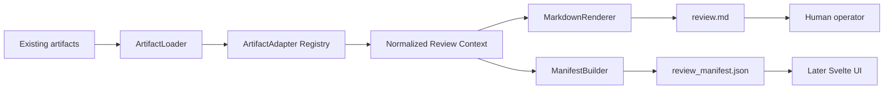
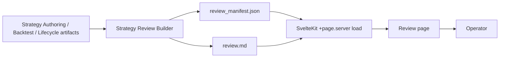

# Minimal Strategy Review Builder for MarketLens Strike

## Executive summary

The best first implementation for MarketLens Strike is **not** a new “Strategy Case” registry, a new orchestration layer, or a UI. It is a **thin, read-only Strategy Review Builder** that consumes existing local artifacts and produces exactly two outputs per case:

- `review.md`
- `review_manifest.json`

That recommendation follows directly from the current repository shape: the workspace already has Strategy Authoring, native backtests, backtest suites and packs, lifecycle review, paper-only preview, and strict boundaries around live trading. What it lacks is a **single human-readable review surface** that consolidates those artifacts without creating another execution stack. The repo also explicitly distinguishes backtest validation from alpha proof, paper readiness, and live readiness, which is a strong signal that the review builder must remain an evidence summarizer, not an approval engine. fileciteturn0file0

The minimal and best-practice design is therefore:

- **read-only first**
- **non-destructive**
- **artifact-path driven**
- **single-responsibility modules**
- **Markdown as the human source of truth**
- **JSON manifest as the machine/UI contract**
- **strict and lenient modes**
- **artifact hashing with SHA-256**
- **missing artifacts represented explicitly, not hidden**
- **no auto-approval**
- **`live_allowed: false` hard-coded in manifest and rendered review**
- **later Svelte UI reads `review_manifest.json` and `review.md`; it does not become the source of truth**

This approach is also aligned with current best practices from official sources. For fast research backtesting, vectorbt cleanly separates signal-driven simulation (`from_signals`) from more complex order logic (`from_order_func`), which is precisely the distinction a review builder should preserve rather than flatten. NautilusTrader’s documentation is especially clear that realistic backtesting depends on data type, timestamp handling, partial fills, queue modeling, and immutable historical data. Scikit-learn’s `TimeSeriesSplit` formally documents why time-ordered validation differs from ordinary cross-validation, and Freqtrade’s official lookahead-analysis documentation explains why whole-dataframe indicator computation can silently falsify backtests. citeturn10view0turn10view5turn4view1turn4view2turn4view3turn4view4

For provenance and manifest design, the lightest useful precedent comes from Frictionless Data: a descriptor at the top level, a `resources`-style list of referenced files, and per-resource `path`, `bytes`, and `hash`. DVC’s experiment-management docs reinforce the same pattern from the ML side: track parameters, metrics, plots, and artifacts in standard structured files and compare them without forcing a heavyweight runtime coupling. JSON Schema remains the right guardrail for interchange and validation, and Python’s `hashlib` provides a standard way to compute SHA-256 file digests efficiently. citeturn6view2turn7view0turn5view0turn9view0turn9view1turn8view0

The practical outcome is simple:

- **first PR**: build a `strategy-review build` command that only reads existing artifacts and writes `review.md` and `review_manifest.json`
- **second PR**: add robust adapters for existing Strategy Authoring, backtest pack, lifecycle review, and paper preview artifacts
- **third PR**: harden with fixtures, golden-file tests, strict/lenient exit codes, and docs

That sequence delivers immediate user value while staying DRY, reusable, and reversible. fileciteturn0file0

## Design principles

The Strategy Review Builder should be designed as a **presentation and provenance layer**, not as a new research engine. The repo already has the engines. A good builder therefore does four things only: load artifacts, normalize evidence, render Markdown, and write a manifest. It should not discover data via network calls, run backtests, create paper sessions, mutate strategies, or infer operator approval. Those boundaries match the current workspace, which already separates Strategy Authoring, backtests, lifecycle review, paper preview, and operational auditing. fileciteturn0file0

A second principle is that the builder must preserve the distinction between **fast signal-level evidence** and **realistic execution evidence**. vectorbt’s official API makes the practical boundary very explicit: `Portfolio.from_signals()` is ideal when the strategy can be expressed as entry/exit signals, and it already handles common abstractions like preventing redundant entries and implementing stop loss / take profit behavior. When logic becomes stateful, multi-order, or more execution-specific, vectorbt itself recommends moving to `from_order_func()`. That is exactly why the review builder should summarize artifacts by **what they prove**, not by forcing every strategy into one flattened story. citeturn10view0turn10view5

A third principle is that the review must foreground **backtest realism and leakage risk**. NautilusTrader’s official backtesting docs emphasize immutable historical data, optional consumption tracking, seeded probabilistic fills for reproducibility, L2/L3 partial fills, and the need to treat bar timestamps carefully to avoid look-ahead bias. The same docs warn that incorrect timestamp handling produces unrealistic simulations, and they explain why book depth and queue behavior matter when simulating fills. Freqtrade’s official lookahead-analysis docs add a complementary warning: full-dataframe indicator calculation can easily allow future candles to contaminate signals, and a dedicated anti-lookahead pass should compare mutated runs against the original backtest. Time-ordered validation must also respect chronology; scikit-learn’s `TimeSeriesSplit` exists precisely because ordinary cross-validation can train on future data and evaluate on past data, and the `gap` parameter exists to leave space between train and test. citeturn4view1turn4view2turn4view4turn4view3

A fourth principle is that the manifest should be **descriptor-like, not database-like**. Frictionless Data’s package/resource model is a strong precedent: a top-level JSON descriptor listing resources, each with a location and optional metadata like `bytes` and `hash`. That matches your intended `review_manifest.json` almost perfectly. DVC’s docs reinforce the same minimalism from another angle: experiments are easier to compare when metrics, parameters, and plots live in standard JSON/YAML/CSV files rather than in opaque internal state. This points to a manifest that references source artifacts rather than copying them. citeturn6view2turn7view0turn5view0

A fifth principle is that the builder should be **UI-ready without becoming UI-coupled**. SvelteKit’s official docs document that server `load` functions are the right place to read from the filesystem and return serializable data, while universal `load` functions can consume that data in the browser. That means `review_manifest.json` should remain intentionally serializable and stable, and `review.md` should remain a plain file with durable semantics; the future Svelte UI becomes a viewer layer over those outputs. citeturn6view5turn6view4

The intended flow is therefore:



The strongest “do not do this” rule is also clear from both the repository and the external sources: **do not encode approval logic into the builder**. The repo already states that pack validation is not proof of alpha, paper readiness, or live readiness, and current boundaries keep live trading out of scope. The review builder should therefore surface evidence and gaps, but never produce an operator decision automatically. fileciteturn0file0

## Recommended package layout

The most maintainable layout is one that mirrors the four core responsibilities: **load**, **extract**, **render**, **write**. The CLI stays thin. Artifact-specific knowledge lives in adapters. Rendering is pure. Writing is atomic.

### Recommended module map

| Path | Responsibility | Core public API |
|---|---|---|
| `src/sis/strategy_review/models.py` | Pydantic models and enums for request/result/manifest | `ReviewBuildRequest`, `ArtifactRef`, `ReviewManifestV1`, `ReviewStatus` |
| `src/sis/strategy_review/hashing.py` | File hashing and stat helpers | `hash_file(path, algo="sha256")`, `stat_file(path)` |
| `src/sis/strategy_review/loader.py` | Read-only file loading; parse JSON/YAML/Markdown text | `load_artifact(path, expected_kind=None)` |
| `src/sis/strategy_review/adapters/base.py` | Adapter protocol and registration | `ArtifactAdapter`, `AdapterRegistry` |
| `src/sis/strategy_review/adapters/authoring.py` | Summarize Strategy Authoring spec/result | `AuthoringAdapter` |
| `src/sis/strategy_review/adapters/backtest.py` | Summarize backtest metrics / pack / artifact summary | `BacktestMetricsAdapter`, `BacktestPackAdapter`, `BacktestArtifactSummaryAdapter` |
| `src/sis/strategy_review/adapters/lifecycle.py` | Summarize lifecycle review and backtest acceptance | `LifecycleReviewAdapter`, `BacktestAcceptanceAdapter` |
| `src/sis/strategy_review/adapters/paper.py` | Summarize paper preview / paper observation manifest | `PaperIntentPreviewAdapter`, `PaperObservationAdapter` |
| `src/sis/strategy_review/context.py` | Merge extracted evidence into one normalized view model | `assemble_review_context(evidence_list)` |
| `src/sis/strategy_review/renderer.py` | Render `review.md` from normalized context | `render_review_markdown(context)` |
| `src/sis/strategy_review/manifest.py` | Build and validate manifest payload | `build_manifest(...)`, `validate_manifest(...)` |
| `src/sis/strategy_review/writer.py` | Write outputs atomically | `write_review_outputs(out_dir, markdown, manifest)` |
| `src/sis/strategy_review/service.py` | Orchestrate one build | `build_review(request) -> BuildResult` |
| `src/sis/commands/strategy_review.py` | CLI glue only | `register_strategy_review_commands(subparsers)` |
| `schemas/strategy_review_manifest.v1.schema.json` | JSON Schema contract for UI/interchange | tracked schema file |
| `tests/strategy_review/` | Unit, golden, CLI, regression tests | test modules + fixtures |

### Class and function boundaries

A reusable internal contract looks like this:

```python
# src/sis/strategy_review/adapters/base.py
from __future__ import annotations

from pathlib import Path
from typing import Any, Protocol

from sis.strategy_review.models import ArtifactRef, ExtractedEvidence

class ArtifactAdapter(Protocol):
    kind: str

    def can_handle(self, ref: ArtifactRef, payload: Any) -> bool: ...
    def extract(self, ref: ArtifactRef, payload: Any) -> ExtractedEvidence: ...
```

The important design choice is that **adapters do not read files** and **renderers do not inspect raw artifacts**. `loader.py` loads and hashes; adapters only interpret payloads; `context.py` merges extracted evidence; `renderer.py` produces text; `manifest.py` produces JSON. That is the cleanest way to keep each module single-responsibility and individually testable.

### Recommended service shape

```python
# src/sis/strategy_review/service.py
def build_review(request: ReviewBuildRequest) -> BuildResult:
    refs = collect_refs_from_request(request)
    loaded = [load_artifact(ref.path, expected_kind=ref.kind) for ref in refs]
    extracted = [registry.extract(item.ref, item.payload) for item in loaded]
    context = assemble_review_context(request, extracted)
    markdown = render_review_markdown(context)
    manifest = build_manifest(request, context, loaded)
    validate_manifest(manifest)
    return write_review_outputs(request.out_dir, markdown, manifest)
```

### Why this layout is the right trade-off

This structure fits the current repo because the repository already uses tracked schemas and Python builders/models as its validation surfaces. It also avoids inventing a case registry before you have a stable review contract. The directory itself can function as a case boundary in the first phase:

```text
data/strategy_reviews/case_20260616_001/
  review.md
  review_manifest.json
```

That is enough for the first release. Only later, if you truly need indexing/history, should you add a formal registry. fileciteturn0file0

## Manifest, CLI, and review template

The minimum viable contract is a single schema: `strategy_review_manifest.v1`. The builder should write the manifest **every time**, even in strict mode failures, because the manifest itself is part of the evidence trail.

### Minimal manifest schema

The schema should stay intentionally narrow. It is not a case database. It is a **descriptor of one rendered review and its sources**.

```json
{
  "$schema": "https://json-schema.org/draft/2020-12/schema",
  "$id": "schemas/strategy_review_manifest.v1.schema.json",
  "title": "Strategy Review Manifest v1",
  "type": "object",
  "required": [
    "schema_version",
    "review_id",
    "title",
    "generated_at",
    "mode",
    "review_markdown_path",
    "source_artifacts",
    "review_status",
    "boundaries",
    "operator"
  ],
  "properties": {
    "schema_version": { "const": "strategy_review_manifest.v1" },
    "review_id": { "type": "string", "minLength": 1 },
    "title": { "type": "string", "minLength": 1 },
    "generated_at": { "type": "string", "format": "date-time" },
    "mode": { "enum": ["lenient", "strict"] },
    "review_markdown_path": { "type": "string", "minLength": 1 },

    "source_artifacts": {
      "type": "array",
      "items": {
        "type": "object",
        "required": ["kind", "status"],
        "properties": {
          "kind": { "type": "string" },
          "path": { "type": ["string", "null"] },
          "status": { "enum": ["present", "missing", "unreadable", "unsupported"] },
          "schema_version": { "type": ["string", "null"] },
          "sha256": {
            "type": ["string", "null"],
            "pattern": "^[a-f0-9]{64}$"
          },
          "bytes": { "type": ["integer", "null"], "minimum": 0 },
          "notes": {
            "type": "array",
            "items": { "type": "string" }
          }
        },
        "additionalProperties": false
      }
    },

    "review_status": {
      "enum": ["REVIEW_READY", "INCOMPLETE", "ERROR"]
    },

    "completeness": {
      "type": "object",
      "properties": {
        "missing_required": {
          "type": "array",
          "items": { "type": "string" }
        },
        "missing_optional": {
          "type": "array",
          "items": { "type": "string" }
        },
        "warnings": {
          "type": "array",
          "items": { "type": "string" }
        }
      },
      "additionalProperties": false
    },

    "boundaries": {
      "type": "object",
      "required": [
        "paper_only",
        "live_allowed",
        "wallet_used",
        "signing_used",
        "exchange_write_used"
      ],
      "properties": {
        "paper_only": { "const": true },
        "live_allowed": { "const": false },
        "wallet_used": { "const": false },
        "signing_used": { "const": false },
        "exchange_write_used": { "const": false }
      },
      "additionalProperties": false
    },

    "operator": {
      "type": "object",
      "required": ["review_required", "decision"],
      "properties": {
        "review_required": { "const": true },
        "decision": { "type": ["string", "null"] }
      },
      "additionalProperties": false
    },

    "provenance": {
      "type": "object",
      "properties": {
        "builder_version": { "type": ["string", "null"] },
        "repo_commit": { "type": ["string", "null"] }
      },
      "additionalProperties": false
    }
  },
  "additionalProperties": false
}
```

This is consistent with JSON Schema’s role as a vocabulary for reliability, validity, and interoperability, and with the Python `jsonschema` ecosystem for validating instances and surfacing schema errors. It also borrows the useful “descriptor plus resources” shape from Frictionless Data’s package/resource conventions without dragging in that full spec. citeturn9view0turn9view1turn6view2turn7view0

### Sample manifest

```json
{
  "schema_version": "strategy_review_manifest.v1",
  "review_id": "case_20260616_001",
  "title": "74h breakout continuation",
  "generated_at": "2026-06-16T12:10:00+09:00",
  "mode": "lenient",
  "review_markdown_path": "review.md",
  "source_artifacts": [
    {
      "kind": "authoring_spec",
      "path": "configs/strategies/breakout_volume_74h.yaml",
      "status": "present",
      "schema_version": "strategy_authoring_spec.v1",
      "sha256": "c2c0b374c211d9fa2a8a0e4fd7132d6533d7dc8b7b93d7611a758fba3a8ecf4d",
      "bytes": 4211,
      "notes": []
    },
    {
      "kind": "backtest_pack",
      "path": "data/research/runs/20260616_001/strategy_backtest_pack_manifest.json",
      "status": "present",
      "schema_version": "strategy_backtest_pack.v1",
      "sha256": "4eb5b4881aa1dbbc984bb55193c7f4e65e21f2bb0da2e13e4fa4b0e9f1e5bf07",
      "bytes": 8862,
      "notes": []
    },
    {
      "kind": "lifecycle_review",
      "path": null,
      "status": "missing",
      "schema_version": null,
      "sha256": null,
      "bytes": null,
      "notes": ["Artifact not provided"]
    }
  ],
  "review_status": "INCOMPLETE",
  "completeness": {
    "missing_required": ["lifecycle_review"],
    "missing_optional": ["paper_intent_preview"],
    "warnings": [
      "Human review required",
      "No live authorization is possible from this review"
    ]
  },
  "boundaries": {
    "paper_only": true,
    "live_allowed": false,
    "wallet_used": false,
    "signing_used": false,
    "exchange_write_used": false
  },
  "operator": {
    "review_required": true,
    "decision": null
  },
  "provenance": {
    "builder_version": "0.1.0",
    "repo_commit": null
  }
}
```

### CLI recommendation

The first command should be exactly one public entry point:

```bash
uv run sis strategy-review build \
  --review-id case_20260616_001 \
  --title "74h breakout continuation" \
  --authoring-spec configs/strategies/breakout_volume_74h.yaml \
  --backtest-pack data/research/runs/20260616_001/strategy_backtest_pack_manifest.json \
  --backtest-summary data/research/runs/20260616_001/strategy_backtest_artifact_summary.json \
  --lifecycle-review data/research/runs/20260616_001/strategy_lifecycle_review.json \
  --paper-preview data/research/runs/20260616_001/paper_intent_preview.json \
  --out-dir data/strategy_reviews/case_20260616_001
```

Recommended flags:

| Flag | Required | Meaning |
|---|---:|---|
| `--review-id` | yes | stable identifier for output folder and manifest |
| `--title` | yes | human-facing review title |
| `--out-dir` | yes | destination folder |
| `--authoring-spec` | no | Strategy Authoring YAML/JSON |
| `--backtest-result` | no | native backtest result |
| `--backtest-pack` | no | backtest pack manifest |
| `--backtest-summary` | no | backtest artifact summary |
| `--lifecycle-review` | no | lifecycle review artifact |
| `--paper-preview` | no | paper intent preview |
| `--strict` | no | missing/unreadable required artifacts return exit code `2` |
| `--lenient` | no | default; build review and warn on missing inputs |
| `--hash-alg` | no | default `sha256` |
| `--required` | no | repeatable list of artifact kinds that must be present |

Recommended exit codes:

- `0`: review built successfully
- `2`: review built, but required artifacts missing/unreadable in strict mode
- `1`: invalid CLI usage or unexpected internal error

This pattern intentionally keeps the command explicit and path-driven. It avoids guessing, directory crawling, or an early registry layer.

### Generation rules for `review.md`

The Markdown file should always be generated from a normalized view model and follow deterministic rules:

| Rule | Behavior |
|---|---|
| Missing artifact | render as `missing`, do not silently omit |
| Unreadable/unsupported artifact | render as `unreadable` or `unsupported` with note |
| Missing metric | print `Not available` |
| Lifecycle says live-canary-eligible | still render `live_allowed: false` |
| Backtest pack validation passes | render the result, but add note that validation is not proof of alpha, paper readiness, or live readiness |
| No lookahead artifact present | summarize it |
| No lookahead artifact absent | flag as evidence gap |
| Cost stress present | summarize key fields |
| Cost stress absent | list under evidence gaps |
| Any review | end with “Human review required. No auto-approval.” |

The recommendation against auto-approval is not merely conservative style; it reflects the current workspace boundaries and the nature of backtesting evidence. The repo already treats backtest validation as insufficient for readiness claims, and the official docs around lookahead bias, timestamp handling, and execution realism show why automated approval would be premature. fileciteturn0file0turn4view2turn4view4

### Sample `review.md` excerpt

```md
# Strategy Review: 74h breakout continuation

## Review status

- Status: INCOMPLETE
- Human review required: yes
- Auto-approval: disabled
- Live allowed: false

## Strategy overview

- Strategy artifact: `configs/strategies/breakout_volume_74h.yaml`
- Strategy schema: `strategy_authoring_spec.v1`
- Entry summary: Donchian breakout with volume expansion filter
- Exit summary: fixed holding window with stop logic
- Position style: long/short rule-based signals

## Source artifacts

| Kind | Status | Path |
|---|---|---|
| authoring_spec | present | `configs/strategies/breakout_volume_74h.yaml` |
| backtest_pack | present | `data/research/runs/20260616_001/strategy_backtest_pack_manifest.json` |
| lifecycle_review | missing | _not provided_ |
| paper_intent_preview | missing | _not provided_ |

## Backtest evidence

- Trade count: 128
- Net return after cost: 7.3%
- Profit factor: 1.19
- Max drawdown: 6.8%
- Cost stress: available
- Regime split: available
- Rolling stability: available
- Lookahead check: available

## Evidence gaps

- lifecycle_review missing
- paper_intent_preview missing

## Boundary notes

- This review is evidence only.
- Backtest evidence is not proof of alpha.
- Paper readiness and live readiness are not implied.
- Human review is required before any paper workflow.
```

That single-file format is intentionally better than a multi-file packet as the first implementation because it is easier to diff, easier to snapshot-test, easier to consume in a future UI, and easier to stabilize.

## Tests, fixtures, and integration points

The test strategy should treat the builder as a pure evidence transformation tool. That means **fixtures first**, **golden outputs**, and **no network**.

### Test matrix

| Test class | Purpose | Example assertions |
|---|---|---|
| Unit: hashing | stable digests and file stats | same file => same SHA-256; missing path => status `missing` |
| Unit: loader | parse and classify inputs | JSON/YAML detection; unreadable file => `unreadable` |
| Unit: adapters | artifact-to-summary extraction | authoring adapter extracts rule summary; backtest adapter extracts core metrics |
| Unit: manifest | schema compliance | produced manifest validates against `strategy_review_manifest.v1` |
| Unit: renderer | deterministic Markdown | same context => byte-identical `review.md` |
| CLI integration | command wiring | build writes both outputs; strict mode returns exit code `2` |
| Golden snapshot | regression protection | fixture inputs produce exact expected `review.md` and `review_manifest.json` |
| Boundary regression | safety invariants | `live_allowed` always false; no operator decision inferred |
| Missing-artifact behavior | lenient vs strict | lenient succeeds with warnings; strict writes outputs and returns `2` |

### Fixture set

At minimum, add these fixtures under `tests/strategy_review/fixtures/`:

```text
authoring_spec_minimal.yaml
authoring_spec_with_risk.yaml
backtest_result_minimal.json
backtest_pack_manifest_minimal.json
backtest_artifact_summary_minimal.json
backtest_pack_with_lookahead_and_stress.json
lifecycle_review_continue_research.json
lifecycle_review_live_canary_candidate.json
paper_intent_preview_minimal.json
malformed_json.txt
```

One especially valuable regression fixture is `lifecycle_review_live_canary_candidate.json`: the rendered review must still say `live_allowed: false` even if upstream lifecycle logic uses wording like “eligible for live canary plan,” because the review builder is not an authorization surface. That nuance exists in the repo already and should be preserved. fileciteturn0file0

### Integration points with current MarketLens Strike artifacts

The builder should consume existing outputs, not replace them.

| Existing artifact family | Existing command surface | First-phase integration |
|---|---|---|
| Strategy Authoring spec/result | `strategy-author-validate`, `strategy-author-explain`, `strategy-author-run` | read spec and backtest result if provided |
| Backtest pack and summaries | `strategy-backtest-pack`, `strategy-backtest-pack-validate`, `strategy-backtest-artifact-summary` | read pack manifest and artifact summary |
| Lifecycle review | `strategy-backtest-acceptance`, `strategy-lifecycle-review` | read lifecycle artifact if provided |
| Paper preview | `build-paper-intent-preview`, `paper-from-intents`, `paper-report` | read preview artifact if provided |
| Ops / audit | optional later | not required in first PR |

This is exactly the right integration strategy because the current repo already has those families and intentionally keeps them as local artifacts with schemas. The review builder should be a passive reader over those outputs, which keeps the implementation incremental and non-destructive. fileciteturn0file0

### Suggested future UI contract

For the later Svelte UI, the manifest is the primary machine contract. SvelteKit server `load` functions are a good fit for reading `review_manifest.json` and `review.md` from disk and returning fully serializable data to the route tree. That means the builder should keep the manifest JSON-only and avoid embedding non-serializable objects or path-dependent runtime structures. citeturn6view5turn6view4

A useful second flow diagram for later documentation:



## PR sequence and acceptance criteria

The right PR sequence is to make the first vertical slice extremely small and useful.

### Recommended PR list

| PR | Scope | Why first |
|---|---|---|
| `PR-REVIEW-00` | core builder, manifest schema, single Markdown output, explicit paths, lenient/strict modes | delivers first real user value immediately |
| `PR-REVIEW-01` | artifact adapters for Strategy Authoring, backtest pack/summary, lifecycle review, paper preview | turns the core into a reusable layer over current repo outputs |
| `PR-REVIEW-02` | comprehensive tests, golden fixtures, CLI polish, docs recipe | locks in determinism and maintainability |
| `PR-REVIEW-03` | optional convenience command(s) and manifest validation subcommand | useful after core semantics stabilize |
| `PR-UI-00` | Svelte viewer over manifest + Markdown | should come after artifact contract stabilizes |

### Acceptance criteria by PR

#### `PR-REVIEW-00`

Deliverables:

- `src/sis/strategy_review/` scaffold
- `schemas/strategy_review_manifest.v1.schema.json`
- `uv run sis strategy-review build ...`
- `review.md` and `review_manifest.json`
- `--strict` and default lenient mode
- SHA-256 hashing
- missing artifact handling
- live disabled hard-coded

Acceptance criteria:

- explicit artifact paths only
- outputs are always written on success and on strict-mode incompleteness
- manifest validates against schema
- `review.md` always includes boundary notes
- no network access, no execution of backtests, no paper creation
- CLI returns `2` on strict missing required artifacts

#### `PR-REVIEW-01`

Deliverables:

- adapters:
  - `authoring.py`
  - `backtest.py`
  - `lifecycle.py`
  - `paper.py`
- normalized review context
- richer Markdown sections

Acceptance criteria:

- review includes strategy overview from authoring spec
- review includes summary metrics from backtest summary/pack if present
- review includes lifecycle status if present
- lifecycle wording never overrides `live_allowed: false`
- unsupported artifacts are marked, not silently skipped

#### `PR-REVIEW-02`

Deliverables:

- golden fixtures
- CLI tests
- schema validation tests
- docs and operator recipe

Acceptance criteria:

- deterministic output for fixture inputs
- lenient vs strict behavior covered
- hash values stable for fixture files
- malformed JSON/YAML surfaces as `unreadable`
- `./scripts/check` passes
- docs show pairing with existing backtest and lifecycle commands

### Why this PR order is better than a Strategy Case first

A Strategy Case registry can be useful later, but it is not the best first commit. It would create a new core concept before the review contract exists. The current repo already has artifacts and commands; the missing value is the **human review surface**. That makes the review builder the true first-class gap. fileciteturn0file0

## Risks, mitigations, and immediate next tasks

### Key risks and mitigations

| Risk | Why it matters | Mitigation |
|---|---|---|
| Over-designing the schema | slows delivery and creates drift | keep v1 intentionally narrow; one descriptor, one markdown path, source artifact refs |
| Creating another orchestration stack | duplicates repo behavior | builder is read-only and path-driven in phase one |
| Auto-approval creep | unsafe and contradicts repo boundaries | hard-code `review_required: true`, `live_allowed: false`, no decision inference |
| Coupling too tightly to current artifact details | brittle against future schema evolution | use adapter registry with small per-artifact extractors |
| Hiding missing artifacts | misleading review quality | render `missing` explicitly in both Markdown and manifest |
| Copying artifacts into case folders | provenance drift and storage noise | store paths + hashes only in v1 |
| Weak reproducibility | difficult to audit review provenance | record SHA-256, bytes, schema version, generated timestamp |
| UI-first temptation | stabilizes the wrong contract | freeze `review.md` + `review_manifest.json` before Svelte |

### Immediate next tasks

| Priority | Task | Effort | Deliverables |
|---|---|---:|---|
| highest | build core read-only builder | medium | package scaffold, schema, CLI, `review.md`, `review_manifest.json`, strict/lenient, SHA-256 |
| next | add artifact adapters for current repo outputs | medium | Strategy Authoring, backtest pack/summary, lifecycle, paper preview adapters |
| next | add fixtures and golden tests | low to medium | fixture set, snapshot tests, CLI regression tests, docs recipe |

### Prioritized next three implementation tasks

The three best next tasks, in order, are:

**Build the core review builder skeleton.**  
Effort: **medium**.  
Implement `models.py`, `hashing.py`, `loader.py`, `renderer.py`, `manifest.py`, `writer.py`, `service.py`, and the `strategy-review build` CLI. Support just enough input handling to produce a useful Markdown review from explicit artifact paths. This is the first deliverable that creates direct value.

**Implement adapters for existing Strategy Authoring and backtest artifacts.**  
Effort: **medium**.  
Add `adapters/authoring.py` and `adapters/backtest.py` first, then `lifecycle.py` and `paper.py`. Make sure the review can summarize backtest counts, returns, drawdown, profit factor, lookahead checks, cost stress, and evidence gaps when fields are absent. The repo already has the relevant artifacts and commands, so this is a straight integration problem, not a research-engine problem. fileciteturn0file0

**Add golden tests and strict/lenient regression coverage.**  
Effort: **low to medium**.  
Snapshot the generated `review.md` and `review_manifest.json` for a small fixture corpus. Include the edge case where lifecycle review language suggests a future live-canary plan; the builder must still hard-stop at `live_allowed: false`. This locks down the safety boundary and the human-readable output.

### Final recommendation

The best-practice implementation plan is:

- **start with one command**
- **accept explicit artifact paths**
- **read only**
- **render one Markdown**
- **write one JSON manifest**
- **never auto-approve**
- **never enable live**
- **delay registry/UI/orchestration until the review contract is stable**

That plan is the most DRY and single-responsibility option because it reuses what MarketLens Strike already has, follows official best practices around backtest realism and time-series validation, and creates a durable artifact contract that a future Svelte frontend can consume directly. fileciteturn0file0turn4view1turn4view2turn4view3turn4view4turn6view5