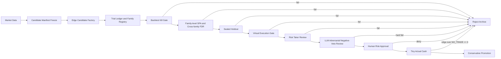

# 現Repoを候補生成強化と多重検定会計と実行可能性担保で再設計する報告

## エグゼクティブサマリ

結論から言います。**候補生成だけを強くするのは悪手**です。金融時系列では、探索量を増やすほど lucky winner と data snooping が増え、見かけの勝ち筋が量産されます。White の Reality Check は「ベストに見えるモデルが benchmark に対して本当に優位か」を探索全体で検定するために作られ、Hansen の SPA は White より power を改善して「ゴミ代替仮説」に振り回されにくくしています。Bailey らの PBO は、インサンプル最良戦略がアウトオブサンプルでは中央値未満に落ちる確率を直接測り、DSR は multiple testing と非正規性で膨らんだ Sharpe を縮めます。つまり、**探索拡張は multiplicity accounting と sealed holdout と virtual execution を同時に入れたときだけ、利益到達確率を上げる可能性がある**、が研究の本線です。 citeturn23view0turn23view1turn26view0turn26view2turn26view3

実務証拠もかなり厳しいです。Quantopian の 888 戦略では、一般的な backtest 指標の OOS 予測力は低く、Sharpe を含む多くの指標は OOS 予測にほぼ効かず、しかも backtest を多く回したほど Sharpe shortfall が増えました。Chordia らの二百万戦略実験では、多重検定を踏まえると必要な t 値閾値は大きく引き上がります。一方で Hsu–Taylor の 21,000 超 FX ルール探索では、stepwise 多重検定補正と OOS 検証を通しても一部の予測性・収益性が残りました。要するに、**大量発想それ自体は否定されていない。否定されているのは、無会計の大量発想です。** citeturn22view1turn22view2turn26view4turn26view5

したがって、いまの Repo で最優先に足すべき Core は三つです。**Edge Candidate Factory、Multiplicity Accounting、Virtual Execution Gate**。あなたが先に共有していた `actual_cash` 系の語彙統制や `risk_taker_review` 系の下流ゲートは、むしろ残すべき強みです。作るべきは「もっと賢いモデル」より先に、**候補を大量に出しても、どれだけ試したか・なぜ落としたか・実際に注文が通るかを会計できる上流**です。これは Arnott–Harvey–Markowitz の「反復 OOS は OOS ではない」という警告や、Numerai の「validation を研究に使いすぎると overfit する」「live が本番」という運用思想とも一致します。 citeturn22view3turn22view4turn30view0turn30view1

以下の Repo 評価は、このスレッドであなたが共有した artifact 名と挙動説明を前提にしています。今回の調査では公開 Repo 本体は確認できなかったため、実ファイルとの差分があれば実コードを優先してください。

## 研究から見えた設計原則

金融の探索でまず壊れるのは、「有望候補を見つける力」ではなく「見つけたように見える錯覚を殺す力」です。Lo–MacKinlay は test statistic の設計やモデル選択に同じデータを再利用すると、検定が歪むことを早くから問題化しました。White は探索全体を benchmark 比較の一つの family とみなし、最良モデルの見かけの優位性を bootstrap で補正します。Hansen の SPA は White より power が高く、特に弱い・無関係な候補が大量に混ざるときに有利です。Romano–Wolf は依存した多数検定で FWER を stepwise に制御し、single-step より多くの偽帰無を弾けます。BH/FDR は「どれだけ false discovery を混ぜてもよいか」を throughput で管理しやすく、Benjamini–Yekutieli は依存が強い場合の保守的版です。PBO と DSR は、選ばれた勝者そのものに対する shrinkage と overfit 計測を担います。 citeturn2search0turn23view0turn23view1turn23view2turn31search9turn26view0turn26view2

重要なのは、これらを**順番に使う**ことです。White/SPA は family 内で「この探索束に benchmark 超えがあるか」を問うのに向き、BH/FDR は複数 family の勝ち残りを横並びで流すのに向き、Romano–Wolf は最終 finalist の厳格な絞り込みに向きます。PBO は「winner-picking リスク」、DSR は「multiple testing で膨らんだ Sharpe の割引」に効くので、family winner の昇格前に使うのが実務的です。単一メトリクスだけに頼ると、Quantopian 型の「Sharpe は立派だが live で死ぬ」を防げません。 citeturn23view0turn23view1turn23view2turn26view0turn26view2turn22view1

探索会計では、**trial ledger を 100% 取ること**が出発点です。López de Prado は finance で multiple testing の本当の難しさは、研究者が何本試したかを普通は報告しない点だと指摘し、trial を「effectively uncorrelated clusters」にまとめる発想を示しています。相関した試行群に対する effective number of tests は、trial return series や signal series の相関行列から、ONC のような clustering や Galwey / Li–Ji 型の eigenvalue-based 近似で実装できます。実務では厳密理論より、「何本試したかを言い逃れできない形で残す」「相関した試行束を 1 family に束ねる」ほうが先です。 citeturn32view0turn10search1turn10search2

sealed holdout は「最後の 1 回だけ見る」ためのものです。Arnott–Harvey–Markowitz は、OOS を見てから理由を調整したらそれはもう OOS ではなく overfitting だと明言しています。Numerai も validation 指標に寄り過ぎると overfit すると警告し、live scoring こそ本番だと運用しています。したがって sealed holdout は、family winner を 1 本に絞るまでは**絶対に見ない**、見たあとに仕様変更が入ったら**新 family/version として trial count を加算し、別の holdout 片を切る**、が正しい運用です。 citeturn22view3turn22view4turn30view0turn30view1

## 候補生成手法の比較と導入順序

候補生成をどう入れるかは、「どれが一番賢いか」ではなく、**どれが今の Repo に最も少ない破壊で trial accounting に乗るか**で決めるべきです。学術・実務を突き合わせると、導入順序は **古典ルール大量生成 → grammar-based 拡張 → GA → ML/ensemble** が妥当です。GA は Pereira の古典研究でも「forecasting ability はあるが profitability はない」という落とし穴が出ています。Hsu–Taylor は大量の technical rule 探索でも stepwise 補正と OOS を通せば残るものは残ると示しました。さらに AFM の実務調査では、現実の大手 prop firms は supervised learning を広く使う一方、RL はまだ主流ではなく、説明可能性軽視と意図しない不適切行動のリスクが指摘されています。つまり、**最初から GA/ML に飛ぶのは、利益目的としても遠回りです。** citeturn15search6turn26view5turn20view4turn21view3

| 手法 | 実務上の強み | 実務上の弱み | 過剰最適化リスク | 実装コスト | いま入れるべき順番 |
|---|---|---|---|---|---|
| 古典ルール大量生成 | 解釈しやすい。trial 会計しやすい。execution 制約を先に埋め込みやすい | 発想の幅は狭い | 中 | 低 | 最優先 |
| grammar-based | ルール空間を広げつつ provenance を残せる | grammar 設計が甘いと junk が激増 | 中〜高 | 中 | 次 |
| GA | パラメータ・構造探索を自動化できる | 何を最適化したかが崩れやすい。profitability 無しの危険 | 高 | 中〜高 | accounting 完成後 |
| ML / ensemble | 非線形・高次元を吸える | validation overfit と implementation burden が大きい | 高 | 高 | 最後 |

この表の判断は、Pereira の GA の限界、Hsu–Taylor の large search の生存例、AFM の supervised learning 実務、Quantopian の backtest 指標の弱さを束ねた実務推論です。ML を全否定しているのではなく、**今の段階で Repo のボトルネックは alpha model の弱さより accounting と execution 証跡の弱さ**だと見ています。 citeturn15search6turn26view5turn20view4turn22view1

実際、machine learning を先に入れるほど、validation の解釈が難しくなります。Numerai は validation 診断を提供しつつも、「validation でモデルを選び過ぎるな」「train で validation を食ったら validation は一般化しない」と明確に警告しています。高リスク・小口資金で greedy に利益を狙うなら、まず必要なのは SOTA っぽい predictor ではなく、**勝った理由を会計できる候補工場**です。 citeturn30view0turn30view1

## 現実的な再設計案

### 案A

**推奨度はこれが最上位**です。現 Repo の下流、つまり `risk_taker_review`、`actual_cash` の厳密語彙、NO_TRADE 比較、human approval まわりは壊さず、その手前に **Edge Candidate Factory v1 + Multiplicity Accounting v1 + Virtual Execution Gate v1** を差し込みます。候補生成は当面、古典ルールと grammar-based に限定します。多重検定会計は、family manifest → trial ledger → family-level SPA → cross-family BH/FDR → winner に PBO/DSR → sealed holdout → virtual execution → risk review の順に流します。これなら「候補数を増やしても false positive・検証渋滞・unexecutable 候補」を同時に抑えやすいです。White/Hansen/BH/PBO/DSR の使い分けとも整合しています。 citeturn23view0turn23view1turn31search9turn26view0turn26view2

この案の良い点は、**いちばん安い**ことです。候補 factory と ledger は deterministic に作れますし、virtual execution も Bitget demo から始めれば KYC と demo API key、`paptrading: 1` header、専用 WebSocket だけで入り口を切れます。Bitget demo は pure paper-trading へ一番早く入れる一方、Hyperliquid testnet は faucet 利用に mainnet deposit 実績が必要で、GRVT は staging/testnet/prod の auth 分離、cookie、`X-Grvt-Account-Id`、funding account / trading account 分離があり、初手としては重いです。**最初の venue は Bitget demo、一周回ってから Hyperliquid、最後に GRVT** が現実的です。 citeturn36view0turn36view2turn37search2turn41view0turn41view3turn41view7

### 案B

もし本当に現在最大の詰まりが「Bitget 実行の外部リスク」や「注文が通るか分からない」ことなら、**Execution-first** で行く案もあります。これは候補生成は控えめに強化しつつ、先に venue adapter を整備して、Bitget demo → Hyperliquid testnet → GRVT staging/testnet の順に order lifecycle、funding、fees、reconcile を潰すやり方です。Hyperliquid は API wallet が master 口座の代行署名に使え、withdrawal 権限を持たないので、bot 用 signer に向いています。rate limit や WebSocket 上限も明示されていて、execution-aware grammar に乗せやすいです。GRVT も fill history、order stream、order status が整っており、order reject/cancel を機械的に記録できます。 citeturn16search1turn16search5turn37search6turn41view4turn41view5turn41view6

ただし、この案の欠点は明確です。**配管だけ整っても、殺すに値する十分な候補が無ければ何も前に進まない。** いまのあなたの問題意識は「候補の発想が弱い」なので、案Bは execution リスクが最優先課題である場合にだけ選ぶべきです。そうでないなら、案Aのほうが利益到達性は高いです。Quantopian と PBO の教訓を踏まえると、execution infra だけ先に豪華にしても、false positive を live に持ち込む危険は残ります。 citeturn22view1turn26view0

### 案C

三つ目は **Dual-lane** です。Stable lane と Exploration lane を分けます。Stable lane は案Aそのもの、Exploration lane は GA や ML を使ってよいが、**mainline に直行できない**。必ず family manifest、trial budget、effective trial count、sealed holdout の quota を別会計にし、Exploration winner も virtual execution と tiny actual cash を経ない限り昇格禁止にします。これなら将来的に GA/ML を使って greedy に探索できる一方、main repo が “narrative machine” になるのを防げます。GA や ML は overfit の罠が深いが、完全に切り捨てる必要もありません。大事なのは**隔離運用**です。 citeturn15search6turn20view4turn22view4

| 案 | 何を主に直すか | 向いている状況 | 想定実装工数 | 私の評価 |
|---|---|---|---|---|
| 案A | 候補不足 + false positive 会計不足 + virtual gate 不在 | いまの主問題が「候補を増やすと暴走しそう」 | 中 | **最有力** |
| 案B | execution risk と venue adapter 不足 | すでに候補はそこそこあるが執行証跡が無い | 中〜高 | 条件付き |
| 案C | 将来の GA/ML 拡張を見据えた二車線化 | 研究速度と本番安定性を分離したい | 高 | 中期向け |

私の本音は、**まず案Aで十分です**。案Cは欲張るなら後でよく、案Bは execution が本当にボトルネックなときだけです。

## 実装テンプレート

### パイプライン図

この流れのポイントは一つです。**Backtest gate は「進める許可」ではなく「大量に殺す装置」**であり、**Virtual execution gate は「paper PnL」ではなく「注文実在性」を見る装置**です。live は Arnott らが言う通り唯一の真の OOS なので、paper/demo/testnet は live 代替ではなく live 前の integration audit と捉えるべきです。 citeturn22view4turn15search3

### 候補生成と会計の最小テンプレ

最初に必要なのは、候補そのものより **family manifest** です。少なくとも `family_id`、`hypothesis`、`search_space_hash`、`parameter_grid`、`benchmark`、`cost_model_version`、`sealed_holdout_window`、`trial_budget`、`venue_constraints` を固定します。試行が走るたびに `trial_ledger` に `family_id`、`candidate_id`、`parent_id`、`generator_type`、`params`、`train_metrics`、`stress_metrics`、`rejection_reason`、`peeked_holdout` を残します。これをやらない限り、White/SPA/BH/PBO/DSR のどれも本当には使えません。 citeturn23view0turn23view1turn26view0turn26view2turn32view0

trial の family clustering は、まずは難しく考えなくていいです。**trial return series の相関行列**、**シグナル系列の相関**、**ルール構文木の距離**、**同一 venue / 同一持ち時間 / 同一執行方式**を使って cluster 化し、その cluster count と eigenvalue-based effective test count を両方出してください。実務では conservative に `N_eff = max(cluster_count, eigenvalue_based_Meff)` のような上限制御で十分です。これは理論そのものではなく engineering heuristic ですが、trial 未記録より 100 倍まともです。ONC clustering と effective number of tests の発想は既存研究に乗っています。 citeturn32view0turn10search1turn10search2

### 候補生成手法の比較表

| 観点 | 古典ルール | Grammar-based | GA | ML/Ensemble |
|---|---|---|---|---|
| provenance の残しやすさ | 高い | 高い | 中 | 低〜中 |
| execution-aware 制約の埋め込み | 容易 | 容易 | やや難 | 難 |
| 多重検定会計との相性 | 良い | 良い | 中 | 低 |
| 発想量 | 中 | 高 | 高 | 非常に高 |
| 検証渋滞リスク | 中 | 高 | 高 | 非常に高 |
| 小口資金との相性 | 良い | 良い | 条件付き | 悪くなりやすい |
| いま採用すべきか | はい | はい | まだ早い | もっと後 |

この表は、Pereira の GA 限界、Hsu–Taylor の大規模 rule search、生き残るには stepwise 補正が必要だという証拠、AFM の supervised learning 実務、Quantopian の validation/backtest の弱さを踏まえたものです。 citeturn15search6turn26view5turn20view4turn22view1

### 主要KPI表

| KPI | virtual 昇格ライン | tiny actual cash 昇格ライン | 意味 |
|---|---|---|---|
| `trial_logging_coverage` | 100% | 100% | 試行漏れ禁止 |
| `rejection_logging_coverage` | 100% | 100% | なぜ落ちたかの会計 |
| `BH_q_value` | ≤ 0.10 | ≤ 0.05 | 発見 throughput の制御 |
| `PBO` | < 0.20 | < 0.10 | winner picking 危険度 |
| `DSR_pass` | 必須 | 必須 | inflated Sharpe 割引後でも合格 |
| `after_cost_edge_over_NO_TRADE` | > 0 | > 0 | コスト後で無取引に勝つか |
| `profit_concentration_top5_share` | ≤ 35% | ≤ 30% | 一発当たり依存の抑制 |
| `fraction_unexecutable` | ≤ 5% | ≤ 2% | 生成器が venue 制約を守っているか |
| `virtual_execution_failure_rate` | < 1% | < 0.5% | 注文 lifecycle の失敗率 |
| `reconcile_mismatch_rate` | 0% | 0% | 帳尻不一致禁止 |
| `unknown_reject_reason_rate` | 0% | 0% | unexplained rejection 禁止 |
| `actual_cash_edge_over_NO_TRADE` | n/a | > 0 | 本当にドルで勝ったか |

BH/FDR、PBO、DSR、after-cost の採用根拠は直接研究にあり、閾値そのものは high-risk small-capital 向けに throughput と安全性のバランスを取った私の運用提案です。Actual-cash の判定は、あなたの既存の `actual_cash` / `NO_TRADE` 思想をそのまま活かす前提です。 citeturn31search9turn26view0turn26view2turn22view4

### 推奨試験設計テンプレ

| 項目 | 推奨ルール |
|---|---|
| sealed holdout | family manifest 作成時に期間固定。winner を 1 本に絞るまで閲覧禁止 |
| holdout peek 後 | ルール変更・コスト変更・stress 変更が 1 つでも入ったら新 family/version 扱い |
| family 切り方 | 同一仮説・同一持ち時間・同一 execution style・同一 venue 制約で束ねる |
| bootstrap | family 内の p-value は block/stationary bootstrap で benchmark 比較 |
| family 内合格 | SPA か同等の family-aware test を通す |
| cross-family 昇格 | family winner に対して BH/FDR、依存が荒いときは BY または Romano–Wolf で finalist 評価 |
| live 前 | sealed holdout pass 後に virtual execution を必須化 |
| tiny live | live は 1〜2 family winner のみ。同時昇格を避ける |

このテンプレは White / SPA / BH / BY / Romano–Wolf / Arnott / Numerai の考え方を組み合わせた運用版です。理論論文のままではなく、Repo に実装するならこのくらい具体化しないと意味がありません。 citeturn23view0turn23view1turn31search9turn23view2turn22view4turn30view0

### family 別の最低 event_count の目安

| family | train の最低 event_count | sealed holdout の最低 event_count | 補足 |
|---|---:|---:|---|
| intraday trend / breakout | 300 | 100 | queue・fee ノイズに耐えるため多め |
| intraday mean reversion | 500 | 150 | コストで死にやすいのでさらに多め |
| funding / carry | 100 funding events + 30 closed trades | 40 funding events + 15 closed trades | funding と close の両方が必要 |
| swing breakout / daily momentum | 120 | 40 | 低頻度でも最低限は必要 |
| ensemble / meta-signal | 300 decision points | 100 | component ごとの寄与も記録 |

これは論文が直接与える universal threshold ではなく、Quantopian の弱い OOS 予測力、Arnott の iterated OOS 問題、after-cost 重視を踏まえた**運用上の下限**です。数が足りない family は「未証明」であって「優秀」ではありません。 citeturn22view1turn22view4

### virtual execution の実装実務

Bitget demo は導入最速です。demo trading は KYC が必要で、Demo API Key を作り、REST では `paptrading: 1` header を付け、WebSocket は `wss://wspap.bitget.com/v2/ws/public` / `private` を使います。したがって、**paper-trading の first venue は Bitget demo** が最も現実的です。 citeturn36view0turn36view2

Hyperliquid は testnet もありますが、faucet 利用に mainnet deposit 実績が必要です。さらに agent wallet / API wallet、nonce、signature、`cloid`、rate limit、liquidation・funding・fee の venue 特性を理解して adapter を書く必要があります。これは execution 実装としては魅力的ですが、**“完全ノーキャッシュの純 paper” ではない**点は見落とさないほうがいいです。 citeturn37search2turn16search1turn16search2turn37search6turn40view0turn40view2turn40view3

GRVT は staging / testnet / prod が明示され、API key または wallet login で session cookie と `X-Grvt-Account-Id` を受け取ります。一方で funding account から trading account へ資金を振る account model、order stream、fill history、reject/cancel status、wrong endpoint での 403 など、初見殺しも多いです。**GRVT は最初の検証 venue ではなく、第二段階以降の venue adapter** と見るのが妥当です。なおヘルプには「restricted region なら compliant server で認証し cookie を再利用」と読める記述がありますが、これは compliance loophole として解釈して運用すべきではありません。法務・規約・居住地適法性を先に確認すべきです。 citeturn41view0turn41view3turn41view4turn41view5turn41view6turn41view7turn38view1turn39view0

virtual gate の合格条件は、PnL ではなく **integration completeness** に置くべきです。少なくとも `submit_ack → open/pending → partial fill → filled/cancelled/rejected → fee/funding capture → reconcile` が 1 本の event log に落ち、unknown state がゼロ、reconcile mismatch がゼロ、venue 制約違反による reject reason が説明可能であることが必要です。これは GRVT の order state と fill history、Hyperliquid の order semantics、Bitget demo API の存在から直接組めます。さらに “same strategy, same data, different simulators” でも結果がずれる implementation risk が新しく指摘されているので、paper-trading は backtest の延長ではなく、**別種の model risk audit** として扱うべきです。 citeturn41view4turn41view5turn41view6turn16search2turn36view0turn15search3

### LLM を negative-veto reviewer に限定する設計

ここはかなり重要です。LLM を「承認機」にすると壊れます。最近の研究では、evidence-grounded review や claim decomposition、verification question の独立実行は監査品質を上げますが、**素の LLM-as-a-judge は human grounding なしでは不安定**です。したがって役割は **adversarial negative-veto reviewer** に限定するべきです。FactReview のような evidence-grounded review、Chain-of-Verification のような起票→検証質問→独立回答の流れは参考になりますが、all-clear 判定まで任せるのは危険です。 citeturn12search0turn12search16turn12search2turn12search10

実務 prompt は次の制約で十分です。入力は `manifest`、`trial ledger summary`、`sealed holdout report`、`virtual execution report`、`risk_taker_review packet`。LLM はまず claim を原子的に分解し、各 claim に対して「支える artifact があるか」「数字が矛盾していないか」「NO_TRADE 比較が欠けていないか」「実行根拠が live ではなく推定で盛られていないか」を見る。出力は JSON で `verdict = KILL | NEEDS_MORE_EVIDENCE | ESCALATE` のみ。**APPROVE は禁止**。また、公式 PnL 計算、actual-cash 判定、deterministic gate override も禁止です。これは LLM-judge の誤判定を “止める側だけ” に閉じ込める設計です。 citeturn12search2turn12search10turn12search16

false positive 対策としては、hard fail と soft flag を分けるのが効きます。たとえば「artifact 不在」「数値矛盾」「holdout peek 後に family version が変わっていない」は hard fail、「仮説説明が弱い」「競合 benchmark が不足」は soft flag にします。さらに 2 体 reviewer にして、一方は kill case を探し、一方は proceed case を擁護させ、その disagreement を保存すれば calibration しやすいです。human reviewer は disagreement と evidence pointer だけを見ればよく、ナラティブ汚染をかなり減らせます。 citeturn12search0turn12search10turn12search22

### 実装コストのラフ見積り

| 作業 | ラフ工数 | コメント |
|---|---:|---|
| manifest / trial ledger / rejection ledger | 3〜5人日 | 最優先。ここが無いと何も始まらない |
| family clustering / effective trial count | 3〜6人日 | 相関計算と registry 追加 |
| SPA / BH / BY / Romano–Wolf wrapper | 5〜10人日 | bootstrap 実装含む |
| PBO / DSR 実装 | 5〜8人日 | 勝者 shrinkage のコア |
| sealed holdout registry 運用 | 2〜4人日 | ルール決めの比重が大きい |
| Bitget demo virtual adapter | 5〜10人日 | 最初の venue として推奨 |
| Hyperliquid adapter | 5〜10人日 | signature / wallet / rate limits |
| GRVT adapter | 8〜15人日 | auth/cookie/account model が重い |
| LLM negative-veto reviewer | 3〜6人日 | prompt + schema + eval |
| tiny actual cash canary | 2〜4人日 | 運用 runbook と kill-switch |

これは私の実務見積りです。最短で利益到達性を上げるなら、**最初の 2〜3 週間は accounting と Bitget demo に集中**し、それ以外は後ろに回すべきです。

## 抜けと誤謬リスク

まず最重要の抜けです。**今回の調査では Repo 実体を確認できていません。** したがって repo-specific な提案は、あなたがこのスレッドで共有した current state の説明に依存しています。もし実装済み機能が私の理解より先に進んでいるなら、優先順位は変わります。

次に、**多重検定補正は魔法ではない**ことです。White/SPA/BH/PBO/DSR は valid p-value と honest trial accounting を前提にしています。リターン系列の依存、コストモデルの嘘、時刻合わせのズレ、label leakage があると、q-value も PBO も飾りになります。特に execution cost を雑に入れた backtest は、Arnott らが警告する通り、統計有意がそのまま経済有意ではありません。 citeturn23view0turn23view1turn26view0turn26view2turn22view3

virtual execution にも限界があります。Bitget demo は live queue priority や内部リスクエンジンの挙動を完全には再現しません。Hyperliquid testnet は本番と同じ funding / liquidation / rate-limit の感覚を部分的には学べますが、やはり live の流動性と adverse selection は別です。GRVT staging/testnet も integration 検証には良いが、そこで通ることと実利益は別問題です。さらに implementation risk の最近の研究は、simulation engine の違いだけで backtest の結果がズレると示しています。**だから demo/testnet は“戦略検証の終点”ではなく“live 前の integration 検査”です。** citeturn36view0turn37search2turn40view0turn41view0turn15search3

法務・規約も軽視しないほうがいいです。Bitget には prohibited countries と suspected market manipulation / market abuse に関する条項があります。GRVT も restricted jurisdictions と AML/ATF を明示しています。Hyperliquid も current terms 上、restricted jurisdiction 警告を出しています。あなたが high-risk small-capital で攻めるとしても、**規約違反や jurisdiction ミスで API・口座・出金が止まると、それは alpha 以前の敗北**です。特に GRVT ヘルプにある compliant server と cookie reuse の記述は、実務上は “やってよい” ではなく “要確認” と読むべきです。 citeturn38view2turn38view1turn39view0turn42search0

最後に、ML/RL を早く入れすぎるリスクです。AFM の観察では実務でも supervised learning が中心で、RL は意図しない負の行動のリスクが明示されています。説明可能性を軽視する文化も確認されていますが、それは個人の小口 repo で真似すべきではありません。あなたのサイズでは edge の寿命も短く、Numerai が指摘するように live と validation のズレは簡単に解釈不能になります。ML は accounting と execution が整ってからで十分です。 citeturn20view4turn21view3turn30view1

## 推奨アクション

- **短期**
  - `edge_candidate_manifest.v1`、`trial_ledger.v1`、`candidate_rejection_account.v1` を先に固定する。試行と棄却理由の記録率を 100% にする。
  - 候補生成は **古典ルール + grammar-based** に限定して `Edge Candidate Factory v1` を実装する。GA/ML はまだ入れない。
  - backtest gate を **family-level SPA → cross-family BH/FDR → winner に PBO/DSR** の順で再設計する。
  - `sealed_holdout_registry.v1` を作り、peek 後の仕様変更は必ず新 family/version にする。
  - venue は **Bitget demo** から始め、`paptrading`、demo WS、fee/funding/reconcile まで `virtual_execution_gate.v1` を仕上げる。 citeturn23view1turn31search9turn26view0turn26view2turn36view0turn36view2

- **中期**
  - Hyperliquid testnet adapter を追加し、API wallet、nonce、`cloid`、rate limit、liquidation/funding を event-sourced に記録する。
  - GRVT adapter はその次に入れる。auth endpoint と trading endpoint の分離、cookie、`X-Grvt-Account-Id`、funding/trading account model、order stream を潰す。
  - `effective_trial_count` を family clustering と eigenvalue-based 近似で計測し、DSR と trial budget に接続する。
  - LLM は **adversarial negative-veto reviewer** としてのみ導入し、APPROVE 権限を与えない。 citeturn16search1turn16search2turn37search6turn41view0turn41view3turn41view5turn12search0turn12search2

- **長期**
  - Stable lane と Exploration lane を分離し、GA/ML は Exploration lane のみで解禁する。
  - ML lane では purged CV / embargo / CPCV 系を検討するが、mainline 昇格は必ず stable gate を通す。
  - tiny actual cash は family winner を 1〜2 本だけに絞り、`actual_cash_edge_over_NO_TRADE > 0` が出るものだけ慎重に昇格する。
  - 実際の virtual/live 失敗ログから family 別 threshold と execution-aware grammar を毎月更新し、Repo を“候補生成器”ではなく“候補会計機”として育てる。 citeturn11search2turn22view4turn30view0